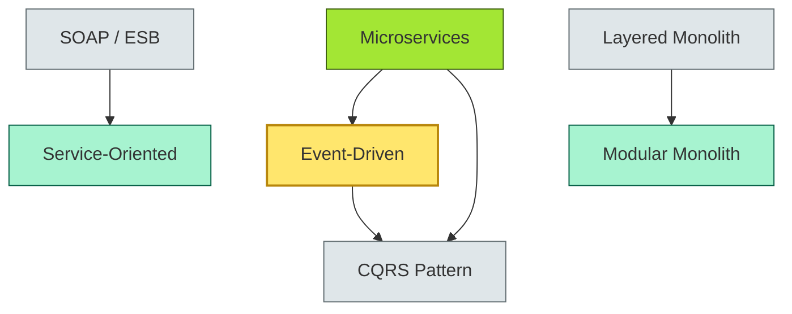
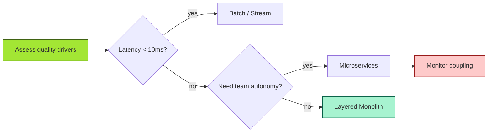

# [C4-01] Architectural styles — DETAIL

> **Category:** C4 — System & Software Design · **Difficulty:** ●
> **Companion brief:** `[briefs/C4-01-architectural-styles.md](../briefs/C4-01-architectural-styles.md)`
>
> > **Target reader:** enterprise architect who must *explain, justify, and defend* the topic — not just recite it.

---

## 1. Precise definition

An **architectural style** (also called a software architecture pattern in some taxonomies, e.g., Buschmann et al., 1996) is a reusable, high-level description of a system's structure that specifies:

1. **Components or entities** (what)
2. **Relationships or interactions** (how)
3. **Constraints** (what is forbidden or required)

This is distinct from a *design pattern*, which addresses a local problem within a single component or class. ISO/IEC/IEEE 42010 (Systems and software engineering — Architecture description) classifies architecture description by *view* and *discipline*, with architectural styles being a "viewpoint" that constrains multiple *view* realizations.

> **Sources:** ISO/IEC/IEEE 24744:2018 (architecture description), Buschmann, Hoffman, et al. *Pattern-Oriented Software Architecture* (1996).

## 2. Why it exists (problem it solves)

Without a shared style, every architect "draws" a differently shaped system. This causes:

- **Inconsistent vendor selection** (one team picks an ESB, another picks point-to-point, resulting in integration spaghetti).
- **Unpredictable cost of change:** a style violation (e.g., a microservice calling another's database directly) hardens the codebase and balloons cognitive load.
- **Regulatory audit failure:** examiners ask "how is data flow controlled?" and receive "it depends." A style provides the evidence chain.
- **Talent retention:** engineers leave when the codebase is an unprincipled mix of 1990s tier and 2024 SaaS callbacks.

Historically, styles emerged from **mainframe partitioning** (AMPS, CICS) to **client-server** (3-tier) to **service-oriented** (SOAs) to **microservices** (2010s). Each addressed a new *quality attribute driver*: performance (mainframe), scalability (n-tier), governance (SOA), team autonomy (microservices).

## 3. Core concepts & vocabulary

| Term | Precise meaning |
|------|-----------------|
| **Style** | A family of systems sharing structural properties (decomposition, interaction, constraints). |
| **Pattern** | A concrete, localized solution within a style (e.g., CQRS, saga, circuit breaker). |
| **Quality attribute driver** | A measurable criterion (latency, throughput, auditability) that influences style selection. |
| **ADR (Architecture Decision Record)** | A lightweight markdown document logging *why* a style was chosen and *what* alternatives were rejected. |

## 4. How it works (architecture / mechanism)

### 4.1 Diagrams

**Diagram A — Style taxonomy (highlight core styles = amber, supporting = grey):**



**Diagram B — Style selection lifecycle (highlight decision points = green, debt = red):**



### 4.2 Mechanism

A style is enforced through **non-functional requirements** (NFRs) and **architecture governance**:

1. **NFRs:** "All services must be independently deployable and own their data."
2. **Governance:** Automated service-mesh policies (O11y), ADR review check, architecture review board (ARB) approval.
3. **Code review gates:** Reject commits that violate cross-service transactional invariants (direct DB access).
4. **Tooling:** Service mesh observability, custom linting rules, CI/CD policy enforcement.

## 5. Variants, options & trade-offs

| Variant | When to pick | When to avoid | Key trade-off axis |
|---------|--------------|---------------|--------------------|
| **SOA** | Heavy B2B integration, existing ESB investments, coarse-grained domain boundaries required | Need fine-grained, low-latency calls; small team | *Coupling granularity vs governance cost* |
| **Microservices** | Many independent teams, cloud-native deployment, polyglot persistence | < 5 developers, low transaction volume, strict cost ceiling | *Team autonomy vs operational complexity* |
| **Event-Driven** | Asynchronous processing, high event volume, cross-domain event sharing (e.g., KYC updates) | Strictly synchronous reporting, strong consistency requirements | *Decoupling vs consistency* |
| **Layered Monolith** | New system, uncertain domain, need fastest path to MVP | Multiple teams, need independent deploy, domain is stable | *Speed-to-market vs evolvability* |
| **Modular Monolith** | Want monolith operational simplicity + internal modularity; still one deploy artifact | Need physical team boundaries; runtimes must be tightly locked | *Operational simplicity vs team scalability* |

## 6. Relationships to sibling topics

- **Layering & modularity (C4-02):** Styles *decompose* at a higher level (system-of-systems); layering/modularity *composes* within a single deployment.
- **Distributed fundamentals (C4-03):** The microservices and SOA styles are *subsumed* by distributed systems constraints (network partitions, timeouts).
- **APIs (C4-08):** The *contract layer* of a style; styles dictate *how* APIs are used (sync, async, event) but not their shape.
- **Observability (C4-12):** Styles with higher operational complexity (microservices) require richer observability.

## 7. Banking / financial-services context 💳

### Scenario
A **tier-1 European retail bank** must onboard 10,000 new digital customers per month, comply with **PSD2** (strong customer authentication), **GDPR** (right to erasure), and **DORA** (ICT risk management) by 2026. The bank runs:

- **COBOL core** (account ledger, clearing) — on-premise, regulated by **BCBS 239**.
- **Payment gateway** (cards, open banking) — migrated to cloud.
- **Wealth platform** (investment advice) — cloud-native microservices.

### Style decisions
| System | Chosen style | Rationale |
|--------|-------------|-----------|
| COBOL core | **Strangler Fig** (layered monolith → API surface) | BCBS 239 forbids migrating the ledger; must wrap, not move. |
| Payment gateway | **Microservices + Event-Driven** | PSD2 requires 99.95% uptime; event decoupling isolates PSD2 partner failures. |
| Wealth platform | **Modular Monolith on Kubernetes** | Small team, weekly release cycle; monolith avoids 200 microservice DEVOPS cost. |

### Regulatory tie-in
- **DORA** requires ICT risk registers per critical service; architectural style choices must be *documented* in the risk register.
- **BCBS 239** demands that data be *captured, validated, and reported* with end-to-end lineage; event-driven styles require a **conflict-free replicated data type (CRDT)** or **idempotent* design to keep the ledger accurate.

## 8. Reference architecture / worked example

### Problem
The bank's **open-banking partner** requires real-time balance checks for every TPP (third-party provider) request. The monolith's `AccountService.getBalance()` call takes 400ms due to synchronous, multi-hop DB reads and is blocking during peak hours.

### Decision
Adopt an **event-driven style with CQRS** for the balance query path.

### ADR

```markdown
# ADR-042: Adopt event-driven CQRS for balance query

## Status
Accepted

## Context
- TPP open-banking requests require < 200ms balance lookup per PSD2 RTS.
- Current monolith balance service is synchronous, blocking, and degrades under TPP spiky traffic.
- The bank's data platform already uses Kafka for payment events.

## Decision
Implement a CQRS view model:
- Writes: BalanceUpdated event published by the domain service on every ledger update.
- Reads: Materialized read-model stored in Redis, updated by Kafka Streams.
- Query: TPPs call a fast, read-only gRPC endpoint returning the materialized view.

## Consequences
- Positive: Sub-100ms reads; independent scalability of read vs write.
- Negative: Eventual consistency gap (typically < 30s); compensation needed for regulatory reconciliation.
- Positive: Decouples TPPs from core ledger domain.

## Alternatives considered
1. **API Gateway + circuit breaker:** Would reduce latency but not scalability; still blocks monolith thread pool.
2. **Hybrid REST/async with a message queue:** Adds complexity without decoupling read from write.
```

### Diagram (reference architecture)

```mermaid
graph LR
    classDef service fill:#bfdbfe,stroke:#1e40af
    classDef data fill:#fde68a,stroke:#92400e
    classDef boundary fill:#f1f5f9,stroke:#475569,stroke-dasharray: 5
    PP[TPP / Client]:::boundary --> Gateway[Open-Banking API Gateway]:::service
    Gateway --> Read[Balance Read Model (Redis)]:::data
    Gateway --> Write[Balance Write Path]:::service
    Write --> ES[BalanceUpdated Event]:::data
    ES --> Stream[Kafka Stream]:::service
    Stream --> Read
```

## 9. Maturity & adoption signals

- **Adopt when:** You have ≥ 3 independent teams, CI/CD maturity (automated deploy), and observability (O11y) in place.
- **Anti-signals (don't adopt yet):** No independent release pipeline, < 5 developers, or a single owner for all services.
- **Common failure modes:**
  1. **Distributed monolith anti-pattern:** 200 microservice definitions, all deployed together as a release train.
  2. **Eventual consistency surprise:** Finance reports show stale balances for an hour, leading to PSD2 compliance allegations.
  3. **API gateway rot:** Uncontrolled schema changes break externals (merchant acquirers, regulators).

## 10. Common confusions — the "don't mix" list

| Often confused | Real distinction |
|----------------|------------------|
| Style vs pattern | Style is global structure (microservices); pattern is local (circuit breaker). |
| Style vs framework | Framework is runnable code (Spring); style is a constraint set (e.g., "services own their data"). |
| Service vs component | A component is a code unit (a class); a service is an architectural role (independent deployable, bounded context). |
| Governing vs delivering architecture | "Governance architecture" = decisions and oversight; "delivery architecture" = the actual runtime system. |

## 11. Tools & standards to know

- **Standards/Frameworks:** ISO/IEC/IEEE 24744 (architecture description), TOGAF 10 (ADM phases: Preliminary and Phases B-D include architecture styles), ISO/IEC/IEEE 42010.
- **Common tooling:** ArchiMate (modeling styles and governance), Sparx EA, Archimate 3.1, Visual Paradigm, Archi (open source), draw.io.
- **Mandatory reading:** *Software Architecture: The Hard Parts* by Neal Ford et al. (2021), *Pattern-Oriented Software Architecture* (Buschmann, 1996).

## 12. ADR template (ready to fill in)

```markdown
# ADR-XXX: <decision>
## Status
Accepted | Proposed | Deprecated

## Context
...

## Decision
...

## Consequences
- Positive ...
- Negative ...
- ...

## Alternatives considered
1. ...
2. ...
```

## 13. Practice — apply it

1. **Recall:** define "architectural style" in 2 min without notes.
2. **Model:** produce an ArchiMate diagram showing your bank's current system-of-systems and annotate which style each subsystem follows.
3. **ADR:** write a decision doc applying it to the open-banking latency problem in §7.
4. **Defend:** roleplay explaining to a non-technical CRO / CIO why the bank should not simply "go cloud and use microservices everywhere."

## 14. Summary (1 paragraph)

Architectural styles are the *structural grammar* of an enterprise system. In banking, a style choice is not a neutral technical preference: it directly determines cost of change, team size scalability, regulatory evidence quality, and the speed at which the bank can onboard new products under PSD2 and DORA. The EA must therefore maintain a *style portfolio*—a register of adopted styles, their NFRs, and their maturity—and map each system under development to the style that minimizes risk across all three axes: *compliance, cost, and time-to-market*.

---
**Status:** ☐ Not started · ☐ In progress · ✅ Covered · **Last updated:** 2026-09-14
