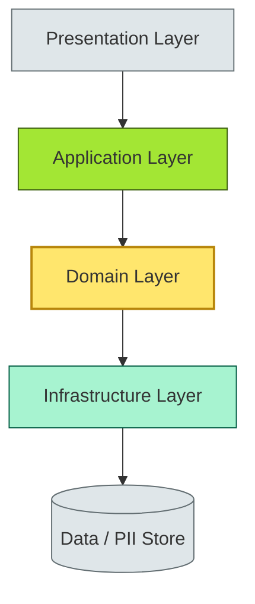
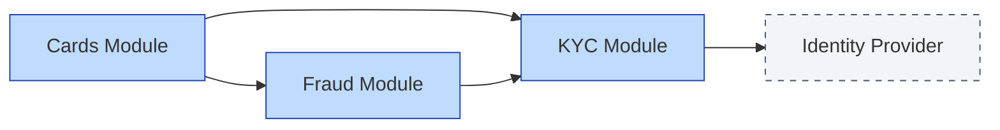

# [C4-02] Layering & modularity — DETAIL

> **Category:** C4 — System & Software Design · **Difficulty:** ●
> **Companion brief:** `[briefs/C4-02-layering-modularity.md](../briefs/C4-02-layering-modularity.md)`
>
> > **Target reader:** enterprise architect who must *explain, justify, and defend* the topic — not just recite it.

---

## 1. Precise definition

**Layering** is a structural arrangement of a system into a set of horizontal strata (layers), where each layer is implemented in terms of layers *below* it and communicates only through *certified interfaces* granted by a *dependency rule* (e.g., the Presentation Layer never accesses the Persistence Layer directly).

**Modularity** is a principle of system organization into distinct, cohesive modules, where each module is a unit of composition with a defined set of invariants that is easier to understand than the system as a whole. Cohesion (inside-module similarity) and coupling (inter-module interdependence) are the classical metrics.

ISO/IEC 25010 classifies modularity under *maintainability* and *testability*; layering is an implicit structural constraint that enables *separation of concerns*, a key quality requirement.

> **Sources:** ISO/IEC 25010:2011 (product quality), Parnas (1969) *On the Design and Development of Program Structures*.

## 2. Why it exists (problem it solves)

Without layering and modularity, a system becomes an unreadable "brownfield" codebase where:

- A bug in the database adapter corrupts the UI (reverse dependency).
- A regulatory requirement (e.g., GDPR erasure) requires rewriting the entire monolith, not just one module.
- New capabilities (e.g., a neobank mobile app) cannot be added without touching every layer (simultaneous multi-team change).

Historically, layering emerged from **n-tier client-server** (1990s) to fight *spaghetti code*; modularity emerged from **information hiding** (Parnas, 1972) to manage *complexity* as program size grew. In banking, both are *regulatory* necessities: auditors ask "where does PII reside?" and "who has access to the payment engine?" without this taxonomy, the answer is unverifiable.

## 3. Core concepts & vocabulary

| Term | Precise meaning |
|------|-----------------|
| **Layer** | A horizontal slice with a dependency rule; higher layers may use lower layers but not the reverse. |
| **Module** | A vertical, cohesive unit with a public interface and hidden internals. |
| **Cohesion** | Degree to which elements inside a module belong together (can be functional, sequential, temporal). |
| **Coupling** | Degree of interdependence between modules; must be *loose* (ideally structural + data coupling). |
| **Inversion of Control (IoC)** | High-level modules depend on abstractions (interfaces), not concretions. |
| **Dependency rule** | A formal statement that forbids upward dependencies (e.g., "Layer N may only import from Layers 1..N-1"). |

## 4. How it works (architecture / mechanism)

### 4.1 Diagrams

**Diagram A — Refined layering in a banking system (critical = PII, OK = infra):**



**Diagram B — Module vs layer view (service composition):**



### 4.2 Mechanism

Enforcing layering and modularity requires:

1. **Static analysis:** Tools like ArchUnit (Java), NDepend (.NET), or custom SonarQube rules that detect upward dependencies (e.g., `PresentationLayer` calling `PersistenceLayer`).
2. **Architecture tests:** A test suite that fails if a violation is committed (e.g., `noLayersMayCallUpward()` in ArchUnit).
3. **Modularity contracts:** Each module publishes an `api-<module>.jar` (or npm package) that must be the *only* compile-time dependency for consumers; internal packages are hidden.
4. **Access control:** Layering ↔ IAM mapping. In Kubernetes: the *Infrastructure Layer* service account has `sudo` only to `pii-db`; the *Presentation Layer* has *no* direct network path to PII DB.
5. **Runtime enforcement:** API gateways route external calls to the *Presentation Layer*; internal services call *Application Layer* gRPC; direct DB access is *network-blocked* at the VPC level.

## 5. Variants, options & trade-offs

| Configuration | When to pick | When to avoid | Key trade-off axis |
|---------------|--------------|---------------|--------------------|
| **Strict layered monolith** | < 5 devs, need fastest MVP, domain unclear | Multiple teams, need independent deploy | *Speed vs evolvability* |
| **Modular monolith** | Want monolith simplicity + internal modularity | Need independent deploy, physical team boundaries | *Cognitive vs operational* |
| **Layered microservices** | Domain boundaries align with layers, need polyling | Extreme performance needs, low team count | *Governance vs latency* |
| **Layerless modular (pure microservices)** | Fully distributed, 100+ services, need team autonomy | < 10 services, tight latency requirement | *Autonomy vs operational cost* |
| **N-tier with BFF** | Monolith frontend + multiple channels (web, mobile, agent) | Simpler monolith + SPA could suffice | *Channel separation vs duplication* |

## 6. Relationships to sibling topics

- **Architectural styles (C4-01):** Layering/modularity are *enablers* for microservices and SOA; they are not styles themselves.
- **Distributed fundamentals (C4-03):** Layered/modular components *run* on distributed infrastructure; a layer's latency budget must account for network partitions.
- **Observability (C4-12):** Layering creates a natural *trace hierarchy* (API → App → Domain → DB); modularity creates *service-level SLOs*.
- **APIs (C4-08):** The *interface* between layers and modules; layering defines *where* the API boundary lives.

## 7. Banking / financial-services context 💳

### Scenario
A **global retail bank** must redesign its **universal credit engine** to run a single onboarding experience across web, mobile, and branch tablets, while keeping:

- On-premise **PII** (name, address, PAN-derived identifiers) in an HBOS-mandated data lake.
- **Fraud scoring** in a low-latency GPU cluster.
- **Audit logging** in a SOX-compliant append-only store.

### Layering applied
| Layer | Responsibility | Example banking service |
|-------|---------------|------------------------|
| Presentation | Channel abstraction | Web app, tablet agent app, mobile |
| Application | Orchestration, transaction | Credit orchestration service |
| Domain | Business rules, invariants | Credit limit calculation, regulatory caps |
| Infrastructure | Tech concerns, secrets | DB access, encryption, logging, external APIs |

### Modularity applied
- **KYC Module:** Customer identity verification (GDPR Art. 17: right to erasure).
- **Credit Decisioning Module:** Scorecard, Basel III capital utilization.
- **Fraud Checks Module:** Real-time device fingerprinting (PCI-DSS scope reduction).
- **Document Management Module:** Signed, encrypted upload (e-IDAS eSignature).
- **Payment Module:** Feeds to real-time gross settlement (RTGS).

### Regulatory tie-in
- **BCBS 239:** Requires *capture, validation, and reporting* of data with end-to-end lineage. Layering ensures the *Domain Layer* is the single source of truth; the *Infrastructure Layer* only persists validated state.
- **GDPR:** The *Infrastructure Layer* must enforce *purpose limitation* and *data minimization* via module-scoped access tokens; the *Domain Layer* must be able to delete PII without leaving traces in the *Fraud Module* in the event of a **right to erasure** request under GDPR Art. 17.

## 8. Reference architecture / worked example

### Problem
The bank's **origination team** reports that a change to the **Document Management Module** (new PDF format validation) requires rebuilding, re-testing, and redeploying the *entire* credit engine because the interface is undocumented and the modules share a common `utils` package.

### Decision
Refactor into a **modular monolith** with strict, versioned module contracts, and enforce layering via ArchUnit.

### ADR

```markdown
# ADR-038: Refactor lending into modular monolith with strict layering

## Status
Accepted

## Context
- The credit engine is a 400k LOC monolith.
- Changing Document Management requires recompiling the entire engine (30 min CI + full regression).
- The team needs to experiment with PDF validation (proposed GPU-based option) without touching Fraud or KYC.

## Decision
1. Extract 4 modules with package-private internals and public `CreditEngineAPI` interface.
2. Enforce layering with ArchUnit tests: Presentation → Application → Domain → Infrastructure.
3. Introduce a *Module Interface Versioning* policy: breaking changes require a major version bump and 2-cycle migration.
4. CI pipeline: each module builds and tests independently; a combined build validates compliance.

## Consequences
- Positive: 80% of changes now limited to one module; CI reduces from 30 min to 8 min.
- Negative: Overhead of versioning interfaces; occasional *thread-safety* across modules requiring shared data.
- Positive: clearer GDPR audit trail (data flow goes through defined module boundaries).

## Alternatives considered
1. **Microservices:** Would give true independent deploy but 6-month migration; not justified by current team size.
2. **No refactoring:** Continue with current monolith; team churn will increase.
```

### Diagram (reference architecture)

```mermaid
graph TD
    classDef critical fill:#ffe66d,stroke:#b8860b,stroke-width:2px
    classDef decision fill:#a3e634,stroke:#3f6212,stroke-width:1px
    classDef context fill:#dfe6e9,stroke:#636e72
    classDef ok fill:#a7f3d0,stroke:#065f46

    subgraph ModuleBoundary[Monolith JVM Process]
        UI[Presentation (web/mobile)]:::context --> App[Application: Orchestration]:::ok
        App --> Dom[Domain: Credit Rules]:::critical
        Dom --> Mod[Modules: KYC, Credit, Fraud, Documents]:::decision
        Mod --> INF[Infrastructure: DB, Secrets, Log]:::context
    end
    INF --> PII[PII Data Lake]:::ok
    INF --> FRAUD[Fraud GPU Cluster]:::boundary
```

## 9. Maturity & adoption signals

- **Adopt when:** NFRs (latency, auditability) require clear separation; you have ≥ 2 feature teams.
- **Anti-signals (don't adopt yet):** No automated testing; team is < 3 people; domain discovery is incomplete.
- **Common failure modes:**
  1. **Leaky abstraction:** A lower layer exposes a generic type that the upper layer abuses, violating the layer's contract.
  2. **Module "God class":** Every module depends on a shared `Utils` or `Common` module, creating a circular dependency and defeating modularity.
  3. **Teardown ceremony:** Refactoring into a modular monolith takes 3-6 months; leadership loses patience before the first autonomous deploy is possible.

## 10. Common confusions — the "don't mix" list

| Often confused | Real distinction |
|----------------|------------------|
| Layer vs module | Layer = horizontal (UI, business, data); Module = vertical (business domain). |
| Modular monolith vs component-based architecture | Modular monolith = one deploy artifact with module boundaries; component-based = multiple artifacts with defined interfaces. |
| Coupling vs dependency | Coupling = *intentional* (what a module needs); Dependency = *implementation* bad smell (what a module *has* regardless). |
| Inversion of Control vs Dependency Injection | IoC = principle (depend on abstractions); DI = mechanism (inject concrete at runtime or compile time). |

## 11. Tools & standards to know

- **Standards/Frameworks:** ISO/IEC 25010 (maintainability, testability), ISO/IEC/IEEE 24744, TOGAF (Phase B: Business Architecture), C4 model (Strangler Figure for decomposition).
- **Common tooling:** ArchUnit (linter), SonarQube (technical debt), Visual Paradigm, Archimate, Modelio, IntelliJ/VS Code refactoring tools, JUnit / xUnit.
- **Mandatory reading:** *Working Effectively with Legacy Code* by Michael Feathers (2004), Parnas *On the Design and Development of Program Structures* (1972).

## 12. ADR template (ready to fill in)

```markdown
# ADR-XXX: <decision>
## Status
Accepted | Proposed | Deprecated

## Context
...

## Decision
...

## Consequences
- Positive ...
- Negative ...
- ...

## Alternatives considered
1. ...
2. ...
```

## 13. Practice — apply it

1. **Recall:** define "cohesion" and "coupling" in 2 min without notes.
2. **Model:** draw an ArchiMate diagram of your current monolith showing layers and modules; annotate any *accidental* circular dependencies.
3. **ADR:** write a decision applying layering/modularity to the document-management problem from §8.
4. **Defend:** explain to a non-technical CRO why "just adding another team" on a monolithic codebase is *not* an architectural option.

## 14. Summary (1 paragraph)

Layering and modularity are the *natural laws* of readable, certifiable software. In banking, they are not optional conventions: they create the *evidence trails* that regulators (Basel, GDPR, DORA, PCI-DSS) demand, and they determine whether a change in fraud scoring or KYC can be shipped without a 30-minute end-to-end regression cycle. The EA must enforce them through code, CI, and IAM—not merely declare them in a presentation.

---
**Status:** ☐ Not started · ☐ In progress · ✅ Covered · **Last updated:** 2026-09-14
