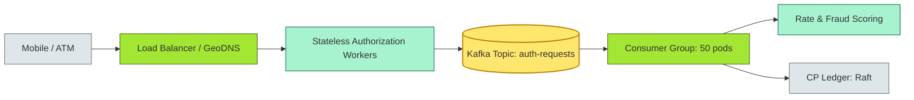
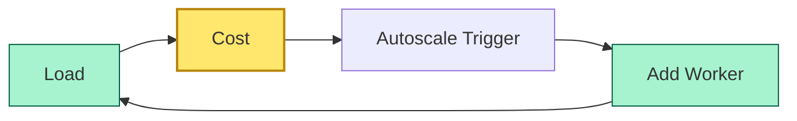
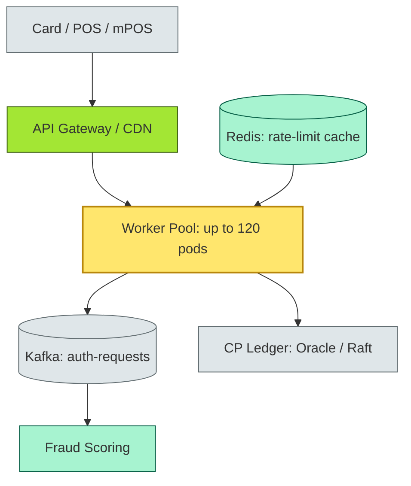

# [C4-04] Scalability — DETAIL

> **Category:** C4 — System & Software Design · **Difficulty:** ●●
> **Companion brief:** `[briefs/C4-04-scalability.md](../briefs/C4-04-scalability.md)`
>
> > **Target reader:** enterprise architect who must *explain, justify, and defend* the topic — not just recite it.

---

## 1. Precise definition

**Scalability** is the capacity of a system to maintain or improve *Service Level Objectives* (SLOs) as the *workload* (transactions per second, storage volume, query latency) increases, without a proportional increase in *cost* or *operational complexity*.

The classical taxonomy (following **S. B. H. Shen, 1994; Wilson, 2016**) defines:

| Axis | Meaning | Banking example |
|------|---------|-----------------|
| **Vertical scalability (scale-up)** | Increase per-node resources (CPU, RAM, IOPS) | A single-region backup server upgraded from 64 GB to 256 GB for a nightly OCR reconciliation batch. |
| **Horizontal scalability (scale-out)** | Increase the number of nodes | Adding 50 authorization workers during Diwali UPI peak. |
| **Functional scalability** | Add new transaction types or products without re-architecting | Adding a "split-the-bill" peer-to-peer P2P transfer to an existing card gateway. |
| **Geographic scalability** | Serve new regions without redesign | Expanding a retail bank from 4 to 18 countries using the same event-driven core. |

**Peak-to-average ratio (PAR):** The ratio of maximum observed load to the mean load over a measurement window. Retail banking PARs can exceed **10:1** (e.g., monthly salary deposits, tax-season refunds).

> **Literature:** Michael T. Wilson, *Systems Performance* (2016) defines scalability as the slope of SLO vs. load; a flat slope = perfectly scalable up to the asymptote.

## 2. Why it exists (problem it solves)

Scalability emerged historically from **mainframe design** in the 1960s, where *software backup* (N+1 redundancy) and *job scheduling* (batch backlogs) handled volume. With **cloud-native** and **microservices**, the problem shifted:

1. **Shared-nothing architecture:** Horizontal scaling became *necessary* because a single machine could not hold a petabyte of transaction data.
2. **Elasticity:** Systems must *shrink* after peaks to control costs; a bank cannot justify 100 reservation nodes for 5 days of UPI peak.
3. **Regulatory spikes:** **RBI** requires banks to demonstrate resilience under *stress tests* (simulated 5x or 10x volume). Without scalable architecture, the bank fails the stress test and loses its banking license (or pays a fine measured in crores).
4. **Tenant economics:** A single horizontal partition (shard) must serve *multiple business lines* (cards, loans, trade finance) with different SLOs; failure to scale one tenant contaminates another.

## 3. Core concepts & vocabulary

| Term | Precise meaning |
|------|-----------------|
| **Scale-up** | Vertical scaling; increase per-node resources. |
| **Scale-out** | Horizontal scaling; add nodes. |
| **Peak-to-average ratio (PAR)** | Maximum / mean workload; high PAR = unpredictable cost. |
| **Backpressure** | Mechanism to slow down a fast producer when a slow consumer cannot keep up. |
| **Sharding / Partitioning** | Splitting a dataset by a key (e.g., merchant_id) across nodes. |
| **Stateless vs stateful** | Stateless = amenable to horizontal scaling; stateful = requires replication/affinity. |
| **Read-heavy vs write-heavy** | Ratio of read to write operations; drives sizing (e.g., 99:1 analytics vs 1:1 core). |

## 4. How it works (architecture / mechanism)

### 4.1 Diagrams

**Diagram A — A scalable payment authorization pipeline (critical = consumer group, ok = stateless workers):**



**Diagram B — Capacity curve showing cost vs. load (decision = scale-out threshold, critical = cost asymptote):**



### 4.2 Mechanism

A production-grade scalable system uses *separation of design* across layers:

| Layer | Scalability mechanism | Banking SLO |
|-------|----------------------|-------------|
| **Ingress** | Elastic Postgres / CloudSQL autoscaling, CDN edge cache | 99.99% API availability |
| **Authorization** | Stateless workers + HPA (Kubernetes) + Kafka partitioning by merchant/bank | < 100 ms auth P99 |
| **Fraud scoring** | Bayesian / ML model served as a stateless service; Redis cluster for geo-lookup | 200 ms fraud P99 |
| **Ledger** | Raft consensus (3-node); *not* sharded; scale-up (bigger nodes) | 5x settlement velocity |
| **Analytics / reporting** | Columnar sharding (Parquet/Delta/Iceberg) on object store; compute scales independently | 24-hour SLA for immutability |
| **Read path** | Read replicas (async) for balance inquiry; CDN for static QCAs | 50 ms read P95 |

**Backpressure & flow control:**
- **Circuit breaker:** Protect services upstream from being overwhelmed.
- **Kafka consumer lag:** Monitor `consumer_lag` and trigger auto-scale before the consumer group is OOM-killed.
- **Queue depth SLO:** If the queue depth > 10,000 for > 30 seconds, trigger a capacity warning and a feature-flag for graceful degradation (e.g., "business resumption" instead of "full check").

## 5. Variants, options & trade-offs

| Strategy | When to pick | When to avoid | Key trade-off axis |
|----------|--------------|---------------|--------------------|
| **Vertical scaling (scale-up)** | Small, predictable load (< 10k TPS); single-region; cost is not the main driver | Peak load exceeds single-node throughput; < 390 days/year utilization | *Capital vs operational* |
| **Horizontal scaling (scale-out)** | Unpredictable or seasonal load; stateless services; multi-tenant | Stateful services with strict consensus; network overhead > CPU benefit | *Complexity vs headroom* |
| **Functional scaling (APIs as product)** | Adding new transaction types; need to decouple business logic from core | Monolith with hard-coded flows; no domain model | *Governance vs speed-to-market* |
| **Sharding (SQL or NoSQL)** | Write-heavy workload exceeds single-node; multi-region read | CP ledger requirements (ACID across shards breaks); < 5 shards | *Consistency vs spread* |
| **Hybrid (read-scale-out + write-scale-up)** | Balanced read/write; ledger needs consensus, analytics need scale | Highly unbalanced write ratios; < 5 nodes | *Operational maturity* |

## 6. Relationships to sibling topics

- **Distributed fundamentals (C4-03):** Horizontal scaling *is* a distributed system pattern; partitions and consensus define the *upper bound* of scalability.
- **Caching & async (C4-06):** Front-end caches and message queues *extend* scalability by absorbing peak load before it reaches the core.
- **Resilience (C4-05):** Auto-scaling *depends* on resilience; if 30% of workers die, 100% horizontal scale-out is pointless without self-healing.
- **Observability (C4-12):** Without SLO-based scaling signals (latency, error rate, queue depth), auto-scaling triggers on cost weather (CPU credit exhaustion), not on business weather (peak volume).

## 7. Banking / financial-services context 💳

### Scenario
An **Indian universal bank** processes **5B+ UPI transactions/month** (peak: January 15th, 8 PM). The bank must also support:

- **Salary credit push** (first working day of every month, 50x volume in a 2-hour window).
- **Tax refunds** (July–August, 10x volume).
- **Real-time card authorization** (24-hour global demand, 10M+ TPS peak during Black Friday in the US).

The EA mandates a **separate-path architecture** where peak-load systems (warm during peaks, cold otherwise) are decoupled from the core CP ledger.

### Design summary

| Component | Scaling strategy | Architectural style |
|-----------|-----------------|---------------------|
| UPI transaction ingestion | Gaussian scaling (add workers based on request rate) + Kafka partitioning by bank/merchant | Event-driven, AP |
| Authorization | Stateless + HPA; read from CDN-cached rate limits; write to CP ledger | Hybrid: stateless workers + CP Raft |
| Fraud scoring | Stateless, GPU-backed, per-request caching (Redis); 24/7 warm pool | Stateless, read-heavy |
| Salary credit | Batch job (Spark/Flink) on HDFS/Delta; scale-out workers; idempotent replay | Event-driven, AP |
| Core ledger | 3-node Raft (CP) with scale-up (bigger nodes); *no* horizontal sharding | Layered, distributed, CP |
| Analytics / AML | Columnar sharding on S3 with Spark (separate cluster); scales independently | Event-driven, AP |
| Balance inquiries | Read replicas + CDN for static reference data (SWIFT codes, FX rates) | CQRS, AP |

### Regulatory tie-in
- **RBI (India) circular on stress testing:** Banks must simulate a 3x surge in debit-card transactions and a 10x surge in UPI (IRDAI and RBI joint stress-test framework). Horizontal, queue-based architecture is the only way to pass without a 2-hour outage.
- **DORA (EU):** Requires ICT risk management including *incident and resilience testing* (Art. 27). A bank without horizontal auto-scaling and backpressure cannot meet *availability* and *operational resilience* SLOs.
- **PCI-DSS v4.0:** Requires *network segmentation* and *resource utilization* monitoring; horizontal scaling with service mesh IAM enforces this.

## 8. Reference architecture / worked example

### Problem
A **retail bank in the UK** experienced a **Black Friday 2024** failure on its card-transaction platform. The authorization service was a **single REST endpoint** with a **synchronous connection to an on-premise Oracle RAC**. At 10:42 AM, the CPU on the single web server reached 100%, connections exhausted, and 15% of card authorizations returned 504 errors. No auto-scaling was configured because the fear was "it might over-provision and cost too much."

### Decision
Re-architect authorization as **stateless workers + Kafka + horizontal auto-scaling** with **backpressure and circuit breaking**.

### ADR

```markdown
# ADR-056: Horizontal auto-scaling for card authorization

## Status
Accepted

## Context
- Black Friday 2024: single authorization endpoint CPU hit 100%; 15% 504 errors; £2.3M/day lost interchange fees.
- PCI-DSS requires 99.99% availability; 0.01% allowed.
- Monolithic auth service couples fraud, authorization, and compliance checks.

## Decision
1. Implement stateless authorization workers behind Kafka; no in-memory auth state.
2. Kubernetes HPA: scale 10 workers (normal) → 120 workers (Black Friday 09:00–13:00 BST).
3. Kafka partitioning: by issuing bank + merchant category; each consumer handles one partition.
4. Circuit breaker on fraud-score gRPC; return 200 + `fraud_score_status=stale` if latency > 200ms.
5. Cache rate-limit decs in Redis (5-min TTL); reduce fraud API calls by 70%.

## Consequences
- Positive: throughput scales from 5k TPS to 50k TPS; cost fixed by worker count + Kafka throughput, not by on-premise VIP cluster.
- Negative: Eventual consistency of fraud score; low-risk fraud may pass through; accept under PSD2 fraud liability.
- Negative: Operational complexity of managing Kafka, Redis, and HPA; mitigated by SRE runbooks.

## Alternatives considered
1. **Vertical scaling (bigger Oracle RAC):** Would cost > £1M/year and still hit a ceiling; rejected.
2. **Fully synchronous microservices (no queue):** Would concentrate overhead; rejected in favor of queue-based burst absorption.
```

### Diagram (reference architecture with scale)



## 9. Maturity & adoption signals

- **Adopt when:** Peak-to-average ratio > 5:1; team has SRE/DevOps; SLO-based metrics are wired to auto-scaling.
- **Anti-signals (don't adopt yet):** < 1k TPS; no observability on queue depth or consumer lag; team is < 3 engineers.
- **Common failure modes:**
  1. **Thundering herd:** All consumers start after a down event; Kafka topic exhaustively re-reads; CPU/memory collapse.
  2. **Backpressure silence:** No circuit breakers; a slow downstream (fraud API) gridlocks the entire pipeline.
  3. **Scale-out bloat:** Workers scale to 120 pods and never scale down (Kubernetes HPA lower bound violated); cost explodes.

## 10. Common confusions — the "don't mix" list

| Often confused | Real distinction |
|----------------|------------------|
| Scalability vs performance | Performance = single-request; scalability = system-wide growth. |
| Horizontal vs vertical scaling | Scale-out = more nodes; scale-up = bigger nodes. |
| Elasticity vs scalability | Elasticity = ability to shrink after peak; scalability = ability to grow. |
| Sharding vs replication | Sharding = partition data; replication = copy data for HA. |
| Additive vs multiplicative systems | Additive = 2x machines = 2x capacity (true); multiplicative = 2x machines = > 2x capacity due to consensus overhead. |

## 11. Tools & standards to know

- **Standards/Frameworks:** ISO/IEC 25010 (performance, reliability), TOGAF (capacity planning), DORA (operational resilience in Art. 27).
- **Common tooling:** Kubernetes HPA, Cluster Autoscaler, Apache Kafka, Apache Pulsar, Redis Cluster, Spanner / CockroachDB (sharded), ClickHouse (columnar), Datadog / Prometheus alerts, Gremlin (chaos).
- **Mandatory reading:** *Systems Performance* by Michael T. Wilson (2016), *Designing Data-Intensive Applications* by Martin Kleppmann (2017), *The SRE Book* (Google).

## 12. ADR template (ready to fill in)

```markdown
# ADR-XXX: <decision>
## Status
Accepted | Proposed | Deprecated

## Context
...

## Decision
...

## Consequences
- Positive ...
- Negative ...
- ...

## Alternatives considered
1. ...
2. ...
```

## 13. Practice — apply it

1. **Recall:** define peak-to-average ratio and explain why it is a P&L concern.
2. **Model:** draw an ArchiMate capacity diagram with 3 tiers and annotate which tier scales horizontally vs vertically.
3. **ADR:** write an ADR applying horizontal auto-scaling to the UK card authorization problem in §8.
4. **Defend:** roleplay explaining to a non-technical CFO why "buying a bigger server" is not the right answer for Black Friday.

## 14. Summary (1 paragraph)

Scalability in banking is not a luxury; it is a *regulatory and commercial requirement*. The EA must model peak-to-average ratios, classify services by their CAP and team-ownership boundaries, and enforce horizontal, queue-based, backpressured architectures wherever volume is unpredictable. The only alternative is a multi-million-pound CAPEX spike for on-premise over-procurement—a cost that any CRO or CIO can reject with a single glance at the utilization graph.

---
**Status:** ☐ Not started · ☐ In progress · ✅ Covered · **Last updated:** 2026-09-14
