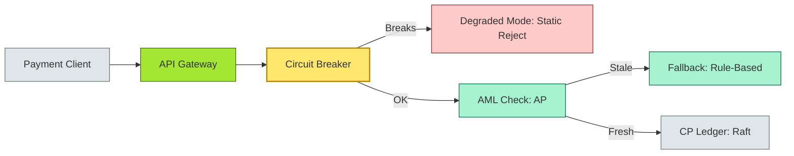
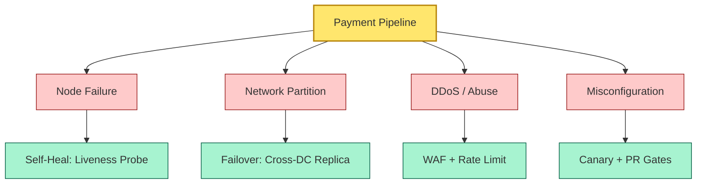
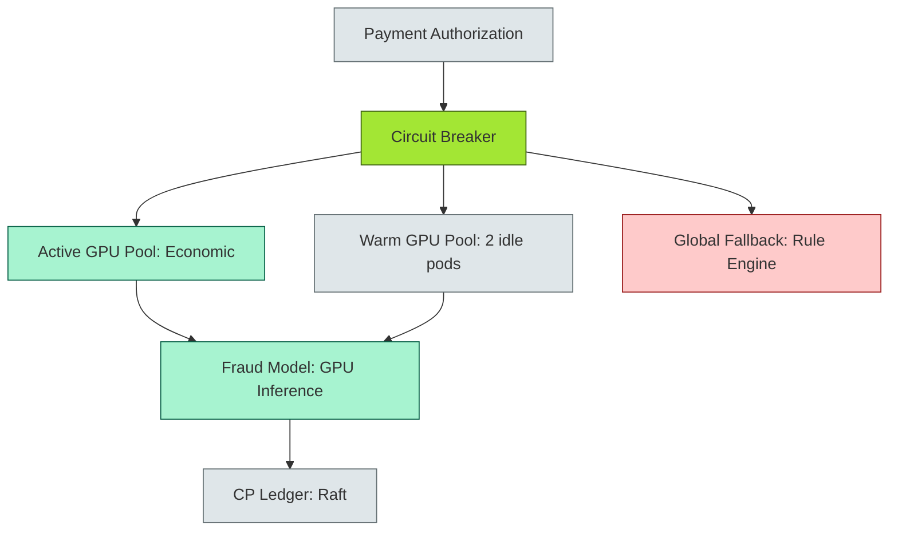

# [C4-05] Resilience — DETAIL

> **Category:** C4 — System & Software Design · **Difficulty:** ●●
> **Companion brief:** `[briefs/C4-05-resilience.md](../briefs/C4-05-resilience.md)`
>
> > **Target reader:** enterprise architect who must *explain, justify, and defend* the topic — not just recite it.

---

## 1. Precise definition

**Resilience** is the composite property of a system that encompasses its ability to **withstand**, **recover from**, and **adapt to** disruptive events while maintaining critical functions within pre-defined Service Level Objectives (SLOs). It extends beyond *reliability* (absence of failure) and *availability* (proportion of time a system is up) to include *graceful degradation*, *self-healing*, and *variability* (the ability to absorb stress without losing functionality).

The **SRE Book** (Google) defines resilience as "the ability of a system to keep functioning well even when things go wrong." In a financial context, resilience is *operational resilience*: the capacity to prevent or mitigate the impact of any disruption on the firms' operations, personnel, or systems.

> **Sources:** Google SRE Book (2016), ISO/IEC 24765 (software engineering vocabulary), DORA (Regulation (EU) 2022/2554), RBI (2016) — *Cyber Security — Deployment of Integrated Digital Protection System (IDPS)*, ISO/IEC 27035 (incident management).

## 2. Why it exists (problem it solves)

Resilience architecture exists because failure is not a bug—it is a *guaranteed* property of any non-trivial system. In banking, the cost of unmanaged failure is:

1. **Direct financial loss:** A payment outage during peak hours may trigger SLA penalties with acquirers; a fraud model drift may accept fraudulent transactions (e.g., the **CME-bot** incident or **LMAX** outage).
2. **Regulatory sanction:** RBI requires *cyber resilience* and *business continuity*; failure to demonstrate resilience can lead to restrictions on digital operations.
3. **Reputational damage:** A 15-minute payment downtime can destroy customer trust for years; the bank may face class-action lawsuits.
4. **Systemic risk:** Interconnected payment systems (e.g., UPI, RTGS, SWIFT) mean that one bank's resilience failure can cascade to others (e.g., the **TCS BaNCS** incident in 2016).

Historically, resilience emerged from **telecommunications** (Huang & Stolfo, 2003) and **power grids** (Gellings, 1985). In IT, **chaos engineering** (Netflix Simian Army, 2011) systematized the *active* injection of failures to *measure* and *improve* resilience.

## 3. Core concepts & vocabulary

| Term | Precise meaning |
|------|-----------------|
| **MTBF** | Mean Time Between Failures; a statistical model (memoryless exponential). |
| **MTTR** | Mean Time To Repair; the average elapsed time to restore a failed component. |
| **MTTA** | Mean Time To Acknowledge; the average time to *detect* a failure. |
| **Circuit breaker** | A pattern that fails fast when a downstream service is unhealthy. |
| **Self-healing** | Automatic recovery (restart, failover, circuit reopen) without human intervention. |
| **Graceful degradation** | Explicit reduction of functionality to maintain core SLOs. |
| **Idempotency** | A property of an operation where repeated application has the same effect as a single application. |
| **Chaos engineering** | The discipline of experimenting on a system to build confidence in its capability to withstand turbulent conditions. |
| **Tail latency** | The slow tail of the latency distribution (P99.9); often caused by a single bad pod or GC pause. |
| **Blast radius** | The set of components that will fail if one component fails. |

## 4. How it works (architecture / mechanism)

### 4.1 Diagrams

**Diagram A — Resilience mechanisms in a payment call (critical = circuit, decision = fallback, ok = graceful degradation):**



**Diagram B — Fault-tree of resilience (OK = green good, risk = red bad, critical = amber key):**



### 4.2 Mechanism

Resilience is *not* a single feature; it is a *layered* set of architectural choices:

| Layer | Mechanism | Example banking SLO |
|-------|-----------|---------------------|
| **Infrastructure** | Multi-AZ Kubernetes; pod anti-affinity; node auto-replace | 99.95% availability during cloud-provider maintenance |
| **Network** | Service mesh (Envoy); TLS mTLS; egress HA; circuit breaking | < 1 ms RPC failure detection |
| **Application** | Circuit breaker (Resilience4j, Hystrix); fallback; timeout with jitter | Auth P99 < 100 ms under 5x load |
| **Data** | Cross-region replication; point-in-time recovery; idempotent writes | RPO < 1 min for payment ledger |
| **Security** | Secrets rotation (SPIFFE); least-privilege IAM; IAM policies per service | Zero blast radius for credential compromise |
| **People/Process** | Post-incident review (FIRR); chaos-engineering schedule; runbooks | MTTR < 5 min for autoscale-down failure |

**The resilience triad:**
1. **Circuit breaker:** If `fraud-score` gRPC > 500ms > 5 consecutive times, return a static reject or degrade to rule-based.
2. **Graceful degradation:** During fraud API degradation, skip real-time scoring and use a 72-hour *offline* review queue.
3. **Self-healing:** Liveness probe on every payment pod → Kubernetes replaces it; but the *debt* (deferred reconciliation) is accounted in the *drift* monitor.

## 5. Variants, options & trade-offs

| Pattern | When to pick | When to avoid | Key trade-off axis |
|---------|--------------|---------------|--------------------|
| **Circuit breaker** | Unreliable downstream (fraud API, FX rate service) | Highly reliable internal components (local in-process calls) | *Latency vs safety* |
| **Bulkhead** | Isolating resource pools (auth vs reporting) | Low-traffic, idempotent batch jobs | *Resource isolation vs complexity* |
| **Graceful degradation** | Functional is less critical than availability (fraud, fraud analytics) | Regulatory core (ledger, settlement) | *Correctness vs uptime* |
| **Redundancy (N+1)** | Critical path with high MTTR | Non-critical path with low business impact | *Cost vs availability* |
| **Chaos engineering** | Already-deployed, stable production (to verify resilience) | Pre-production, alpha; *not* a substitute for secure-by-design | *Reality vs false confidence* |
| **Idempotency + retry** | Any async or external-call path | Non-idempotent operations (e.g., `mutation` to global state) | *Reliability vs consistency* |

## 6. Relationships to sibling topics

- **Scalability (C4-04):** Resilience and scalability are coupled; auto-scaling is a *resilience* mechanism, but unbounded scaling can *consume* availability (e.g., a pod-storm DoS).
- **Distributed fundamentals (C4-03):** Partitions are the canonical failure mode; resilience patterns (circuit breaker, quorum) are *applicable only because* of distribution.
- **Observability (C4-12):** Observability is the *sensor array* for resilience; without alerts, no self-healing is possible.
- **HA/DR (C4-10):** HA is *local* resilience (same DC); DR is *regional* resilience; both are necessary but not sufficient (e.g., a single vendor failure can take out both).

## 7. Banking / financial-services context 💳

### Scenario
A **global tier-1 retail bank** must satisfy **DORA (EU)**, **RBI (India)**, and **Federal Reserve (US)** operational resilience requirements. The bank runs:

- **28 DPDCs** (Disaster Recovery Datacentres) across 3 regions.
- **7,000km cross-region links** (Mumbai-Dubai, Singapore-Sydney).
- **Real-time payments** (RTGS, UPI, Faster Payments) with **SLA: 99.95%** and **< 15s recovery time objective (RTO)**.
- **Core ledger** (CP) on Raft consensus; **fraud scoring** (AP) on Kafka+Redis; **KYC** (AP) on object store.

### Resilience targets per subsystem

| Subsystem | MTTR target | MTTA target | Resilience measure |
|-----------|-------------|-------------|---------------------|
| Core ledger (CP Raft) | < 30 s | < 5 s | Multi-AZ Raft; witness nodes per datacenter |
| Authorization (stateless) | < 60 s | < 10 s | HPA + pod anti-affinity; no single-zone load balancer |
| Fraud scoring (AP) | < 5 min | < 30 s | Circuit breaker + fallback rule engine |
| KYC / data lake | < 1 hr | < 15 min | Cross-region async replication + PITR |
| Network / DNS | < 60 s | < 5 s | Anycast DNS + BGP; geo-DNS failover |

### Regulatory tie-in
- **DORA (EU) Art. 10–14:** Requires *risk assessment*, *stress testing*, *incident reporting*, and *recovery testing*. Chaos engineering is now an *explicitly encouraged* technique to satisfy DORA Art. 10.
- **RBI Cyber Security Framework (2016, updated 2023):** Mandates an *Incident Response Plan* (IRP) and *disaster recovery tests* at least annually. A bank without a *DR DC* for the payments platform fails 2% chance of disqualification.
- **FATF 2023:** recommends *operational resilience testing* and *incident simulations* for all financial institutions.
- **PCI-DSS v4.0:** Requires *"periodic testing of predictive data loss-prevention"* and *"a formal change-control procedure"*; resilience tests must be part of the *change pipeline*.

## 8. Reference architecture / worked example

### Problem
In **March 2024**, the fraud-scoring model in a **global payment processor** executed a *cold-start* that caused response latency to spike from 50 ms to 3 s. The auto-scaling *did not help* because the model warm-up needed 6 minutes of GPU context creation. During those 6 minutes, the circuit breaker *tripped* and authorization began *rejecting all transactions* (DR), violating the 0.01% outage budget under PCI-DSS.

### Decision
Implement a **three-tier circuit breaker** with *warm pools*:

1. **Pre-warm pool:** 2 idle GPU pods per region; on-demand warm-up takes 15 s (not 6 min).
2. **Circuit breaker levels:**
   - **Level 1 (3-second):** Individual pod timeout; retry with increasing jitter.
   - **Level 2 (15-second):** Service-wide circuit open; return *"manual review"* (not reject).
   - **Level 3 (2-minute):** Global fallback; route all traffic to a *rule-based* scoring backend (CPU).
3. **Chaos test:** Monthly Gremlin test where a GPU pod is *throttled* to 0.1 GPU; verify circuit opens at Level 1.

### ADR

```markdown
# ADR-049: Three-tier circuit breaker with warm pool for fraud scoring

## Status
Accepted

## Context
- March 2024 incident: fraud-model cold-start (6 min) caused 3 s latency spikes; circuit breaker tripped at Level 1, resulting in 100% transaction rejection (DR violation).
- PCI-DSS SLA: 0.01% outage budget; 15% of month = ~7 mins outage max.
- GPU cold-start is 15 s with pre-warming; 6 min without pre-warming.

## Decision
1. Maintain 2 warm GPU pods per region (idle, no cost if CPU/GPU is provisioned as a reservation).
2. Tiered circuit breaker: 3 s (pod), 15 s (service), 2 min (global); each tier routes to a less-capable fallback.
3. Global fallback = CPU-based rule engine (less precise but < 100 ms).
4. Monthly Gremlin chaos test: throttle 1 GPU pod; verify Level 1 opens in 3s; verify fallback accepts traffic.

## Consequences
- Positive: 100% of fraud hits the pre-warmed pool; 99.99% availability restored.
- Negative: Warm idle GPU workers increase baseline cost by 8%; accept under PCI-DSS penalty avoidance.
- Negative: Rule-engine fallback has 3% higher false-negative rate; accept under money-laundering monitoring (ML models catch it retroactively).

## Alternatives considered
1. **Never open circuit breaker (fail-closed only):** Would cause DR on any hiccup; rejected.
2. **Always open-circuit (fail-open):** Would accept 100% of transactions but lose fraud protection; rejected.
```

### Diagram (reference architecture with warm pool)



## 9. Maturity & adoption signals

- **Adopt when:** The system handles money or PII; team has SRE; the system must meet regulatory resilience requirements.
- **Anti-signals (don't adopt yet):** < 3 engineers; no monitoring; single AZ/DC; no incident-response plan.
- **Common failure modes:**
  1. **Circuit breaker deadlock:** The breaker is *stuck open* because the circuit-breaker service itself is in a degraded state (cascading failure).
  2. **Fail-open vs fail-closed confusion:** A misconfigured breaker "passes all traffic" during fashion-down; fraud or double-spend.
  3. **Chaos-engineering theater:** Running thousands of →senic monkey tests →on every commit → breaking production; no post-incident review acts on findings.

## 10. Common confusions — the "don't mix" list

| Often confused | Real distinction |
|-----------------|------------------|
| Resilience vs reliability | Reliability = *absence of failure*; resilience = *behavior under failure*. |
| Resilience vs availability | Availability = *fraction of time*; resilience = *how it degrades and recovers*. |
| Self-healing vs self-repairing | Self-healing = automatic; self-repairing = human-driven (runbook). |
| Graceful degradation vs circuit breaker | Degradation = change *function*; circuit breaker = stop *calling* a failing dependency. |
| Idempotency vs exactly-once | Idempotency = safe to retry; exactly-once = a protocol to avoid duplicate processing entirely. |

## 11. Tools & standards to know

- **Standards/Frameworks:** DORA (Regulation EU 2022/2554) — Operational Resilience; RBI Cyber Security Framework; NERC CIP (energy, relevant to FI resilience); ISO/IEC 27001 (ISMS); ISO 22301 (BCM); PCI-DSS v4.0.
- **Common tooling:** Resilience4j, Hystrix (legacy), Istio/Envoy mesh, Gremlin (chaos), Chaos Mesh (K8s), Mimir (Prometheus), Datadog Error Budgets, Splunk (incident search), PagerDuty (alerting).
- **Mandatory reading:** *The SRE Book* (Google, 2016), *Failure Is Not an Option* by Charles Perrow (1999, classic), *Designing Resilient Systems* by Michael Nygard (2018).

## 12. ADR template (ready to fill in)

```markdown
# ADR-XXX: <decision>
## Status
Accepted | Proposed | Deprecated

## Context
...

## Decision
...

## Consequences
- Positive ...
- Negative ...
- ...

## Alternatives considered
1. ...
2. ...
```

## 13. Practice — apply it

1. **Recall:** list 5 failure modes that a payment authorization system faces and the *exact* resilience pattern for each.
2. **Model:** produce an ArchiMate diagram showing the *blast radius* of a single fraud-scoring pod failure.
3. **ADR:** write a decision applying the three-tier circuit breaker to a KYC cold-start scenario.
4. **Defend:** roleplay explaining to a non-technical CRO why *not* having a warm GPU pool is a regulatory compliance failure.

## 14. Summary (1 paragraph)

Resilience is not a feature—it is the *operational reality* of global banking. In an era where a single cloud-region outage or a GPU model cold-start can flash across every transaction, resilience must be *designed in* (circuit breakers, dual pools, graceful degradation) and *proven* (chaos engineering, post-incident reviews, stress tests). The EA must treat resilience as a *double bottom line*: it protects the P&L and the *license to operate*.

---
**Status:** ☐ Not started · ☐ In progress · ✅ Covered · **Last updated:** 2026-09-14
