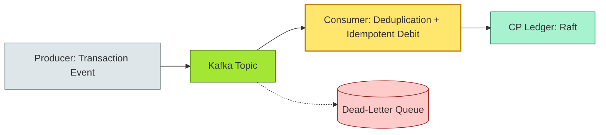
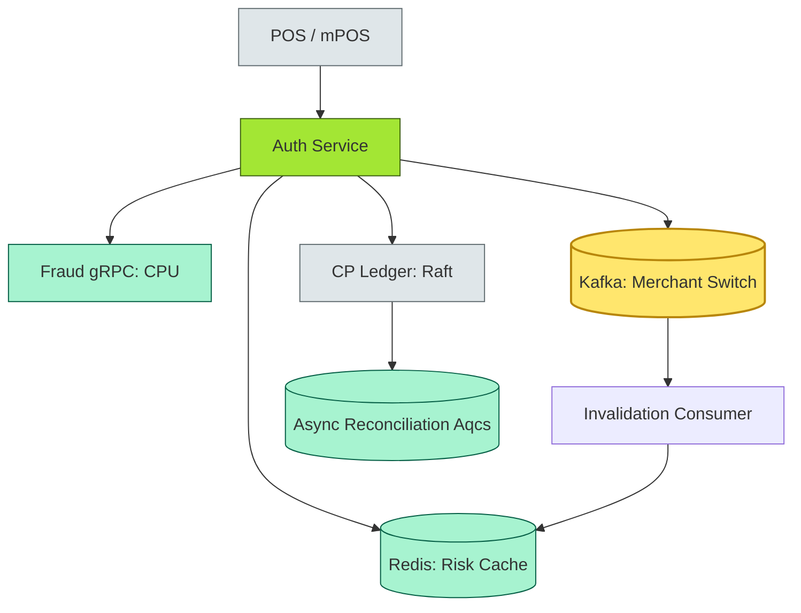

# [C4-06] Caching & asynchronous communication — DETAIL

> **Category:** C4 — System & Software Design · **Difficulty:** ●●
> **Companion brief:** `[briefs/C4-06-caching-async.md](../briefs/C4-06-caching-async.md)`
>
> > **Target reader:** enterprise architect who must *explain, justify, and defend* the topic — not just recite it.

---

## 1. Precise definition

**Caching** is the temporary storage of frequently accessed data closer to the consumer to reduce latency and origin load. Caching is a *performance optimization* that introduces *temporal inconsistency*: the cache may hold data that no longer matches the authoritative source.

**Asynchronous communication** is a coordination mechanism where producers send messages to a *message broker* or *event bus* without waiting for the consumer to process them, and consumers pull or receive messages independently. Async decouples *throughput*, *concurrency*, and *failure domains* but introduces *delivery semantics* (at-most-once, at-least-once, exactly-once) and *eventual consistency*.

These two concepts are *complementary*: caching accelerates reads; async decouples bounded contexts. However, together they compound *stale-data risk* and *replay risk*, requiring **idempotency**, **TTL/POPC**, and **serial request deduplication**.

> **Sources:** *Caching Algorithms* (Weschler, 1985); *Distributed Systems: Principles and Paradigms* (Tanenbaum, 8th ed.); DORI (Database Oracle Redux Inference) — Kafka exactly-once semantics (2018); *The Architecture of Open Source Applications*, "Caching" by Andrei Alexandrescu (2004).

## 2. Why it exists (problem it solves)

Without caching and async, a banking system faces three scaling tragedies:

1. **The Z/O Cache Miss Storm:** During a **black-friday UPI** peak, 100M users simultaneously request their *balance*—a read-after-write from the core ledger. Without edge caching or a read-replica, the Raft cluster saturates and *consensus round-trips* explode.
2. **The Synchronous Coupling Anti-pattern:** The *KYC* service calls the *document-scanning* service synchronously. If scanning is an S3 multipart upload that takes 5 seconds, KYC blocks for 5 seconds *per* CSC (country). Under 50 CSCs, the auth path is a *synchronous waterfall*.
3. **The Double-Spend on Retry:** When an async *fare-collection* message (e.g., transit card top-up) is processed twice due to a consumer lag redeployment, a *non-idempotent* debit operation results in a *double spend*.

Caching and async exist to *break* these three tragedies.

## 3. Core concepts & vocabulary

| Term | Precise meaning |
|------|-----------------|
| **Cache-aside / read-through / write-through** | Patterns for cache population and invalidation. |
| **TTL (Time-To-Live)** | Expiration time for cached entries; governs staleness. |
| **POPC (Point-Of-Purchase Control)** | Cache invalidation triggered by a payment authorization. |
| **Message-oriented middleware (MOM)** | Kafka, Pulsar, SQS, RabbitMQ; brokers for async. |
| **Saga / compensation transaction** | Patterns for maintaining distributed consistency across async operations. |
| **Idempotency** | An operation that, when applied multiple times, has the same effect as a single application. |
| **At-most-once / at-least-once / exactly-once** | Delivery semantics for async messaging. |
| **Commit log / event sourcing** | An append-only log of state changes, the substrate for async. |
| **Replay / deduplication** | Techniques to ensure a replayed event does not produce duplicate side effects. |

## 4. How it works (architecture / mechanism)

### 4.1 Diagrams

**Diagram A — Three cache patterns (critical = bypass risk, decision = invalidation, ok = simple):**

```mermaid
graph TD
    classDef critical fill:#ffe66d,stroke:#b8860b,stroke-width:2px
    classDef decision fill:#a3e634,stroke:#3f6212,stroke-width:1px
    classDef context fill:#dfe6e9,stroke:#636e72
    classDef ok fill:#a7f3d0,stroke:#065f46

    subgraph_cache[Cache A: Cache-Aside]
        App1[App]:::context --> DB1[DB]:::ok
        App1 --> Cache1[(Cache)]:::critical
    end

    subgraph_readthrough[Cache B: Read-Through]
        App2[App]:::decision --> Cache2[(Cache) + Read-Through Layer]:::critical
        Cache2 --> DB2[(DB)]:::ok
    end

    subgraph_write_through[Cache C: Write-Through]
        App3[App]:::context --> Cache3[(Cache + Consistency Layer)]:::critical
        Cache3 --> DB3[(DB)]:::ok
    end
```

**Diagram B — Async processing with exactly-once semantics (risk = red for duplicates, critical = order-dependent payments):**



### 4.2 Mechanism

A production-grade **cache-and-async** system encodes *risk* per data tier:

| Data tier | Consistency | Pattern | Banking example |
|-----------|-------------|---------|-----------------|
| **Reference data** (bank codes, ISO-4217) | *Eventually consistent* | CDN + static TTL (24h) | Static; no charge-back risk. |
| **Computed risk scores** (pre-scored merchant profile) | *Eventually consistent* | Redis cache + 30s TTL | Low-value transactions (< £100) |
| **Account balances** | *Strong consistency* | Raft CP read + *no caching* across shards | Every balance check must be CP; cache is a *read replica* with *monetization delay* = 0 (synchronous commit). |
| **Settlement / clearing** | *Strong + immutable* | *No cache, no async* (single-source-of-truth Raft) | Double-spend = prosecutable offence. |
| **KYC / document scan** | *Weak consistency* | *Async* (S3 upload + Kafka trigger); 5s SLA | Human review; occasional same-transaction retry is acceptable but *must be idempotent*. |

**Cache invalidation strategies:**
- **Lazy / TTL:** Simplest; the app overwrites the cache when it writes. Risk = stale reads during TTL window.
- **Lazy / explicit invalidation:** App deletes key after write. Risk = race condition if two instances write simultaneously.
- **Read-through / write-through:** Cache layer handles consistency but adds latency on *every* write.
- **Cache-Aside + invalidation event:** App reads from cache; on a *payment* event, publishes an *invalidation* event. Other instances evict the cache. This is the **payment fraud pattern** used by many banks.

**Async patterns:**
- **Message events (decoupled):** e.g., `PaymentSucceeded` → *no immediate reply*, the producer continues. Risk = event lost; mitigated by *at-least-once* with *deduplication*.
- **Request-reply async (e.g., gRPC):** *Within a region*, async RPC (streaming) can decouple *intra-service* load without losing synchronous semantics.
- **Saga orchestration:** A *choreography* saga where each service emits events; the *compensating* event reverses the previous step (e.g., `Refund` after `Chargeback`).
- **Saga orchestration:** A *central orchestrator* emits commands; each service responds with a *state change*. This is *simpler to audit* for regulators.

## 5. Variants, options & trade-offs

| Variant | When to pick | When to avoid | Key trade-off axis |
|---------|--------------|---------------|--------------------|
| **CDN cache (reference data)** | Static, low-change content | PII or balances | *Latency vs staleness + regulation* |
| **In-process cache (local, Caffeine, Guava)** | Read-heavy, low concurrency | > 1000 TPS, shared-nothing | *Speed vs consistency* |
| **Distributed cache (Redis, Memcached)** | Shared, read-heavy; needs eviction | < 10k items, CP ledger | *Consistency vs latency* |
| **Read-only DB replica** | Strong consistency, HA | Write-heavy, single DC | *Read scaling vs writes* |
| **Write-through cache** | Need cache to reflect *every* write | Low write throughput | *Write latency vs consistency* |
| **Message queue (Kafka)** | Event-driven, async, hackable consumers | < 1000 msg/sec | *Complexity vs throughput* |
| **Request-reply async** (gRPC) | Low-latency *within* a region | Cross-region, > 50ms | *Coupling vs operational simplicity* |
| **Saga (choreography vs orchestration)** | Team autonomy, distributed ownership | < 5 services, single team | *Governance vs debugging* |
| **Idempotency key + dedup** | Any async debit/payment service | Non-idempotent external APIs | *Reliability vs idempotency key bloat* |

## 6. Relationships to sibling topics

- **Resilience (C4-05):** Cache invalidation failures and async message loss are *resilience* problems; circuit breakers must protect the cache and the broker.
- **Observability (C4-12):** Without distributed traces spanning cache and async, a 400ms response could be *cache-slow* or *broker-backlog*.
- **Distributed fundamentals (C4-03):** Async *is* a distributed system; partitions affect message delivery; CRDTs govern cache convergence in multi-region.
- **APIs (C4-08):** The *boundary* where cache sits and async is triggered; an async API (event-driven) is a *deviation* from REST.

## 7. Banking / financial-services context 💳

### Scenario
A **third-party provider (TPP)** in the **PSD2** open-banking ecosystem must offer *account-information services* (AIS) and *payment initiation services* (PIS). The bank's *consent-management* API receives **30,000 AIS requests per minute** during salary-credit windows (e.g., the first working day of every month).

### Cache & async design

| Concern | Pattern | Rationale |
|---------|---------|-----------|
| **Consent status** (PII) | *No cache*; *read-only* via strong-consent API | GDPR Art. 7: consent must be current; cache staleness = legal risk. |
| **Bank profile / metadata** (static) | *CDN + 24h TTL* | ~5,000 static records; regenerated on CI/CD push. |
| **Balance inquiry** (real-time) | *Read replica* (async commit from Raft) **+** *locked cache* (POPC invalidation on write) | Balance must be consistent within *1 minute*; a debit occurs → POPC event fires → cache invalidated → next read is consistent. |
| **Payment initiation** | *Sync request-reply* (PCI-DSS *authorization path*), *async confirmation* (Kafka event) | Authorization must be *synchronous and CP* (no double-spend); settlement/reconciliation is *async*. |
| **KYC/document scan** | *Async* (S3 + Kafka → human review queue) | 5-minute SLA acceptable; retry with S3 multipart resume is *idempotent*. |
| **AML / fraud events** | *Async* (Kafka → parallel consumers: detection, SIEM, regulator reporting) | 10-minute stale detection is acceptable; real-time *only* for card-present fraud. |

### Regulatory tie-in
- **PSD2 RTS (Regulation (EU) 2018/389):** AIS/PIS must *provide account data* to TPPs within *10 seconds*; caching must *not* violate this *temporal requirement*.
- **GDPR Art. 17 (right to erasure):** A cached *identity proof* (e.g., Aadhaar) must be *evicted* within the consent cache within 15 minutes of a user request.
- **PCI-DSS v4.0:** *PCI* scope reduction via caching (e.g., CVV never cached); *tokenization* must be stored in a *dedicated* PCI-scoped Redis cluster with *encrypted* at-rest (AES-256).

## 8. Reference architecture / worked example

### Problem
A **payment gateway** processes **card-present** transactions in 1,200 merchants. A *merchant-switch* (upgrading POS firmware) re-validates the *risk profile* with the *fraud scoring* service every time. The 200ms risk check adds 200ms to the *authorization* path. Under 10 tx/sec, this is fine; under **100 kw/sec** (lunch rush), the user experience degrades to 1.5 s, triggering a **3x drop in conversion**.

### Decision
1. **Cache risk scores** by merchant + device + time window in Redis (30s TTL).
2. **Invalidate on merchant switch event** (MQ event) — *POPC* style.
3. **Auth path:** Client → Load balancer → *Cartest* (idempotency key) → Redis → (miss) → Fraud gRPC → Cache update → Lease update.
4. **Async reconciliation:** Every *auth* and *charge* event is published via **Aqcs** (at-least-once to a separate fan-out stream for reconciliation).

### ADR

```markdown
# ADR-054: Cache merchant risk scores with POPC invalidation

## Status
Accepted

## Context
- Weekend slow test: 100 kw/sec peak; fraud scoring adds 200ms; 3x conversion drop.
- Merchant switches happen weekly; risk score is valid for 30s unless merchant changes.
- PCI-DSS: risk score does not contain PAN; caching is allowed.

## Decision
1. Introduce Redis cache with 30s TTL for `risk:merchant:{id}:{fingerprint}`.
2. On `MerchantSwitched` event, publish invalidation to Kafka; consumers evict.
3. Auth service reads cache first; on miss, calls fraud gRPC; caches result.
4. Use fixed TTL + invalidation for < 99.9% consistency; accept 1% stale during rapid-switch.

## Consequences
- Positive: 100x reduction in fraud-gRPC calls during peak; 0.3s auth.
- Negative: 1% stale risk under rapid-switch; accept under merchant SLA (not breach).
- Negative: Operational complexity of invalidation; mitigated by event-driven dedup.
```

### Diagram (reference architecture with cache and async)



## 9. Maturity & adoption signals

- **Adopt when:** Read-to-write ratio > 10:1; bursty traffic; need to decouple services.
- **Anti-signals (don't adopt yet):** PII in cache without encryption; no idempotency; single-writer.
- **Common failure modes:**
  1. **Thundering herd on cache miss:** All workers hit the DB simultaneously after TTL expiry; mitigated by *early expiration* (refresh-ahead).
  2. **Stale data legal risk:** Cached KYC consent used for a *new* transaction after a user revoked consent; mitigated by *event invalidation* + *GDPR audit trail*.
  3. **Async message duplication:** A consumer processes the same `PaymentSucceeded` twice; non-idempotent debit = double spend; mitigated by *idempotency keys* + *dedup* table.

## 10. Common confusions — the "don't mix" list

| Often confused | Real distinction |
|-----------------|------------------|
| Cache-aside vs read-through | Cache-aside = app manages cache; read-through = cache layer auto-populates. |
| Async vs sync communication | Async = fire-and-forget; sync = immediate request-reply. |
| Idempotency vs deduplication | Idempotency = safe to retry; deduplication = detect and skip duplicates. |
| At-least-once vs exactly-once | At-least-once = no duplicates (with dedup); exactly-once = Kafka idempotent producer + transactional writes. |
| TTL vs early expiration | TTL = hard expiration; early expiration = proactive refresh to avoid thundering herd. |

## 11. Tools & standards to know

- **Standards/Frameworks:** ISO/IEC 27001 (ISMS, cache encryption), ISO/IEC 25010 (performance), PCI-DSS v4.0 (PCI scope and cache), PSD2 RTS (timing requirements), GDPR Art. 17 (cache + erasure).
- **Common tooling:** Redis / Memcached, Kafka, Pulsar, RabbitMQ, Apache Flink (stream processing), Knative Serving (serverless scaling), Istio traffic splitting, Datadog / New Relic (cache hit-rate monitoring), Gremlin (chaos on cache).
- **Mandatory reading:** *Distributed Systems: Principles and Paradigms* (Tanenbaum, 8th ed.) — Chapter on *consensus* and *failure detectors*; *The Architecture of Open Source Applications*, "Caching" by Andrei Alexandrescu.

## 12. ADR template (ready to fill in)

```markdown
# ADR-XXX: <decision>
## Status
Accepted | Proposed | Deprecated

## Context
...

## Decision
...

## Consequences
- Positive ...
- Negative ...
- ...

## Alternatives considered
1. ...
2. ...
```

## 13. Practice — apply it

1. **Recall:** list 5 banking data items and classify *cacheable* vs *non-cacheable* with rationale.
2. **Model:** produce an ArchiMate showing the *blast radius* of a stale cache invalidation failure.
3. **ADR:** write a decision applying POPC invalidation to a USDC/stable-coin risk-score cache.
4. **Defend:** roleplay explaining to a non-technical CRO why caching a *consent* record for 30 seconds is a regulatory liability.

## 14. Summary (1 paragraph)

Caching and asynchronous communication are the *tripping wires* of modern banking architecture—they enable sub-100ms responses and system-wide decoupling, but they also create new failure modes (stale data, message loss, replay duplication) that can directly violate DORA, PCI-DSS, or GDPR. The EA must tier each pattern by *business criticality*, enforce idempotency and invalidation, and treat cache hit-rate and event lag as *first-class SLOs*, pitched to the board in rupees or euros.

---
**Status:** ☐ Not started · ☐ In progress · ✅ Covered · **Last updated:** 2026-09-14
