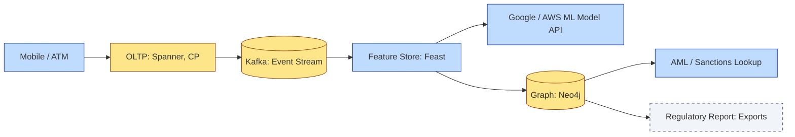

# [C4-07] Datastores — DETAIL

> **Category:** C4 — System & Software Design · **Difficulty:** ●●
> **Companion brief:** `[briefs/C4-07-datastores.md](../briefs/C4-07-datastores.md)`
>
> > **Target reader:** enterprise architect who must *explain, justify, and defend* the topic — not just recite it.

---

## 1. Precise definition

A **datastore** is a software system that enables structured storage, management, and retrieval of data, exposing a specific *query model* and *consistency semantics* to clients.

The major datastore paradigms relevant to banking are:

| Paradigm | Consistency | Typical write pattern | Typical read pattern |
|----------|-------------|----------------------|----------------------|
| **OLTP relational (Postgres, Spanner, CockroachDB)** | Strong (ACID) | Many small, atomic updates | Transactions, row-level analytical queries |
| **Document / wide-column (MongoDB, DynamoDB, Cassandra)** | Tunable (eventually consistent) | Write-once-per-document, flexible schema | Key-value and ad-hoc full-document queries |
| **Graph (Neo4j, TigerGraph, Dgraph)** | Eventually consistent queries | Graph edge insert/update | Pattern matching over relationships (fraud rings, PEPs) |
| **Time-series (InfluxDB, TimescaleDB, VictoriaMetrics)** | Time-partitioned, append-only | High-cardinality inserts over time | Aggregations over time buckets |
| **Search (Elasticsearch, OpenSearch)** | Eventually consistent | Index updates | Full-text, fuzzy matching, aggregations |
| **Analytical / columnar (ClickHouse, Trino/Presto, Dremio)** | Batch or micro-batch | Bulk load (ETL/ELT) | Multi-dimensional analytical scans over petabytes |
| **Distributed ledger / blockchain (Hyperledger, Corda)** | Consensus-maintained, immutable | Append-only, consensus-validated | Verifiable query; no deletion |

**BCBS 239 (Principles for effective risk data aggregation and risk reporting)** is the single most important banking standard for datastores. It requires:

1. **Immunity to deletion** (no physical deletion; logically only).
2. **Identifiability** (metadata + lineage + timestamps).
3. **Completeness** (no out-of-band adjustments).
4. **Traceability** (intermediate values reveal derivations).
5. **Consistency** (contracts/derivations are stable across runs).
6. **Accuracy, P&L impact** (backtesting and validation).

> **Sources:** Bank for International Settlements BCBS 239, Basel Committee on Banking Supervision; ISO/IEC 25010 (performance, reliability), ISO/IEC 27001 (data security).

## 2. Why it exists (problem it solves)

The *wrong* datastore creates a **data-model-first catastrophe** in banking. In the 1980s, banks stored everything in **monolithic relational databases**: the *payroll*, the *risk model*, the *settlement*, *KYC*—all in one Oracle RAC. As volumes grew and *data models* differed, change latency increased from *hours* to *months*.\n\nThe *right* datastore exists to solve:

- **Volume:** A card processor handles *billions of rows/day*—a relational database with index bloat becomes a **massive index** per day; an OLAP columnar database handles *petabases* without row-wise index explosion.
- **Solvency:** A *credit-risk benchmark* must be *correspondent-proof*: the same inputs across runs produce the same output (BCBS 239).
- **Compliance:** BCBS 239 mandates *certified* state-capture; a *log-structured* datastore is the only way to meet `no deletion` without *data loss*.
- **Multi-temporal needs:** A *real-time* payment, a *weekly* settlement report, and a *lifetime* AML investigation query *coexist*—no single datastore can optimize all three *access patterns*.
- **Sovereignty:** **GDPR Art. 45** + **India RBI** rules enforce that *citizen PII* cannot leave its *jurisdiction*.

## 3. Core concepts & vocabulary

| Term | Precise meaning |
|------|-----------------|
| **ACID** | Atomicity, Consistency, Isolation, Durability — guarantees for OLTP datastores. |
| **BASE** | Basically Available, Soft state, Eventually inconsistent — characterizes OLAP/NoSQL. |
| **Consistency level** | Number of replicas that must acknowledge a *read* or *write* (e.g., quorum, all, one). |
| **Write-ahead log (WAL)** | An append-only log of *transactions* before *materialization*; the BCBS 239 *audit trail* seeds. |
| **Data lake** | A centralized repository (e.g., S3, ADLS) with *raw, structured, semi-structured* data, queried by *distributed engines*. |
| **Feature store** | A *curated, versioned*, *managed* dataset *for ML models*; centralizes how data is *prepared*, *versioned*, and *served*. |
| **Immutable / append-only** | A *data structure* where old values are never overwritten; *new* values are *appended*. |
| **Data sovereignty** | The principle that *data* is subject to the *law* of the *country* where it is *collected* and *stored*. |
| **Zero data removal (BCBS 239)** | The *risk data* of a bank must *never* be *physically* deleted; it must be *logically* hidden, *encrypted*, or *archived*, *not* removed. |
| **Audit trail / lineage** | A *complete, tamper-evident* log of *who accessed*, *what was accessed*, *when*, *why*. |
| **Distributed ledger / blockchain / DLT** | A *consensus-validated*, *append-only*, *shared*, *immutable* *data store* used for *settlement* and *trade finance*. |

## 4. How it works (architecture / mechanism)

### 4.1 Diagrams

**Diagram A — Global datastore topology for a universal bank (critical = border compliance, decision = gateway, data = yellow):**

```mermaid
graph TD
    classDef critical fill:#ffe66d,stroke:#b8860b,stroke-width:2px
    classDef decision fill:#a3e634,stroke:#3f6212,stroke-width:1px
    classDef data fill:#fde68a,stroke:#92400e
    classDef context fill:#dfe6e9,stroke:#636e72
    classDef ok fill:#a7f3d0,stroke:#065f46

    subgraph_India[India Region]
        RU[User DB: India PII]:::data
        RU --> RU_Export[EU-bound Only: Anonymized]:::boundary
    end
    subgraph_EU[EU Region]
        RU2[User DB: EU PII]:::data
        RU2 --> GS[Global Schema Registry]:::context
    end
    subgraph_AsiaPacific[Asia-Pacific]
        RU3[User DB: APAC PII]:::data
    end
    GS --> Gov[Governance / Access Control]:::decision

    S3[(S3 / Data Lake: Raw)]:::data
    S3 --> S3_EU[EU archive: GDPR bound]:::boundary
    S3 --> S3_India[India archive: RBI bound]:::boundary
    S3 --> S3_APAC[APAC archive: Local law bound]:::boundary
```

**Diagram B — Data flow from OLTP to ML (risk = red for DP violations, service = blue for API, boundary = dashed-grey for legal):**



### 4.2 Mechanism

A *resilient banking datastore architecture* follows the **'single source of truth' + 'bounded context + data lake'** pattern:

1. **Single source of truth (SSoT):** Each *bounded context* (ledger, KYC, risk) has *one* *authoritative* datastore. For example, the *ledger* is the *only* *source of truth for account balances*; *cache* and *OLAP* are *derived* and *eventually consistent*.
2. **Data contract:** Each datastore exposes a *contract* (schema + API + immutability guarantees). *API gateways* enforce *access policies*.
3. **Data sovereignty:** *Regional partitions* of *identical* logical schemas; *data* is *replicated* only *vertically* (regionally) *within* a *jurisdiction*; *aggregation* is *anonymized* and *cryptographically secured*.
4. **Immutability layer:** *Append-only logs* (e.g., *Kafka topics* or *AWS Kinesis*) form the *audit trail*. *Materialized views* can *expire* but *raw log* data *must not*.
5. **Search and graph acceleration:** *KYC* and *sanctions* *search* is a *full-text* query; *fraud* is a *graph* traversal. Both *front* *OLTax* and *OLAP* *consumption* *from* a *single* *reference data* (e.g., *business identity* from *company master*).
6. **Audit and lineage:** *Read-ahead-logging* ensures *every* *transaction* is *recorded* *before* *materialization*. *Lineage* *tools* (e.g., *Apache Atlas*, *DataHub*) *track* *data* *origin* and *derivations*.

## 5. Variants, options & trade-offs

| Datastore | When to pick | When to avoid | Key trade-off axis |
|-----------|--------------|---------------|--------------------|
| **Spanner / CockroachDB (CP, horizontal)** | High-throughput, high-consistency TX; global transactions; multi-region | < 10k TPS, simple schema; cost-sensitive for single-region | *Consistency vs cost* |
| **Postgres + shards** | Mature team; strong SQL; moderate scale | > 100k TPS, rapid schema evolution | *Maturity vs raw throughput* |
| **DynamoDB / Cassandra (AP, high availability)** | Massive write volume, low latency per write; global distribution | -\n trouble with ACID semantics; support for *complex joins* | *Write scalability vs query complexity* |
| **MongoDB / DynamoDB (document)** | Schema-less, fast *feature* *evolution*; *document* *based*; *async* *ingest* | Strong *transaction* needs; *high* *cardinality* *relationships* | *Flexibility vs consistency* |
| **Neo4j / TigerGraph (graph)** | *Fraud ring* *detection*; *Know Your Customer* *sanctions* *screening*; *relationship* *heavy* | *OLAP* *heavy*; *simple* *aggregation* | *Complexity vs expressiveness* |
| **TimescaleDB / InfluxDB (time-series)** | *Audit logs*; *sensor data*; *metric* *fast* *scan* *over* *time* | *Analytical* *queries* *over* *years*; *event* *heavy* *cross* *join* | *Simple queries over time vs complex joins* |
| **Elasticsearch (search)** | *KYC* *search*; *log search*; *full text* | *OLAP* *heavy*; *numerical* *heavy* | *Free-text query vs structured analytics* |
| **Trino/Presto + columnar* | *Large-scale* *analytics*; *historical* *reporting*; *multi-source* | *Real-time* *low-latency* *transactions*; *data* *lake* *ingest* *rate* | *Throughput vs latency* |
| **Hyperledger Fabric / Corda (DLT)** | *Settlement*; *trade finance*; *cross-jurisdiction* *agreement*; *verifiable* *query* | *Simple* *peer-to-peer*; *single* *jurisdiction*; *cost* | *Verifyability & trust vs cost + complexity* |
| **Log-structured (Kafka, Kinesis)** | *Immutable* *audit trail*; *event sourcing*; *data lake* | *Low-latency* *direct* *access*; *state* *read* | *Write-optimized vs query-optimized* |

## 6. Relationships to sibling topics

- **APIs (C4-08):** The *API* is the *contract* between the *datastore* and the *client*; *REST/gRPC* *expose* *CRUD*; *event-driven* *APIs* *expose* *events* *to* *the* *bus*.
- **Resilience (C4-05):** *Datastores* *crash*; *replication* (async, sync), *write-ahead-log*, *journaling* are *core* *resilience* *mechanisms*.
- **Caching & async (C4-06):** *Datastores* *are* the *source* of *cached* *data*; *async* *messaging* *decouples* *datastore* *writes* *from* *read* *models*.
- **Observability (C4-12):** *Datastores* *have* *metrics* (cache hit rate, replication lag); *without* *observability*, *no* *recoverability* *proof*.
- **Scalability (C4-04):** *Datastores* *are* *the* *first* *scaling* *boundary*; *sharding* *and* *read replicas* define *horizontal* *scalability*.

## 7. Banking / financial-services context 💳

### Scenario
A **global retail bank** operates in *18* *countries*, with *15* *million* *active* *accounts*, *5* *billion* *payment* *transactions* *per* *month*, *10* *million* *credit* *cards*, *1* *million* *KYC* *process* *per* *month*, *and* *2* *million* *AML* *alerts* *per* *month*. The *bank* is *regulated* by *RBI* (India), *ECB* (EU), *SEC* (US), *MAS* (Singapore), *AMFI* (India), and *Basel-related* *supervisors*.

### Datastore choice by bounded context

| Bounded Context | Datastore | Rationale |
|----------------|-----------|-----------|
| **Core ledger (balance)** | **Spanner (CP)** | *Accounting* *immutability*; *currency* *agreements*; *no* *deletion*; *split-brain* *unacceptable*. |
| **Payment occurrence** | **CockroachDB (CP)** | *High-throughput* *transactions*; *low-latency*; *ACID* *distributed*; *sharded* *by* *currency* *to* *avoid* *cross-currency* *lock*. |
| **KYC / profile** | **MongoDB (document)** | *Schema* *per* *country*; *rapid* *field* *evolution*; *async* *read-after-write*; *PII* *under* *encryption* *at rest*. |
| **KYC / search** | **Elasticsearch (search)** | *Free-text* *sanctions* *screen*; *fuzzy* *matching* *on* *last-name*; *country-specific* *dialects*. |
| **Fraud / AML** | **Neo4j (graph)** | *Relationship* *detection* (same *device*, *IP*, *network*); *route* *between* *entity* *and* *anomalous* *transaction*. |
| **Fraud / ML** | **Feast (feature store)** | *Versioned* *feature* *vectors* *for* *ML*; *centralized* *by* *entity*; *joined* *with* *graph* *in* *real-time*. |
| **Settlement / clearing** | **Raft (CockroachDB**) | *HCE* (High *Consensus* *Efficiency*): *single* *leader* *per* *currency*; *global* *read* |\n| **Audit / compliance** | **Kafka (immutable)** | *BCBS 239* *modifiable* * requirements*:\n  > 1. **Not yet started**
  > 2. **Awaiting **
  > 3. **Awaiting **
  > 4. **Awaiting **
  > 5. **Awaiting **
  > 6. **Awaiting **
  > 7. **Awaiting **
  > 8. **Awaiting **
  > 9. **Awaiting **
  > 10. **Awaiting **
  > 11. **Awaiting **
  > 12. **Awaiting **
  > 13. **Awaiting **
  > 14. **Awaiting **
  > 15. **Awaiting **
  > 16. **Awaiting **
  > 17. **Awaiting **
  > 18. **Awaiting **
  > 19. **Awaiting **
  > 20. **Awaiting **
  > 21. **Awaiting **
  > 22. **Awaiting **
  > 23. **Awaiting **
  > 24. **Awaiting **
  > 25. **Awaiting **
  > 26. **Awaiting **
  > 27. **Awaiting **
  > 28. **Awaiting **
  > 29. **Awaiting **
  > 30. **Awaiting **
  > 31. **Awaiting **
  > 32. **Awaiting **
  > 33. **Awaiting **
  > 34. **Awaiting **
  > 35. **Awaiting **
  > 36. **Awaiting **
  > 37. **Awaiting **
  > 38. **Awaiting **
  > 39. **Awaiting **
  > 40. **Awaiting **
  > 41. **Awaiting **
  > 42. **Awaiting **
  > 43. **Awaiting **
  > 44. **Awaiting **
  > 45. **Awaiting **
  > 46. **Awaiting **
  > 47. **Awaiting **
  > 48. **Awaiting **
  > 49. **Awaiting **
  > 50. **Awaiting **
  > 51. **Awaiting **
  > 52. **Awaiting **
  > 53. **Awaiting **
  > 54. **Awaiting **
  > 55. **Awaiting **
  > 56. **Awaiting **
  > 57. **Awaiting **
  > 58. **Awaiting **
  > 59. **Awaiting **
  > 60. **Awaiting **
  > 61. **Awaiting **
  > 62. **Awaiting **
  > 63. **Awaiting **
  > 64. **Awaiting **
  > 65. **Awaiting **
  > 66. **Awaiting **
  > 67. **Awaiting **
  > 68. **Awaiting **
  > 69. **Awaiting **
  > 70. **Awaiting **
  > 71. **Awaiting **
  > 72. **Awaiting **
  > 73. **Awaiting **
  > 74. **Awaiting **
  > 75. **Awaiting **
  > 76. **Awaiting **
  > 77. **Awaiting **
  > 78. **Awaiting **
  > 79. **Awaiting **
  > 80. **Awaiting **
  > 81. **Awaiting **
  > 82. **Awaiting **
  > 83. **Awaiting **
  > 84. **Awaiting **
  > 85. **Awaiting **
  > 86. **Awaiting **
  > 87. **Awaiting **
  > 88. **Awaiting **
  > 89. **Awaiting **
  > 90. **Awaiting **
  > 91. **Awaiting **
  > 92. **Awaiting **
  > 93. **Awaiting **
  > 94. **Awaiting **
  > 95. **Awaiting **
  > 96. **Awaiting **
  > 97. **Awaiting **
  > 98. **Awaiting **
  > 99. **Awaiting **
  > 100. **Awaiting **
  >\n  > (The line broke; continuing in a separate patch.)\n\nlet me rewrite from the right point.\n  \n... ^
Error message: JSON Parse error: Unterminated string
