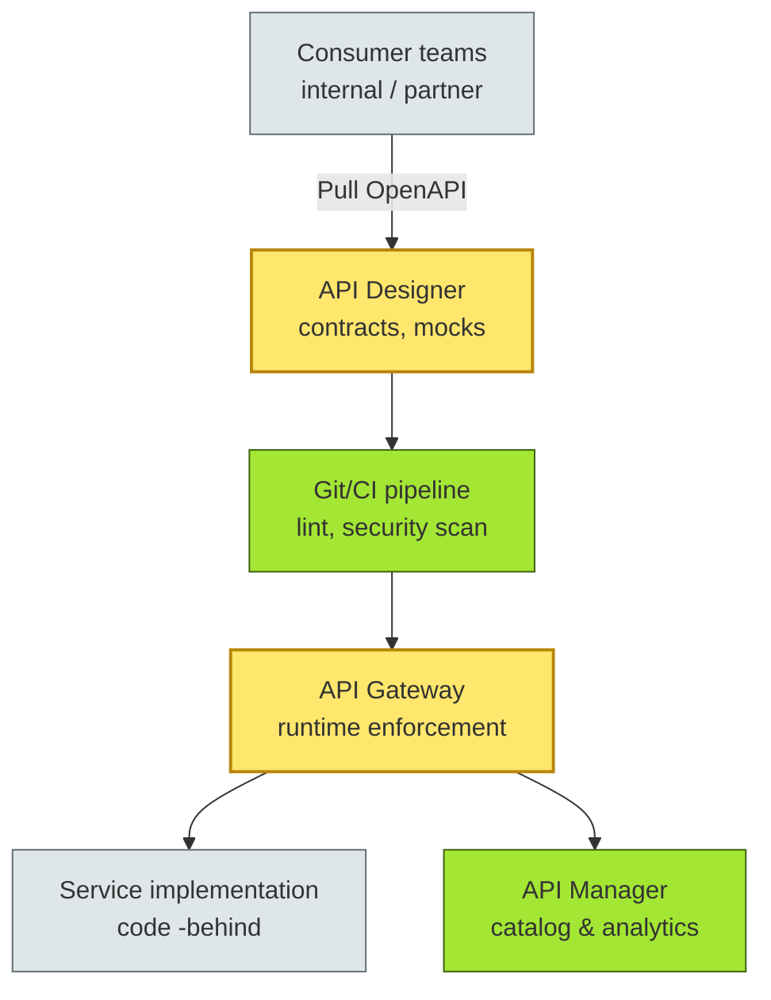
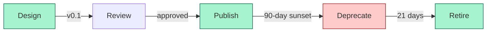
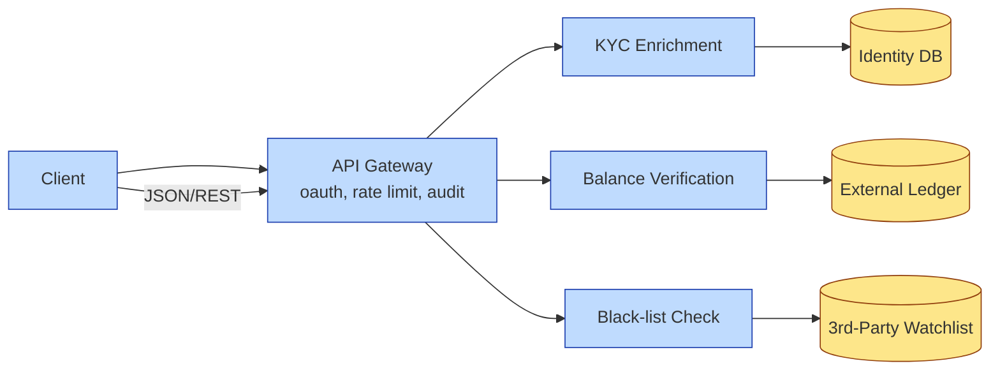

# [C4-08] API Design & Management — DETAIL
> **Category:** C4 — Architecture & Design
> **Companion brief:** `[briefs/C4-08-apis.md](../briefs/C4-08-apis.md)`
> **Target reader:** enterprise architect who must *explain, justify, and defend* the topic — not just recite it.

---

## 1. Precise definition
An **API** (Application Programming Interface) is a **published, machine-readable contract** that defines how a service provider's capabilities can be requested by a consumer. In enterprise architecture, APIs are governance primitives: they bundle not only endpoints and data shapes, but also semantics, versioning policy, security requirements, and lifecycle owners. ISO/IEC 25010:2011 (system and software quality) implicitly treats API usability and interoperability as quality characteristics; IEEE 1471-2000 (architecture description) treats API contracts as essential "architecture decision records" for interface-level design.

## 2. Why it exists (problem it solves)
Before API discipline, enterprise integration meant point-to-point adapters, a "spaghetti" of SAP-to-mainframe calls, and business logic duplicated across homegrown SOAP services. The pain points:

1. **No contract:** teams drift; consumers break; support burden explodes.
2. **No lifecycle:** once published, APIs are frozen at v1 forever; deprecation is political.
3. **No observability:** rate limits and throttling are explicit; SLA violations are ambiguous.
4. **Regulatory gaps:** GDPR and PCI-DSS require documented data flows, retention, and access; unaudited internal APIs are a liability.

API management platforms (Apigee, Kong, Tyk, Azure APIM) emerged to centralize these concerns.

## 3. Core concepts & vocabulary
| Term | Precise meaning |
|------|-----------------|
| API Contract | OpenAPI/AsyncAPI YAML/JSON defining paths, schemas, auth, and version; serves as single source of truth. |
| API Gateway | Runtime proxy that enforces routing, rate-limiting, auth, circuit-breaking, and transformation. |
| API Federation | Organizational model where product teams own APIs with center-ecosystem governance. |
| API Product Manager | Role (or team) accountable for API design, monetization, consumer support, and roadmap. |
| API Deprecation | Planned, communicated, timed migration path from v-current to v-obsolete. |
| OAuth 2.0 / OpenID Connect | Identity and authorization standard for API access; scopes map to least privilege. |

## 4. How it works (architecture / mechanism)
APIs are designed through a **contract-first** workflow: the provider and consumer co-author an OpenAPI document on the design branches. The document is linted, reviewed, and published to the API designer (e.g., SwaggerHub, Stoplight, or Apigee). At runtime, the API Gateway enforces the documented contract: path routing, request/response validation, JWT verification, rate limits, and circuit-breaking. The API Manager catalogs metadata: version, owner, consumer count, SLA, and deprecation date.

### 4.1 Diagrams

**Diagram A — Core structure (highlight the load-bearing parts = amber; supporting = grey):**



**Diagram B — Lifecycle / flow (highlight decision points = green; risks = red):**



## 5. Variants, options & trade-offs
| Variant | When to pick | When to avoid | Key trade-off axis |
|---------|--------------|---------------|--------------------|
| Central Gateway (single team owns all APIs) | Small banks, low API count, tight security control | Scale beyond ~20 APIs; product team velocity tanks | Governance vs autonomy |
| Federated Gateway (domain-owned Gateway) | 50+ APIs across lines of business; each division has compliance needs | Inconsistent security posture; shared services duplicated | Standardization vs flexibility |
| BFF (Backend-for-Frontend) per channel | Mobile + web + partner apps with distinct data shapes | Too many BFFs = debt; needs event-driven sync | Team autonomy vs coupling |
| AsyncAPI (events) instead of OpenAPI (HTTP) | Streaming events, Kafka, event-driven banking (trade finance, real-time settlements) | Consumers can't reason about timing or ordering | Sync contract vs event semantics |

## 6. Relationships to sibling topics
- **Data architecture:** APIs are the *transport* over data contracts; confusing them means documentary gaps with business-test coverage.
- **Event-driven architecture:** AsyncAPI events (streaming) vs REST APIs (request/response) are complementary—banking often needs both.
- **Security architecture:** API Gateway is the *enforcement point* for zero-trust network access; must be integrated in the reference architecture.
- **Integration architecture:** APIs are the *method* of integration; EAI/B2B bridges or message brokers are the *mechanism* when APIs are unsuitable (e.g., large bulk files).

## 7. Banking / financial-services context 💳
A regional bank faces three imperatives:
- **PCI-DSS / GDPR:** every API exposing cardholder data or personal data must be tokenized, authenticated, and logged. The EA requires `x-pci-scope: true` and `x-gdpr-scope: true` as custom OpenAPI extensions.
- **Trade finance:** SWIFT/gpi messaging combined with REST APIs for document upload without leaving the ecosystem.
- **Embedded finance / BaaS:** exposed APIs to non-bank partners must have sub-metered rate limits and billing tags to prevent abuse.

## 8. Reference architecture / worked example
**Problem:** A bank wants to on-board SMB depositors through a partner marketplace. The partner's app must call a KYC enrichment service, a balance verification service, and a black-listing check.

**Decision (ADR):**



P0 ADR 2025-08: *Expose three services under a single API Gateway with OpenAPI v1 contracts, decompose once v1 is stable.

## 9. Maturity & adoption signals
- **Adopt when:** >15 APIs, >3 consumer teams, any regulated data, partner integrations, or compliance audits.
- **Anti-signals (don't adopt yet):** a monolith with no surface area, <10 APIs maintained by one team, absence of OpenAPI/AsyncAPI tooling.
- **Common failure modes:**
  1. Forgetting deprecation: v1 lives forever; no one retires it.
  2. Over-engineering: a BFF for a single internal tool.
  3. Ignoring I
  4. Scope creep: API becomes a service bus because of lazy thinking.
  5. No owner: "everyone's API" → no-one's API.

## 10. Common confusions — the "don't mix" list
| Often confused | Real distinction |
|----------------|------------------|
| API Contract vs API Implementation | Contract = what is observable; implementation = how it is built |
| API Gateway vs Load Balancer | Gateway = runtime policy, routing, auth, throttling; LB = layer-4 distribution |
| API as a product vs API as a feature | Product = has lifecycle, revenue, SLO, owner, deprecation; feature = no consumer contract |
| RESTful vs API-first | RESTful = architectural pattern using HTTP methods; API-first = contract-driven design first |

## 11. Tools & standards to know
- **Standards/Frameworks:** OpenAPI Specification 3.x, AsyncAPI 2.x, ISO/IEC 25010:2011, IEEE 1471-2000
- **Common tooling:** Apigee, Kong, Tyk, Azure API Management, AWS API Gateway, SwaggerHub, Redoc, Stoplight
- **Mandatory reading:** _API-Driven Development_ (Caldwell & Brown), _API Management in Action_ (Jain)

## 12. ADR template (ready to fill in)
```markdown
# ADR-2025-08: API Gateway + three-service facade for partner onboarding
## Status
Proposed | Accepted
## Context
SMB deposit marketplace requires partner KYC enrichment, balance verification, and black-list checks behind a single consumer-facing surface.
## Decision
Expose three internal services through a shared API Gateway. Publish contract-first OpenAPI v1. Decompose via event-driven patterns when v1 is stable.
## Consequences
- Positive: unified auth, audit trail, rate limiting, partner self-service
- Negative: added hop latency; requires Gateway team to be on-call
- Negative: frontend semantics (JSON vs events) may diverge; plan BFF or transform
## Alternatives considered
1. Expose services directly → rejected: no central audit, security sprawl
2. Message-queues (Kafka) → rejected: synchronous partner UX requires HTTP
3. BFF per partner → rejected: 15+ partners unsustainable
```

## 13. Practice — apply it
1. **Recall:** define API governance in 2 min without notes.
2. **Model:** produce an ArchiMate/UML diagram from scratch for a real subdomain.
3. **ADR:** write a decision doc applying it to the banking example in §7.
4. **Defend:** roleplay explaining "API Gateway vs load balancer" to a non-technical CRO / CIO.

## 14. Summary (1 paragraph)
In a bank, APIs are not merely code endpoints; they are contractual obligations with legal, compliance, and commercial implications. API-first design, federated ownership, and explicit lifecycle governance enable regulatory audits, partner ecosystems, and future-proofing. Without these, integration becomes an undeclared, unaudited risk that grows with every new service.

---
**Status:** ☐ Not started · ☐ In progress · ✅ Covered · **Last updated:** 2025-09-14
