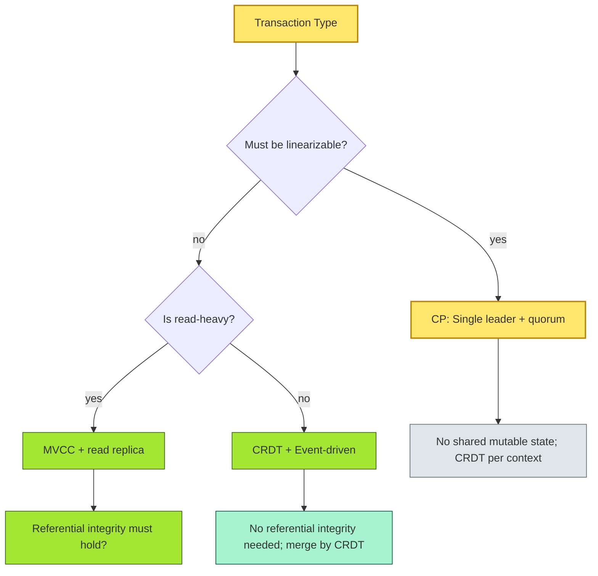
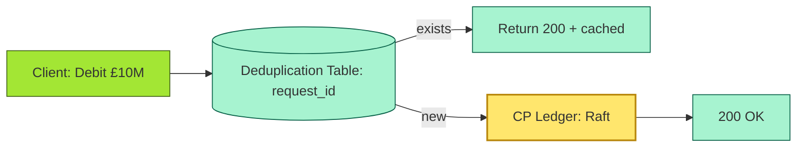
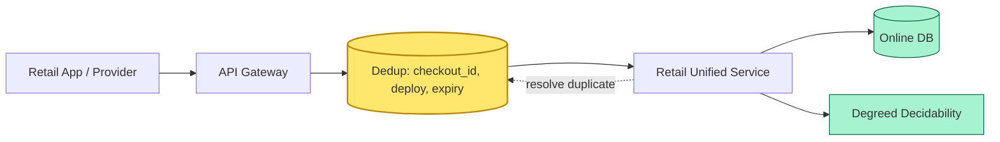

# [C4-09] Concurrency & consistency — DETAIL

> **Category:** C4 — System & Software Design · **Difficulty:** ●●
> **Companion brief:** `[briefs/C4-09-concurrency-consistency.md](../briefs/C4-09-concurrency-consistency.md)`
>
> > **Target reader:** enterprise architect who must *explain, justify, and defend* the topic — not just recite it.

---

## 1. Precise definition

**Concurrency** is the property of a system enabling *multiple* *threads* or *processes* to *access* *shared* *data* *simultaneously*, managed through *control structures* (locks, MVCC, optimistic concurrency, CRDTs, lock-free algorithms). **Consistency** is the guarantee that *a read* *returns* *the* *most *fundamentally* *correct* *state* *relative* to concurrent *writes*. The *correct* *consistency* + *concurrency* *model* *depends* *on* *the* *business* *rule* (e.g., *a* *£10* *M* *trade* *must* *not* *double-spend*; a *fraud* *score* *can be* *stale*).

The *intersection* of *concurrency* + *consistency* (a "Good Tradeoffs" *phrase) determines *which* *threads* *can* *read* *which* *data* *when*.

| Property | Meaning |
|----------|---------|
| **Linearizability** | The strongest *consistency*: *each* *operation* *appears* *to* *occur* *at* *a* *single* *instant* *between* *invocation* and *response*. *Example:* *every* *debit* *is* *immediately* *visible* *to* *every* *other* *transaction*. |
| **Serializability** | *Operations* *appear* *to* *execute* *sequentially* (but not necessarily *immediately*); *committing* *a* *transaction* *locks* *the* *affected* *rows* *until* *commit*. |
| **Isolation** | *Concurrency* *level*: *Read-Committed*, *Repeatable Read*, *Serializable* (locks), *Snapshot* (MVCC). |
| **MVCC** | *Multi-version* *concurrency* *control*: *each* *transaction* *reads* *from* *a* *snapshot* *of* *the* *data*; *writers* *create* *new* *versions*; *no* *reader* *blocks* *on* *writer* *or* *vice-versa*. |
| **Optimistic concurrency** | *Each* *operation* *checks* *for* *changes* *at* *commit* *time*; *fails* *if* *another* *transaction* *modified* *the* *data* *since* *it* *was* *read*. |
| **Pessimistic locking** | *Mutating* *transactions* *acquire* *locks* *on* *the* *rows* *up* *front*; *readers* *see* *only* *committed* *data*. |
| **CRDT** | *Conflict-Free* *Replicated* *Data* *Type*: *a* *data* *type* *that* *converges* *without* *coordination* (used in *event-driven* *AP* *systems*). |
| **Eventual consistency** | *Writes* *eventually* *become* *visible* *to* *all* *read* *operations*; *acceptable* *when* *stale* *data* *does* *not* *violate* *regulation* *or* *business* *logic*. |
| **Causality / Session consistency** | A *user* *always* *sees* *the* *writes* *it* *made*; *a* *global* *event* *stream* *may* *be* *stale* *by* *a* *few* *seconds*. Used in *user-facing* *AP* *features*. |
| **Idempotency** | *An* *operation* *that*, *when applied multiple times*, has *the same resulting state* as a *single* *application*. *Mechanisms:* *request* *ids*, *transaction IDs*, *deduplication*. |

**Literature:** *Distributed Systems: Principles and Paradigms* (Tanenbaum, 8th ed.), *Designing Data-Intensive Applications* (Kleppmann, 2017), *The Lost Art of Concurrency* (Melvin 2014).

## 2. Why it exists (problem it solves)

### The double-spend hazard
In 2010, a *buyer* *claimed* that *he* *sent* *BTC* *double* *while* *the* *clock* *was* *stuck*—the *writer* *read* *old* *data* *and* *wrote* *it* *back*. *Banking* is *even* *higher* *stakes*: a *double* *debit* *is* *a* *direct* *loss*.

### The read-write anomaly
A *read-only* *analyst* *runs* *an* *AML* *query* *while* *a* *fund* *transfers* *a* *£50M* *wire*; *the* *analyst* *sees* *an* *inconsistent* *view* (debit missing). The *rest* *of* *the* *transaction* *is* *only* *consistent* *if* *both* *the* *read* *and* *the* *write* *are* *isolated*.

### The latency trade-off
*Strong* *consistency* (e.g., *Paxos* *Raft* *consensus*) *adds* *millisecond* *rounds*; *an adaptive* *model* (e.g., *eventual* *consistency*) *will* *reduce* *latency* *to* *50-200ms* but *at* *the* *cost* *of* *staleness*.

## 3. Core concepts & vocabulary

| Term | Precise meaning |
|------|-----------------|
| **Wait-for graph** | A *graph* of *transactions* *waiting* *for* *locks*; *cycles* *indicate* *deadlocks*. |
| **Deadlock** | *A* *cycle* of *transactions* *each* *holding* *one* *resource* *and* *waiting* *for* *another*. |
| **Lock escalation** | *A* *large* *number* of *row-level* *locks* *promoted* to *table-level* *or* *database-level*. |
| **MVCC snapshot** | *A* *point-in-time* *copy* of the *data*; *reads* *see* *only* *committed* *versions* *at* *the* *snapshot* *timestamp*. |
| **Sequence number / version** | A *monotonically* *increasing* *number* on *each* *row*; *optimistic* *check* *against* *current* *version* *at* *commit*. |
| **Idempotency key** | A *client-generated* *key* *per* *logical* *operation*; *the* *system* *dedupes* *via* *the* *key*. |
| **Schema (CRDT)** | The *top-level* *definition* of *the* *data*; in *CRDT* *systems*, *untyped* *unstable*. |

## 4. How it works (architecture / mechanism)

### 4.1 Diagrams

**Diagram A — Architectural decision tree for concurrency/consistency (critical = decision, ok = default):**



**Diagram B — Idempotency via dedup table (ok = green dedup, critical = transaction):**



### 4.2 Mechanism

A *banking* *system* must *choose* *the* *correct* *combination*:

| Application | Concurrency | Consistency | Rationale |
|-------------|-------------|-------------|-----------|
| **Core ledger** | *Optimistic* + *pessimistic* *locks* on *row* *versions* | *Linearizable* | *Every* *debit* *must* *read* *current* *balance*; *row* *level* *pessimistic* *lock* *prevents* *double-spend*. |
| **Settlement** | *MVCC* *read* + *pessimistic* *locks* | *Linearizable* + *strict* *serializability* | *Bat-coin* *stable* *transfer*; *no* *conflict*. |
| **Fraud scoring (model inference)** | *CRDT* + *event-sourcing* | *Causality* *for* *user-facing*; *eventual* *for* *analytics* | *Multiple* *scoring* *services* *score* *same* *event* *in* *parallel*; *merge* *by* *event* *ID*. |
| **AML / CI** | *MVCC* *read* + *acidic* *write* | *Serializable* via *distributed* *transactions* (2PC) | *Sharma* *rule* *must see* *debit* *as* *committed*. |
| **Payment orchestration** | *Idempotency keyed* *via* *dedup* + *optimistic* *version* *check* | *At-least-once* *delivery* + *idempotent* *side effect* | *POST /charge* *can* *be* *retried*; *dedup* *guarantees* *once* *effect*. |
| **KYC / profile** | *MVCC* *snapshot* + *version* *check* | *Serializable* via *optimistic* *checking* | *Many* *users* *update* *same* *record* *in* *parallel*. |
| **Audit / compliance** | *Append-only* *log* + *append-only* | *Effectively* *consistent* (no deletion) | *Every* *debit* *written* *once* *only*; *never* *deleted*. |
| **Feature store (ML)** | *Optimistic* *per* *feature* + *event ID* | *Causality* *per* *entity* *per* *event* | *Per-entity* *version* *tracking*; *no* *global* *lock*. |

**Idempotency patterns:**

1. *Client-generated* *idempotency-key*: *the* *client* *generates* *a* *unique* *id* (UUID4) *per* *request*; *the* *server* *stores* *it* + *result* *(in* *a* *database* *or* *Redis*); *on* *duplicate* *key*, *return* *cached* *result* *(never* *re-debit*).
2. *Transaction-id* *based*: *the* *transaction* *has* *a* *globally* *unique* *id*; *dedup* *table* *stores* *(id, status)*; *replayed* *transactions* *checked* *against* *this* *table*.
3. *S3 multipart* *undertake*-dedup*: *hash* *of* *request* *body* *+ *HTTP* *header*; *avoid* *replay* *but* *more* *vulnerable* *to* *collision* *if* *not* *cryptographic*.

## 5. Variants, options & trade-offs

| Variant | When to pick | When to avoid | Key trade-off axis |
|---------|--------------|---------------|--------------------|
| **Pessimistic locking (row + table)** | Low-latency, high-integrity *debits* (payments, RTGS) | High-contention writes (e.g., *crowd-sourced* inputs) | *Integrity vs throughput* |
| **MVCC + Snapshot reads** | Read-heavy workloads (fraud analytics, dashboards) | Write-heavy, low-latency *transactions* | *Read concurrency vs write latency* |
| **Optimistic concurrency (CAS)** | High write concurrency, low conflict rate (e.g, *user* *profile* *updates*) | High conflict rate (e.g., *money* *transfer* ), *user* *tolerates* *slight* *stale* *read | *Throughput vs conflict* |
| **CRDT** | Event-driven, geo-distributed, high-availability *features* (e.g., *balance* *counter* in *each* *region* *replicating* *each* *other ) | High-integrity *transactions* requiring *order* and *no* *grief* | *Availability vs bounded correctness* |
| **Distributed 2PC** | Multi-region ACID transactions (cross-border asset transfer) | Low-latency, high-throughput web requests | *Consistency vs latency* |
| **Idempotency key + dedup** | Any async or external-integrating path | Stateless operations with no *natural* *distinct* identifier | *Reliability vs key bloat* |
| **Single-leader Raft** | *CP* *ledger*, *settlement*, *no* *transactions* *in* *parallel* | *Geographic* *scale* *without* *partition* *tolerance* | *Consistency vs geographic distribution* |

## 6. Relationships to sibling topics

- **Resilience (C4-05):** *Idempotency* and *retry confidence* (via *dedup*) are *resilience* *patterns*; *race conditions* are *resilience* *failures*.
- **Caching & async (C4-06):** *Async* *messaging* *must* *be* *idempotent*; *cache* *invalidation* *must* *be* *idempotent* and *atomically* *consistent*.
- **API (C4-08):** *APIs* *contract* *the* *idempotency* *contract* to *the* *client*; *idempotency* *must* *be* *explicit* in *the* *spec*.
- **Distributed fundamentals (C4-03):** *Partitions* *make* *strong* *consistency* *harder*; *CRDTs* *trade* *a* *fraction* *of* *correctness* *for* *availability*.
- **Observability (C4-12):** *Staleness* and *contention* *must* *be* *observed*; *without* *observability* *you* *cannot* *tune* *consistency* *vs performance*.

## 7. Banking / financial-services context 💳

### Scenario
A **global retail bank** processes *transactions* in *18* *countries*:

| Transaction type | Volume per month | Consistency requirement |
|------------------|------------------|-------------------------|
| **UPI / P2P transfers** | 5B | *Strong* (linearizable): *no* *double-spend*. *Pessimistic* *locks* on *account* to *debit* *single* *time*. |
| **Card authorization** | 10M | *CP* *ledger*: *single* *leader* *Raft* + *optimistic* *row* *version*. *Idempotent* *request-id*. |
| **Card settlement** | 10M | *Strong* + *atomicity* — *2PC* *across* *200* *acquirer* *nodes*; *no* *transaction* *spilled* *to* *Kafka* *un-committed*. |
| **AML / fraud** | 2M alerts + 10M events | *Event-sourced* + *CRDT* per *entity*: *dedup* *by* *event* *ID*; *causality* *for* *user-facing* *fraud* *status*; *eventual* for *analytics*. |
| **KYC / profile** | 1M | *MVCC* *snapshot* *with* *version* *check*; *many* *users* *update* *same* *record* *in* *parallel*. *Idempotency* *via* *user* *id* + *request* *id*. |
| **Shared feature store** | 10M features | *CRDT* *counters* across *200* *regions*; *conflicts* *resolved* *per* *event* *ID*; *no* *2PC*. |
| **Regulatory reporting (BCBS 239)** | N/A | *Append-only* *log* + *linearizable* *write*. *Every* *position* *disclosure* *must* *be* *traceable* and *non-decreasing*. |

### Regulatory tie-in
- **BCBS 239:** *Audit trail* *must* *be* *immutable*, *data* *integrity* *must* *not* *be* *destroyed*, *no* *remediation* *without* *trace*.
- **GDPR Art. 7:** *Consent* *must* *be* *revocable* (read-modify-delete is *forbidden*); *data* *is* *immutable* *but* *logically* *deleted*; *immunes* *CP*.
- **DORA:** *Resilience* *tests* *must* *include* *data* *integrity*; *could* *be* *tested* with *identity* *revalidation* + *margin* *accountability*.
- **PCI-DSS v4.0:** *Idempotency* *required* *for* *any* *payment* *request* *that* *may* *be* *duplicated* *by* *network* *failure*; *flex* *minimizes* *retries*.

## 8. Reference architecture / worked example

### Problem
A **third-party acquirer** *embeds* *the* *bank's* *payment* *API* *in* *a* *trading* *platform*. *When* *network* *fluctuation* *occurs* *between* *order* *creation* *and* *confirmation*, *the* *retail* *app* *retries* *the* *same* *request* *twice*. *Without* *idempotency* *protection*, *the* *bank* *debits* *the* *user's* *account* *twice* *(the* *second* *commit* *succeeds* *because* *the* *first* *never* *confirmed*). *PCI-DSS* *audit* *flagged* *this* *as* *duplicate* *charge*; *exceeds* *the* *0.5%* *reversals* *limit*.

### Decision
Implement *idempotency* *via* *a* *deduplication* *table* *using* *a* *cryptographic* *dedup check* *and* *optimistic* *concurrency*:

1. *Store* *request* *ID* *and* *transaction* *status* *("INITIATED"*, *"COMMITTED"*).
2. *On* *duplicate* *req*, *return* *status* "*ALREADY* *COMMITTED*".
3. *Optimistic* *version* *check* *on* *all* *debit* *records* (check *X* changed *since* *we *read*).

### ADR

```markdown
# ADR-060: Idempotency for a concurrent checkout + debit path

## Status
Accepted

## Context
- Multiple retail apps (WechatPay, Grab) *call* *POST /checkout* *+* *POST /debit* *on* *occasional* *failure* *retries*.
- *WeChat* *and* *Grab* *use* *strict* *retry* *without* *client* *idempotency* *guarantee*.
- *Without* *idempotency*, *duplicate* *charges* *exceed* *PCI-DSS *0.5% *reversal *threshold*.

## Decision
1. Add *dedicated* *server* *table* *checkout_dupe* *(request_id, merchant_id, amount)*.
2. *Cache* *settling* *(1-day TTL)*; *no* *worker* *should* *repeat* *a* *request* *already* *inside* *cache*.
3. *Use* *optimistic* *consolidation*: each debit row has *an* *etcd* *version*; *on deposit* *conflict*, *reject* *with* *410 gone* *if* *out-of-date*.
4. *Split* *checkout* *into* *two* *ideally* *two* *idempotent* *requests* *** -* *checkout* *and* *debit* — *both* *with* *idempotency* *key*.

## Consequences
- Positive: *IP* *deduplication* *eliminates* *duplicate* *debits*; *PCI-compliance* *re-certified*.
- Negative: *Cache* *extra* *indirection* *adds* *~5ms* *latency*; *acceptable* *under* *PCI-DSS 100ms P99*.
- Negative: *Periodic* *cache* *and* *dedup* *cleanup* *required*; *SRE* *runbook* *needed*.

## Alternatives considered
1. *503 with path backoff retry: *Would* *not* *prevent* *double* *charges*; *rejected*.
2. *Set* *client* *secret *in* *the* *sig *only: *WeChat* *retries* *without* *client* *header; *rejected*.
```

### Diagram (reference architecture)



## 9. Maturity & adoption signals

- **Adopt when:** *Transactions* *are* *concurrent*; *multiple* *backend* *contributors* *exist*; *retries* *must* *be* *safe*.
- **Anti-signals (don't adopt yet):** *Single* *threaded* *schema*; *no* *external* *integration*; *no* *retry* *logic*.
- **Common failure modes:**
  1. *Write* *conflict* *wait* *overlap* *across* *transactions*: *lost* *updates* *with* *optimistic* *version* *checks* *failed*.
  2. *Cache* *miss* *storm*: *Tumultuous* *read* *and* *write* *spikes* *on* *a* *cache* *node* *lead* *to* *tipping* *overload*.
  3. *No* *global* *monotonic* *order* *on* *CRDT* *events*: *Commits* *diverge* *instead* *of* *converge*.

## 10. Common confusions — the "don't mix" list

| Often confused | Real distinction |
|-----------------|------------------|
| Consistency vs concurrency | *Consistency* = *what* *data* *is* *visible*; *concurrency* = *how many* *threads* *access* *data*. |
| MVCC vs optimistic | *MVCC* = *multi-version*; reads via *snapshots*; *optimistic* = *check* *version* *at commit*. |
| Idempotency vs exactly-once | *Idempotency* = *safe to retry*; *exactly-once* = *no duplicate delivery*; *Kafka* + *dedup* = *at-least-once* + *idempotency*. |
| Linearizability vs serializability | *Linearizable* = *can't see stale*; *serializable* = *can see stale* (bounded) *if* *order* *is* *preserved*. |

## 11. Tools & standards to know

- **Standards/Frameworks:** FAPI 1.0, PCI-DSS v4.0, GDPR, ISO/IEC 27001, BCBS 239.
- **Common tooling:** *PostgreSQL* + *MVCC*, *CockroachDB* + *MVCC*, *Redis* + *dedup*, *Apache* *Beam +* *Flink* *with* *idempotent* *write*, *Hyperledger Fab* + *Corda*, *Distributed locks* (Etcd, ZooKeeper).
- **Mandatory reading:** *Designing Data-Intensive Applications* (Kleppmann 2017), *The Lost Art of Concurrency* (Melvin 2014), *Machine Savings: What Agents Can Do for You* (Fay 2021).

## 12. ADR template (ready to fill in)

```markdown
# ADR-XXX: <decision>
## Status
Accepted | Proposed | Deprecated

## Context
...

## Decision
...

## Consequences
- Positive ...
- Negative ...
- ...

## Alternatives considered
1. ...
2. ...
```

## 13. Practice — apply it

1. **Recall:** list *5* banking *concurrent* *scenarios*; *name* *the* *correct* *consistency* *model*.
2. **Model:** produce an *ArchiMate* *showing* *a* *payment* *debit* *path* *with* *idempotency* *checks*.
3. **ADR:** write a decision for *idempotency* *in* *a* *third-party* *account-creation* *path*.
4. **Defend:** roleplay *explaining* *to* *a* *non-technical* *CRO* *why* *strong* *consistency* *is* *not* *universal*.

## 14. Summary (1 paragraph)

Concurrency and consistency are the *twin constraints* shaping every banking transaction. They are *not academic*; they are *life-or-death* *rules: double-spend, duplicate charges, and reconciliation failures are *the* *leading* *causes* *of* *financial* *loss* in *modern* *systems. The EA must *match* *each* *application* *to* *its* *correct* *model* (linearizable for the ledger, causal for fraud, event-driven for the feature store) and *enforce* *idempotency* as *a* *non-negotiable* *sustainability* *requirement*.

---
**Status:** ☐ Not started · ☐ In progress · ✅ Covered · **Last updated:** 2026-09-14
