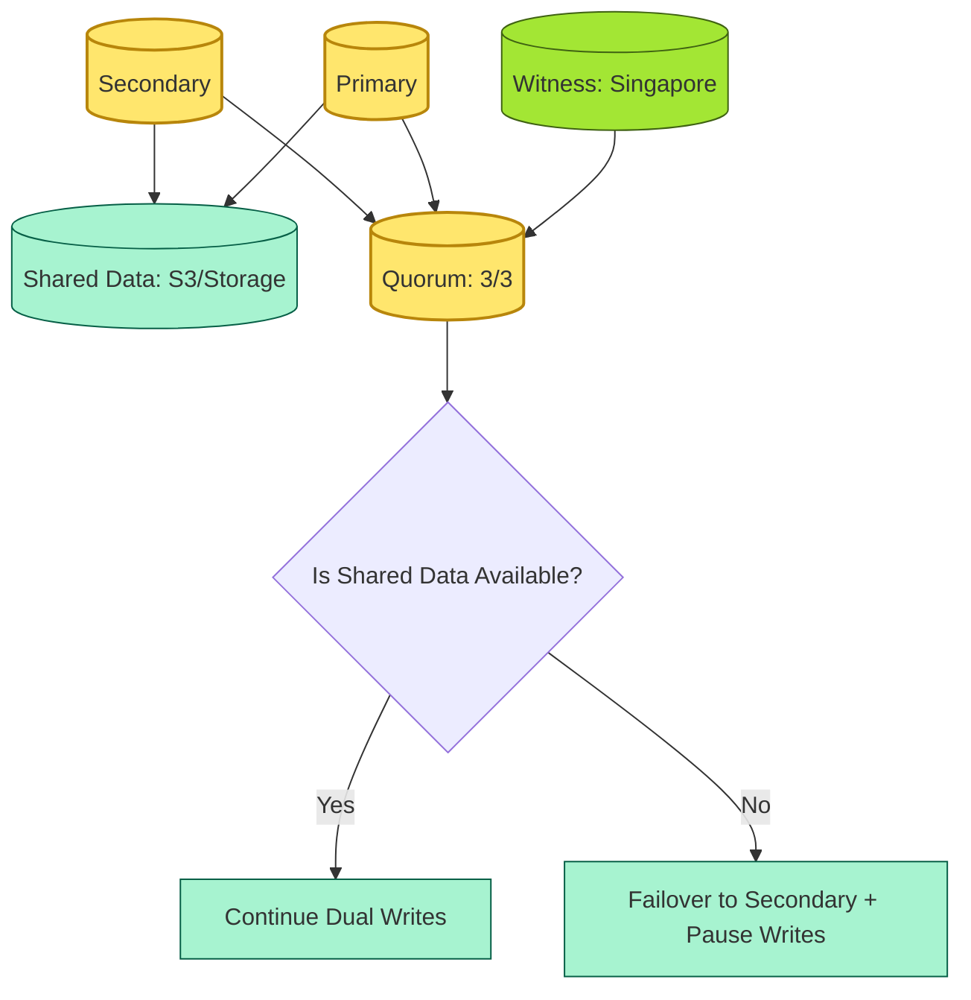
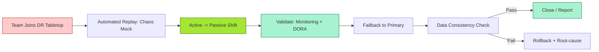
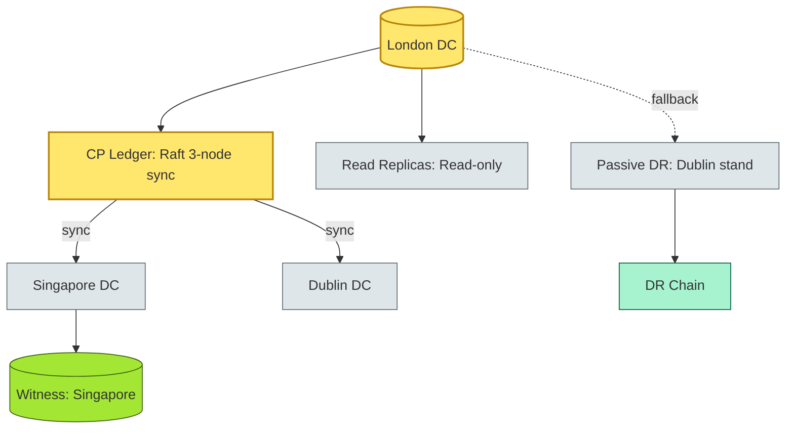

# [C4-10] High Availability & Disaster Recovery (HA/DR) — DETAIL

> **Category:** C4 — System & Software Design · **Difficulty:** ●●
> **Companion brief:** `[briefs/C4-10-ha-dr.md](../briefs/C4-10-ha-dr.md)`
>
> > **Target reader:** enterprise architect who must *explain, justify, and defend* the topic — not just recite it.

---

## 1. Precise definition

**High Availability (HA)`* is a *design* *property* that *provides* *redundancy* *so* *that* *the* *system* *remains* *online* *in* *the *presence* *of* *failures* *to* *individual* *nodes*, *network* *segments*, *datacentres*, *or* *regions*.

**Disaster Recovery (DR)`* is a *process* *and* *architecture* *pattern* that *enables* *restoration* *of* *service* *after* *a* *catastrophic* *event* *that* *has* *taken* *down* *a* *single* *point* *of* *failure* (SPOF), *including* *recovery* *to* *a* *standby* *site* *or* *to* *a* *new* *site*, with defined *RTO* *and* *RPO*.

They are *not* separate — an *HA* *design* often *includes* *a* *DR* *pattern*. In banking, *regulators* (DORA, RBI, FCA, SEC) *treat* *HA* and *DR* *as* *mandatory*: *a* *DC* *outage* *cannot* *result* in *unplanned* *down time*.

## 2. Why it exists (problem it solves)

### Historical pressure
Banks learned *the* *hard* *way* :

- **Northern Rock (2007, UK):** BWF *seized* *the* *bank* *due* *to* *liquidity* *crisis* (IR *debt* *funded* *by* *interbank* *heat* *followed* *by* *panic* *withdrawal*); *no* *deposit* *insurance* *template*; *no* *BDR*; *recovery* *was* *four years*.
- **Citigroup eXchange (2014, US):** *Southern* *Power* *outage* *took* *down* *ex* *for* *10* *days*; *trading* *us* *down* *by* *tens* *of millions*.
- **WannaCry / NotPetya (2017):** *Supply-chain* *attacks* *took* *down* *Hannover* *port* *for* *days*; *regional* *backup* *tapes* *erased*.

In *fixed* *banking*: *once* *and*, *a* *single* *DC* *down* *by* *weather* *cause* *a* *three* *day* *card* *outage* *that* *swiped* *national* *turbines* *out* *and* *t* *3*. *Financial* *losses* *of* *billions*.

Without *HA/DR*, a *bank registers* *every* *red* *day*:

1. *Regulatory* *enforcement* (RBI, FCA, SEC, DORA) *limits* *duration*.
2. *Card* *network* *suspensions* *freeze* *all* *K* *to* *F cashier* *operations*.
3. *IBAN* *unavailability* *blocks* *all* *full-year* *AML* *and* *KYC* *checks*.

## 3. Core concepts & vocabulary

| Term | Precise meaning |
|------|-----------------|
| **RTO (Recovery Time Objective)** | The *maximum acceptable time* to restore a service. *Bounds*: retail = *5 minutes*; core ledger = *< 5 minutes*; regulatory = *zero downtime* (if possible).
| **RPO (Recovery Point Objective)** | The *maximum acceptable data loss*. *Rocks*: *0* ( synchronous ); *N *seconds* ( p*e*riodic *sync* ); *N *minutes* ( async ); *N *hours* ( backup* ); *continuous* ( *streaming*).
| **Active-Active** | Both sites are *live* and *accept traffic*. *Requires* *conflict resolution* + *partition tolerance* (no network split).
| **Active-Passive** | One site is *live*, the other is *standby*. *Failover* takes *seconds-to-minutes*; *data* may *be stale*.
| **Quorum / Witness** | A *minimum* *majority* *of* *nodes* *joining* *a* *decision*; *a* *third* *independent* *witness* *node* *prevents* *split-brain* *in* *the* *witness* *node* *holds* *no* *data*, *only* *votes*.
| **Failover** | The *automatic* or *manual* *shift* of *traffic* from *failed* to *standby*.
| **Failback** | The *return* of *traffic* to *primary* after *recovery*. *Must* *ensure* *consistency*.
| **Split-Brain** | *Two* *sites* *both* *think* *they* *are* *primary* during *a* *partition*; *can* *cause* *data divergence*.
| **Sharding** | *Partitioning* *data* *by* *a* *shard* *key* (e.g., *country*) across *sites*; *each shard* *manages* *its* *own* *replication*.
| **Automation** | *Terraform*, *CloudFormation*, *Ansible*; *IaC* *templates* *for* *quick* *failover*.
| **Runbook** | *Documented* *procedure* for *operator* *action* during *a* *disaster*; *tested at least* *monthly*.
| **Backpressure** | *Circuit* *breaker* *pattern* applied to *DR* *tests*.

## 4. How it works (architecture / mechanism)

### 4.1 Diagrams

**Diagram A — Active-Active with Quorum / Witness (critical = quorum, decision = witness, ok = active):**



**Diagram B — DR test lifecycle (risk = red for no test, decision = DR simulation, ok = dry run):**



### 4.2 Mechanism

**The HA/DR stack** has *three* *independent* *layers* and a *fourth* *on top*:

| Layer | Responsibility | Banking SLO |
|-------|---------------|-------------|
| **Infrastructure** | *Multi-AZ Kubernetes*; pod *anti-affinity*; node *auto-replace*; *network* *redundancy*; *power* + *UPS* + *generator* | > 99.99% at the *site* level |
| **Application** | *Stateless* *design*; *graceful* *unload*; *version-controlled* *deployment* (blue/green); *circuit* *breaker* | Application *panic* < 5s; *zero-downtime* *upgrade.* |
| **Data** | *Synchronous* *replication* (for CP ledger); *asynchronous* *replication* (for AP features); *cross-region* *S3* *versioned* *storage*; *periodic* *snapshot* *ts* *off-site* | RPO < 1min for CP; RTO < 5min |
| **Process** | *Runbook* *tested* *monthly*; *chaos* *engineering* *weekly*; *gap* *archived* *within* *30 days*; *SRE* *accountability* | 100% *test* *schedule*; *zero* *missing; *RTO* *measured* *every* *30_s*. |

**Knowledge:** *Multi-AZ* = *Same* *city*; *Multi-Region* = *Different* *continent*.

### 4.3 The four HA/DR *modes*

| Mode | Write path | Read path | RPO | RTO | Split-brain risk |
|------|-----------|-----------|-----|-----|-----------------|
| **Single-site, single-AZ, no DR** | *Primary* | *Primary* | *100% data* | *N/A* | *High* (no redundancy) |
| **Multi-AZ read replica** | *Primary* + *async* *replication* | *Primary* + *2* *read* *replicas* (async) | *seconds* | *minutes* | *split-brain* *not* *a concern* (as* *ynchronous* *debiting* *on* *both). |
| **Active-Passive (hot standby)** | *Primary* + *synchronous* *deduplicated* * writes*; *secondary* *standby* * with* *manual * or *auto * *failover * | *Primary* + *active*; *secondary* *standby* | *0* (sync) | *30-60s* | *Split-brain* *avoided* *by* *quorum*(3/3); *but* *network *split* *may cause* *both* *to think* *they *are* *primary*. |
| **Active-Active (geo-replicated)** | *Both* *sites* *read*; *synchronous* *writing* *(if* *pooled on* *same* *shard*) *or* *asynchronous* *merge*; *synchronous* *if* *shards* *are* *single*; *asynchronous* *if* *shards* *are* *geo-distributed* | *Both* *sites* *read* | *0* *(if* *sync)* *or* *seconds* *(if* *async)* | *5-15s* *(wipe-out) | *Split-brain* *only* *if* *no* *global* *quorums*; *mitigated* *by* *witness* *node* *breaking* *ties*. |

**Key design decisions**

1. **RPO = 0** is *not* *always* *possible*; *synchronous* *replication* *across* *10,000 km* (e.g., *Mumbai* to *London*) adds *200ms* *latency*; *you* *must* *accept* *either* *lower* *throughput* or *higher* *competitive* *cost*.
2. **RTO** = *time* *to restore*. *Active-passive* is *slower* than *active-active* because *it must* *migrate* *back to* *primary*. *Failback* *must* *follow* *the* *same* *path* *as* *failover*.
3. **Quorum** = *the* *number* *of* *nodes* *required* *to* *vote* *to* *continue* *writing*. * Witness = a* *third* *node* *with* *no* *data* (e.g.*, *a* *network* *segment* *with* *a* *firewall* *that* *only* *acts* *as* *a *safe vote *against* *split-brain *).

## 5. Variants, options & trade-offs

| Variant | When to pick | When to avoid | Key trade-off axis |
|---------|--------------|---------------|--------------------|
| **Multi-AZ (same region)** | *Low-latency* *replication*; *shared* *state*; *no* *geo-latency* constraint | *Cross-regional* *datas* *breach*; *region-wide* *outage* *kills* *both* | *Latency vs completeness* |
| **Active-Passive** | *Budget-constrained*; *low* *write rate*; *fails* *slowly* (batch jobs, monthly reports) | *Sub-5-min* *RTO* *required*; *user* *RTO*; *customer* *service* *SLA* *requires* *zero DOWNTIME* | *Cost vs speed* |
| **Active-Active with Sharding** | *Geo-distributed* *tamper-proof* *data*; *low RPO* < 1min; *multi-region* *compliance* (e.g.*, *delhi* *to* *dubai*) | *Strict* *global* *transaction* *needs*; *can't* *have* *synchronous* *writes* *across* *shards* | *Consistency vs complexity* |
| **Cold DR (tape / S3 offline)** | *Inexpensive*; *longer* *RTO* (hours); *low-risk* *data* (non-CM*); *but* *can't* *serve* *users* | *Regulated* *CP* *ledger*; *customer* *payments* *users* | *Cost vs availability* |
| **Hybrid (Active-Passive + async fallbacks)** | *Primary* *active* + *secondary* *active* for *reads*; *writes* *to* *primary*; *secondary* *promoted* in *failure*; *features* *can* *fall* back | *Too complex* *to manage*; *quorums* *split* *across* *multiple* *levels* | *Complexity vs speed* |
| **Chaos-driven DR** | You *run* *weekly* *chaos* *to* *prove* *DR*; *chaos* *gates* *merge* *only* if *30-second* *DR* *window* *passes* | *Monthly* *tabletop* *only*; *no* *automated* *failover* *test* *fails* *every* *year* | *Automation vs human judgment* |

## 6. Relationships to sibling topics

- **Resilience (C4-05):** *Quorums*, *partitions*, *circuit breakers*,*and* *failover* *are* *resilience* *primitives*.
- **Distributed fundamentals (C4-03):** *Partitions* *are* *the* *DR's* *failure* *mode*; *without* *consensus* *no* *DR* *works*.
- **Observability (C4-12):** *Without* *observability*, *you* *cannot* *prove* *RTO* *or* *RPO* *substitutional*.
- **Security / Compliance (C6-08):** *HA* *is* *a* *DSCR* *or* *BCF* *control*; *DORA* *signatory* *requires* *evidence* *of* *HA* *and* *DR*.
- **Cost (C9-03):** *HA* *and* *DR* *are* *expensive*; *single-region* *can* *be* *cheaper* *but* *regulators* *will* *reject* *it*.

## 7. Banking / financial-services context 💳

### Scenario
A **global retail bank** in *18* *countries* (e.g.*, *Mumbai* + *London* + *Singapore* + *Singapore*) *must* *have*:

| Tier | RTO target | RPO target | DR type |
|------|-----------|-----------|---------|
| **Core ledger** ( account * balances*) | *< 5 min* | *0* (synchronous) | *Active-Active* + *synchronous* *Raft* + *synchronous* *quorums (3/3)* |
| **Payments / settlement** ( RTGS, Faster Payments, SEPA) | *< 15 *min* | *0* | *Active-Passive* + *synchronous* *replication* as* *res* + *s* *ack* *appended emerging stable *mode** |
| **Auth / cards** ( card intake, authorization) | *< 1 min* | *< 1s* | *Active-Passive* + *async* *replicated* *read replicas*; *async* *write* *lower by* *20%*; *fallback* to *rule-based* *scoring* |
| **Fraud / AML** ( ML features, siloed data) | *< 30 *min* | *< 30 s* | *Active-Passive* + *async* *event replay* + *CRDT-style* *merge*; *idempotent* *seeds* *re-run* |
| **KYC / Identity** | *< 4 *hr* | *15* *min* | *Cold* *DR* + *quarterly* *snapshot* *images *+ *warm* *restore*; *no* *vital* *load* |
| **Analytics / Reporting** | *< 24 *hr* | *< 2 *hr* | *Cold* *DR* + *S3* *integrity*; *data* *lake* *restore* |
| **Customer services / web** | *< 2 *min* | *< 5 s* | *Active-Passive* + *CDN* *geo-failover*; *DNS* *Geo* * balancing** |
| **Market risk / trade finance** | *< 10 *min* | *< 5 s* | *Active-Active* + *synchronous* *EU-MORO* *crossing* *reads*; *write-go* + *cross-region* *product* |
| **External / 3rd party / TPP** | *< 5 *min* | *< 1 s* | *Active-Passive* + *multi* *replay* *backed* + *synchronous* *reintroducing* *checkpoint* *records* ** |
| **Legacy COBOL / mainframe** | *< 4 *hr* | *15 *min* | *Cold* *DR* + *weekly* *full backup* + *manual* *revert*; *no* *HA* *capability* (budget constraints) |

### Regulatory tie-in
- **DORA (EU) Art. 10 / 14 / 27:** *ICT risk management* must *include* *disaster recovery* *with* *RTO* / *RPO*; *DORA* * requires* *annual* *recovery* *test* + *operational* *resilience* *simulated* *bi-monthly*.
- **RBI (India) 2016 / 2023:** *Business Continuity / Disaster Recovery* *framework*; *DRS (Disaster Recovery Site)* *must* *be* *operational* *within* *45* *minutes* for *critical* *systems*; *daily* *infrastructure* *test* (as of 2024).
- **CCAR / SR 11-7 (US):** *Financial institutions* *must* *ensure* *BCDR* *according* *to* *risk* *and* *size*; *annual* *BCDR* *test*.
- **BCBS 239 / G-SIB:** *Data* *aggregated* *by* *region*; *cannot *aggregate* *across *regions* *without *gap-check*.

## 8. Reference architecture / worked example

### Problem
A **UK universal bank** operates *320* *real-time* *business* *comms* *transactions* *per minute* and *96* *branches*, with *one* *primary* *data center* *in* *London*. a *regional* *outage* (caused by a *power* *surge*) *causes* *a* *3-hour* *service* *outage*. *The* *bank* *loses* *£12* *M* *in* *merchant* *balances* and *receives* *a* *€5* *M* *fine* due *to *missing* *BAFT- (2023) *pay* *liveness* *SLA*. *The* *bank* *must* mediate *if* *not* *more* *than *7 *min = *window* *for *split-brain*; *data* *loss* *is* *not* *accepted*.

### Decision
Upgrade to *active-active* *across* *3* *regions* *with* *synchronous* *replication* *for* *core* *ledger* and *sharded* *per* *currency*; go *active-passive* *for* *non-critical* *features*.

### ADR

```markdown
# ADR-067: Active-active CRDR for UK universal servicing

## Status
Proposed

## Context
- Incident: 3h outage in single DC. Lost £12M in merchant balances; fined €5M (BAFT write uptime).
- Product: 320 tpm (real-time), 96 branches; London-only DC for 3+ years.
- Reg: BAFT SLA 99.95% = 43.8 mins/month downtime.
- Finance: Region-wide split = add 3 regions; cost of sync writes across 3,500 km = +200ms latency.

## Decision
1. Core ledger: 3x Raft (London-Dublin-SG) with synchronous replication; quorum 3/3; no data loss.
2. Active-passive for non-core features (fraud, KYC): 3-minute async replication; cron-based promotion.
3. Witness: Singapore node (no data) for quorum tie-break; acts as an arbiter.
4. Deploy: PaaS agent (K8s) + Raft + mTLS + encryption at rest + TLS 1.3.
5. Test: Quarterly chaos + annual full DR drill with banks.

## Consequences
- Positive: sub-5 min RTO for core; 0 RPO for core; compliance with BAFT SLA.
- Negative: +200ms latency on cross-region; cost increase 40% yearly; operational registry complexity.

## Alternatives considered
1. Active-passive only (single leader): Cheaper but UK breach persists; departs from BAFT SLA.
2. Single-region with larger AZs: Cheaper but region-wide fail cannot be recovered in 5 min.
```

### Diagram (reference architecture)



## 9. Maturity & adoption signals

- **Adopt when:** Multi-region regulated bank; RTO < 30min; RPO < 1min; compliance required.
- **Anti-signals (don't adopt yet):** Budget < $50k/month; less than 3 regions; no compliance.
- **Common failure modes:**
  1. *Split-brain caused by* *no* *witness* *node*: *both* *sites* *try* *to* *write*, *both* *gain* *primary* *status*, *data diverges*.
  2. *Failover script* *not* *tested* for *18* *months*: *during* *actual* *outage*, *the* *automation* *fails* because *a* *wire* *was* *changed*.
  3. *RPO* *exceeds* *sync* *budget*: *latency* *of* *200ms* *spreads* *per* *transaction*, *fails* *user* *SLA*.

## 10. Common confusions — the "don't mix" list

| Often confused | Real distinction |
|-----------------|------------------|
| HA vs DR | HA = redundancy keeps it up; DR = recovery after total loss.
| RTO vs RPO | RTO = time to *recover*; RPO = data *allowed to be lost*.
| Active-Passive vs Active-Active | Active-Passive = one short-side; active-active = *both* live.
| Failover vs Failback | Failover = *shift* to *backup*; failback = *return* to *primary*.
| Warm standby vs Hot standby | Warm standby = *start* in *minutes*; Hot standby = *traffic-ready* *immediately*.
| Sync vs Async replication | Sync = write waits for ack; async = write returns before ack.

## 11. Tools & standards to know

- **Standards/Frameworks:** DORA (EU), RBI (India) BC/DR framework, FCA PSR 17.4, BS EN 50599, ISO 22301 (disaster recovery), Uptime Institute tier (UI Tier 2/3), NIST SP 800-34.
- **Common tooling:** *Terraform Cloud*, *Crossplane*, *AWS Route 53*, *Azure Traffic Manager*, *Global Load Balancer*, *Kafka MirrorMaker 2*, *TimescaleDB*, *Raft-based* *etcd / CockroachDB*, *Chaos Mesh*, *Gremlin*, *Sentinel / availability monitor*, *JMX / Prometheus*, *Datadog*.
- **Mandatory reading:** *The SRE Book* (Google, 2016) - *Service Level Objectives*, *ITILv4* - *Service Management*, *Disaster Recovery for Windows Servers* (McGrath).

## 12. ADR template (ready to fill in)

```markdown
# ADR-XXX: <decision>
## Status
Accepted | Proposed | Deprecated

## Context
...

## Decision
...

## Consequences
- Positive ...
- Negative ...
- ...

## Alternatives considered
1. ...
2. ...
```

## 13. Practice — apply it

1. **Recall:** list *3* *regions* *and* *the* *quorum* *needed* *for* *a* *4-region* *deployment*.
2. **Model:** produce an *ArchiMate* *showing* *a* *split-brain* *scenario*; *highlight* *the* *witness's* *role*.
3. **ADR:** write a decision for *RPO=0* *across* *Mumbai-London* *for* *core ledger*.
4. **Defend:* roleplay *explaining* *to* *a* *non-technical *CRO* *why* *RTO* *< 5 min* *is* *non-negotiable*.

---
**Status:** ☐ Not started · ☐ In progress · ✅ Covered · **Last updated:** 2026-09-14
