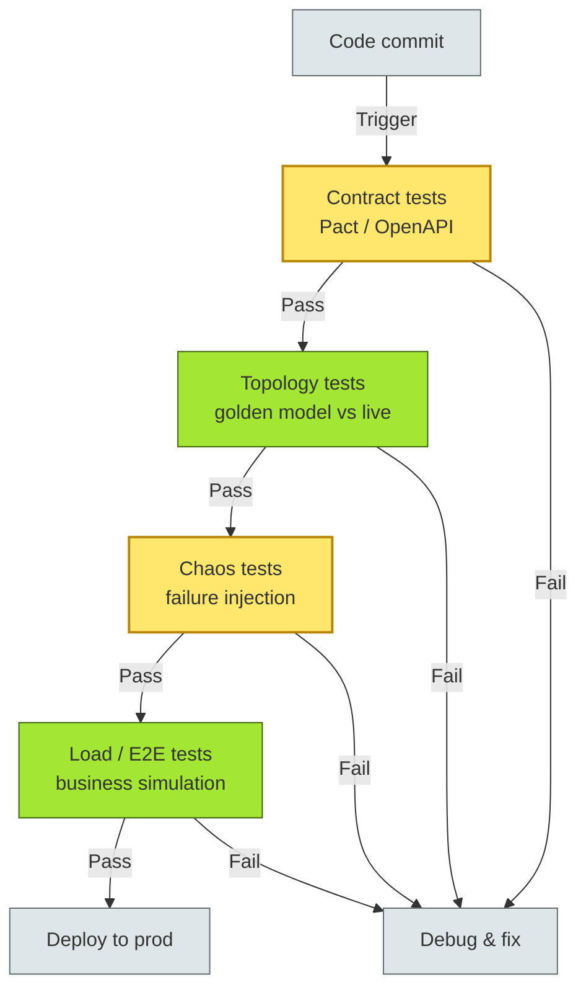
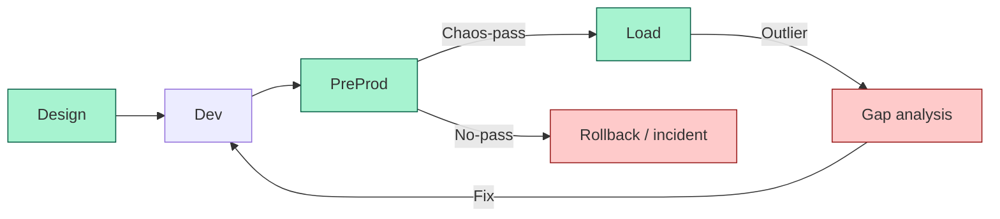
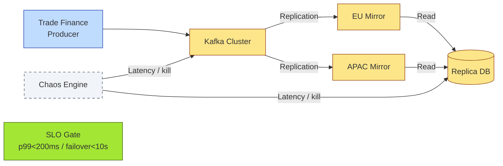

# [C4-11] Architectural Testing — DETAIL
> **Category:** C4 — Architecture & Design
> **Companion brief:** `[briefs/C4-11-testing.md](../briefs/C4-11-testing.md)`
> **Target reader:** enterprise architect who must *explain, justify, and defend* the topic — not just recite it.

---

## 1. Precise definition
**Architectural testing** is the disciplined validation of an architecture's **structural invariants, behavioral contracts, and non-functional requirements (NFRs)** through automated and manual test techniques. It is distinct from unit, integration, and system testing in scope and in the *objects* it selects: components, services, deployments, and the topology among them. The IEEE 829 (Software Test Documentation standard) and ISTQB Advanced Test Analyst syllabus explicitly recognize architecture-level testing as a test level.

## 2. Why it exists (problem it solves)
Architectures are often "tested by production"—a post-hoc ritual where the system is observed until it breaks, then patches are applied. The consequences in regulated domains:

- **Silent data corruption:** no test for exactly-one event consumption in a distributed ledger.
- **CapEx/OpEx waste:** environments built but untested mean rollback theater at release time.
- **Regulatory failure:** PCI-DSS Requirement 10 (logging and monitoring) and Basel III (fault tolerance) require documented evidence of resilience, not anecdotes.
- **Narrative testing:** teams assume "if integration tests pass, we are fine"; this ignores latency tail, cross-border replication, and failure-mode cascades.

## 3. Core concepts & vocabulary
| Term | Precise meaning |
|------|-----------------|
| Contract Test | Verify that published OpenAPI/AsyncAPI schemas match runtime request/response payloads (Pact, Dredd, Schemathesis). |
| Topology Test | Validate that all critical service-to-service dependencies reported by discovery match the golden architecture model (Consul, Istio, OPA). |
| Chaos Test | Inject failures (latency, packet loss, kill, disk-fill) into components to verify architecture-level degradation and recovery. |
| Negative Test | Intentionally provide invalid inputs, missing headers, and dropped connections to assert architectural boundaries and error handling. |
| E2E Business Simulation | Execute realistic banking user journeys through the full topology to validate cut-points, trust domains, and data lineage. |

## 4. How it works (architecture / mechanism)
A mature architectural-testing pipeline contains *four stacked gates*:

1. **Contract gate:** After PR merge, contract tests (Pact/Dredd) verify that the provider still adheres to the OpenAPI document.
2. **Topology gate:** Discovery tools (K8s API, Consul, Istio) produce a dependency graph; compare it against the golden model; alert on drift.
3. **Resilience gate:** Chaos scripts (Litmus, Chaos Mesh, Gremlin) inject faults; the system must satisfy SLOs (e.g., p99 <200 ms, error rate <0.01%, failover <10 s).
4. **Load/E2E gate:** Business simulates with recorded traffic; verify tail latency, queue depth, and per-account correctness.

### 4.1 Diagrams

**Diagram A — Core structure (highlight the load-bearing parts = amber; supporting = grey):**



**Diagram B — Lifecycle / flow (highlight failures = red, successful states = light-green):**



## 5. Variants, options & trade-offs
| Variant | When to pick | When to avoid | Key trade-off axis |
|---------|--------------|---------------|--------------------|
| In-memory chaos (unit-class) | Fast feedback in CI; no infra cost | Real environment (pools, region-level replication) differs | Speed vs realism |
| Session-based chaos (dev/staging) | Pre-DR validation; teams learn failure modes | Can't test cold-start, cache-warming, or tenant isolation | Breadth vs depth |
| Production-chaos (controlled) | Validate true SLOs; warm pools | High risk to live transactions; bank regulators may disallow | Truth vs safety |
| Canary-based load (shadow) | Real traffic patterns without customer exposure | Cannot simulate peak-monthly volume; shadow may hide errors | Safety vs realism |
| Synthetic E2E (artificial) | Automation at scale; scheduled hours | Less representative than real user journeys | Coverage vs authenticity |

## 6. Relationships to sibling topics
- **Observability:** Chaos tests generate observability data; without metrics/logs/traces, resilience has no evidence.
- **DevOps / SRE:** Chaos tests are a pillar of SRE's "risk-based testing"; SLOs define the pass criteria.
- **Security architecture:** Penetration tests and fuzzing are architectural validation of the attack surface, not code-level scanning.
- **Integration architecture:** E2E tests validate the integration topology that bridges message brokers and APIs.

## 7. Banking / financial-services context 💳
- **PCI-DSS / GDPR / Basel III:** requirement for documented, reproducible tests of failover, encryption, and logging.
- **Payment latency SLO:** <200 ms settlement is a hard NFR; architectural tests verify tail latency under queue pressure.
- **Operational resilience (DORA):** European Digital Operational Resilience Act mandates testing of ICT risk management, including architecture-level chaos testing.
- **Cross-border replication:** E2E must validate multi-region failover for SEPA and RTGS corridors, with data-residence constraints.

## 8. Reference architecture / worked example
**Problem:** A bank's trade-finance platform uses Kafka for event persistence and has a read-replica pattern per jurisdiction.

**Decision (ADR):**



P0 ADR 2025-12: *Inject region-level Kafka failures and verify dyn-replication failover preserves data order and consistency.

## 9. Maturity & adoption signals
- **Adopt when:** NFRs are measured, not stated; SLA violations are written as SLOs; any regulated data is crossed; third-party dependency changes require contract verification.
- **Anti-signals (don't adopt yet):** project has no SLO definition; infrastructure is ephemeral (no persistent volumes to test); no observability means you cannot know if a chaos test succeeded.
- **Common failure modes:**
  1. False negatives: chaos tests mask a system that is actually weak but default-retries hide it.
  2. Overload: tests are so slow that they block every release.
  3. Relevance gap: simulated failure does not match real-world failure mode (e.g., disk-full vs network-split).

## 10. Common confusions — the "don't mix" list
| Often confused | Real distinction |
|----------------|------------------|
| Load test vs load/chaos combo | Load = volume only; chaos = volume + injected failures |
| Chaos testing vs penetration testing | Chaos = resiliency; pen = security exploit |
| System test vs architectural test | System = end-to-end with real code; architectural = NFRs, topology, contracts |
| E2E test vs business simulation | E2E = technical journey; business sim = realistic transactional context |

## 11. Tools & standards to know
- **Standards/Frameworks:** IEEE 829, ISTQB ATAL syllabus, DORA (EU), PCI-DSS Req 10, Basel III ICT
- **Common tooling:** Pact (contract), Dredd / Schemathesis (contract), Chaos Mesh / Gremlin / Litmus (chaos), K6 / Gatling (load), Forta / OpenTelemetry (observability), Terraform / Helm (infrastructure-as-test)
- **Mandatory reading:** _Chaos Engineering_ (Covert & Nightingale), _Site Reliability Engineering_ (Beyer et al.)

## 12. ADR template (ready to fill in)
```markdown
# ADR-2025-12: Chaos testing for Kafka trade-finance replication
## Status
Proposed | Accepted
## Context
EU and APAC Kafka clusters replicate trade-finance events; region-outage must failover in <10 s with no data loss.
## Decision
Inject latency and broker-kill faults in staging using Chaos Mesh. Measure failover from producer to secondary region and verify event-order preservation with Schemathesis.
## Consequences
- Positive: validated failover path before DORA audit; team trained on incident response
- Negative: setup cost; requires durable test cluster with regional topology
- Negative: testing cannot absolutely prove correctness; residual risk remains
## Alternatives considered
1. Accept risk → rejected; regulatory exposure too high
2. DR drills annually → rejected; too infrequent; DORA requires evidence
3. Synthetic simulation only → rejected; cannot test real partitioning and latency tail
```

## 13. Practice — apply it
1. **Recall:** define architectural testing in 2 min without notes.
2. **Model:** produce an ArchiMate/UML diagram of your current-state testing gates.
3. **ADR:** write a decision doc applying it to the banking example in §7.
4. **Defend:** roleplay explaining SLO-based chaos testing to a non-technical CRO / CIO.

## 14. Summary (1 paragraph)
Architectural testing is the discipline that proves an architecture's shape—contracts, topology, resilience, and load characteristics—before it encounters live banking transactions. Without these tests, the best-laid plans rely on hope rather than evidence, and regulatory audits will show you have not fulfilled your duty of proof.

---
**Status:** ☐ Not started · ☐ In progress · ✅ Covered · **Last updated:** 2025-09-14
