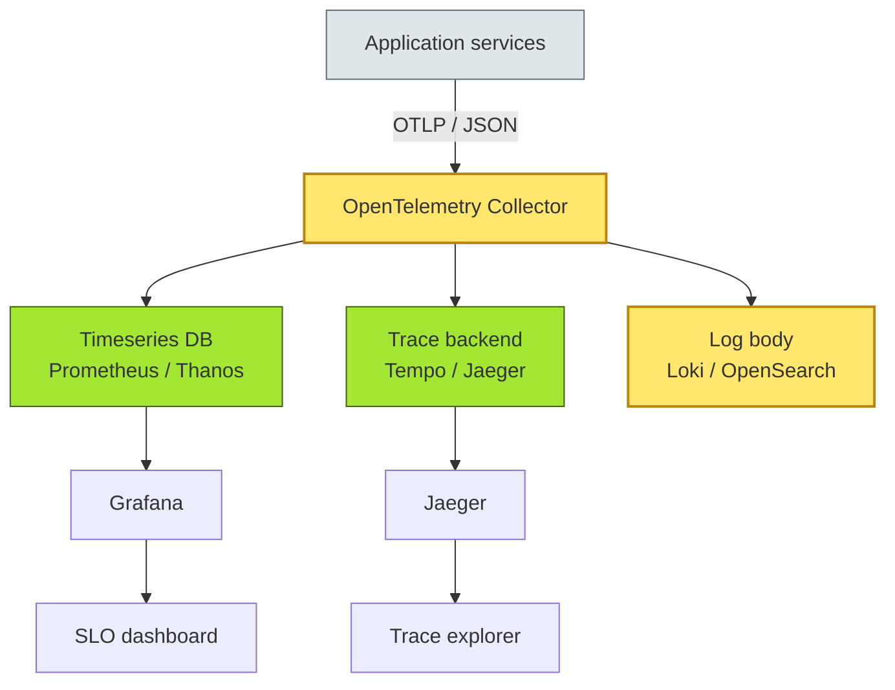
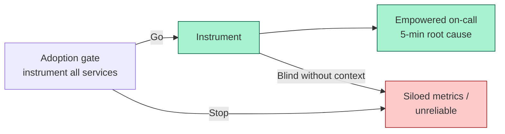
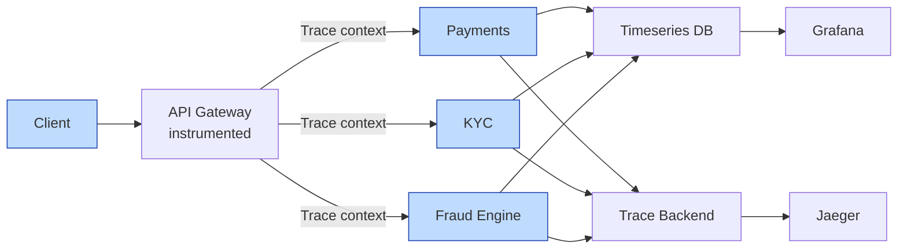

# [C4-12] Observability — DETAIL
> **Category:** C4 — Architecture & Design
> **Companion brief:** `[briefs/C4-12-observability.md](../briefs/C4-12-observability.md)`
> **Target reader:** enterprise architect who must *explain, justify, and defend* the topic — not just recite it.

---

## 1. Precise definition
**Observability** is the **degree to which internal states of a system can be inferred from its external outputs**. It is not merely logging or alerting; it is the **instrumentation of three signal types**—structured logs, numerical metrics, and distributed traces—along with the **correlation** infrastructure that lets an operator answer *new, unanticipated* questions about a system's behavior. It is distinct from monitoring: *monitoring* validates known-known hypotheses (e.g., "CPU > 80%"), while *observability* enables discovery of unknown-unknowns (e.g., "why did 0.001% of transactions fail at exactly 14:03?").

## 2. Why it exists (problem it solves)
Complex systems fail in unanticipated ways. Traditional logging and alerting require auditors to *presume* the failure mode ahead of time. In distributed banking systems:

- **Sagas and orchestration:** a failed compensating transaction in a cross-border settlement may have no single point of failure; its footprint is spread across Kafka, Postgres, and an external SWIFT partner.
- **Cloud mutability:** infrastructure is ephemeral; you cannot ssh into a pod and grep a log when it might be gone in 12 hours.
- **Regulatory evidence:** DORA (EU), PCI-DSS, SOX, and Basel III expect documented incident-response capability; observability is the evidence.
- **Cost of downtime:** every minute of payment-system outage costs direct revenue and reputational harm; observability reduces mean-time-to-detect (MTTD) and mean-time-to-respond (MTTR).

## 3. Core concepts & vocabulary
| Term | Precise meaning |
|------|-----------------|
| Telemetry | Data emitted by the system: logs (discrete), metrics (aggregates), traces (request paths). |
| Structured (sometimes JSON) Logs | Machine-parseable event records with a schema, correlation ID, and fields. |
| Metrics | Numerical values recorded at intervals; dimensions (labels) add context. |
| Distributed Traces | Spans across services, linked by trace and span IDs; visualized as a dependency graph. |
| Golden Signals | RED (Netflix): Request Rate, Error Rate, Duration; or SLI-derived: Throughput, Latency, Saturation, Errors. |
| Correlation | The ability to link a trace, metric anomaly, and log record to the same causal incident. |
| Trace Injection | Adding trace context (trace-id, span-id, sampling decision) as messages flow through async or message-bus boundaries. |

## 4. How it works (architecture / mechanism)
A production observability stack has *four layers*:

1. **Instrumentation layer:** agents (OpenTelemetry SDK), loggers (Structured JSON), exporters (Prometheus, Jaeger, Loki).
2. **Collection layer:** sidecar/agent agents or OpenTelemetry Collector; OpenTelemetry Protocol (OTLP); buffering and sampling.
3. **Storage layer:** time-series database (Prometheus, Thanos, VictoriaMetrics); trace backend (Jaeger, Tempo, OpenSearch); log backend (Loki, OpenSearch, Elasticsearch).
4. **Query / serve layer:** dashboards (Grafana), traces (Jaeger UI, Tempo Explore), log exploration (Loki, Grafana Explore), alertmanager.

### 4.1 Diagrams

**Diagram A — Core structure (highlight the load-bearing parts = amber; supporting = grey):**



**Diagram B — Lifecycle / flow (highlight decision points = green; risks = red):**



## 5. Variants, options & trade-offs
| Variant | When to pick | When to avoid | Key trade-off axis |
|---------|--------------|---------------|--------------------|
| Vendor-managed SaaS (Datadog, Dynatrace, New Relic) | Teams lack infra ops; rapid start; budget for SaaS | Data residency / sovereignty concerns (EU GDPR, DORA) | Speed vs control; cost/license scaling |
| Open-source stack (OpenTelemetry, Tempo, Loki, Grafana) | Strong data compassion; multi-cloud; license cost control | Requires platform engineering investment | Cost vs engineering effort |
| Dual-write (sanitized logs in SIEM + full telemetry in portal) | Security audits need centralized logs; engineering needs rich traces | Log explosion and schema drift | Audit completeness vs developer-friendliness |
| Continuous SLO / error budgets | SRE maturity; production automation; team autonomy | Requires disciplined SLAs and on-call rotation | Autonomy vs chaos without guardrails |

## 6. Relationships to sibling topics
- **Distributed systems architecture:**Observability is the *only* reliable way to diagnose failures across services; without it, layering, event-driven design, or microservices are black boxes.
- **Security architecture:** Logs and traces are evidence in a security incident; correlation between a security SIEM and observability backends accelerates incident response.
- **Resilience / failure-mode architecture:** Chaos-test failures are invisible without observability; the observability pipeline is part of the resilience backbone.
- **Performance architecture:** Golden signals directly map to performance engineering; without observability, performance tuning is guessing.

## 7. Banking / financial-services context 💳
- **DORA (EU):** ICT risk management explicitly includes "level of monitoring" as an indicator of operational resilience.
- **PCI-DSS Req 10 / 100:** logs must be collected, protected, and maintained for at least one year; real-time alerting on suspicious activity.
- **SWIFT / ISO 20022:** payment-rail failures must be traced across the network, including downstream correspondent banks; correlation across borders is legally required.
- **AML / KYC:** lineage and provenance of transactions must be traceable for regulatory audit; distributed tracing across KYC, fraud, and ledger services satisfies this.
- **Real-time trading / wealth:** sub-millisecond latency is mission-critical; OpenTelemetry must sample efficiently to avoid adding instrumentation latency.

## 8. Reference architecture / worked example
**Problem:** A bank's real-time wealth-management platform shows infrequent p99 latency spikes.

**Decision (ADR):**



P0 ADR 2025-11: *Adopt OpenTelemetry Collector + Tempo + Loki + Grafana. Instrument all critical services with golden signals.

## 9. Maturity & adoption signals
- **Adopt when:** >3 services cross failure domains; NFRs require detection <5 min; any regulated data is exchanged; incident investigations take >1 hour.
- **Anti-signals (don't adopt yet):** a monolith with a single database; no on-call rotation; no incident post-mortem culture.
- **Common failure modes:**
  1. Instrumentation invasiveness: OpenTelemetry adds 5-15% latency; memory pressure kills the collector at scale.
  2. Signal explosion: too many logs without rotation; SIEM becomes ignored.
  3. Trace discontinuity: async boundaries (Kafka, SQS) break trace links; essential for banking sagas.

## 10. Common confusions — the "don't mix" list
| Often confused | Real distinction |
|----------------|------------------|
| Observability vs monitoring | Monitoring = known-known alerts; observability = unknown-unknown discovery |
| Observability vs SIEM | SIEM = security-event correlation; observability = runtime performance and behavior |
| Logs vs observables | Logs = retained-for-days records; observability = real-time, queried-on-demand |
| SLO vs SLA vs objective | SLA = external promise to customer; SLO = internal coverage target; objective = team commitment |

## 11. Tools & standards to know
- **Standards/Frameworks:** MITRE ATT&CK (security correlation); OpenTelemetry specification; OMD (Open Metrics Definition); NIST Cybersecurity Framework
- **Common tooling:** OpenTelemetry (language SDKs, Collector), Prometheus/Grafana (metrics), Tempo/Jaeger/Zipkin (traces), Loki/Elastic (logs), Jaeger (trace UI), SLObook/YourDOSTIO
- **Mandatory reading:** _Distributed Systems Observability_ (Bourke & Brown), _SRE in a Box_ (Google SRE Team), _The Site Reliability Workbook_

## 12. ADR template (ready to fill in)
```markdown
# ADR-2025-11: OpenTelemetry observability stack for wealth platform
## Status
Proposed | Accepted
## Context
Real-time wealth-management platform across 12 services shows sporadic p99 latency spikes; investigative MTTR exceeds 4 hours.
## Decision
Adopt OpenTelemetry Collector (OTLP), Grafana + Prometheus/Loki, Tempo for traces, and SLO-based alerting. All production services instrumented by end of Q1 2025.
## Consequences
- Positive: sub-5-min MTTR; DORA compliance evidence; unified cross-domain debugging
- Negative: learning curve; Collector tuning required; transient signal cost
- Negative: trace data retention policy must align with GDPR and DORA
## Alternatives considered
1. Vendor SaaS (Datadog) → rejected; data residency / egress cost for EU and APAC
2. Prometheus only → rejected; insufficient for async saga tracing
3. Logs-only → rejected; correlation too slow for real-time incident response
```

## 13. Practice — apply it
1. **Recall:** define observability in 2 min without notes.
2. **Model:** draw an OpenTelemetry Collector pipeline from service to Grafana dashboard.
3. **ADR:** write a decision doc applying it to your banking example in §7.
4. **Defend:** roleplay explaining "why we instrument traces across Kafka and Postgres" to a non-technical CRO / CIO.

## 14. Summary (1 paragraph)
Observability is the difference between knowing *that* a payment failed and knowing *why* it failed within minutes rather than hours. In banking, that difference is regulatory evidence, customer trust, and millions in avoided downtime. It is not a "nice-to-have monitoring add-on"—it is an architectural imperative for any platform that touches regulated data or real-time customer outcomes.

---
**Status:** ☐ Not started · ☐ In progress · ✅ Covered · **Last updated:** 2025-09-14
