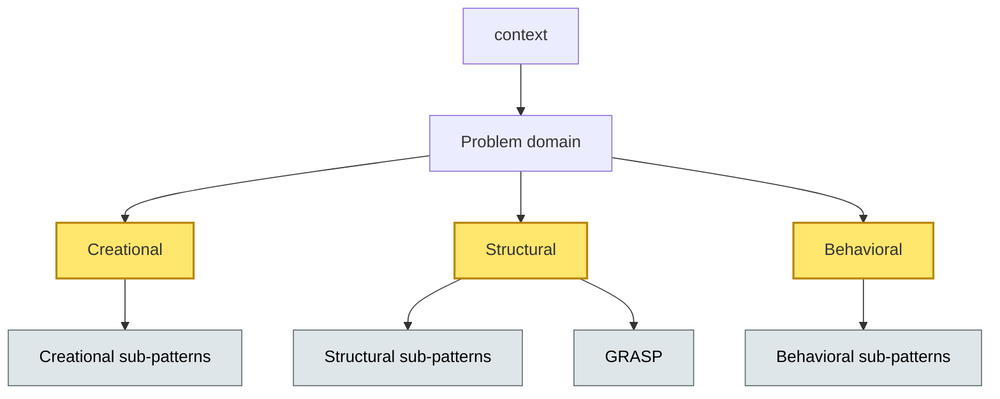
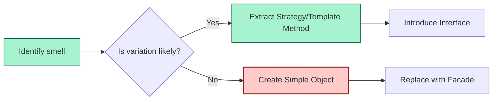
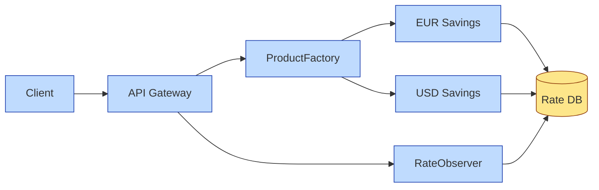

# [C5-01] GoF Design Patterns — DETAIL
> **Category:** C5 — Patterns & Archetypes · **Difficulty:** ●/◑/○ · **Banking-relevant:** yes
>
> **Companion brief:** `briefs/C5-01-gof-patterns.md`
>
> > **Target reader:** enterprise architect who must *explain, justify, and defend* the topic — not just recite it.

---

## 1. Precise definition
According to Gamma et al. (*Design Patterns: Elements of Reusable Object-Oriented Software*, 1994), a **design pattern** is a description of communicating objects and classes that are customized to solve a general design problem in a particular context. The 23 GoF patterns are grouped into Creational, Structural, and Behavioral. A pattern is not a finished design that can be transformed directly into code; it is a template for how to solve a problem that can be used in many different situations.

Bad software design:
-	copy/pasted queries or UI fragments,
-	one giant service,
-	tight coupling between domain and infrastructure

GoF patterns provide vocabulary, notation, and proven solutions; they do not prescribe a one-size-fits-all architecture.

## 2. Why it exists (problem it solves)
Before GoF, software decay was rampant. Early 1990s banking systems shipped in 1985, were rewritten in 1992, and survived on patches that turned them into “spaghetti code.” Gamma et al. formalized *how* to introduce indirection, polymorphism, and shared interfaces without premature abstraction. The cost of change could drop 5×–20× because each pattern carved out a seam for future variation.

## 3. Core concepts & vocabulary
| Term | Precise meaning |
|------|-----------------|
| Creational pattern | Configure objects without specializing the client code (Singleton, Factory Method, Abstract Factory, Builder, Prototype). |
| Structural pattern | Explain how to assemble classes and objects into larger structures (Adapter, Bridge, Composite, Decorator, Facade, Flyweight, Proxy). |
| Behavioral pattern | Streamline communication patterns between objects (Chain of Responsibility, Command, Interpreter, Iterator, Mediator, Memento, Observer, State, Strategy, Template Method, Visitor). |
| GoF | The four authors (Erich Gamma, Richard Helm, Ralph Johnson, John Vlissides). |
| GRASP | *General Responsibility Assignment Software Patterns*; 9 patterns (Information Expert, Creator, Controller, High Cohesion, Low Coupling, Inversion of Control, Polymorphism, Indirection, Pure Fabrication). |

## 4. How it works (architecture / mechanism)
### 4.1 Diagram A — Class taxonomy (highlight the load-bearing parts = amber, supporting = grey)


### 4.2 Diagram B — Pattern lifecycle (highlight decision points = green, failures = red)

(Note: in the second diagram, `risky` is alias for `risk` for consistency.)

---

## 5. Variants, options & trade-offs
| Variant | When to pick | When to avoid | Key trade-off axis |
|---------|--------------|---------------|--------------------|
| Factory Method | Subclass-specific variants exist (e.g., German vs. US MBS rate classes). | Too few variants; consumer pays upfront cost. | Coupling vs. extensibility. |
| Abstract Factory | Need families of related objects (e.g., trade-finance UI + API + audit-log implementations). | Large family set; ABC bloat. | Family completeness vs. simplicity. |
| Singleton | One, unpartitioned resource per JVM (e.g., daily-rate cache for irrevocable FX). | Multi-tenant or multi-instance deployments. | Convenience vs. testability / DORA resilience. |
| Adapter | Wrap a legacy mainframe transaction processor into a REST facade. | Cheap wrapper alternatives exist. | Abstraction value vs. maintenance surface. |
| Strategy | Multiple algorithms compete at runtime (e.g., Basel-III P&L aggregation engines). | Stateless one-liner; no need for indirection. | Flexibility vs. cognitive load. |

## 6. Relationships to sibling topics
- **Domain-Driven Design (DDD):** GoF patterns are *inside* bounded contexts; DDD builds the macro-structure around them.
- **Microservice architecture:** GoF patterns live *within* services; cross-service boundaries are usually REST/gRPC, not Decorators.
- **Resilience patterns (Circuit Breaker, Bulkhead):** Behavioral patterns solve *design* decoupling; resilience patterns solve *operations* decoupling.
- **EIP / PAA remnants:** Messaging and pipeline patterns handle distribution; GoF patterns handle local object interaction.

## 7. Banking / financial-services context 💳
In a banking context, every loan-pricing engine, fraud-rule evaluator, and payout-orchestrator must evolve without downtime. A **Strategy** pattern allows a long-short-equity trading desk to swap Monte-Carlo vs. Black-Scholes vs. historic-simulation engines by reloading a strategy class at runtime, satisfying Basel risk-model change-management requirements.

A **Factory Method** hides legacy mainframe COBOL G strings behind a Java `LoanProductFactory`; new product types (greentech mortgage, Islamic Ijarah) can be added by subclassing without touching the ledger service.

A **Singleton** is acceptable only when the resource is truly single-instance; a token vault or encryption key resolver fits the pattern, but a transaction-manager pool does not.

## 8. Reference architecture / worked example
**Problem:** A global bank must support 40+ retail savings products across 12 jurisdictions, each with different compounding rules, disclosure requirements, and rate-change frequencies.
**Decision:** Use Abstract Factory + Strategy + Observer.

**ADR-013: Introduce Abstract Factory for Retail Savings Products**
```markdown
# ADR-013: Abstract Factory for Retail Savings Products
## Status
Accepted
## Context
The savings portfolio spans 40+ products, 12 jurisdictions, and 3 compounding calendars.
## Decision
Abstract Factory + Factory Method + Observer.
## Consequences
- Positive: New jurisdiction addition requires one factory subclass, no ledger changes.
- Negative: Requires synchronized contract tests.
- Negative: Daily-rate observers add write load on the analytics warehouse.
## Alternatives considered
1. Simple Factory: rejected—requires factory-method changes every quarter.
2. Build builder per product: rejected—too many classes to maintain.
```

## 9. Maturity & adoption signals
- **Adopt when:** codebase has ≥3 recurring parallelism points; change-request lead-time >2 sprints.
- **Anti-signals (don't adopt yet):** system is <1,000 lines; no products-in-production; no new compliance-driven rate model expected.
- **Common failure modes:** 1) creating a Singleton for stateful multi-tenant logic and violating PCI-DSS tokenization boundaries; 2) over-abstracting (Bridge with no variant) and slowing compiler/CI.

## 10. Common confusions — the "don't mix" list
| Often confused | Real distinction |
|----------------|------------------|
| GoF vs. GRASP | GoF = 23 OOP solutions; GRASP = 9 heuristics for assigning responsibility. |
| Pattern vs. Framework | Pattern is a reusable solution; framework is a skeleton you **must** implement. |
| Singleton vs. Global variable | Singleton is instantiable via static method; supports lazy init, ordering, and lifecycle hooks. |

## 11. Tools & standards to know
- **Standards/Frameworks:** IEEE 830 (software requirements), TOGAF 9.2 ADM (design & transition phases).
- **Common tooling:** Enterprise Architect, Sparx EA, Archi, draw.io, PlantUML.
- **Mandatory reading:** *Design Patterns* (Gamma et al., 1994); *Applying UML and Patterns* (Larman, 2017); *Accelerate* (Forsgren et al., 2018).

## 12. ADR template (ready to fill in)
```markdown
# ADR-XXX: <decision>
## Status
Accepted | Proposed | Deprecated
## Context
...
## Decision
...
## Consequences
- Positive ...
- Negative ...
- ...
## Alternatives considered
1. ...
2. ...
```

## 13. Practice — apply it
1. **Recall:** define Strategy vs. Template Method in 2 min without notes.
2. **Model:** produce an ArchiMate/UML diagram from scratch showing Observer used in common-domain server.
3. **ADR:** write an ADR applying Strategy to an FX pricing engine.
4. **Defend:** roleplay explaining Singleton risk to a non-technical CRO.

## 14. Summary (1 paragraph)
GoF patterns are the grammar of OO design. They reduce volatility by isolating variation—rates, products, communication channels—behind stable interfaces. In banking, that grammar prevents quarter-end fire drills when a regulator demands a new risk model or a flagship product adds a micro-feature.

---
**Status:** ✅ Covered · **Last updated:** 2026-09-14
