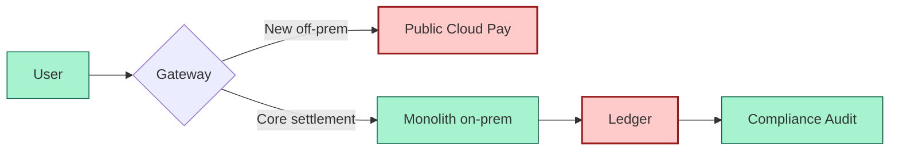
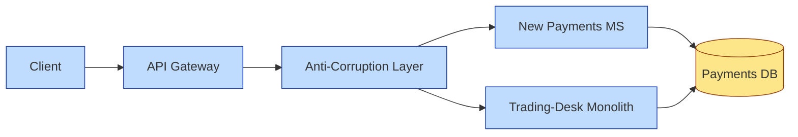

# [C5-02] Architectural Patterns — DETAIL
> **Category:** C5 — Patterns & Archetypes · **Difficulty:** ●/◑/○ · **Banking-relevant:** yes
>
> **Companion brief:** `briefs/C5-02-arch-patterns.md`
>
> > **Target reader:** enterprise architect who must *explain, justify, and defend* the topic — not just recite it.

---

## 1. Precise definition
An **architectural pattern** (or architectural style) is a family of systems in terms of a configuration of elements and a pattern of organization and interaction. It is expressed as a set of components, connectors, and constraints that capture the essential properties of the system’s structure. Examples include layered architecture, microkernel, microservice architecture, and client-server.

In TOGAF terms: design patterns operate at the component and interaction level; architectural patterns operate at the system and deployment level.

## 2. Why it exists (problem it solves)
Without an architectural pattern, every banking system becomes an ad hoc tangle of JARs/DLLs, SQL schemas, and shell scripts. Source-code analysis cannot enforce system-wide non-functional requirements (NFRs) like “all settlement calls must be idempotent” or “fraud analytics must have <100ms p95 latency.” Patterns create a *vocabulary* for architectural reviews, risk models, and regulatory demonstratives.

## 3. Core concepts & vocabulary
| Term | Precise meaning |
|------|-----------------|
| Architectural pattern | High-level organizing structure (layered, event-driven, microservice, hexagonal, etc.). |
| Pattern instance | A concrete realization of a pattern (e.g., *this* bank’s layered monolith is an instance). |
| Bounded Context | DDD domain boundary; natural microservice mine-shaft. |
| Diffusion of architecture | When an architectural decision leaks into adjacent contexts without control. |
| On-premise / Hybrid / Public Cloud | Deployment topology choices. |
| Event-storming | Collaborative exercise to define domain and architectural boundaries. |

## 4. How it works (architecture / mechanism)
### 4.1 Diagram A — Top-level decomposition (highlight load-bearing parts = amber, supporting = grey)
```mermaid
graph TD
    classDef critical fill:#ffe66d,stroke:#b8860b,stroke-width:2px
    classDef context fill:#dfe6e9,stroke:#636e72,color:#000
    Client[Client UI]:::context --> Gateway[API Gateway]:::critical
    Gateway --> S1[Domain Service A]:::critical
    Gateway --> S2[Domain Service B]:::critical
    S1 --> DB[(Data)]:::context
    S2 --> DB
    S1 <-> S3[Event Bus]:::critical
    S2 <-> S3
```

### 4.2 Diagram B — Deployment topology (highlight decision points = green, failures = red)


## 5. Variants, options & trade-offs
| Variant | When to pick | When to avoid | Key trade-off axis |
|---------|--------------|---------------|--------------------|
| Monolith layered | Team <50, simple domain, <50k lines of code. | Need independent deployment or multiple language stacks. | Simplicity vs. scalability. |
| Microservices | Multiple bounded contexts, CI/CD maturity, 24/7 SLOs. | <10 engineers, no SRE/DevOps team. | Organizational fit vs. operational overhead. |
| Microkernel | ERP/core is stable; plug-ins (fraud, chat, analytics) change frequently. | High-throughput, low-latency core paths. | Extensibility vs. indirection cost. |
| Hexagonal / Clean | High testability, regulation-driven auditability, frequent UI/DB swaps. | Cold-start latency for simple CRUD. | Testability vs. ceremony. |
| Event-driven | Asynchronous flows, eventual consistency, telemetry pipelines. | Need strong ACID across contexts. | Correctness vs. complexity. |
| Shared kernel | Dozens of services share a schema; coordination cost < duplication cost. | Schema drift or independent release cycles. | Consistency vs. governance complexity. |

## 6. Relationships to sibling topics
- **DDD:** Bounded contexts define *where* to apply architectural patterns; event storming surfaces the boundaries.
- **Microservice patterns (EIP/PAA):** Complements the “what” (how services communicate) with the “how” (how the organization supports them).
- **SRE / Cloud patterns:** Resilience, observability, and cost-efficiency are NFRs, not patterns; but patterns like Circuit Breaker enforce them.
- **Zero Trust / Security patterns:** Architectural patterns choose execution environments; security patterns harden those environments.

## 7. Banking / financial-services context 💳
A major EU bank (2004 monolith) decomposed into ~30 microservices for **Payments**, **Lending**, and **Trade Finance** after a €120M T24 upgrade. The **API Gateway** enforces PCI-DSS tokenization rules, while **settlement services** remain hosed on-prem because regulatory data residency requires air-gapped transaction systems. The **Onion architecture** ensures the fraud-detection bounded context can swap reinforcement-learning models without invalidating the core-ledger transaction log.

DORA (Digital Operational Resilience Act) explicitly requires *output-based* resilience testing; an event-driven arch pattern with a dedicated **Commit Log** and **Read Model** ensures that failures in the enrichment pipeline do not halt settlement.

## 8. Reference architecture / worked example
**Problem:** Legacy payments monolith cannot deploy KYC updates without a 4-week regression cycle.
**Decision:** Adopt Microservice + On the Outside + ACL.

**ADR-021: Decompose Payments to Microservices**
```markdown
# ADR-021: Payments Microservice Decomposition
## Status
Accepted
## Context
Payments monolith has 2-week releases; anti-fraud rules change weekly; PCI-DSS audit is costly.
## Decision
Domain-driven bounded contexts + Anti-corruption Layer + event-driven orchestration.
## Consequences
- Positive: Independent fraud-rule deployment; team A targets 1-day releases.
- Negative: Eventual-consistency reconciliation must be added; complexity budget ~3 engineers.
- Negative: Shared DB pattern risks data co-location; must migrate to eventual consistency.
## Alternatives considered
1. Continue monolith: rejected—velocity insufficient to beat fintech.
2. Strangler fig with API Gateway only: rejected—cannot isolate transaction boundaries.
```

## 9. Maturity & adoption signals
- **Adopt when:** NFRs (latency, uptime, regulatory isolation) cannot be met by existing stack; team size >20; funding is multi-year.
- **Anti-signals (don't adopt yet):** No SRE/DevOps org; no distributed-tracing adoption; no observability budget.
- **Common failure modes:** 1) “distributed monolith” (services chat synchronously) and lose microservice benefits; 2) premature Eventual Consistency and compound reconciliation bugs.

## 10. Common confusions — the "don't mix" list
| Often confused | Real distinction |
|----------------|------------------|
| Microservice vs. Microkernel | Microkernel is *one* runtime process + plugins; microservices are *many* independently deployable services. |
| Hexagonal vs. Onion vs. Clean | Same topology (domain in center, adapters at edge); different naming conventions. Clean is Martin Fowler’s; Onion is Udi Dahan’s. |
| Pattern vs. Framework | Pattern = reusable solution; framework = skeleton you **must** implement. |

## 11. Tools & standards to know
- **Standards/Frameworks:** TOGAF 9.2 ADM (Design/Transition phases), ISO 82079 (technical writing), ISO 42010 (software architecture description).
- **Common tooling:** ArchiMate, BPMN, C4 Model, draw.io, PlantUML, Structurizr.
- **Mandatory reading:** *Software Architecture in Practice* (Bass, Clements; 2012); *Building Microservices* (Sam Newman; 2019); *Domain-Driven Design* (Eric Evans; 2003).

## 12. ADR template (ready to fill in)
```markdown
# ADR-XXX: <decision>
## Status
Accepted | Proposed | Deprecated
## Context
...
## Decision
...
## Consequences
- Positive ...
- Negative ...
- ...
## Alternatives considered
1. ...
2. ...
```

## 13. Practice — apply it
1. **Recall:** define layered vs. microservice vs. hexagonal in 90 seconds.
2. **Model:** produce an ArchiMate/C4 diagram of your bank’s payments ecosystem.
3. **ADR:** draft an ADR for adopting a new architectural pattern to support a PSD2-mandated open-banking API.
4. **Defend:** explain why on-prem settlement should stay monolithic to a non-technical Board.

## 14. Summary (1 paragraph)
Architectural patterns are architecture’s anchor. They decide who owns what, how data moves, and where failure can live. In banking, the decision to partition around bounded contexts—whether you call them microservices or plugins—determines whether you respond to a regulatory change in days or months.

---
**Status:** ✅ Covered · **Last updated:** 2026-09-14
