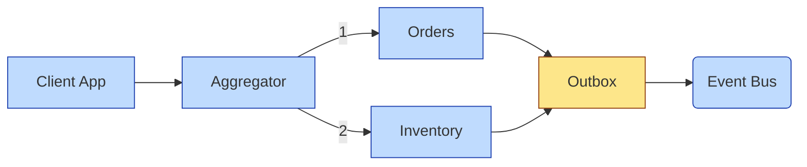
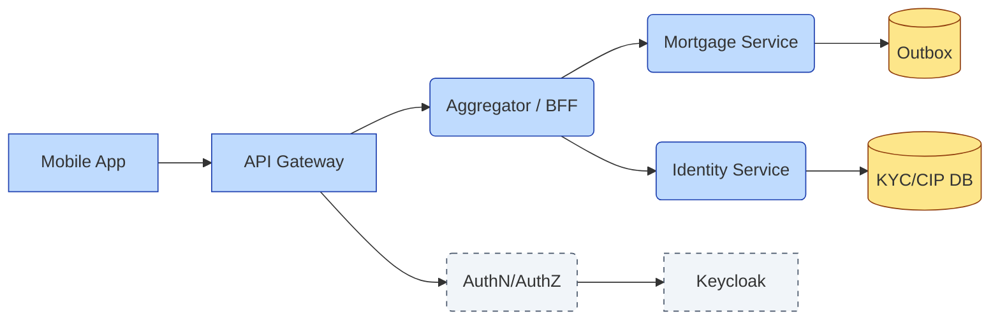

# [C5-03] Microservice Patterns — DETAIL
> **Category:** C5 — Patterns & Archetypes · **Difficulty:** ●/◑/○ · **Banking-relevant:** yes
>
> **Companion brief:** `briefs/C5-03-microservice-patterns.md`
>
> > **Target reader:** enterprise architect who must *explain, justify, and defend* the topic — not just recite it.

---

## 1. Precise definition
A **microservice** is a single-purpose, independently deployable persistent service in its own right. Because a *collection* of microservices introduces distributed-system challenges (network failure, partial outages, eventual consistency), **microservice patterns** are the structural, organisational, and behavioural solutions that keep the collection coherent and operable.

Key references: Sam Newman, *Building Microservices* (O'Reilly, 2015); Greg Young, *Event Sourcing and CQRS* (OOPSLA 2005, 2012).

## 2. Why it exists (problem it solves)
A monolith can be fast to ship but slow to evolve. Conversely, a “many tiny services” approach quickly becomes a *distributed monolith*—synchronous HTTP cascades between services, shared databases appear through service-A, service-B becomes a literal client of service-C’s tables. Microservice patterns were invented to make the independent deployment promise a *practical* operational reality: independent CI/CD pipelines, bounded failure domains, and clear ownership boundaries.

## 3. Core concepts & vocabulary
| Term | Precise meaning |
|------|-----------------|
| Service | Single-purpose, independently deployable unit of execution. |
| Strangler Fig | Incremental, facade-based migration from monolith to microservices. |
| Aggregator | Service that composes multiple downstream calls into one client-facing response. |
| Anti-corruption Layer (ACL) | Translation layer between two bounded-context models (legacy vs. new). |
| Event Sourcing | Persist state as immutably ordered events; reconstruct current state by replaying. |
| CQRS | Command Query Responsibility Segregation—separate write and read models. |
| Saga | Orchestrated all-or-nothing transaction of local transactions + compensations. |
| Outbox | In-process table guaranteeing exactly-once outbound event emission. |

## 4. How it works (architecture / mechanism)
### 4.1 Diagram A — Strangler Fig migration timeline (highlight decision/causality = green, risk = red)


### 4.2 Diagram B — Aggregator / Outbox flow (highlight data/hydration = yellow, service/boundary = blue)


## 5. Variants, options & trade-offs
| Variant | When to pick | When to avoid | Key trade-off axis |
|---------|--------------|---------------|--------------------|
| Strangler Fig (incremental) | Legacy exists, risk-averse, 2-5 year modernization window. | Need immediate full separation; not enough infra budget. | Risk vs. speed. |
| Big-bang rewrite | Greenfield; no legacy debt; team fully staffed. | Rarely justified in regulated banks (missing history, compliance gaps). | Speed vs. auditability. |
| API Gateway (edge) | Need unified security, rate limiting, and version routing. | Simple 3-service PoC; another hop adds latency. | Centralization vs. tail latency. |
| Aggregator (composition) | Consumer needs data from 2+ services for one UI screen. | Excessive chattiness; fan-out of synchronous calls. | Latency vs. single-request convenience. |
| Choreography Saga | Several services publish events; each reacts independently. | Hard to reason about end-to-end flow; debugging distributed causality. | Decentralization vs. observability. |
| Orchestrator Saga | Central coordinator (state machine) directs compensating actions. | Single point of control; coordinator fault kills the saga. | Simplicity vs. central fault. |
| Event Sourcing | Audit-trail immutability required; long-lived aggregates; time-travel queries. | Reporting-heavy systems where read re-materialization is expensive. | Correctness vs. query complexity. |
| Shared Database | Want to avoid eventual consistency; <10 services; same tech stack. | Hidden coupling; each service becomes a schema owner. | Coupling vs. development speed. |

## 6. Relationships to sibling topics
- **Microservice architectural patterns (go/no-go decisions):** Determines *why* you decompose; these patterns govern *how* services interact *after* decomposition.
- **Resilience patterns (Circuit Breaker, Bulkhead):** If Load Balancer fails, Circuit Breaker breaks fast; if one service is slow, Bulkhead isolates it.
- **EIP / PAA (Message Broker, Publish-Subscribe):** Enable asynchronous communication that makes Sagas and Event Sourcing practical.
- **DDD:** Domain boundaries define service boundaries; microservice patterns then describe how those boundaries communicate.
- **SRE / Cloud patterns:** Spans, Load Testing, and Golden Signals define the operational SRE observability contract for a microservice.

## 7. Banking / financial-services context 💳
A global cooperative bank modernized its **wealth-management platform** via the Strangler Fig. The monolith handled account opening, product recommendation, and portfolio rebalancing. Each became a microservice: • Account Provisioning (Java, on-prem). • Product Recommendation (Python, FaaS for churn ML). • Portfolio Rebalancing (Change Data Capture from account events in Kafka).

A **Saga** orchestrates a **wire-transfer** request across Fraud (stellar), AML (chain-age), and Clearing (real-time gross settlement). Overdraft risk triggers a compensating *reversal* event; if AML enrichment times out after 30 seconds, the saga transitions to a *manual-review* state, keeping the system from OOM or dead-lock.

An **Outbox** table in the Provisioning service guarantees that a *customer-kyc-verified* event is emitted exactly once, satisfying the DORA requirement for incident-response telemetry proof.

## 8. Reference architecture / worked example
**Problem:** A mortgage-origination monolith needs to expose a JSON API to a new consumer-facing mobile app without interrupting the 15,000 T24 terminal sessions.
**Decision:** Strangler Fig + Aggregator + Outbox.

**ADR-034: Adopt Microservice Patterns for Mobile Mortgage Origination**
```markdown
# ADR-034: Microservice Patterns for Mobile Mortgage Origination
## Status
Accepted
## Context
Monolith handles mortgage origination, identity verification, and compliance checks. New mobile app needs JSON API without disrupting 15k terminal sessions.
## Decision
Strangler Fig: API Gateway routes new /mortgages/* to Aggregator; legacy /mortgage/* stays monolith. Aggregator composes Mortgage Service + Identity Service. Outbox ensures KYC verified events are published once.
## Consequences
- Positive: Independent DevOps for mobile team; no monolith changes.
- Negative: Eventual consistency between Identity and Mortgage introduces reconciliation job.
- Negative: Aggregator adds latency (P95 +40ms); caching at gateway mitigates.
## Alternatives considered
1. Pure monolith-with-facade: rejected—cannot isolate mobile traffic.
2. Full rewrite: rejected—loss of 10 years transaction history and AML rules.
```

## 9. Maturity & adoption signals
- **Adopt when:** 12+ engineers; CI/CD; distributed-tracing; SLOs >99.9%.
- **Anti-signals (don't adopt yet):** No observability; async-first mindset missing; <5 services.
- **Common failure modes:** 1) *Tightly coupled services* (synchronous HTTP in a loop) and lose deployment independence; 2) *Choreography spaghetti* and produce un-replayable event chains; 3) *Shared database* and create false microservice illusion.

## 10. Common confusions — the "don't mix" list
| Often confused | Real distinction |
|----------------|------------------|
| Saga vs. ACID transaction | Saga is *eventual* and *compensating*; target is not atomicity across services. |
| Event Sourcing vs. CQRS | ES persists events; CQRS separates read/write models. You can have one without the other. |
| Strangler Fig vs. Big-bang | Strangler is incremental; Big-bang is one-time replacement. |
| API Gateway vs. BFF (Backend for Frontend) | Gateway = all traffic; BFF = frontend-specific compose and aggregate. |

## 11. Tools & standards to know
- **Standards/Frameworks:** TOGAF, NIST SP 800-53 (security controls), ISO 27001.
- **Common tooling:** Kafka, Apache Pulsar, NATS, RabbitMQ (EIP); Zipkin, Jaeger, OpenTelemetry (observability); Kong, Istio (API Gateway / Service Mesh).
- **Mandatory reading:** *Building Microservices* (Sam Newman); *Domain-Driven Design* (Eric Evans); *Role-Based Access-Control for Microservices* (Wang et al., IEEE 2023).

## 12. ADR template (ready to fill in)
```markdown
# ADR-XXX: <decision>
## Status
Accepted | Proposed | Deprecated
## Context
...
## Decision
...
## Consequences
- Positive ...
- Negative ...
- ...
## Alternatives considered
1. ...
2. ...
```

## 13. Practice — apply it
1. **Recall:** define Strangler Fig vs. Big-bang in 60 seconds.
2. **Model:** draw a C4 context + container diagram of Strangler microservices for trade-finance.
3. **ADR:** write a Saga ADR for a cross-border payment with fraud + AML + clearing.
4. **Defend:** explain to a CFO why a Strangler Fig migration is less risky than a full rewrite.

## 14. Summary (1 paragraph)
Microservice patterns translate the *idea* of small services into an *operate-able* platform. They prevent the distributed monolith trap by enforcing bounded failure domains, independent deployability, and clear event-driven contracts—critical when your bank’s clearing-rail arrives without a pause button.

---
**Status:** ✅ Covered · **Last updated:** 2026-09-14
