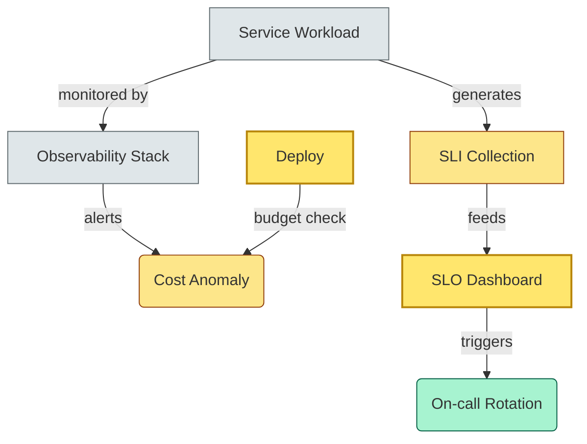
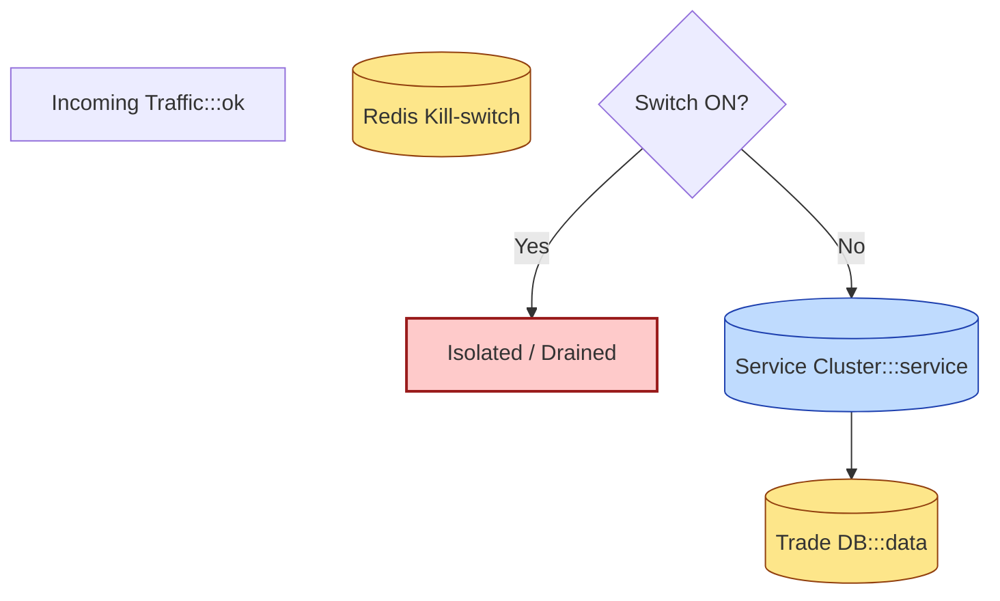
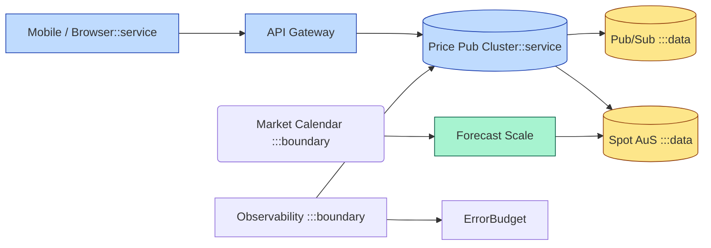

# [C5-04] Cloud & SRE Patterns — DETAIL
> **Category:** C5 — Patterns & Archetypes · **Difficulty:** ●/◑/○ · **Banking-relevant:** yes
>
> **Companion brief:** `briefs/C5-04-cloud-sre-patterns.md`
>
> > **Target reader:** enterprise architect who must *explain, justify, and defend* the topic — not just recite it.

---

## 1. Precise definition
**Cloud patterns** address cloud-specific adoption, resilience, security, and cost governance. **Site Reliability Engineering (SRE) patterns**, originating at Google, are engineering minima: you must engineer in a way that supports high availability and require carefully planned engineering.

Key intellectual sources:
- Cloud Adoption Frameworks: AWS CAF, Microsoft Azure CAF, Google Cloud CAF.
- *Site Reliability Engineering: How Google Runs Production Systems* (Beyer, Jones, Petoff, Murphy; O'Reilly, 2016).

## 2. Why it exists (problem it solves)
On-premise infrastructures are expensive to over-provision and slow to recover. Cloud-native elasticity solves *scale* but introduces *transient* complexity: local disk fails, zones go down, egress costs explode. SRE patterns were invented to replace heroic firefighting with engineering-driven reliability: explicit error budgets, on-call ownership, and toil reduction.

In banking, the regulatory requirement for *operational resilience* (UCITS, MiFID II, DORA, GDPR) means outages are not merely engineering defects—they are *regulatory events*.

## 3. Core concepts & vocabulary
| Term | Precise meaning |
|------|-----------------|
| Cloud Adoption Framework (CAF) | Structured guidance for planning, organizing, and governing cloud adoption. |
| Cost anomalies | Spurious spend increase caused by mis-configured resources or unexpected demand. |
| Error Budget | The budgeted amount of unreliability (the difference between an SLI target and actual service performance). |
| Toil | Manual, automatable operational work that scales poorly and distracts from engineering. |
| On-call burden | Human cost of running production; includes page volume, cognitive load, and fairness. |
| SLI | Service Level Indicator: a direct measurement of a service’s level of service. |
| SLO | Service Level Objective: an agreement between service providers and consumers. |
| SLA | Service Level Agreement: a formal commitment between provider and customer. |
| Kill Switch | An externally activated mechanism to stop, drain, or isolate a system. |
| Forecast-based horizontal scaling | Predict demand and scale compute resources before the load arrives. |

## 4. How it works (architecture / mechanism)
### 4.1 Diagram A — Cloud governance + SRE feedback loop (highlight critical/contextual balance = amber, supporting resource data = yellow)


### 4.2 Diagram B — Kill switch / traffic drain (highlight risk = red, service/data = blue/yellow)


## 5. Variants, options & trade-offs
| Variant | When to pick | When to avoid | Key trade-off axis |
|---------|--------------|---------------|--------------------|
| Forecast-based scaling | Predictable traffic spikes (holiday batches, quarter-end). | Truly unpredictable “flash” events (market crash). | Capacity cost vs. latency risk. |
| On-call rotation | Teams >10; 24/7 SLO expectations. | Small startups; single engineer cannot be fair. | Fairness vs. alert fatigue. |
| Kill switch | Production system; high-alert scenario; ability to detach externally. | Single-DB production without HA path. | Safety vs. continuity. |
| Cost anomaly monitoring | Multi-account; cloud-native spending. | Small fixed-cost environment. | Governance vs. alerting noise. |
| Error budget policy | Mature SRE org; product teams ready to stop work when budget spent. | Startup in hyper-growth phase with 0m/min viability metric. | Velocity vs. reliability. |

## 6. Relationships to sibling topics
- **SRE:** This category *is* SRE; it is the operationalization of patterns from C5 (microservice, cloud, resilience).
- **Resilience patterns:** Covered in C5-09; SRE *runs* the resilience strategy (error budgets, capacity management) and *roles* (incident commander).
- **Microservice patterns:** SRE patterns assume services exist; microservice patterns assume SRE can observe and intervene.
- **Cloud patterns:** C5-04 is the operational layer that makes cloud patterns affordable and compliant.
- **Security & Zero Trust:** SRE must also comply with PCI-DSS and GDPR when dealing with customer data at scale.

## 7. Banking / financial-services context 💳
A UK retail bank runs two-day online banking in a single availability zone; on Black Friday, its error budget for *account-balance read* (SLO 99.99% over every 30-day window) exhausted in 4 days due to a mis-configured auto-scaling cooldown. The **on-call** rotation triggered; a **kill switch** drained traffic to a read-only replica; **cost anomaly monitoring** flagged a runaway spot instance.

Post-mortem instituted **forecast-based scaling** for retail, hardcoded a 1-minute cooldown, and published an **error budget** agreement signed by the CTO, VP of Product, and CRO—to prevent a recurrence that would violate FCA operational-resilience principles.

## 8. Reference architecture / worked example
**Problem:** Trading-desk price-publishing service owes <50ms p99 latency at 10k TPS during market open, but daily infra spend varies 3× based on spot-instance volatility.
**Decision:** Reserved capacity + fallback to on-demand + **forecast-based scaling** + **error-budget policy**.

**ADR-041: Adopt SRE Error-Budget Policy for Trading-Platform**
```markdown
# ADR-041: SRE Error-Budget Policy for Trading-Platform
## Status
Accepted
## Context
Price-publishing queue saturates at market open; SLO missed twice; no agreed threshold to stop feature-work.
## Decision
Error budget = 0.01% of 30-day error budget; stop deployment when budget spent; on-call on-opt-out; quarterly review.
## Consequences
- Positive: Predictable reliability mirror; velocity drops only when risk is high.
- Negative: DevOps must build accurate SLI pipelines; leads to metric gaming if sampled poorly.
- Negative: Requires buy-in from VP Engineering; initial pushback.
## Alternatives considered
1. Ignore error budget, just fix alerts: rejected—reacts against symptoms.
2. No on-call optimization: rejected—burns engineers in MoPub responses.
```

## 9. Maturity & adoption signals
- **Adopt when:** SLOs are defined; CI/CD is automated; monthly on-call assessment exists.
- **Anti-signals (don't adopt yet):** No monitoring; alerts go to 1 email; single on-call engineer per team.
- **Common failure modes:** 1) *Error budget exhaustion without干预* and resulting SLO breach; 2) *Toil*: teams spend all day firefighting and cannot deprecate legacy predictors; 3) *Kill switch with no degradation path* and the drain itself causes outage.

## 10. Common confusions — the "don't mix" list
| Often confused | Real distinction |
|----------------|------------------|
| SLI vs. SLO vs. SLA | SLI = measurement; SLO = internal target; SLA = customer contract. |
| Toil vs. Automation | Toil = repetitive manual tasks; automation = the mechanism to remove toil. |
| SRE vs. Operations | SRE = engineering-based reliability with error budgets; Ops = traditional sysadmin task list. |
| Cloud pattern vs. Cloud service | Pattern = structural strategy; service = concrete offering (e.g., AWS Lambda). |

## 11. Tools & standards to know
- **Standards/Frameworks:** ITIL 4 (SRE practices), ISO 26262, NIST SP 800-53, DORA, PCI-DSS.
- **Common tooling:** Prometheus/Grafana, Datadog, Sentry, PagerDuty, Jira/Business-of-One, CloudCustody, Pilot.ai, Runbook Automation.
- **Mandatory reading:** *Site Reliability Engineering* (Beyer et al.); *Building Secure & Reliable Systems* (O'Reilly); *Team Topologies* (Skeggs & Willis; 2019).

## 12. ADR template (ready to fill in)
```markdown
# ADR-XXX: <decision>
## Status
Accepted | Proposed | Deprecated
## Context
...
## Decision
...
## Consequences
- Positive ...
- Negative ...
- ...
## Alternatives considered
1. ...
2. ...
```

## 13. Practice — apply it
1. **Recall:** define Error Budget in 60 seconds.
2. **Model:** draw an SRE error-budget dashboard with burn-rate, remaining budget, and on-call shift indicators.
3. **ADR:** write an ADR for a kill-switch policy on a payment-processing service.
4. **Defend:** explain to a non-technical COO why a service must be on-call even if it has 99.999% availability.

## 14. Summary (1 paragraph)
Cloud and SRE patterns turn *reliable operations* from an art into a measurable, budgeted engineering discipline. They align every teams' incentives with SLIs, error budgets, and cost observability—so when your bank's trading platform faces a liquidity event, it survives because the patterns pre-built the growth path, and the SRE team can safely drain traffic without executive panic.

---
**Status:** ✅ Covered · **Last updated:** 2026-09-14
