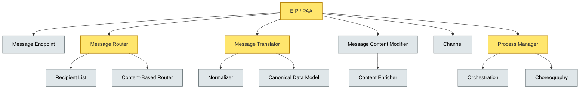

# [C5-05] EIP / PAA / Message Broker Patterns — DETAIL
> **Category:** C5 — Patterns & Archetypes · **Difficulty:** ●/◑/○ · **Banking-relevant:** yes
>
> **Companion brief:** `briefs/C5-05-eip-patterns.md`
>
> > **Target reader:** enterprise architect who must *explain, justify, and defend* the topic — not just recite it.

---

## 1. Precise definition
**Enterprise Integration Patterns (EIP)** are 66 patterns described by Gregor Hohpe and Bobby Woolf in *Enterprise Integration Patterns* (2003). Each pattern addresses a specific integration problem—routing, transformation, mediation, or delivery semantics—across heterogeneous systems.

**Process-Aware Application (PAA) / Process-Aware Message Broker (PNG)** extends EIP by adding process-awareness: each message carries workflow context, and the broker can enforce process-level invariants (e.g., a message cannot arrive out of sequence).

Key references:
- *Enterprise Integration Patterns* (Hohpe & Woolf, 2003).
- *Enterprise Integration Patterns with .NET* (Gama, 2009).
- *Process-Aware Message Broker* (Ptolemaios, 2007; Singhal & Ellahham, 2007).

## 2. Why it exists (problem it solves)
Banking architectures have always been heterogeneous. Mainframes (IBM z/OS COBOL) coexist with mid-tier CICS, NPS, and T24; third-party clients (Visa, SWIFT, CHIPS) send IDocs and MT messages; new middleware is Java, Python, or FaaS; New Zealand banks use BSP; German banks use E-Postbank DSB; UK banks use Payments Service.

Without EIP, integration means **hand-written IDoc→JSON→proto converters** or **SQL replication jobs**—fragile, un-tested, and hard to govern. EIP provides a *vocabulary* for integration architects to reason about data flow, failure, and delay.

## 3. Core concepts & vocabulary
| Term | Precise meaning |
|------|-----------------|
| EIP | 66+ message-routing / transformation / delivery patterns for integration middleware. |
| PAA / PNG | Process-aware extensions that add sequencing, correlation, and workflow state to message flows. |
| Message Router | Decisions based on *where to send next*; Channel, Recipient List, Scatter-Gather. |
| Message Translator | Decisions based on *what to change*; Normalizer, Canonical Data Model, Enricher. |
| Content-Based Router | Route based on payload semantics; not just a channel number. |
| Process Manager | Orchestrates a long-running process; uses messages as coordination events. |
| Guaranteed Delivery | At-least-once, exactly-once, or not-at-all semantics via Retry, Dead-Letter Channel, Redirect. |
| Content Enricher | Looks up/injects missing data from a secondary source before persistence. |
| Claim Checker | Validates a business rule; rejects or quarantines messages that fail. |
| Canonical Data Model (CDM) | A simplified composition of all participants' data models; intermediate format. |
| Interacting with PAA | Uses process IDs, correlation tokens, and sequence enforces; enables state recovery after crashes. |

## 4. How it works (architecture / mechanism)
### 4.1 Diagram A — EIP taxonomy with critical + context (highlighting load-bearing = amber)


### 4.2 Diagram B — EDI + enrichment flow (highlighting decision = green, data = yellow, boundary = dashed-grey, ok = light-green)
```mermaid
flowchart TD
    classDef ok fill:#a7f3d0,stroke:#065f46
    classDef context fill:#dfe6e9,stroke:#636e72
    classDef critical fill:#ffe66d,stroke:#b8860b,stroke-width:2px
    classDef data fill:#fde68a,stroke:#92400e
    classDef boundary fill:#f1f5f9,stroke:#475569,stroke-dasharray: 5

    Inbound[SWIFT MT103 Inbound:::boundary]:::boundary --> Router{Type Router}:::decision
    Router -->|Fraud| Fraud[Fraud Check]:::service
    Router -->|Clearing| Clear[Clearing Merge]:::service
    Router -->|KYC| KYC[3A Lookup]:::service
    Fraud -->|Enriched| Enrich[(Enricher Cache)]:::data
    Clear -->|Enriched| Enrich
    KYC -->|Enriched| Enrich
    Enrich -->|Persistence| Ledger[(Common Ledger) ]:::data
```

## 5. Variants, options & trade-offs
| Variant | When to pick | When to avoid | Key trade-off axis |
|---------|--------------|---------------|--------------------|
| Canonical Data Model | >5 heterogeneous systems; schema freeze requires governance. | Small ISV integration; direct API is <1 week effort. | Consistency vs. throughput (CDM adds serialization/de-serialization). |
| Content-Based Router | MT103 routing; dynamic message classification. | Static channels; simple point-to-point. | Routing accuracy vs. execution latency. |
| Content Enricher | Need external KYC, risk, or master-data enrichment. | Data already co-located; no network hop. | Richness vs. dependency on external SLA. |
| Claim Checker | Compliance filter (e.g., PSR 707 remittance advice). | Simple data pass-through. | Compliance safety vs. enrichment cost. |
| Dead-Letter Channel | Guarantees no message loss; audit trail for disputes. | Real-time trading where even 1ms of delay is fatal. | Correctness vs. latency. |
| Scatter-Gather | Need responses from 3+ services within <100ms SLA. | Available services >5; fan-out amplifies load. | Response completeness vs. load explosion. |
| Eventual Consistency | High throughput; tolerant of stale reads. | Settlement-critical; atomic ledger consistency required. | Throughput vs. correctness. |

## 6. Relationships to sibling topics
- **Microservice patterns:** EIP operate *between* services (synchronous, asynchronous, via broker); microservice patterns govern *inside* and *across* services (Strangler, Saga).
- **Resilience patterns:** If a service fails, Dead-Letter Channel and Retry (EIP) + Circuit Breaker ( Resilience) + Bulkhead (Resilience) = complete resilience policy.
- **PAA / Process Manager:** Occurs when EIP extends from message-level to process-level; Process Manager is the Saga coordinator (Orchestration or Choreography) in banking.
- **Data patterns (C5-07):** EIP routing decides *where* Data Lake / Data Lakehouse sits; Data Patterns decide *how* data is modelled, governed, and queried.
- **Security patterns:** PAA carries correlation tokens; ACL (EIP) can be combined with Zero Trust (Security) to restrict who can enrich which message.

## 7. Banking / financial-services context 💳
A major EU retail bank must switch its card-authorization pipeline from MPI/acquirer to a new PSD2 SCA-owned model. The **Message Router** (Recipient List) directs ISO-8583 messages to existing web-auth, 3A DP, and fraud components based on the `Channel` field.

A **Content Enricher** looks up the customer’s **KYC-hold status** from an external IDV provider in <100ms before the authorization decision; a **Claim Checker** rejects PAN-less requests (PCI-DSS v4.0) unless an SCA-verified exemption is present.

A **Process Manager** orchestrates a **cross-border fund-transfer** with 3 services (Fraud, AML, SWIFT MT110): if AML rejects, a **compensation** message generates a `reject` event; the saga (PAA/Saga) orchestrates 3 compensating payments if the SWIFT message was already dispatched.

## 8. Reference architecture / worked example
**Problem:** A UK bank must process 50,000 ACH-equivalent SOF (standing-order payment) messages nightly from legacy mainframe channel records into a new Java-based Payments-Fabric, adding Fraud, AML, and HL7-to-FHIR transformations.
**Decision:** Canonical Data Model + Content-Based Router + Content Enricher + Claim Checker + Dead-Letter Channel.
```mermaid
graph TD
    classDef service fill:#bfdbfe,stroke:#1e40af
    classDef data fill:#fde68a,stroke:#92400e
    classDef boundary fill:#f1f5f9,stroke:#475569,stroke-dasharray: 5
    classDef ok fill:#a7f3d0,stroke:#065f46

    Legacy[Legacy Channel Records]:::boundary --> Adapter[Channel Adapter: IDoc Converter::service]:::service
    Adapter --> CModel[Canonical Data Model: SOF]:::data
    CModel --> CBase{Channel Router}:::ok
    CBase --> Fraud[Fraud SOF Validator]:::service
    CBase --> AML[AML Screening]:::service
    AML --> Succeed[Persist to Ledger]:::data
    CModel --> Enrich[(3A KYC Lookup)]:::data
    Enrich -->|Role Enriched| Enrich
    Enrich --> CClaim[(Claim Checker)]:::service
    CClaim -->|Reject| Dead{(Dead-Letter Channel)}:::data
    CClaim -->|Pass| Succeed
```
**ADR-052: Adopt EIP-Based ACH Payment Ingestion**
```markdown
# ADR-052: Adopt EIP-Based ACH Payment Ingestion
## Status
Accepted
## Context
Legacy IDoc channel records from 1991 T24 must become JSON for Java Payments-Fabric; need fraud, AML, and KYC enrichment; must retain audit trail.
## Decision
Canonical Data Model (SOF) + Content-Based Router (Channel) + Content Enricher (3A KYC) + Claim Checker (PSR 707 / AML rules) + Dead-Letter Channel (rejected messages).
## Consequences
- Positive: Single source of truth; new channels added by adding new routing rules only.
- Negative: CDM evolution is a *fork-risk*; governance required.
- Negative: Enricher adds ~80ms per message; parallel lookup mitigates.
## Alternatives considered
1. Direct IDoc→JSON mapping: rejected—no enrichment or routing flexibility.
2. Script-based fork (Python): rejected—unmaintainable; no governance.
```

## 9. Maturity & adoption signals
- **Adopt when:** System portfolio >8 heterogeneous touchpoints; data-movement lag >5 seconds; compliance audit requires traceability.
- **Anti-signals (don't adopt yet):** <3 systems; no documentation standards; no ETL/integration team.
- **Common failure modes:** 1) *Canonical Data Model death* (uncorrelated changes in participant schemas); 2) *Technology coupling* (ESB vendor lock-in); 3) *Message explosion* and fan-out (Scatter-Gather without concurrency control) → OOM or downstream timeouts.

## 10. Common confusions — the "don't mix" list
| Often confused | Real distinction |
|----------------|------------------|
| EIP vs. PAA | EIP = message-level routing/transformation; PAA = process-aware coordination/stateful process manager. |
| Canonical Data Model vs. Canonical Model | CDM = *integration* simplification; Canonical Model = *domain* shared model in DDD. |
| Content Enricher vs. Claim Checker | Enricher *adds* data; Claim Checker *validates* a rule and may reject. |
| Guaranteed Delivery (EIP) vs. Exactly-Once (RISC pattern) | EIP guarantees *at-least-once/at-most-once* semantics; exactly-once across processes is hard and expensive. |

## 11. Tools & standards to know
- **Standards/Frameworks:** ISO 20022, ISO 27001, ISO 19115 (metadata), EIP catalog (Hohpe, 2003), DORA, MiFID II, PSR 707, PSD2.
- **Common tooling:** Apache Camel (EIP/JBI/OSGi ESB), MuleSoft (MegaESB), IBM WebSphere ESB, Apache Kafka (streaming + Routed EIP semantics), Kafka Streams / ksqlDB, IBM Integration Bus (IIB).
- **Mandatory reading:** *Enterprise Integration Patterns* (Hohpe & Woolf, 2003); *Applied Integration Patterns* (Sclater & Rosen, 2003); *Enterprise Integration Patterns in .NET* (Gama, 2009); *Event Storming* (Brandolini, 2015).

## 12. ADR template (ready to fill in)
```markdown
# ADR-XXX: <decision>
## Status
Accepted | Proposed | Deprecated
## Context
...
## Decision
...
## Consequences
- Positive ...
- Negative ...
- ...
## Alternatives considered
1. ...
2. ...
```

## 13. Practice — apply it
1. **Recall:** define EIP vs. PAA in 90 seconds.
2. **Model:** draw an EIP taxonomy for a cross-border payment flow (customer → card → fraud → clearing → ledger).
3. **ADR:** write an ADR for replacing direct database queries with a Content Enricher in a KYC microservice.
4. **Defend:** explain to a CTO why a Dead-Letter Channel is not just an “ignore the error” queue but a compliance audit requirement.

## 14. Summary (1 paragraph)
EIP and PAA are the grammar of banking data flow. From an identity provider's response enrichment to SWIFT MT103 routing and a SAGA-orchestrated dispute, these patterns make the messy reality of 1991 mainframe records, 2010 Python stacks, and 2024 ISO 20022 interoperability a manageable, governable, and auditable web—without it, every system-of-record addition becomes a one-off wire.

---
**Status:** ✅ Covered · **Last updated:** 2026-09-14
