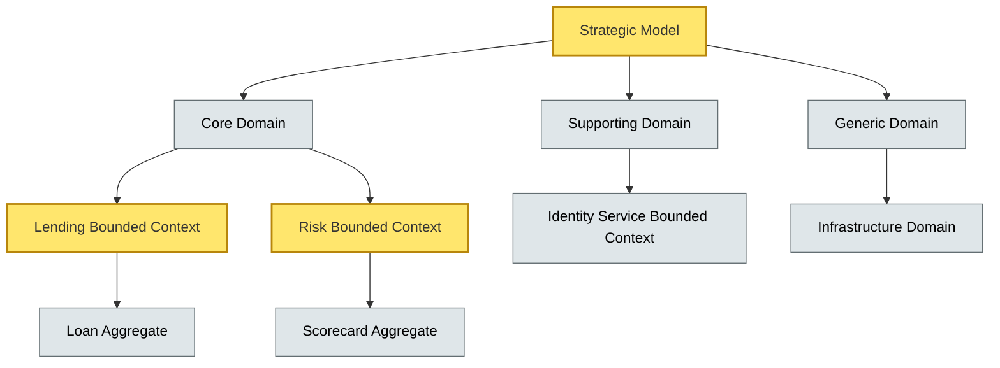
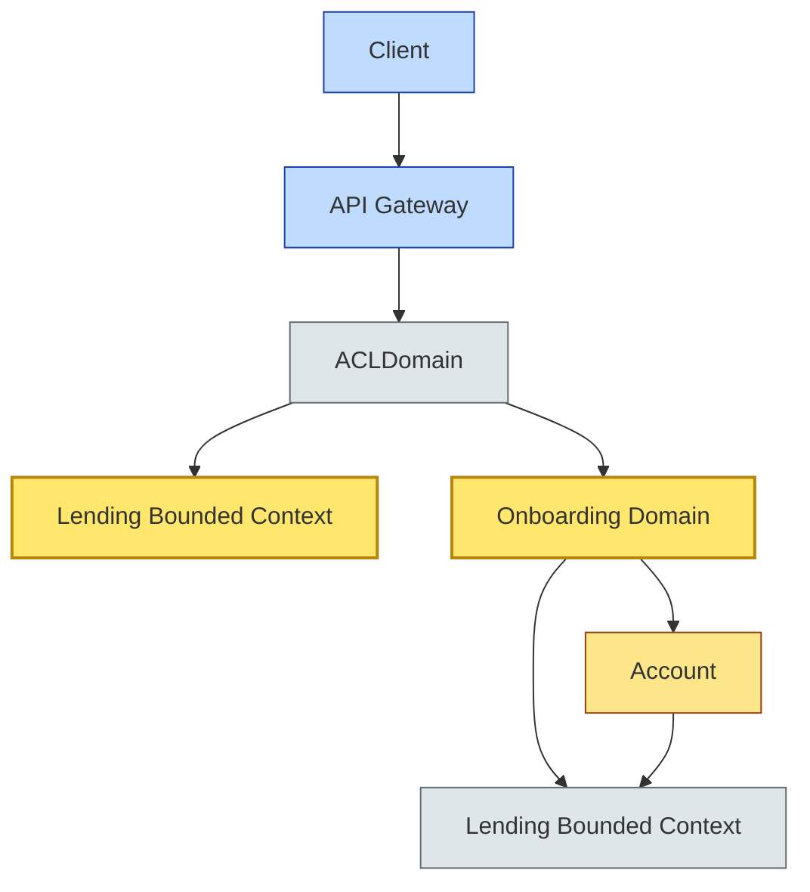

# [C5-06] Domain-Driven Design (DDD) Patterns — DETAIL
> **Category:** C5 — Patterns & Archetypes · **Difficulty:** ●/◑/○ · **Banking-relevant:** yes
>
> **Companion brief:** `briefs/C5-06-ddd-patterns.md`
>
> > **Target reader:** enterprise architect who must *explain, justify, and defend* the topic — not just recite it.

---

## 1. Precise definition
Domain-Driven Design (DDD) is an approach for focusing and coding complex software modeled around a domain. It is a strategic and tactical methodology that requires strict discipline and active, ongoing collaboration between business experts and developers to use an **ubiquitous language** that binds the business domain to the software model and integrates the use of a set of tactical design patterns upon the foundation of strategic domain-driven architectural structures.

Key references:
- *Domain-Driven Design* (Eric Evans, 2003).
- *Implementing Domain-Driven Design* (Vernon, 2013; 2016).
- *Strategic Design Patterns* (White et al., 2020).
- *Better Customer Outcomes with Software Design* (Evans, 2022).

## 2. Why it exists (problem it solves)
In the late 1990s, a major UK bank's IT portfolio lacked a shared model: a “tier-one fixed income” system, a “payments” system, and an “AML” system each used the word *Customer*, *Account*, and *Transaction* with incompatible meanings, causing integration costs to spiral and compliance errors to go undetected. DDD introduces a strategic model (subdomains, bounded contexts, context mapping) and tactical constructs (aggregator, entity, value object, encapsulation) to eliminate this ambiguity.

## 3. Core concepts & vocabulary
| Term | Precise meaning |
|------|-----------------|
| Domain | The area of knowledge around which software is being built. |
| Core domain | The business capability that differentiates the organization. |
| Domain model | Abstract representation reflecting selected aspects of the domain. |
| Ubiquitous language | An unambiguous vocabulary used by all team members. |
| Bounded context | The application of a domain model within a boundary. |
| Context mapping | The practice of describing relationships between bounded contexts. |
| Aggregate | A cluster of associated objects; treated as a single unit for data changes. |
| Aggregate root | The single entry point into an aggregate; all external references go through it. |
| Entity | An identifier-rich object. |
| Value object | An identity-poor, immutable object. |
| Domain event | An event that marks something significant in the domain model. |
| Subdomain / Domain | A strategic segmentation into Core, Supporting, and Generic. |
| Anti-corruption layer (ACL) | A pattern that translates one bounded-context model to another. |
| Context map | A document or visual map of the relationships between bounded contexts. |

## 4. How it works (architecture / mechanism)
### 4.1 Diagram A — DDD Strategic Model (highlight Bounded Context ownership = amber, other-context = grey)


### 4.2 Diagram B — Context Mapping styles (highlight decision points = green, risk = red)
```mermaid
flowchart LR
    classDef ok fill:#a7f3d0,stroke:#065f46
    classDef risk fill:#fecaca,stroke:#991b1b,stroke-width:2px
    classDef context fill:#dfe6e9,stroke:#636e72
    A[Staffing (Core/Co-located)]:::ok -->|low coupling| B[Customer: 1 Context]:::ok
    C[Partnership (Shared Kernel)]:::context -->|medium coupling| D[Customer: Shared Model]:::context
    E[Customer-Supplier (ACL)]:::context -->|translation| F[Customer: ACL]:::ok
    G[Open-Host Service]:::context -->|read-only| H[Customer: Read-Only]:::ok
    I[Enterprise (Decouple)]:::risk -->|opposing| J[Customer: Separate Models]:::risk
```

## 5. Variants, options & trade-offs
| Variant | When to pick | When to avoid | Key trade-off axis |
|---------|--------------|---------------|--------------------|
| Aggregates centered on Entity | Core-domain with identity-rich, long-lived entities (Account, Loan). | High-churn ephemeral flows where IDs are meaningless. | Consistency vs. performance. |
| Value objects vs. entity for identifiers | Use value objects for *meaningful* predicates; entities for identity-rich objects. | Over-abstracting everything into value objects and losing event sourcing. | Expressiveness vs. simplicity. |
| Bounded context per team (Massive Monolith) | DDD adopted, but not ready for microservice decomposition. | Need independent deployability across contexts. | Team autonomy vs. deployment speed. |
| Context Map as “Context Map” | Multiple contexts with shared concepts requiring a shared kernel or central data hub. | Bill of materials for shared kernel unbounded; governance collapse. | Consistency vs. evolution independence. |
| Tactical patterns (Event Storming) | Mapping black-board workshops; domain discovery sessions. | Large distributed teams without co-location; remote EventStorming. | Speed vs. depth. |
| Erasing obtrusive software: Bounded context as service | DLO boundaries; eventual consistency crossing context boundaries. | Need strong ACID; cross-context transaction required. | Consistency vs. compliance. |

## 6. Relationships to sibling topics
- **DDD (Strategic Model) vs. Tactical Patterns:** Strategic (bounded context, context mapping) determines *where* the lines are; tactical (aggregates, entities, value objects) determines *how* to model inside each line.
- **DDD vs. Agile/Lean:** DDD provides the *domain clarity* for Agile iterations; Agile provides the *cadence* for DDD discovery.
- **DDD vs. Microservice Patterns:** Microservice patterns operationalize bounded contexts; DDD ensures the contexts are *meaningful*, not just physically separate.
- **DDD vs. Cloud/SRE Patterns:** DORA requires observability and resilience; DDD's *Domain Events* are a natural substrate for SRE event pipeline monitoring.
- **DDD vs. Data Patterns:** Data patterns decide *how* to store and query; DDD decides *what* the models mean.

## 7. Banking / financial-services context 💳
A EU wealth-management bank uses DDD to model a **Cross-Border Offering**: **Risk** (Basel II/III probability-of-default), **Lending** (Iloan in INT + GBP), **Security** (transfer-agent, registrar), and **Client** (investment mandate).

The **Risk Aggregate** root is *Portfolio*; it enforces the invariant that *probability-of-default* cannot change without a *regulatory-approved model-certification* domain event. The **Anti-Corruption Layer** between **Risk** and **Lending** translates *probability-of-default* to *credit-rating* using a mapping table; when the central-risk model changes, ACL rules evolve; *Lending's* domain remains stable.

Event Storming sessions reveal that *Clientonboarding* is not a single context but two (*Identity* + *KYC*) with a **smart-entity** boundary: *KYC* aggregates *Document*, *Address*, and *Identity*; *Identity* aggregates *Biometrics*, *Passport*, and *Aadhaar* (India-specific).

## 8. Reference architecture / worked example
**Problem:** A digital-first neobank needs to know if it can support >200,000 account openings and 500 payments/second (Rails-like concurrency) while maintaining Basel-III risk invariants and zero financial losses at scale.
**Decision:** Domain-driven boundary-context decomposition + 2 cross-context references.

**ADR-061: Adopt Domain-Driven Design for Digital Onboarding**
```markdown
# ADR-061: Adopt DDD for Digital Onboarding
## Status
Accepted
## Context
Neobank core model failed: 'account' meant variable things to Product, Risk, Fraud; customer complaints; 22% drop-off at KYC.
## Decision
DDD modular architecture: Onboarding Aggregate Root (KYC Journey) + Lending Aggregate Root (Eligibility) + shared domain model of 'customer'. Ground-up event-storming workshops.
## Consequences
- Positive: Clear 'account' semantics; KYC policy changes can be encoded as simple rule switch at customer boundary.
- Positive: 'Fraud' and 'risk' models no longer need application-level injection.
- Negative: 2-3-month upfront discovery; requirement to rework ~60 legacy PRs and ~10 monolith services.
- Negative: Estimated additional 15-person-days for product owners to maintain shared domain model.
## Alternatives considered
1. Add domain fields to monolith: rejected—no strict boundary.
2. 'Customer workflows in state machine': rejected—state machines hide business meaning.
```

## 9. Maturity & adoption signals
- **Adopt when:** Bounded false positive: domain is >5 years; multiple stakeholder vocabularies; product roadmap depends on domain innovation; DARA/FCA require auditable domain model.
- **Anti-signals (don't adopt yet):** Single-domain app; domain is incidental; <5 engineers; DDD adds overhead without clarifying new product insights.
- **Common failure modes:** 1) *Do-nothing DDD* (naming conventions only, no Event Storming or model governance); 2) *Too many aggregates* (database round trips); 3) *Gold-plating* (over-abstracting); 4) *Premature microservices* (without hard apex before segmentation).

## 10. Common confusions — the "don't mix" up list
| Often confused | Real distinction |
|---|---|
| Bounded Context vs. Subdomain | Subdomain is a strategic segmentation (Core, Supporting, Generic); Bounded Context is the *architectural boundary* within which a Ubiquitous Language applies. |
| Aggregate vs. Entity vs. Value Object | Aggregate is a *cluster* with a root; Entity is identity-rich; Value Object is identity-poor, immutable. |
| Ubiquitous Language vs. Glossary | Ubiquitous Language is *actively used* in code and domain; a glossary is *passive* documentation. |
| DDD vs. Agile | DDD provides domain clarity for Agile; Agile provides cadence for DDD. |
| Context Map vs. Shared Kernel | Context Map is a description of relationships; Shared Kernel is a *pattern* of tight model sharing. |
| Trade-offs | Cannot avoid trade-offs; can model meaningfully; can capture intent; implementation details intermediate; iteratively refine. |

## 11. Tools & standards to know
- **Standards/Frameworks:** TOGAF 9.2 strategic/engineering phases, ISO 82079-2 (technical writing), MISRA, Basel II/III, DORA, SEC 17a-4.
- **Common tooling:** Miro or Mural (Event-Storming), ExDoc / Godoc (documentation), Domain Modeling Canvas, C4-plus (C4), ArchiMate.
- **Mandatory reading:** *Domain-Driven Design* (Evans, 2003); *Implementing Domain-Driven Design* (Vernon, 2013); *Strategic Design Patterns* (White, Evans; 2020).

## 12. ADR template (ready to fill in)
```markdown
# ADR-XXX: <decision>
## Status
Accepted | Proposed | Deprecated
## Context
...
## Decision
...
## Consequences
- Positive ...
- Negative ...
- ...
## Alternatives considered
1. ...
2. ...
```

## 13. Practice — apply it
1. **Recall:** define Ubiquitous Language in 60 seconds.
2. **Model:** draw a Context Map for your bank or service.
3. **ADR:** write an ADR applying an Aggregate to a Core domain.
4. **Defend:** explain to a CRO how a KYC policy change is now a volume change.

## 14. Summary (1 paragraph)
DDD is the *strategic compass* of architecture: it decides *where* to draw lines and *what* each line means; microservice patterns (C5-03) then describe *how* those lines connect; without it, every architectural pattern becomes a tangle.

---
**Status:** ✅ Covered · **Last updated:** 2026-09-14
