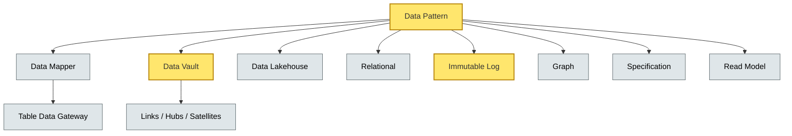

# [C5-07] Data Patterns — DETAIL
> **Category:** C5 — Patterns & Archetypes · **Difficulty:** ●/◑/○ · **Banking-relevant:** yes
>
> **Companion brief:** `briefs/C5-07-data-patterns.md`
>
> > **Target reader:** enterprise architect who must *explain, justify, and defend* the topic — not just recite it.

---

## 1. Precise definition
**Data patterns** address how data is modeled, accessed, stored, queried, and governed across the technology stack. Unlike enterprise integration patterns (EIP), which describe *flows between systems*, data patterns describe *the shape and semantics of data itself*. They apply across relational, immutable-log, columnar, and graph models.

Key references:
- *Patterns of Enterprise Application Architecture* (Martin Fowler, 2002) — Row Data Gateway, Data Mapper, Table Data Gateway, Active Record.
- *Data Vault 2.0* (Linstedt & Campagna, 2010–2020).
- *Designing Data-Intensive Applications* (Martin Kleppmann, 2015) — from relational to immutable logs, the database selection guide.
- *The Data Lakehouse Architecture* (Lemire, 2023; Databricks finishes 2028).

## 2. Why it exists (problem it solves)
Banking data is the scarcest regulatory asset. 1) **Auditability:** DORA, Basel II/III, SEC 17a-4, MiFID II require immutable, attributable, and retrievable records. 2) **Heterogeneity:** One system sprints on PostgreSQL; another processes Kafka topics; a third runs a Neo4j graph for counterparty networks; a fourth lands in Dremio on S3.

Without explicit data patterns, teams fight over schemas, produce copy-paste ETL scripts, and create *data silos* that contradict authority and slow decisioning.

## 3. Core concepts & vocabulary
| Term | Precise meaning |
|------|-----------------|
| Data pattern | Reusable strategy for modeling, storing, querying, and governing data. |
| Data Lakehouse | Unified storage layer (Delta/Iceberg/Hudi) with ACID, time-travel, and schema enforcement. |
| Data Vault | Data vault: tiny granules, low-velocity load, non-volatile, append-only, satellite/hub/link model. |
| Row Data Gateway | Object operates on a single database row. |
| Table Data Gateway | Object abstracts a whole database table. |
| Data Mapper | Object mediates between in-memory objects and database persistence. |
| Immutable Log | Append-only, replayed storage (event sourcing, Kafka, Kinesis). |
| Specification | Composable predicate query; Domain-Driven Design query abstraction. |
| Repository | Encapsulates data access; hides storage details. |
| Graph | Relationship-centric storage model; nodes = entities, edges = relationships. |
| Read Model | Denormalized view built from domain events; optimizes query performance. |
| Data Vault Atom | A vault with a single subject/hub and satellites; the basic load unit. |
| Business Lead / Hub / Link | Vault atom: central record (Hub) + detail attributes (Satellites) + relationships (Links). |

## 4. How it works (architecture / mechanism)
### 4.1 Diagram A — Data pattern taxonomy (critical load-bearing = amber, context = grey)


### 4.2 Diagram B — Legacy vs. Modern Data Integration (highlight challenge = red, ok = green)
```mermaid
flowchart TD
    classDef ok fill:#a7f3d0,stroke:#065f46
    classDef risk fill:#fecaca,stroke:#991b1b,stroke-width:2px
    classDef boundary fill:#f1f5f9,stroke:#475569,stroke-dasharray: 5
    classDef context fill:#dfe6e9,stroke:#636e72
    classDef critical fill:#ffe66d,stroke:#b8860b,stroke-width:2px

    Legacy[Mainframe IDOC]:::boundary
    Legacy -->|Hard-to-parse| Challenge(Parsing Challenge)
    Challenge -->|Fragmented Data Lake| Fragmented[Fragmented Data Lake]:::risk
    Fragmented -->|Manual ETL| Scentress[(Fraud Detection :::data)]:::critical
    Scentress -->|Decisions Made :::ok
    Modern[Clean Ontology :::ok] -->|Aggragate :::data ]:::critical
    Modern --> Decisions[Decision :::ok]:::ok
```

## 5. Variants, options & trade-offs
| Variant | When to pick | When to avoid | Key trade-off axis |
|---------|--------------|---------------|--------------------|
| Row Data Gateway | Simple single-row queries. | Collections-heavy; round trips multiply. | Simplicity vs. performance. |
| Table Data Gateway | Very table-oriented; team knows SQL. | Large table volumes; locking risk. | Familiarity vs. scalability. |
| Data Mapper | Domain-rich objects; persistence independence. | Performance-sensitive; mapping overhead. | Abstraction vs. efficiency. |
| Active Record | Rapid prototype; single table; no persistence indirection. | Multi-table aggregate management; testability. | Convenience vs. coupling. |
| Data Vault | Load-from-source or source-agnostic; audit-trail demand. | Real-time low-latency reporting; batch-heavy. | Auditable scaling vs. query performance. |
| Data Lakehouse | Ad-hoc analytics, time-travel, machine-learning raw data. | OLTP transaction volume; governance overhead. | Analytics agility vs. consistency. |
| Immutable Log | Financial ledger, event-sourced aggregates, replay. | Frequent row-level updates; storage cost. | Correctness vs. mutability cost. |
| Graph | Counterparty risk, AML/watch-list networks. | OLTP-dominated workloads; simple CRUD. | Relationship insight vs. schema complexity. |
| Specification | Dynamic where-clause composition (e.g., fraud rule predicates). | Simple static queries. | Query flexibility vs. readability. |

## 6. Relationships to sibling topics
- **DDD:** A Specification is a DDD query abstraction; Data Vault load patterns are DDD-style *aggregates* at the storage level; Data Lakehouses feed *Read Models* in CQRS.
- **Microservice patterns:** Each microservice owns its data; Data Vault governs inter-service data *integration* (loads); EIP governs inter-service *message* flow.
- **EIP / PAA:** EIP / PAA describes *what* data flows where; Data Patterns describe *how* that data is stored, queried, and governed.
- **Resilience patterns:** SRE keeps data pipelines healthy; Data Vault append-only design prevents partial failures from corrupting source data.
- **Security patterns:** Data Vault encrypts sensitive fields (PII in satellites) and enforces zero-trust access; Lakehouse implements retention and encryption policies.

## 7. Banking / financial-services context 💳
A German bank uses **Data Vault** for its data integration platform (IDOC + real-time external feed ingestion). Each *vault atom* represents a GSL payment or a mortgage application. Because Data Vault is append-only, if a parse error occurs, the erroneous record lands in a *satellite* (typed Satellites carry technical metadata and error traces) and the *source* remains untouched.

The **Graph** database (Neo4j) models counterparty risk: entities (counterparty, subsidiary, shipping-agent) with edges (maritime, loans, correspondent). A nightly batch computes风险暴露_LIMIT violations across all high-risk maritime counterparty exposures.

For **regulator submission**, a **data lakehouse** (Iceberg on S3) supports *time-travel* queries for SEC 17a-4 (retention 3–7 years) and MiFID II *best-execution* audits (trade reconstruction by instrument):
```
SELECT * FROM trades WHERE event_time = '2023-01-15' FOR SYSTEM_TIME AS OF '2023-01-15'
```

## 8. Reference architecture / worked example
**Problem:** A global cooperative bank's data integration layer has 3 transformed manual ETL scripts that copy data from mainframes to a data mart, but 30% of records fail QC, and the CRO cannot reconstruct a single trade ledger entry after a S2-level P3P external-vendor outage.
**Decision:** Data Vault 2.0 + event sourcing + subject-based data lakehouse.
```mermaid
graph TD
    classDef service fill:#bfdbfe,stroke:#1e40af
    classDef data fill:#fde68a,stroke:#92400e
    classDef boundary fill:#f1f5f9,stroke:#475569,stroke-dasharray: 5
    classDef ok fill:#a7f3d0,stroke:#065f46

    Source[Mainframe / SWIFT :::boundary]
    Source -->|Raw Extract | Vault[(Data Vault :::data)]:::data
    Vault -->|Second Pass :::ok]:::ok
    Vault -->|Lakehouse :::data ]:::data
    Lakehouse[(Data Lakehouse :::data)]:::data -->|Governance :::context]:::context
    Lakehouse --> AMLEngs[(AML :::ok]:::data
    ALMLEngs --> Reports[Risk :::ok ]:::ok
```
**ADR-071: Adopt Data Vault 2.0 for Financial Data Integration**
```markdown
# ADR-071: Adopt Data Vault 2.0 for Financial Data Integration
## Status
Accepted
## Context
Three manual ETL scripts copy mainframe + SWIFT IDOC to a data mart; 30% QC failure; regulator FOIA'd a trade ledger entry and we couldn't reconstruct it after a vendor outage.
## Decision
Data Vault 2.0: source-agnostic, append-only, with Hub/Link/Satellite. Time-travel via Delta Lake for regulatory queries.
## Consequences
- Positive: Source-agnostic; new system extracts without pipeline重构.
- Positive: Immutable source avoids destructive writes; audit-friendly.
- Negative: Second-pass transformations needed; data model skill gap.
- Negative: Append-only storage costs higher at raw scale.
## Alternatives considered
1. Materialized views: rejected—cannot support source reconstruction.
2. Raw + Lakehouse: rejected—no data variance management; schema drift.
```

## 9. Maturity & adoption signals
- **Adopt when:** Portfolio >8 systems; regulatory audit-trail requirements; need for ad-hoc + compliance queries; multiple data formats.
- **Anti-signals (don't adopt yet):** <3 data sources; static single-table Schema; no regulatory audit demands; no analytics.
- **Common failure modes:** 1) *Data Vault architect-first* and business skew; 2) *Lakehouse dark storage* (raw data untested); 3) *Immutable log storage cost* from verbose events.

## 10. Common confusions — the 'don't mix' list
| Often confused | Real distinction |
|----------------|------------------|
| Data Lake vs. Data Lakehouse | A lake is raw files; a lakehouse is a lake with ACID, governance, and schema enforcement. |
| Data Vault vs. Data Lakehouse | Data Vault is *load* pattern; Data Lakehouse is *storage* format with ACID and time-travel. |
| Data Pattern vs. Database | A pattern is a structural strategy; a database is a concrete implementation. |
| Immutable Log (DDD vs. data pattern) | In DDD, Event Sourcing is an aggregation pattern; in data patterns it's an immutable append-only storage. |
| Mode vs. Model | Mode is a storage format (table, event, graph); model is a logical representation. |

## 11. Tools & standards to know
- **Standards/Frameworks:** ISO/IEC 704 (terminology clarity), ISO 82079 (technical writing), ISO 42010 (architecture), Basel II/III, SEC 17a-4, MiFID II, GDPR, PSD2, DORA.
- **Common tooling:** Teradata, Snowflake, Delta Lake, Iceberg, Hudi, Dremio, StarRocks, Neo4j, Apache Kafka, Confluent, Flink, Dremio, Python/R for data-transfer.
- **Mandatory reading:** *Patterns of Enterprise Application Architecture* (Fowler, 2002); *Data Vault 2.0 Handbook* (Linstedt, 2010–2020); *Designing Data-Intensive Applications* (Kleppmann, 2015).

## 12. ADR template (ready to fill in)
```markdown
# ADR-XXX: <decision>
## Status
Accepted | Proposed | Deprecated
## Context
...
## Decision
...
## Consequences
- Positive ...
- Negative ...
- ...
## Alternatives considered
1. ...
2. ...
```

## 13. Practice — apply it
1. **Recall:** define Data Vault in 90 seconds.
2. **Model:** produce a UML class diagram for a trade settlement that uses a Data Vault atom.
3. **ADR:** write an ADR adopting a Data Lakehouse for regulatory reporting.
4. **Defend:** explain to a non-technical CIO why append-only logs cost more but reduce audit risk.

## 14. Summary (1 paragraph)
Data patterns are the *structural grammar* of the information fabric. Microservice patterns (C5-03) and Event-Storming (C5-06) define *who owns* data; data patterns define *how* each owner is stored, queried, and evolved.

---
**Status:** ✅ Covered · **Last updated:** 2026-09-14
