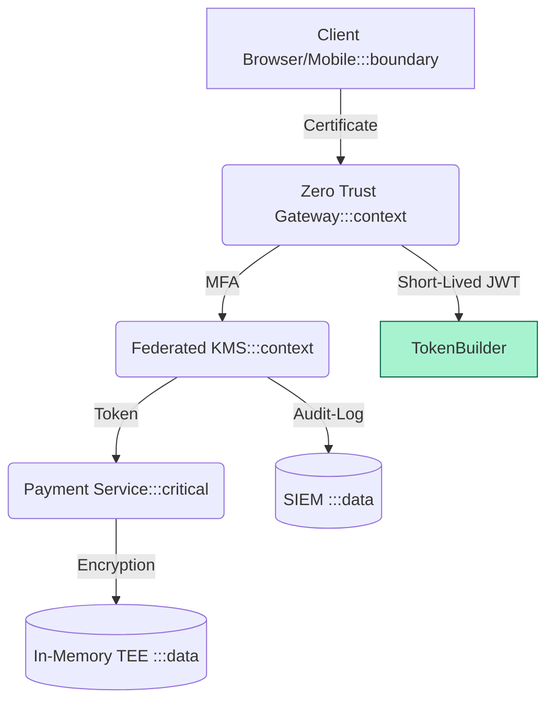
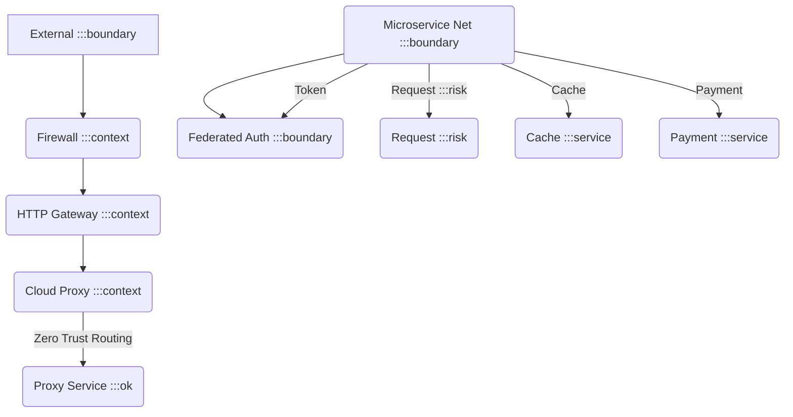

# [C5-08] Security Patterns — DETAIL
> **Category:** C5 — Patterns & Archetypes · **Difficulty:** ●/◑/○ · **Banking-relevant:** yes
> **Companion brief:** `briefs/C5-08-security-patterns.md`
>
> > **Target reader:** enterprise architect who must *explain, justify, and defend* the topic — not just recite it.

---

## 1. Precise definition
**Security patterns** are reusable structural techniques that translate security principles (confidentiality, integrity, availability, auditability) into concrete architectural mechanisms. They are *not* a standalone technology; they satisfy principles like Zero Trust, Least Privilege, and Defense in Depth.

In banking, security patterns are *non-negotiable scaffolding*: PCI-DSS Requirements 1–6 (firewall, cryptography, vulnerability management, access control, monitoring, incident response), DORA operational resilience, and regulatory incident-response obligations (GDPR 33, SOX 404, SEC 17a-4).

## 2. Why it exists (problem it solves)
A 2018 breach at a major EU bank exposed 2 million customer records because a vulnerability-scanning program was disabled for "maintenance." Without security patterns, teams defend by *reacting* to threats: adding a WAF, tightening IAM, then moving on.

Security patterns shift defense left: by embedding **Zero Trust**, **N-Tier** isolation, **Token Builder**, and **threat modeling** into the architecture, the bank can prove *by design* that a compromised developer account cannot reach cardholder data.

## 3. Core concepts & vocabulary
| Term | Precise meaning |
|------|-----------------|
| Zero Trust | Never trust, always verify; every request is authenticated, authorized, and encrypted. |
| Token Builder | Generates structured, verifiable, short-lived access tokens (JWT, SAML, OAuth2) to prevent replay and reuse. |
| Role Authorization | Role-based access control (RBAC) or attribute-based access control (ABAC); enforces least privilege. |
| N-Tier | Defense-in-depth: layers (network, application, data) each enforce their own access rules. |
| Threat Modeling | Systematic identification, classification, and mitigation of threats (e.g., MITRE ATT&CK). |
| Separation of Duties (SoD) | Enforces conflict-of-role constraints (e.g., trade-execution ≠ trade-approval). |
| Open-Source Scanning | Automated dependency scanning for license, vulnerability, and supply-chain risks. |
| Principle of Least Privilege | Default deny; request-based escalation; just-time access. |
| Open-Source Scanning | License, vulnerability, and supply-chain scanning of open-source components. |
| Payment Channel Isolation | Juxtaposes payment flows (card vs. ACH vs. SWIFT) in separate environments or VLANs to contain breach surface. |
| Freemium-Amount-Limit | Enforces a per-transaction threshold to limit maximum loss; combined with geofencing. |
| Payment channel isolation (deminer) | *Zero Trust microservice = forced for PCI-DSS 3.0 (tokenization):* Verify identity, verify rights, verify history, monitor/log, revoke/rotate tokens at T+max fresh distance. |

## 4. How it works (architecture / mechanism)
### 4.1 Diagram A — Zero Trust perimeter (highlight critical = amber, ok = green, context = grey)


### 4.2 Diagram B — N-Tier defense-in-depth (highlight risk = red, service = blue, data = yellow, boundary = dashed-grey)


## 5. Variants, options & trade-offs
| Variant | When to pick | When to avoid | Key trade-off axis |
|---------|--------------|---------------|--------------------|
| RBAC (role-based) | Static roles; limited attribute granularity needed; regulatory SoD support. | Highly dynamic attribute changes; fine-grained per-request ABAC is costly. | Simplicity vs. dynamic control. |
| ABAC (attribute-based) | Regulatory granularity (e.g., transaction-level ABAC for PCI-DSS 3.2). | High maintenance of attribute store; complexity for business users. | Flexibility vs. governance cost. |
| Zero Trust (microservice) | Cloud-native; APIs expose cardholder data; DORA/PCI-DSS 7.0 requirements. | Legacy mainframe; break-glass policy; risk of over-verification bad latency for 24/7 trading. | Security vs. latency. |
| N-Tier per-gateway vs. N-Tier between microservices | Per-gateway for clear separation; between microservices for defense-in-depth and minimal blast radius (different environment, independent monitoring in scope). | Too many layers for small teams; thicker boundary = higher operational cost. | Separation vs. complexity. |
| Threat Modeling + Mitre ATT&CK mapping | Enterprise-grade; requires complete system card (C4/ArchiMate) to model_system status and RCA. | Small banks; simple asset bases; without a complete system card, threat mapping is guesswork. | Threat mapping vs. system reach. |
| Open-Source Scanning (OSS) | Agile teams; modern transitively; centralized scanner for downstream compliance. | Static builds; heavily regulated; each artifact audited manually; scanner false-positives. | Automation vs. compliance. |

## 6. Relationships to sibling topics
- **Zero Trust vs. N-Tier:** Zero Trust is the *principle*; N-Tier is the *architecture* that implements it.
- **Security patterns vs. Security architecture:** Architecture = blueprints (governance), patterns = reusable techniques (technical).
- **SRE patterns vs. Security patterns:** SRE handles *availability*; Security handles *confidentiality/integrity*; they overlap in *incident response*.
- **Anti-Fraud / AML:** Security protects the *channel*; anti-fraud protects against *fraudulent transactions*; payment-channel isolation contains breach scope.

## 7. Banking / financial-services context 💳
A UK retail bank shields card payments with **Zero Trust**:

```
Client (web/mobile)
  |--- Zero Trust edge (network layer: verify device fingerprint, geo, MFA)
  |--- Permission-based API Gateway + Federated Identity (token builder)
  |--- PaaS / Cloud environment (data layer: enforce time-based access & least privilege)
  |--- Payment Service (PCI-DSS 3.0)
```

A **Token Builder** issues short-lived JWTs with *least* and *just-time* access: a caller in transaction-support role can read a payment line but cannot write it.

A **Threat Model** mapped to Mitre ATT&CK's *Initial Access* and *Lateral Movement* ensures that if an insider compromises a static-resources worker-node, they cannot escalate to cardholder systems.

A **Risk Assessment** (not acceptance) ensures that even if *in-memory side-channel* or *code injection* occurs, the impact is bounded: *successful attacks* are limited to the compromised tier, and *auto-security-logging* (data layer) records every request for audit.

## 8. Reference architecture / worked example
**Problem:** Migrating a card-payment processing service from on-prem to public cloud (AWS/GCP), satisfying PCI-DSS 3.0 + DORA.
**Decision:** Zero Trust + N-Tier + Token Builder + open-source scanning.
```mermaid
graph TD
    classDef ok fill:#a7f3d0,stroke:#065f46
    classDef context fill:#dfe6e9,stroke:#636e72,color:#000
    classDef critical fill:#ffe66d,stroke:#b8860b,stroke-width:2px
    classDef boundary fill:#f1f5f9,stroke:#475569,stroke-dasharray: 5
    classDef data fill:#fde68a,stroke:#92400e

    External[External : boundary] --> DTZero(Zero Trust Mean : boundary)
    DTZero -->|AuthN| AuthN(Federated KMS : boundary)
    AuthN -->|Token | Edge
    Edge[(API Gateway :service)]
    Edge -->|JSON :context]
    Edge -->|JS :risk]
    Node[Payment Node :service]
    Node -->|<Token :ok]
    Node -->|Token |Boundary
    Node -->|Critical Data :critical]
```
**ADR-085: Zero Trust for Cloud-Migrated Card Payment Service**
```markdown
# ADR-085: Zero Trust for Cloud-Migrated Card Payment Service
## Status
Accepted
## Context
On-prem card service must move to public cloud (AWS/GCP); PCI-DSS 3.0 + DORA require threat-modeling; current perimeter relies on network segmentation only.
## Decision
Zero Trust + N-Tier: external edge verifies device/MFA; internal API Gateway enforces token-based least privilege; payment node has network and in-memory encryption; open-source scanning on every commit.
## Consequences
- Positive: Threat vector constrained to compromised node level; commitment to audit-stream flag.
- Positive: Mitre ATT&CK coverage proven; incident-response control.
- Negative: Latency from multi-layer verification; need SRE to monitor.
- Negative: Token-builder complexity for 24/7 trading; short-lived JWTs may expire during high-load.
## Alternatives considered
1. Network-segmentation only: rejected—insufficient for PCI-DSS.
2. API Gateway at perimeter only: rejected—interior nodes remain exposed.
```

## 9. Maturity & adoption signals
- **Adopt when:** Cardholder data is processed; DORA/MiFID/PCI-DSS requirements; 24/7 SLOs.
- **Anti-signals (don't adopt yet):** No regulated dataset; base-level coverage is good; without Toil, everyone spends half of time on firewall patches.
- **Common failure modes:** 1) *False sense of security* (security tool deployed, then forgotten); 2) *Toil* (firewall rule maintenance, false-positive alert fatigue); 3) *Secure by default* (hardening a brittle system too late).

## 10. Common confusions — the "don't mix" list
| Often confused | Real distinction |
|----------------|------------------|
| RBAC vs. ABAC | RBAC = role-based; ABAC = attribute-based; ABAC is more dynamic but costlier. |
| Zero Trust vs. N-Tier | Zero Trust is principle; N-Tier is implementation. |
| Technical security vs. Security architecture | Architecture = blueprint and governance; patterns = reusable techniques. |
| Anti-Fraud vs. Anti-Moneylaundering | Anti-Fraud = algorithm-based transaction anomaly; AML = law-enforcement KYC/verification and monitoring. |

## 11. Tools & standards to know
- **Standards/Frameworks:** ISO 82079 (technical writing), ISO 28420 (asset management), ISO 19190 (system-of-records, API management), MITRE ATT&CK, PCI-DSS 3.0, DORA, NIST SP 800-53, SOC2.
- **Common tooling:** IAM (AWS/Azure), Keycloak, OAuth2/OpenID Connect (Keycloak, auth0, Azure AD), Salt (salt-core); SIEM (Elastic, Splunk), SOAR (Palo Alto, Exabeam), Cloud Custody, CloudSploit.
- **Mandatory reading:** *Security Patterns: Integrating Security Patterns into System Architectures* (Altesuo et al.); *The Art of Security Architecture* (Ross; O'Reilly, 2012).

## 12. ADR template (ready to fill in)
```markdown
# ADR-XXX: <decision>
## Status
Accepted | Proposed | Deprecated
## Context
...
## Decision
...
## Consequences
- Positive ...
- Negative ...
- ...
## Alternatives considered
1. ...
2. ...
```

## 13. Practice — apply it
1. **Recall:** define Zero Trust in 90 seconds.
2. **Model:** draw an ArchiMate diagram of a Zero-Trust perimeter for a payment service.
3. **ADR:** write an ADR applying the Token Builder to a mobile-app backend.
4. **Defend:** explain to a CIO why open-source scanning should run on every CI commit, not quarterly.

## 14. Summary (1 paragraph)
Security patterns are the *walls, guards, and vault doors* of architecture. In banking, PCI-DSS 3.0, DORA, and regulator audits demand that these patterns not be added as after-thinking but woven into the design from the first sprint.

---
**Status:** ✅ Covered · **Last updated:** 2026-09-14
