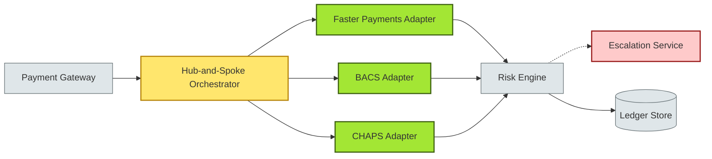
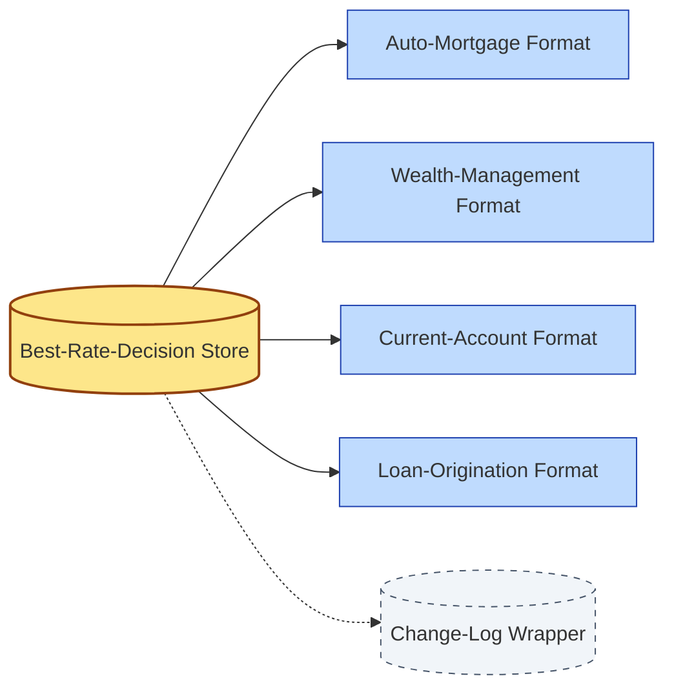
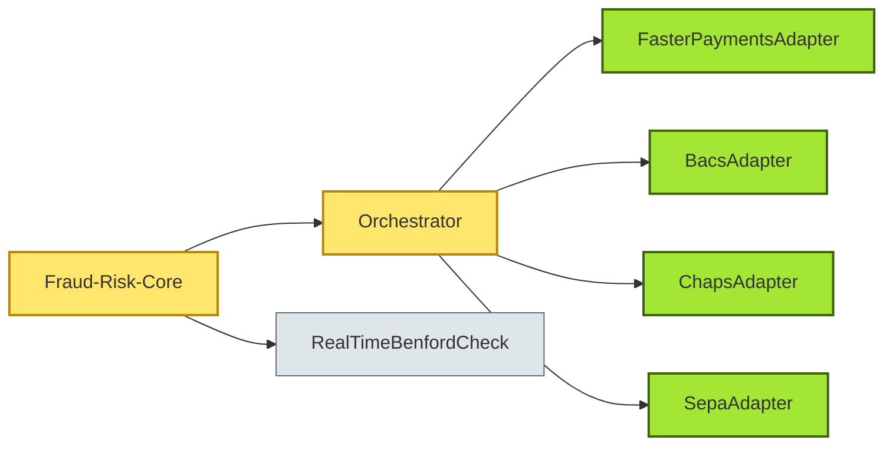

# [C6-01] SOLID, DRY, KISS — DETAIL

> **Category:** C6 — Design Philosophy & Quality Attributes · **Difficulty:** ● · **Banking-relevant:** yes
> **Companion brief:** `[briefs/C6-01-solid-dry-kiss.md](../briefs/C6-01-solid-dry-kiss.md)`
> **Target reader:** enterprise architect who must *explain, justify, and defend* the topic — not just recite it.

---

## 1. Precise definition

The **SOLID** principles are five object-oriented design rules articulated by Robert C. Martin (Uncle Bob) in 2000:

| Letter | Principle | Core prescription |
|--------|-----------|-----------------|
| **S** | Single Responsibility Principle (SRP) | A class should have only one reason to change. |
| **O** | Open-Closed Principle (OCP) | Software entities should be open for extension, closed for modification. |
| **L** | Liskov Substitution Principle (LSP) | Subtypes must be substitutable for their base types without altering correctness. |
| **I** | Interface Segregation Principle (ISP) | Clients should not be forced to depend on interfaces they do not use. |
| **D** | Dependency Inversion Principle (DIP) | High-level modules should not depend on low-level modules; both should depend on abstractions. |

**DRY** (Don't Repeat Yourself) was coined by Andy Hunt & Dave Thomas (The Pragmatic Programmer, 1999): every meaningful piece of knowledge must be represented in exactly one explicit place.

**KISS** (Keep It Simple, Stupid) is an aphorism attributed to aerospace engineer Kelly Johnson (Lockheed, 1960s): systems should avoid unnecessary complexity.

Precision matters because **SOLID** is often misquoted as "always use the *Interface Segregation Principle* to split every class into its own JAR". In banking, Splitting a `ReadOnlyRepository` into five tiny interfaces *violates* the usability of contracts and is a common early-career error.

## 2. Why it exists (problem it solves)

Legacy banking stacks were built with little or no design discipline. A single `LoanAccount` class in a 20-year-old mainframe replacement accumulated 3,400 LOC and 80 method overloads. When the EU issued the PSD2 "Strong Customer Authentication" requirements, developers had to insert SMS, push-notification, and hardware-token logic into the same class. A 3,400 LOC class was not open for *safe* extension; testing required 6 weeks; rollbacks meant 2 patient nights of manual re-integration.

DRY existed before SOLID as a pragmatic code-maintenance rule. In financial services, DRY is harder because *regulatory* semantics (AML, KYC, GDPR consent) must repeat across products even when the UI is shared. DRY + correctness requires a **single source of truth for business rules**, often a domain-specific decision engine rather than duplicated `if/then` in 14 repositories.

KISS is a discipline against "abstraction vertigo": 12 architectural layers is not "full-stack"; it is a complexity debt instrument that accrues developer cost every sprint.

## 3. Core concepts & vocabulary

| Term | Precise meaning |
|------|-----------------|
| **SRP** | Responsibilities are axis-of-change; group by reason-to-change, not by technology stack. |
| **OCP** | Use polymorphism / injection so new behaviour is added without changing existing modules. |
| **LSP** | A `SavingsAccount` must be a valid `Account` under all lender-card, ACH-batch, and cheque-clearing operations. |
| **ISP** | A `DailyLimitInspector` should not depend on the "create deposit" mutation interface. |
| **DIP** | `PaymentProcessor` depends on `PaymentMethod` interface, not on `FasterPayment_StripeAdapter`. |
| **DRY** | No duplicated constant for the same threshold in two micro-services; no duplicated SQL in three `.sql` files. |
| **KISS** | A discretionary wealth model that averages three risk factors is better than an LSTM that needs six hyper-parameters and a nightly retraining pipeline until evidence supports it. |

## 4. How it works (architecture / mechanism)

### 4.1 Diagrams

**Diagram A — Floating-rate context (highlight the decision = green, risk = red):**



**Diagram B — DRY knowledge centralisation (highlight the data = yellow, boundary = dashed-grey):**



### 4.2 Mechanism — OCP in a fraud-rule pipeline

1. The system defines an `abstract class FraudCheckGate` with `validate(Transaction)` returning a `ComplianceDecision`.
2. Each channel (mobile deposit, wire, card-present) has a concrete subclass.
3. A new `RealTimeBenfordCheck` is inserted by subclassing, *without modifying* the wire-processing loop.  
4. The loop issues only the *shared call*; exceptions from `BenfordException` propagate to an *orchestrator* configured via the `RuleEngineConfig` abstraction.

### 4.3 Mechanism — DRY for cross-product interest-rate thresholds

- One canonical JSON file `interest-rules.v2.4` is read at process start by:
  - `SavingsInterestService`
  - `FixedTermInterestService`
  - `IjarahProfitRateService` (Islamic finance variant)
- All three inject the load-time map; they do not copy the numbers.

## 5. Variants, options & trade-offs

| Variant / Axis | When to pick | When to avoid | Key trade-off |
|----------------|--------------|---------------|---------------|
| **Violation of SRP for speed** | Hot-path in-memory data transfer in a market-data pipeliner | Core-banking product logic | Short-term latency; long-term fragility |
| **Interface explosion (ISP)** | Bounded-context micro-service with 3+ stakeholders | Green-field prototype | Correctness now; maintenance tax later |
| **God-class with internal DRY** | Read-only reporting data-mart; interface never public | Write-model services | DRYness without OCP means one class changes for many reasons |
| **KISS over premature optimisation** | Greenfield lending platform; team < 15 | Guaranteed high-throughput payment rail (CHAPS) | Insufficient throughput; need to engineer later |
| **DRY with shared mutable state** | Stateless rule engine using a versioned read-only datastore | Multiple services with isolated DB-per-service | Consistency vs autonomy trade-off; version skew risk |

## 6. Relationships to sibling topics

- **C5 — TDD / BDD:** When `-> 0.1.0` of solid code is covered by BDD specs, refactors are *locally verifiable*; shrink the test surface and you shrink the refactor risk.
- **C6-03 (Coupling / Cohesion):** SOLID *maximises* cohesion and *minimises* coupling; a violation of SRP usually correlates with high coupling.
- **C6-07 (Maintainability):** OOP purity under SOLID/DRY/KISS is an *input* to maintainability; maintainability also needs observability, deployability, and FOSS-free licenses.
- **C6-09 (ADR):** An ADR documents *why* a SOLID violation was approved (e.g. "OCP was relaxed because a 3-week deadline forced inline protection") — making the debt visible.

## 7. Banking / financial-services context 💳

A **Tier-1 UK bank** migrated its retail mortgage platform from a VM-per-product to a shared-services model. Originally, each product area owned its own risk-rule JAR. Because rules were duplicated, updating the *Maturity-Value-at-Risk* table required six deployments. After applying the **DRY** principle, they extracted a `RiskRuleEngine` (OCP-compliant, interface-driven) and published it as a Spring-Cloud-gRPC service.  
- **Regulatory cost:** PRA / FCA demands documented change control; DRY reduces the attack surface of materially mis-stated rates.  
- **Security impact:** Fewer duplicated secrets files means fewer lost credentials during onboarding.  
- **Business value:** The change team reduced the **MTTR** for interest-rate miscalculation from 3 weeks to 4 hours.

A **wealth-management boutique** adopted KISS by resisting a micro-services decomposition of its *discretionary rebalancing* engine. The product team argued that three services (execution, tax-lot-management, performance-attribution) were cleaner. Architecture retained them as *modules inside a single JVM* because the eight-person team could not afford distributed-debugging costs. The trade-off: **I** (KISS) rejected **O** (extension via new network boundaries) for **latency** and **operational simplicity**.

## 8. Reference architecture / worked example

### Problem
A bank wants to add a *new same-day Bacs credit* channel to an existing faster-payment orchestrator without retraining the fraud-scoring batch.

### Decision
1. Define `PaymentChannel` interface (`Channel: FasterPayments | Bacs | CHAPS | SEPA`).
2. Implement `BacsAdapter extends PaymentChannel`.
3. Add `BacsFraudAdapter interfaces FraudTool` to the *existing* risk pipeline *without modifying* `FasterPaymentsAdapter`.
4. Reject a proposed `ChannelOrchestratorService` with 14 methods in favour of **KISS**: keep the orchestrator as a simple switch-case backed by a map of adapters.

### Diagram


### ADR
```markdown
# ADR-2026-007: Drip-feed new payment channels via Open-Closed channels
## Status
Accepted
## Context
Faster Payments now runs 24/7; the bank must add Bacs credit, CHAPS, and SEPA without halting the existing credit-transfer business.
## Decision
Each channel is a concrete implementation of `PaymentChannel` and injected into the `Orchestrator`. The `FraudRiskCore` depends on `FraudTool` interface, so new scoring checks are plugged at runtime.
## Consequences
- Positive: zero channel-specific code in the critical path; rollback is a config change.
- Negative: initial channel map design must be broad to avoid future OCP violations.
## Alternatives considered
1. Refactor to 4 independent micro-services — rejected (team size, operational burden).
2. Single queue with polymorphic messages only — rejected (audit-traceability requirements).
```

## 9. Maturity & adoption signals

- **Adopt when:** (1) code-review checks for "SRP warning" are in CI; (2) duplicated constants > 3 per PR trigger a lint rule; (3) architectural decision records are reviewed before any new `if (true)` branches.
- **Anti-signals (don't adopt yet):** team < 3 developers; no domain model yet; product churn < 1 month.
- **Common failure modes:**
  1. **Interface explosion:** every concrete class gets its own interface.
  2. ** premature abstraction:** writing an OCP plugin for a feature that may never ship.
  3. **KISS overcorrection:** rejecting a necessary compliance module because it "felt complex".

## 10. Common confusions — the "don't mix" list

| Often confused | Real distinction |
|----------------|------------------|
| SOLID as *project structure* | SOLID describes *class responsibilities and dependencies*; it does not dictate folder layouts. |
| DRY as *no shared code* | DRY means *no shared knowledge*; a shared library with a shared mutable lock is an anti-pattern. |
| KISS as *naïve* | KISS demands you understand the **minimum** complexity; it is not ignorance, it is disciplined restraint. |
| SRP vs OCP | SRP protects one class per reason; OCP protects one class per extension dimension. |

## 11. Tools & standards to know

- **Standards/Frameworks:** IEEE 830 (Software Requirements Specification, where DRY applies to requirement text); ISO 26262 (automotive functional safety principles echo OCP); TOGAF ADM Phase F (Opportunities & Solutions — finance-mapped).
- **Common tooling:** SonarQube (duplicated blocks detection), SpotBugs / PMD (SRP smell detection), blank cannon (anti-DRY tests), GitHub Advanced Security (secret duplication alerts).
- **Mandatory reading:** *Clean Architecture* (Robert C. Martin), *Domain-Driven Design* (Eric Evans chapter 4 on ubiquitous language), *Pragmatic Programmer*.

## 12. ADR template (ready to fill in)

```markdown
# ADR-XXX: <decision>
## Status
Accepted | Proposed | Deprecated

## Context
...

## Decision
...

## Consequences
- Positive ...
- Negative ...
- Neutral ...

## Alternatives considered
1. ...
2. ...
3. ...
```

## 13. Practice — apply it

1. **Recall:** define SOLID in 2 min without notes; then illustrate with a `LoanAccount` class from today's domain.
2. **Model:** produce an ArchiMate diagram of a façade that isolates the fraud-check engine; label each OCP-protected adapter.
3. **ADR:** write a 10-row ADR licensing a new `SameDaySettlementGateway` under OCP.
4. **Defend:** explain to a CRO why we are *not* building a micro-service for CHAPS; invoke KISS and operational cost.

## 14. Summary (1 paragraph)

SOLID, DRY, and KISS are not individual "good practices" but a *joint commitment to local verifiability*: each class has a single responsibility (SOLID), each fact has a single owner (DRY), and each design wants the simplest path to proof (KISS). In banking, where systems survive decades, local verifiability is the cheapest insurance against regulatory failure, fraud, and unplanned attrition of judgment-laden domain experts.

---
**Status:** ✅ Covered · **Last updated:** 2026-09-14
