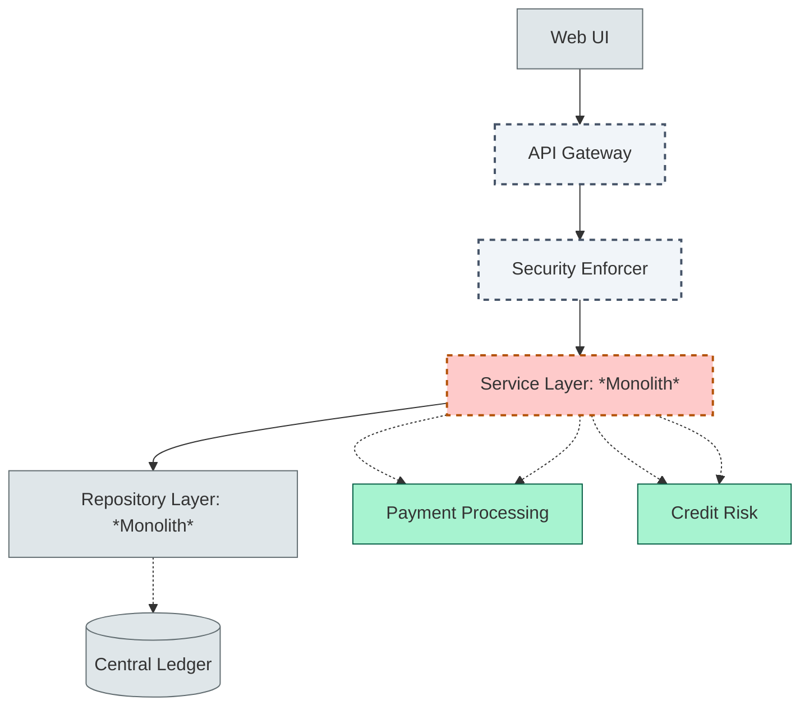
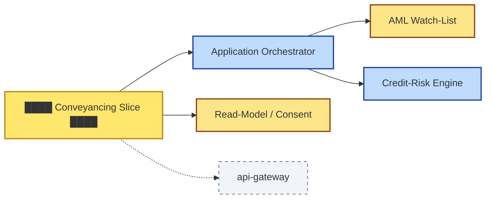
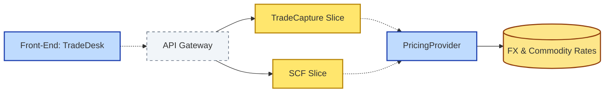

# [C6-02] Separation of Concerns — DETAIL

> **Category:** C6 — Design Philosophy & Quality Attributes · **Difficulty:** ◑ · **Banking-relevant:** yes
> **Companion brief:** `[briefs/C6-02-soc-abstraction.md](../briefs/C6-02-soc-abstraction.md)`
> **Target reader:** enterprise architect who must *explain, justify, and defend* the topic — not just recite it.

---

## 1. Precise definition

**Separation of Concerns** (SoC) is a design principle with roots in the 1970s work of Edsger Dijkstra: software systems should be decomposed into parts that address *independent* functional interests. A *concern* is any aspect that affects the system independently — business logic, persistence, security, messaging, user experience, etc.

The IEEE 1471 (now ISO/IEC 42010:2011) standard defines *concern* as "a coherent set of functional and non-functional requirements that must be realized by the same structure or behaviour."

IBM coined the term **separation of concerns (SoC) in software engineering** in the 1970s, formalising Dijkstra's modularity ideas for large systems.

A **boundary** is the set of interfaces (syntactic, protocol, policy) that separates one concern from another. Boundaries are the *guardrails* that make a separation enforceable; without them, SoC is merely a suggestion.

## 2. Why it exists (problem it solves)

The 1990s saw monolithic banking platforms (ING's IBS, DBS's legacy core) where *every* transaction path — from *USD wire* to *mortgage approval* to *regulatory reporting* — ran through a single 500,000-LOC JBoss server. When the EU mandated **PSD2** (Open Banking), the bank had to expose 12 API endpoints. The team decided to add new REST controllers to the existing monolith because there was no architectural boundary between *payment-orchestration* and *customer-identity* concerns. 

The result:
- A change to the *Faster Payments* queue format caused a regression in *KYC onboarding*.
- The compliance audit (SOC 2 Type II) could not scope test effort because one team owned 6 concerns.
- A single DBA schema change dropped two tables in one migration.

SoC, enforced via **macro-modules** and **physical boundaries** (separate JVMs, separate schemas, separate teams), prevents *functional entanglement*. It is the architectural analogue of *separation of duties* in financial reporting (COBIT 2019).

## 3. Core concepts & vocabulary

| Term | Precise meaning |
|------|-----------------|
| **Concern** | A set of requirements (functional or non-functional) that can be discussed / changed / tested independently. |
| **Boundary** | Encapsulation surface: ADL (interface level) + APD (asset-protection-domain). |
| **Vertical slice** | A feature-sized module that owns end-to-end capability (e.g. `approve-conveyancing`). |
| **Horizontal layer** | A function-sized module across all capabilities (e.g. `message-bus`). |
| **Chord diagram of concerns** | Visualises which concerns touch which resources; dense chords = violation. |
| **Architectural framework-of-concerns (AFoC)** | A curated list of concerns that a specific domain (payments, cards, lending, custody) recognises. |

## 4. How it works (architecture / mechanism)

### 4.1 Diagrams

**Diagram A — Layered onion, with violated boundaries in red (highlighting the risk):**



**Diagram B — Vertical slice with clean boundaries (highlight data = yellow, service = blue):**



### 4.2 Mechanism — vertical-slice extraction

1. **Identify a cross-cutting capability:** e.g. *faster-payment-confirmation*.
2. **Map all current concerns** touching it: `PaymentsComponent`, `LedgerComponent`, `NotificationComponent`, `AuditComponent`.
3. **Enforce a new boundary:** Introduce a `FasterPaymentSlice` module.
   - *Inbound:* REST/gRPC only through the gateway.
   - *Outbound:* gRPC to `LedgerComponent`, `AuditComponent` — but the slice does not *depend* on internal HR/HR-payroll.
4. **Deploy as a separate artefact** (Docker image, Spring-Cloud deploy, or serverless).
5. **Verify via chord diagram:** if the slice still shows >2 thick chords to unrelated concerns, split further or stop.

### 4.3 Mechanism — horizontal layer discipline

A *message-bus* concern is horizontal. It must not own business logic. If `PaymentEventTopic` subscribers directly call `AccountRepository`, the bus concern is violated. The remedy: introduce an inversion-of-control container that resolves `AccountRepository` *inside* the subscriber, not inside the bus library.

## 5. Variants, options & trade-offs

| Variant / Axis | When to pick | When to avoid | Key trade-off |
|----------------|--------------|---------------|---------------|
| **Vertical slices + hexagonal ports/adapters** | Multi-product retail or corporate bank with 10+ capabilities | Single-platform fintech (2 products) | Governance overhead; slower time-to-market for small teams |
| **Pure horizontal layers (onion)** | Small team, low churn, one product | Any regulated bank with > 5 concerns | Constant cross-concern coupling; hard to audit |
| **Domain-driven vertical slices** | Complex wholesale banking (trade-finance, syndications) | Mass-market deposit product | Over-scoping; many *trivial* slices |
| **Shared-kernel (horizontal) + customer-kernel (vertical)** | Platform teams + product teams | Centralised monolith | Kernel pollution; divergence in schema |

### 5.1 The "horizontal-layer death spiral"

In the dot-com boom, banks adopted **N-tier** (UI → Presentation → Business → Data). Each "tier" was a *concern*. When product demands grew, teams layered a *services tier* on top of the business tier, then a *gateway tier* above that. After 4 tiers, a bug in the *presentation tier* required 6-team triage. The cure: *collapse* horizontal layers by enforcing *vertical* boundaries with bounded contexts.

## 6. Relationships to sibling topics

- **C5 — Domain-Driven Design (DDD):** DDD supplies *bounded contexts*, which are the *polytheistic* incarnations of SoC. Each context is a monolith of concerns; contexts communicate via *context maps*.
- **C6-03 (Coupling / Cohesion):** High SoC (macro) often means *more* cohesion (micro) by coincidence, but the two are independent variables.
- **C6-09 (ADR):** An ADR documents *why* a concern was kept inside a slice vs promoted to a platform (e.g. *AML compliance is a shared-kernel concern in Europe* but *stand-alone* in Asia).
- **C8-08 (Tech Debt — ADRs):** Every SoM violation that is papered over becomes a "knowledge duplication" ADR in a legacy portfolio.

## 7. Banking / financial-services context 💳

**RBK Bank (retail, €12bn AUM)** had a *classic* horizontal 4-tier monolith:  
- Presentation: Swing desktop for branch employees  
- Application: Java EE 6  
- Business: JPA entities + EJB  
- Data: Oracle RAC (shared)

Their *Mifid II* readiness programme needed to introduce **execution-quality reporting** and **best-execution analytics** as a distinct concern. Because the *business tier* already contained *order-routing* and *code-translation* concerns, any change to the *routing* module had to undergo a 90-day regression window that scheduled business-analyst re-validation.

**SoC intervention:**
- *Trade-Capture* became a **vertical slice** owning end-to-end: instrument → trade → post-trade → report.
- *FX-Pricing* remained a **shared-kernel** concern (used by both Trade-Capture and Wealth-Management) but was upgraded to a separate micro-service with an *independent schema*.
- *Risk-Limit* stayed a **horizontal global concern** because every slice consumed it.
- *Audit-Trail* was elevated to a *global<<Audit>>* stereotype in ArchiMate, with a dedicated schema and independent log-aggregation pipeline.

Result: *execution-quality* changes no longer touched *order-routing* code. The *best-execution* team reduced its cycle time from 3 months to 2 weeks. The *shared-kernel* cost was acknowledged: any FX-pricing bug required *all* dependent slices to be re-tested, but the team accepted it because the risk was low and the guarantee of consistency was high.

## 8. Reference architecture / worked example

### Problem
A corporate bank needs to split its existing *Trade-Finance* monolith into a *Trade-Capture* and a *Supply-Chain-Finance* slice without breaking the *FX-Pricing* shared concern.

### Decision
1. Identify three concerns: **TradeCapture** (slice 1), **SCF** (slice 2), **FXPricing** (shared-kernel).
2. Define `PricingProvider` interface (context → shared).
3. Implement `TradeCapture` with an inbound adapter to `PricingProvider`.
4. Implement `SCF` with a *different* `PricingProvider` adapter (using *circuit-breaker* for resilience).
5. Keep a single `PricingProvider` implementation but host it as an **independent RDBMS + gRPC** service.

### Diagram


### ADR
```markdown
# ADR-2026-012: Trade-Finance vertical slices with shared FX kernel
## Status
Accepted
## Context
Trade-finance needs fast local changes; FX-pricing is shared across 6 products but no single product owns it.
## Decision
Split `TradeFinanceMonolith` into `TradeCaptureSlice` and `SCFSlice`. Deploy `FXPricing` as a gRPC micro-service with a synchronised read replica.
## Consequences
- Positive: product teams ship independently; no downtime for FX pricing.
- Negative: eventual consistency on FX rates; sliding window of 2 seconds acceptable for pricing but not for settlement.
## Alternatives considered
1. One monolith with feature-flags — rejected (continuous delivery pain, audit pain).
2. 6 separate FX micro-services — rejected (cost, coordination).
```

## 9. Maturity & adoption signals

- **Adopt when:** (1) a 2× number of deployments per quarter is impossible without new boundaries; (2) team size > 8 per service; (3) regulatory audits demand * segregation of duties* mapping.
- **Anti-signals (don't adopt yet):** product hypothesis not validated; monolith < 6 months old with a clear product owner; team < 5 developers.
- **Common failure modes:**
  1. **Boundary rot:** interfaces evolve (version drift) but contracts remain unvalidated.
  2. **Concern migration blame:** a bug appears in slice A; it actually originated in shared-kernel B; finger-pointing consumes 2+ weeks.
  3. **Over-granularization:** 50 slices, none of which is a complete business capability.

## 10. Common confusions — the "don't mix" list

| Often confused | Real distinction |
|----------------|------------------|
| Cohesion vs SoC | Cohesion = *inside* a module; SoC = *between* modules. A module can have high cohesion and high coupling outside its boundary. |
| SRP vs SoC | SRP = *class reasons-to-change*; SoC = *service / bounded-context boundaries*. |
| Layer vs Slice | Layer = horizontal function; Slice = vertical capability. Slices *cross* layers; layers *span* slices. |

## 11. Tools & standards to know

- **Standards/Frameworks:** IEEE 1471 / ISO 42010 (architecture description); TOGAF ADM Phase B (Business Architecture); D&B (separation-of-concerns patterns in banking); MiFID II organisational requirements.
- **Common tooling:** Archi / Sparx EA (cohesian); Consequences (boundary-violation tracker); SonarQube (technical-debt by boundary); ADR templates (plain markdown).
- **Mandatory reading:** *No Silver Bullet* (Brooks), *Domain-Driven Design* (Eric Evans), *The Constraint of Logarithms* (fictional boardroom summary).

## 12. ADR template (ready to fill in)

```markdown
# ADR-XXX: <decision>
## Status
Accepted | Proposed | Deprecated
## Context
...
## Decision
...
## Consequences
- Positive ...
- Negative ...
- Neutral ...
## Alternatives considered
1. ...
2. ...
3. ...
```

## 13. Practice — apply it

1. **Recall:** list all concerns in your home-bank's *current credit-app*; draw them as a chord diagram.
2. **Model:** produce an ArchiMate canvas with `<<Slice>>` and `<<SharedKernel>>` stereotypes; add `<<Audit>>`, `<<Security>>`, `<<Pricing>>` as global concerns.
3. **ADR:** write an ADR for keeping *KYC* as a shared kernel vs promoting it to a slice.
4. **Defend:** pitch to a non-technical CR to convince them that vertical-slice architecture reduces PCI-DSS audit fatigue.

## 14. Summary (1 paragraph)

Separation of Concerns is the architectural discipline of drawing enforceable boundaries around every independent functional interest, because in a regulated financial institution *one bug in pay-out logic* or *one corrupted KYC record* can trigger legal, reputational, and residual-income outcomes that scale with the number of concerns entangled in a single artefact.

---
**Status:** ✅ Covered · **Last updated:** 2026-09-14
