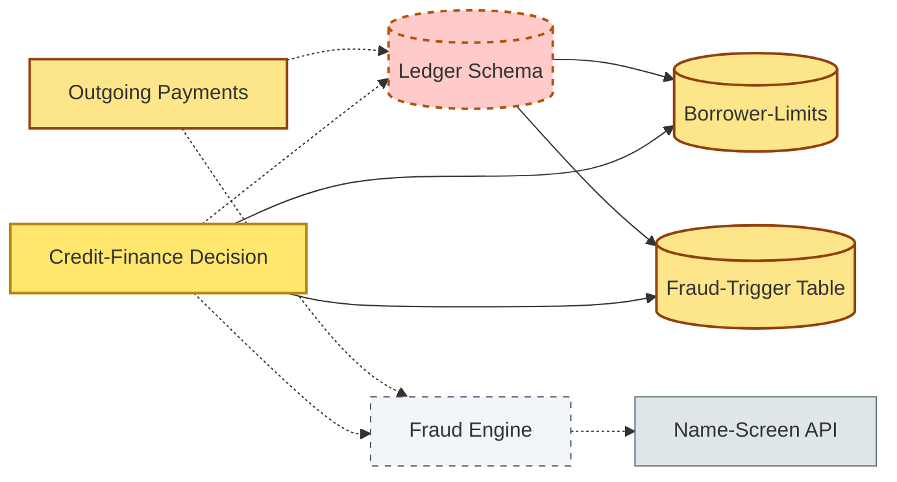
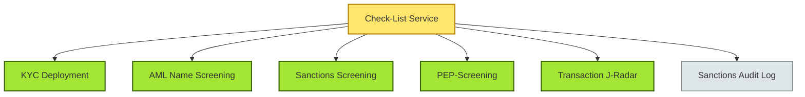
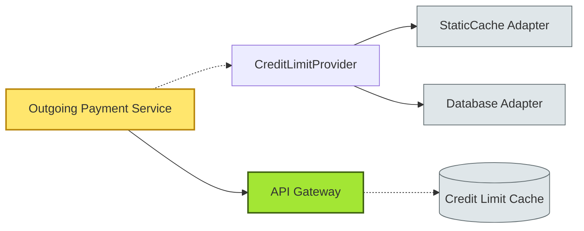

# [C6-03] Coupling & Cohesion — DETAIL

> **Category:** C6 — Design Philosophy & Quality Attributes · **Difficulty:** ◑ · **Banking-relevant:** yes
> **Companion brief:** `[briefs/C6-03-coupling-cohesion.md](../briefs/C6-03-coupling-cohesion.md)`
> **Target reader:** enterprise architect who must *explain, justify, and defend* the topic — not just recite it.

---

## 1. Precise definition

**Coupling** quantifies the strength of inter-module dependence. It is the susceptibility of module A to a change in module B. Coupling is not binary; it exists on a spectrum.

**Cohesion** quantifies how strongly the elements *inside* a module belong together. It is the functional or logical relatedness of the tasks performed by a module.

These definitions mirror Robert C. Martin's 2000 *Agile Software Development, Principles, Patterns, and Practices*: cohesion is a measure of the *directionality* in which abstraction builds; coupling is a measure of the *intrusiveness* of one module into another.

Coupling and cohesion are independent variables. A software ecosystem can exhibit high cohesion / high coupling (a tightly-knit oligopoly), low cohesion / low coupling (a loose federation of unrelated singletons), or the desirable *low coupling / high cohesion*.

## 2. Why it exists (problem it solves)

Before micro-services, the **European retail-banking monolith** model bundled *Retail Banking*, *Corporate Banking*, *Payments*, *Credit Risk*, and *Compliance* into 20,000 classes across 40 WAR files. Coupling was **content** coupled: `PrivateBankService` reached into `ComplianceAudit`'s private fields via reflection to read `auditId`. Any change to the audit schema broke the private-bank end-of-year reconciliation reports.

Cohesion was weak: `TransactionProcessor` handled *capture, clearing, settlement, and rebooking* because the legacy core used the same *transaction table* for all four states. A new *SEPA credit transfer* format required inserting an 11th column; the motivation-less column landed in a table used by 5 services — **stamp coupling** and **data coupling** simultaneously.

The refactor (circa 2016) introduced a *domain event bus* (RabbitMQ) and enforced:
- *Maximum cohesion:* each bounded context owned its own event schema.
- *Minimum coupling:* contexts communicated via *immutable events* with *forward-executable consumers*; no shared schema, no *direct* DAO calls.

## 3. Core concepts & vocabulary

| Term | Precise meaning |
|------|-----------------|
| **Data coupling** | Modules communicate through simple data values (primitives, DTOs). |
| **Stamp coupling** | Modules communicate through a composite object; receiver depends on *entire structure* even if it uses only one field. |
| **Control coupling** | Module A passes a *control flag* to B that causes B to execute one of multiple behaviours. |
| **Common coupling** | Modules communicate through a *global or static* data structure. |
| **Content coupling** | Module A *directly accesses* internal data or code of B (e.g. `A.B.c`). |
| **External coupling** | Module A relies on the *external environment* (hardware, OS, file system) of B. |
| **Adhesion / Coupling-by-Abstraction** | Modules depend on *interfaces* that stay stable; changes to interface *names* or *evolutions* ripple downstream. |
| **Logical cohesion** | Elements are grouped by *category* or *similar kinds* (e.g. `BinaryFileParser`, `MoneyInputStream`, `CryptographicInputStream` in a *generic I/O* library). |
| **Temporal cohesion** | Elements are related by *being executed at the same time* (e.g. *startup* sequence classes). |
| **Communicational cohesion** | All elements contribute to *passing the same data* (e.g. `Sender`, `Serializer`, `NetworkBuffer`). |
| **Sequential cohesion** | Output of one element is input to the next (e.g. `AccountValidator`, `AccountLoader`, `AccountDigester`). |
| **Functional cohesion** | All elements contribute to *one well-defined task* (the gold standard). |

## 4. How it works (architecture / mechanism)

### 4.1 Diagrams

**Diagram A — Coupling map of a payments-and-credit schema (highlight risk = red, context = grey, data = yellow):**



**Diagram B — Cohesion by adjacency of the *Check-List* micro-service (highlight decision = green, ok = light-green):**



### 4.2 Mechanism — reducing data coupling via event sourcing

1. **Identify the coupling:** a legacy `PaymentEngine` directly calls `AccountRepository.getBalance()`.
2. **Introduce an abstraction:** `AccountState` is emitted as an *immutable event* after each mutation.
3. **Signal consumers:** `PaymentEngine` receives `AccountDebited` instead of invoking `getBalance`.
4. **Verify:** a load test shows the *latency* increased by 2 ms; the *availability contract* is still met.
5. **Commit:** `AccountState` schema is now the *single source of truth* for both *payments* and *risk*; duplication is eliminated *by the event ledger*.

### 4.3 Mechanism — improving cohesion by strategic abstraction

1. **Measure current cohesion:** in a *Loan-Origination* service, `KYCValidator`, `CreditBureauPuller`, `ProductEligibilityChecker`, and `DocumentRetriever` all share the same `apply()` method and the *same entity* `Application`.
2. **Refactor:** extract a *pipeline* where each class is a *coherent action sequence* (`validate KYC`, then `pull bureau`, then `check eligibility`).
3. **Result:** each class now passes `Application` downstream via a *fluent chain*; the *chain* is the *relational glue* (sequential cohesion).
4. **Verify with a law-of-metamorphism diagram:** if the *chain* is replaced by a *parallel* executor, the *cohesion boundary* is crossed; revert to sequential.

## 5. Variants, options & trade-offs

| Variant / Axis | When to pick | When to avoid | Key trade-off |
|----------------|--------------|---------------|---------------|
| **Maximal low coupling** | Regulated micro-service mesh with > 15 services | High-frequency trading engine (nanosecond latency) | Amortisation cost of serialization dominates |
| **High situational cohesion** | Domain-driven vertical slices | Generic utility libraries (e.g. *date formatting*) | Over-aggressive; generality is a value |
| **Data coupling (DTOs) vs event coupling (async)** | BI or read-model pipelines | Latency-sensitive fraud detection | Eventual consistency vs real-time scoring |
| **Common coupling (shared object cache)** | In-memory trading cache shared by 3 services | Any service with strict PII isolation | Auditability and GDPR conflict |
| **Content coupling (reflection)** | Legacy monolith forced by API contracts | New green-field project | You *must* decouple to add scaling |

### 5.1 The "too much cohesion" danger

A *compliance* team once created twelve micro-services named `Check1`, `Check2`, ... because each had *perfect* functional cohesion. The result was twelve independent *Kafka topics*, twelve consumer groups, and a *coupling* between *deployment automation* and *ops tooling* that was *higher* than the original monolith. The lesson: **cohesion is a means, not an end**. A module must be functionally cohesive *and* cohesively *deployable* and *observable*.

## 6. Relationships to sibling topics

- **C6-02 (SoC):** High cohesion is the *local* manifestation of SoC; low coupling is the *global* manifestation.
- **C6-09 (ADR):** An ADR from a coupling-reduction initiative should name the *alternative* it rejects (e.g. *content coupling was rejected in favour of data coupling; the alternative would have required schema-orchestration across three pods*).
- **C5 (TDD/BDD):** Cohesion can be measured at the *test-level*: a test-class that exercises only one public method is maximally cohesive.

## 7. Banking / financial-services context 💳

A **Danish mortgage bank** (DaNish Bank) built a *fast-payments-to-securities* bridge.  
- Initially, the *balance-inquiry* service used *direct SQL* to query the shared `account_ledger` table (content coupling). A *regulatory change* to *fair-value accounting* added a *derivative fair-value* column, breaking the payments service.
- Refactored: `AccountLedger` became a *domain event*-sourced aggregate. The *balance-inquiry* consumer now depends on the *event contract*, not the *schema*. The *securities-valuation* service also *consumes* the same event stream.
- **Result:** *content coupling* → *data coupling* (DTO) → *event coupling* (event sourcing). Cohesion of the *balance-inquiry* module improved from *sequential* to *functional*.

A **US retail bank** applied **cohesion** to its *mobile-deposit* flow.  
- Originally, `MobileDepositController` handled camera capture, OCR, validation, and image-retention — temporal/sequential cohesion.
- Refactored into `CaptureService` + `OCRValidator` + `ImageRepository`. Each had *functional* cohesion.
- **Result:** the *security team* could audit *ImageRepository* (storage encryption, retention policy) in isolation without reviewing OCR logic.

## 8. Reference architecture / worked example

### Problem
The *Faster Payments* outgoing service currently depends on `LoanAccountDAO` directly to read the *borrower-limit* before issuing a debit, causing a build-time dependency on the *accounts* schema.

### Decision
1. Extract `CreditLimitProvider` interface into the *shared-gateway* (a hexagonal port).
2. Implement `StaticCacheCreditLimitProvider` for hot paths, `DatabaseCreditLimitProvider` for cold.
3. Inject the provider into `OutgoingPaymentService` via constructor injection.
4. `LoanAccountDAO` is no longer a direct dependency; `CreditLimitProvider` is.

### Diagram


### ADR
```markdown
# ADR-2026-018: Credit-limit decoupling via hexagonal port
## Status
Accepted
## Context
Outgoing Payments Service shares schema with Loan Accounts; schema change forced rebuilds.
## Decision
Introduce CreditLimitProvider interface; inject adapters; isolate direct DAO access.
## Consequences
- Positive: decoupled build; can evolve loan schema independently.
- Negative: latency increase of 3 ms due to extra adapter indirection; acceptable within < 100 ms SLA.
## Alternatives considered
1. Shared schema with abstract facade — rejected (tight coupling persists).
2. Fully separate database with eventual consistency — rejected (operational complexity).
```

## 9. Maturity & adoption signals

- **Adopt when:** (1) dependency-graph analysis (e.g., `npm ls` equivalent for JVM/Python) shows > 15% of classes in *content coupling*; (2) CI builds require > 5 minutes because a test in `AccountsModule` rebuilds `PaymentsModule`.
- **Anti-signals (don't adopt yet):** system is green-field; module count < 3; no release pipeline yet.
- **Common failure modes:**
  1. **Boundary rot:** interfaces evolve unnoticed; downstream consumers break at *run-time* despite CI passing.
  2. **Over-cohesion:** 50 micro-services, each 3 classes; deployment overhead exceeds any benefit.
  3. **Circular coupling:** module A depends on B, B on C, C on A — easy to miss with optimistic reasoning.

## 10. Common confusions — the "don't mix" list

| Often confused | Real distinction |
|----------------|------------------|
| Coupling vs cohesion | Coupling is *between* modules; cohesion is *within* modules. |
| Coupling vs dependency | Dependency is a *name* relationship; coupling is a *strength* relationship. |
| High cohesion as always good | Cohesion is a *local* good; a system of 5 perfectly cohesive but *disconnected* services has **low system cohesion**. |

## 11. Tools & standards to know

- **Standards/Frameworks:** ISO 26262 (automotive FMEA principles); IEEE 1016 (UML for architecture); SAFe 5.0 (features and agile releases map to cohesive features).
- **Common tooling:** NDepend / SonarQube (coupling smell detection); CHACO / Structure101 (dependency matrices); ADR markdown (architecture decision tracking); Confluence / Jira for context.
- **Mandatory reading:** *SICP* (structure and interpretation of computer programs — coupling as absence of shared mutable state), *Clean Code* (R. Martin, Chapter 10).

## 12. ADR template (ready to fill in)

```markdown
# ADR-XXX: <decision>
## Status
Accepted | Proposed | Deprecated
## Context
...
## Decision
...
## Consequences
- Positive ...
- Negative ...
- Neutral ...
## Alternatives considered
1. ...
2. ...
3. ...
```

## 13. Practice — apply it

1. **Recall:** state the six coupling levels from weakest to strongest.
2. **Model:** produce a dependency matrix of your *current* monolith; colour-code red for *content* and *common* couplings.
3. **ADR:** write a decision document removing *common coupling* from a shared static cache in a fraud-detection pipeline.
4. **Defend:** explain to a head-of-payments why *data coupling* is not "just an abstraction layer" but a *blast-radius limiter*.

## 14. Summary (1 paragraph)

Coupling and cohesion are the two dials that define a system's *architectural metabolism*: low coupling plus high cohesion yields a system that can be *tested, deployed, and evolved independently*. In banking, where a change in accounting standards or sanction-list formats can trigger a *material-change* regulatory filing, every *content* or *common* coupling is a *latent operational-risk exposure* that will eventually surface.

---
**Status:** ✅ Covered · **Last updated:** 2026-09-14
