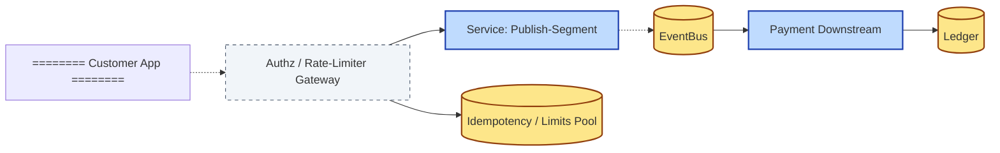

# [C6-04] Quality Attributes — DETAIL

> **Category:** C6 — Design Philosophy & Quality Attributes · **Difficulty:** ● ◑ ◐ · **Banking-relevant:** yes
> **Companion brief:** `[briefs/C6-04-quality-attributes.md](../briefs/C6-04-quality-attributes.md)`
> **Target reader:** enterprise architect who must *explain, justify, and defend* the topic — not just recite it.

---

## 1. Precise definition

A **quality attribute** (QA) is a non-functional requirement describing the system as a whole. The *canonical* nuclear set (derived from the ISO/IEC 25010 + ISO/IEC 41010 frameworks, and the *TechTarget* "-ilities" list) is:

| QA | Core question |
|----|---------------|
| **Availability** | Does the system remain operational? |
| **Security** | Is the system resilient against attack? |
| **Performance** | Does the system meet speed constraints? |
| **Operability** | Is the system observable and diagnosable? |
| **Scalability** | Can the system expand capacity? |
| **Usability** | Can the system be used by its intended users? |
| **Maintainability** | Can the system be modified cheaply? |
| **Testability** | Can the system be validated? |
| **Compliance** | Does the system meet regulatory obligations? |

A **quality-attribute scenario (QAS)** is a concrete spec executable as a test or stale-check. The *QAW* (Quality Attribute Workshop) method by Chris Hofmeister and Paul Clements (1995) defines format:

| Slot | Meaning |
|------|---------|
| **stimulus** | The condition or event that triggers concern |
| **source** | The entity that triggers it |
| **environment** | Conditions under which it triggers |
| **artifact** | The architectural element being exercised |
| **response** | The expected response to the stimulus |

A **strategic QA** (stochastic, open-ended) might be *"the system survives a 3× peak without degraded transactions."* A **tactical QA** (quantitative, closed) is *"99.99% of Faster Payments settle in < 30 seconds under 5× normal volume."*

Banking adds **Regulatory** as a 10th QA because *compliance* is not optional; it is *unit of account* in many scenarios.

## 2. Why it exists (problem it solves)

Before quality-attribute analysis, architects discussed *"our system is scalable"* in vague terms. During the **US Veterans Affairs (VA)** *DeCA* replacement (2014), the JAG concluded that *"failure to test performance"* was a root cause of 1-in-13 veterans being auto-enrolled into debt-collection calls. 

In banking, the **Soros 044 / LIBOR transition** showed that a *seemingly minor* latency change in a *forward rate* service caused *regulatory-reporting* latencies to breach the *ESMA / WM/Reuters* closing window, affecting *trillions* in notional.

Quality-attribute scenarios provide *architectural evidence*:
- They are *archivable* in the *architecture decision record* (ADR).
- They are *testable* in the *default* contract against which a *handoff to operations* is judged.
- They are *reviewable* by a non-technical CRO because the *response* slot is a *number*, not a *subjective* "*good*".

## 3. Core concepts & vocabulary

| Term | Precise meaning |
|------|-----------------|
| **-ilities acronym** | Informal shorthand for the QA set; derived from informal engineering parlance (e.g. *reliability* → *maintainability*); the *full* set is broader than the acronym. |
| **QAS (Quality-Attribute Scenario)** | A 5-slot spec: stimulus, source, environment, artifact, response. |
| **Stochastic scenario** | Response is probability-based (e.g. "with probability 0.999, latency stays below threshold"). |
| **Open-response vs closed-response** | Open: response is qualitative (e.g. "*acceptable*"); closed: response is quantitative (e.g. "*< 50 ms*"). |
| **Syntactic scenario** (Hofmeister) | Reuse of *dynamic sharing* and *role-based* notation from software architecture; a *scenario* models *control-flow* across components. |
| **GISTIC** (Rate, Latency, Throughput, Availability, Remaining-storage, Resistance-to-failure) | A maturity model where QAs are *anticipable, manageable, stable, physical* — each GISTIC dimension maps to QAs. |
| **Tactical vs Strategic** | Tactical QAs are *measurable* (targetable); strategic QAs are *top-level policy* (e.g. *survive a 24-hour outage*). |
| **Metric** | Refinement of a QA into a *quantity* with a *unit* and a *threshold* (e.g. *p99 latency*, *MTTR*). |
| **SCEN (Scenario, Context, Environment, Artifact)** | LAMW refinement: *situation* (who/when), *concern*, *stimulus*, *artifact*, *response*. |
| **NFR (Non-Functional Requirement)** | Broader than QA; includes *regulatory* (e.g. *3-month retention for audit*) and *business-level* (*exit SLA*). |
| **GSS (Goal Structuring Notation)** | Used with GPG to *quantify* intangible qualities; less common in banking but relevant for ESG risk. |

## 4. How it works (architecture / mechanism)

### 4.1 Diagrams

**Diagram A — Quality-attribute scenario map ( ACID-like, highlight critical = amber, decision = green, risk = red):**


**Diagram B — GISTIC maturity map of a net-interest-rate platform ( highlight ok = light-green, data = yellow):**

```mermaid
graph LR
    classDef critical fill:#ffe66d,stroke:#b8860b,stroke-width:2px
    classDef ok fill:#a7f3d0,stroke:#065f46,stroke-width:2px
    classDef data fill:#fde68a,stroke:#92400e,stroke-width:2px

    RA[Rate (currency multiplier)]:::ok
    VO[Volume (parallel heartbeats)]:::ok
    TI[Throughput (TPS)]:::ok
    AV[Availability (active-active infra)]:::ok
    RO[Remaining-storage (ledger archive)]:::ok
    RM[Resistance-to-failure (multi-AZ, multi-reg)]:::ok

    classDef risk fill:#fecaca,stroke:#991b1b,stroke-width:2px
    classDef boundary fill:#f1f5f9,stroke:#475569,stroke-dasharray: 5
```

### 4.2 Mechanism — deriving scenarios from regulations

1. **Identify a statutory instrument:** e.g. *PSD2 SCA* requires *strong customer authentication* with *effective* challenge-response.
2. **Map to QA:** *Security* (authentication) + *Availability* (must not block all payments during an adaptive challenge).
3. **Write stimulus-source-environment:**  
   - *Stimulus:* "Challenged customer exceeds adaptive-response threshold."  
   - *Source:* "Payment initiation service."  
   - *Environment:* "Fallback channel is inactive; only App-Browser channel."  
   - *Artifact:* "AuthenticationOrchestrator."  
   - *Response:* "Fails CFP (Customer Financial Profile) with GRPC error; logs audit event; alerts ops."
4. **Derive test:** fail the *AuthenticationOrchestrator* in CI and assert the *response*.

### 4.3 Mechanism — strategic QA → tactic QA

1. **Strategic:** "System must survive a 24-hour AZ failure without customer-facing degradation."
2. **Tactical 1 (Availability):** "Data-plane services must auto-failover to a secondary AZ in < 45 seconds."
3. **Tactical 2 (Performance):** "Trade-Price-Capture pipeline must continue ingesting at *baseline* rate from secondary AZ."
4. **Tactical 3 (Operational):** "Runbooks must document AZ-failover for each *domain* within 15 minutes."
5. **Tactical 4 (Security):** "Secrets in secondary AZ must be *sync'd* from primary; rotation at < 60 minutes."

## 5. Variants, options & trade-offs

| Variant | When to pick | When to avoid | Trade-off |
|---------|--------------|---------------|-----------|
| **Tactical only (numbers)** | Vendor RFP with defined SLAs | New green-field with no baselines | Caller must anchor "baseline" |
| **Strategic-only (policy)** | Board-level governance | Implementation planning | Not directly testable |
| **Tactic + Strategy (both)** | Regulated bank with CRO sign-off | Very small team; scope creep risk | More documentation; better alignment |
| **BA + P | Business-accessability + Performance | Capital-markets HFT (latency-only) | Usability needs in all other domains |
| **GISTIC addition (risk key)** | Survival-risk BA (DORA) | Consumer-banking; risk less of an issue | Mutates QA taxonomy; team must know GISTIC |
| **BACC (Business, Actor, Context, Concern)** | Legacy micro-service with poor docs | Greenfield with good upstream | Still ambiguous; less precise than QAW |

## 6. Relationships to sibling topics

- **C4 (Architecture Patterns):** Patterns (e.g. *Strangler Fig*, *Saga*) exist *because* tactical QAs drive them.
- **C5 (Testing):** QAs formalise *what* to test; TDD/BDD formalise *how* to verify.
- **C6-07 (Maintainability):** Maintainability is a QA; if it is silent in the scenario list, the team will optimise *performance* and *security* at the expense of *maintainability* (the classic *scalability vs maintainability* knife-edge).
- **C6-08 (Tech Debt — ADRs):** Every *unmeasured* QA is an *implicit assumption* that becomes *tech debt*.

## 7. Banking / financial-services context 💳

A **German Sparkasse** needed to migrate its *mortgage-to-move* platform to the cloud.  
- **Strategic QA:** "The system must survive a simultaneous SLA breach in two AZs without material financial exposure."
- **Derived tactical:**
  - *Availability:* data-plane < 45 s failover
  - *Security:* TLS 1.3 + mutual auth to all internal gRPC
  - *Regulatory:* *BaFin* requires *20-year* immutable *interest-rate history*; maintain that in an *object store* with *WORM*
  - *Performance:* *p99* balance-inquiry < 200 ms under 10× Black-Friday
- **Architectural decision:** Adopt *multi-active* deployment across *Frankfurt* and *Munich* AZs; *event-sourced* interest-rate ledger stored in *S3 with Object Lock*; *side-car* circuit-breaker at the *deposit-service* gateway.

A **Brazilian neobank** (Nubank-type) used quality-attribute scenarios in a *Risk-Assessment-as-a-Service* product.  
- *Open QA:* "Users must receive a credit-limit decision in under 500 ms."
- *Closed QA:* "Under 1,000 concurrent synthetic-user load testing, 99.9% of credit-limit responses returned < 400 ms."
- *Architecture:* *resilience-4j* + *Hystrix* at every external *Bureau API* call.

## 8. Reference architecture / worked example

### Problem
A UK challenger bank must meet *PSD2 + FCA* requirements for a *real-time funds-transfer* API while also supporting a *Black-Friday* 5× throughput peak.

### Decision
1. **QAW workshop** with 4 roles: *SRE, Security, Product, Compliance*.
2. **Strategic QAs:** *survival* (DORA), *availability* (24/7), *security* (PSD2 SCA + PCI-DSS).
3. **Tactical QAs derived:**
   - *Stimulus:* 5× concurrent transfers.
   - *Source:* Open-Banking PSD2 inbound.
   - *Environment:* Black-Friday + market-close volatility.
   - *Artifact:* PaymentInflightRepository + ChannelManager.
   - *Response:* p99 latency < 50 ms, 99.99% success, no PII in logs.
4. **Architecture:** *event-sourced* ledger with *outbox* pattern; *side-car* rate-limiter; *multi-AZ* Kafka; *idempotency* keys.

### Diagram


### ADR
```markdown
# ADR-2026-020: DORA-aligned QA targets for real-time transfer
## Status
Accepted
## Context
FCA/DORA requires > 99.99% availability for critical payment channels; Black-Friday is a 5× load peak.
## Decision
Multi-AZ event-sourcing with outbox; side-car idempotency; PII-redacted audit logging.
## Consequences
- Positive: meets DORA "four-hour recovery" and FCA "continuous availability".
- Negative: operational complexity of multi-AZ; latency increase of 2 ms per hop.
## Alternatives considered
1. Single-AZ monolith with horizontal scaling — rejected (no disaster recovery).
2. 3 separate micro-services across separate data centres — rejected (cross-DC latency > 5 ms).
```

## 9. Maturity & adoption signals

- **Adopt when:** (1) a *QAW* workshop is held *before* vendor selection; (2) every *epic* in Jira has ≥ 1 QA scenario; (3) *SRE* owns a *SLO dashboard* tied to *quality attributes*.
- **Anti-signals:** QA list exists only in a *Confluence* page that no team references; "architecture" is only a *diagram file*.
- **Common failure modes:**
  1. **Vague QAs:** "fast" or "secure" without numbers — reviewed out of scope.
  2. **Single-QA optimiser:** tuning for *performance* breaks *availability*.
  3. **QA-creep:** adding *too many* QAs until every decision is blocked.

## 10. Common confusions — the "don't mix" list

| Often confused | Real distinction |
|----------------|------------------|
| Quality attribute vs non-functional requirement | QA is a *canon* (7-10 items); NFR is *broader* and includes *usability*; QA is *testable* in the sense of *scenario*; NFR can be *policy*. |
| Strategic vs tactical | Strategic is *qualitative, high-level* (Gistic); tactical is *quantitative, measurable* (targetable). |
| Scenario vs use-case | A scenario is *a stimulus-response*; it is *not* an actor-goal. A use-case is *actor-centric*; a scenario is *architecturally-centric*. |

## 11. Tools & standards to know

- **Standards/Frameworks:** ISO 25010 (system and software quality models); ISO 41010 (building construction); DORA (digital operational resilience); SOX (US); PCI-DSS v4.0; PSD2; GDPR Art. 32.
- **Common tooling:** *Veneer* (QA scenario tracker), *JIRA* (user stories with QA tag), *Datadog* SLI/SLO dashboards, *GPG* models, *Archi* EA.
- **Mandatory reading:** *Software Architecture in Practice*, 3rd Edition (Bass, Clements, Kazman); *Re*-ATAM (for QAW workshops); *TCR* (for banking-specific * regulatory-compliance * QAs).

## 12. ADR template (ready to fill in)

```markdown
# ADR-XXX: <decision>
## Status
Accepted | Proposed | Deprecated
## Context
...
## Decision
...
## Consequences
- Positive ...
- Negative ...
- Neutral ...
## Alternatives considered
1. ...
2. ...
3. ...
```

## 13. Practice — apply it

1. **Recall:** name the *seven* nuclear QAs.
2. **Model:** produce a *scenario map* for a *mortgage-approval* flow: stimulus = "application submitted"; source = "customer portal"; artifact = "CreditDecisionService"; response = "approved / declined with reason."
3. **ADR:** write a scenario-driven ADR for keeping *fraud-screening* inside the *onboarding* service vs extracting it.
4. **Defend:** explain to a CTO why *availability* is not enough without *operability*; use the *median MTTR* argument.

## 14. Summary (1 paragraph)

Quality attributes are the *lingua franca* between engineering, product, risk, and regulators. They transform *"the system should be fast"* from a *marketing claim* into a *testable contract* that a CRO can point to in a crisis.

---
**Status:** ✅ Covered · **Last updated:** 2026-09-14
