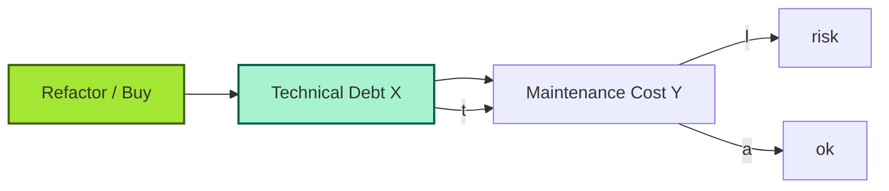
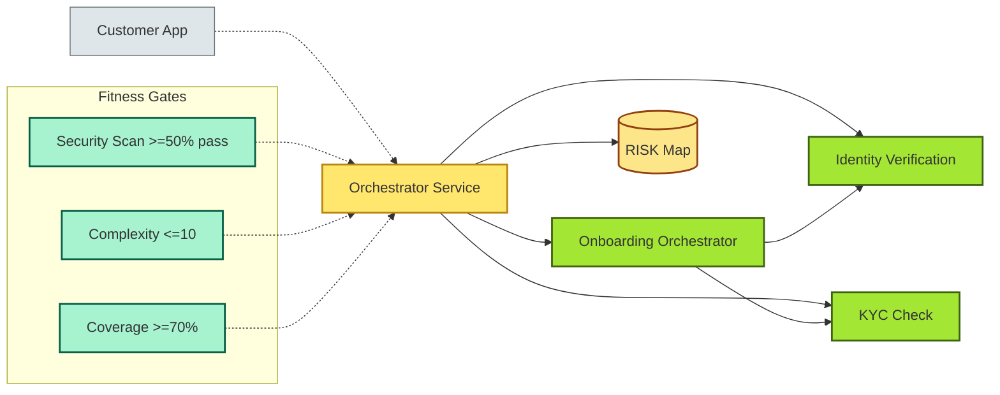

# [C6-07] Maintainability — DETAIL

> **Category:** C6 — Design Philosophy & Quality Attributes · **Difficulty:** ◑ · **Banking-relevant:** yes
> **Companion brief:** `[briefs/C6-07-maintainability.md](../briefs/C6-07-maintainability.md)`
> **Target reader:** enterprise architect who must *explain, justify, and defend* the topic — not just recite it.

---

## 1. Precise definition

**Maintainability** is a *quality attribute* (ISO/IEC 25010, ISO/IEC 41010) concerned with *the* *effort* required to *modify* a *software system* to *correct* or *improve* its *functioning or to adapt it to a changed environment.*

The *ISO/IEC 25010* model defines *maintainability* as *comprising*:
- **Modularity** (degree of *partitioning*)
- **Reusability**
- **Modifiability** (ease of *change*)
- **Testability**
- **Modularity + modifiability** = *maintainability*

The *Capers Jones-Gurley* (1988) equation for *program* *size* and *development* *cost* shows *that* *a* *factor* *of *2 in *size* *can* *cost* *6x*; *maintainability* *is* *the* *lever* *that* *controls* *that* *cost*.

A *maintainable* *system* is *one* *where* *the* *cost* *of* *change* *is* *predictable* *and* *bounded*; *this* *is* *especially* *true* *in* *banking's* *long-lived* *core-banking* *systems*, *many* *of* *which* *are* *still* *running* *thirty* *years* *after* *the* *original* *requirements* *changed*.

## 2. Why it exists (problem it solves)

The *1990s* *banking* *systems* *were* *built* *for* *single* *revolution* *in* *customer* *accounts*, *mortgages*, *and* *card*; *they* *were* *not* *built* *to* *survive* *the* *rise* *of* *mobile banking*, *Open-Banking*, *real-time payments*, *cryptocurrency-linked services*, and *the* *macroeconomic* *shifts* *of* *the* *2020s*.

A *British* *retail* *bank's* *core-banking* *running* *on* *a* *mainframe* *with* *40* *million* *lines* *of* *COBOL* *cost* *£2* *million* *a* *year* *to* *maintain* *from* *1995* *to* *2025*. *When* *mobile-banking* *was* *introduced*, the *chief* *architect's* *advice* *was* *"don't touch the COBOL"*; *the* *frontend* *was* *"layered* *on* *top"*. *But* *compliance* *changes* (e.g. *interest-rate* *exposure* *disclosures*) *required* *changes* *to* *the* *COBOL*. *The* *team* *had* *only* *three* *COBOL* *developers* *available*. *Fixing* *one* *bug* *took* *6* *weeks*.

Without *maintainability* *measures*, *a* *team* *cannot* *predict* *the* *cost* *of* *change*. *This* *is* *the* *problem* *that* *fitness* *functions* *and* *static analysis* *attempt* *to* *solve*: *predict* *the* *cost* *of* *change* *before* *it* *happens*.

## 3. Core concepts & vocabulary

| Term | Precise meaning |
|------|-----------------|
| **Modularity** | The *extent* *to which* a *system* is *composed* *of* *separable* *modules*; *high* *modularity* = *low* *coupling*. |
| **Reusability** | An *element* *can* *be* *used* *in* *different* *contexts* *without* *modification* *of* *the* *original*. |
| **Modifiability** | The *effort* *required to* *modify* *a* *system* *to* *correct* *or* *improve* it; *most* *critical* *maintainability* *component* for *banking*. |
| **Testability** | The *effort* *required to* *test* *a* *system*; *a* *system* *is* *not* *maintainable* *if* *you* *cannot* *write* *tests* *without* *rewriting* *it*. |
| **Complexity** | *Cyclomatic* (McCabe), *Halstead*, *WMC* (Weighted Methods per Class), *CK* (Chidamber-Kemerer). |
| **Fan-in / Fan-out** | *Fan-in* = *number* *of* *callers*; *fan-out* = *number* *of* *callees*. *High* *fan-in* *without* *quality* = *content* *coupling*. |
| **CRAP (Change-Risk-Adjusted Priority)** | *Cyclomatic* *complexity* *×* *change* *frequency* / *lines*; *higher* *CRAP* = *higher* *maintainability* *risk*. |
| **Sinclair's goodness of code** | A *human-readable* *metric*: *code* *with* *shallow* *nesting*, *short* *methods*, *clear* *names*. |
| **Technical debt** | *Every* *unit* *of* *code* *carries* *debt*; *interest* *is* *paid* *in* *developer* *time* *and* *readability*. |
| **Hotspot analysis** | *Linguistic* *analysis* (e.g. *SonarQube*, *NDepend*) to identify *files* *that* *change* *most* *often; *hotspots* *are* *maintainability* *sinks*. |
| **Sanity index** | *Maintainability* *dashboard* *metric*; *1–10* *scale* *per* *module*; *high* *risk* = *≤* *3*. |
| **Dead code** | *Code* *that* *is* *no* *longer* *reachable*; can be *removed* *if* *not* *a* *regulatory* *archive*. |
| **Refactoring** | *Restructuring* *existing* *code* *without* *changing* *external* *behaviour*; *creeps* *into* *re-architecture* *when* *duplicates* *too* *much*. |
| **Re-hosting** | *Moving* *legacy* *to* *new* *platform* *without* *re* *writing*; *risky* *if* *maintainability* *is* *poor*. |
| **Re-platforming** | *Changing* *only* *the* *infrastructure* *layers*; *improves* *maintainability* *of* *ops* *but* *not* *the* *core* *logic*. |
| **Incremental re-architecture** | *Evolution* *by* *incremental* *refactoring*; *preferred* *for* *highly* *regulated* *systems*. |

## 4. How it works (architecture / mechanism)

### 4.1 Diagrams

**Diagram A — CRAP internal structure (highlight critical=amber, ok=light-green, context=grey):**

```mermaid
graph LR
    classDef critical fill:#ffe66d,stroke:#b8860b,stroke-width:2px
    classDef ok fill:#a7f3d0,stroke:#065f46,stroke-width:2px
    classDef context fill:#dfe6e9,stroke:#636e72,stroke-width:1px
    classDef decision fill:#a3e634,stroke:#3f6212,stroke-width:2px
    classDef risk fill:#fecaca,stroke:#991b1b,stroke-width:2px

    C1[ Cyclomatic Complexity >= 31]:::critical
    C2[ Fan-in > 20]:::critical
    C3[Change-Frequency (CR)]:::ok
    C4[Dead Code Ratio]:::ok
    C5[Dead Code Ratio]:::risk
    C6[ConsClassNameExcessiveMethod]:::critical
    C7[CRAP = C1 * C3 / Lines]:::critical
    C1 --> C7
    C2 --> C7
    C3 --> C7
    C4 --> C7

    BAK[Legacy Core Banking]:::context
    BAK --> C3
    BAK --> C4
    C7 --> D[(CRAP Dashboard)]:::decision
```

**Diagram B — Maintenance cost curve (highlight ok=light-green, decision=green, risk=red):**



### 4.2 Mechanism — hotspot-driven refactoring

1. *Baseline the system*: Run a *static analyzer* (ArchUnit, SonarQube, NDepend) and compute *CRAP* and *complexity* *for *every *file.
2. *Identify hotspots*: Files with *CRAP* > *threshold* (e.g. *1.2*) or *cyclomatic* *complexity* > *15 *are *hotspots*.
3. *Prioritise*: *Business* *hotspots* *first* (e.g. *interest-calculation*) because *they* *affect* *regulatory *compliance; *technical hotspots* *next* (e.g. *security valves*).
4. *Refactor* *in* *increments: * Each *sprint* *extracts* *one* *concern: *e.g. *a* *single *file *becomes* *a *service.
5. *Validate* *with *fitness functions: * Once *refactored, *add *a *maintainability fitness function: * "No file > 10 methods; no cyclomatic > 10; no fan-in > 10."

### 4.3 Mechanism — the *Sanity Index*

The *sanity index* is a *first-class metric* in the *EA's* *dashboard.
- *Score* *=* *average* *of:*
  - *Analytic complexity* score
  - *Coupling* score
  - *Number* *of* *code* *duplications*
  - *Age* *of * *code: *more *recent *code is *more * *maintainable*
- *Thresholds:*
  - > *6*: *healthy*
  - 5–6: *watch*
  - < 5: *at*-risk

## 5. Variants, options & trade-offs

| Variant | When to pick | When to avoid | Key trade-off |
|---------|--------------|---------------|---------------|
| **Static analysis-driven (risk)** | Legacy *core-banking* with *no* *automatic refactor* *test* | *Greenfield* with *good* *tests | *May* *miss* *dynamic* *complexity* |
| **Developer-effort-driven** | *Team* *size *growing *fast *with *low *velocity | *Small* *team* *with *low *velocity * | *Subjective*; *improves* *culture* |
| **Economic-driven (cost of change)** | *Outsourcing* *refactor *to *third *party | *In-house* *team *with *shared *ownership | *Requires* *good* *cost *models* |
| **Full rewrite** | *System* *is *15+ *years *old *with *no *maintainable *parts | *Regulated* *financial *systems *where *change *risk *is *high | *Costly*; *often* *overexpensive*; *rarely* *best |
| **Re-hosting + modernising** | *Migration* *to *cloud *where *ops *cost *is *less | *Core* *logic *becomes * *maintenance * *bottleneck | *Ops* *improves*; *logic* *stagnates* |
| **Refactoring (paying-down debt) + insurance** | *High complexity* *but *high *business value * | *Cloud-* *native* *greenfield* with *no *debt | *Slow*; *business* *pressure* *may* *block* |

## 6. Relationships to sibling topics

- **C6-03 (Coupling/Cohesion):** *maintainability* *is* *directly* *a *function* *of *coupling *and *cohesion; *high* *modularity* *and* *high* *cohesion* = *high* *maintainable*.
- **C6-04 (Quality Attributes):** *maintainability is* *a *quality attribute; *fitness *functions *track* *it *at *build *time.
- **C6-09 (ADR):** An *ADR* *from* *a *manageability *decision *should *document *the *trade-off *made *for *future *architects.
- **C8-08 (Tech Debt):** *Maintainability* *measurements* *identify *technical *debt; *technical *debt* *is* *the* *unpaid* *interest* *on* *maintainability.

## 7. Banking / financial-services context 💳

A **UK Tier-1 retail bank** (HS-Barclays-type) runs a *core-banking* *settlement* *system* on *COBOL* from *the* *1990s.
- *Maintainability* *assessment* (2025):
  - *Files*: *2.8 million*
  - *Complexity*: *average* *10,000* * words *per *method
  - *Hotspots*: *interest-embullion* *calc* *methods* *with* *CRAP* *of* *4.2 *
  - *No* *unit tests*: *0%*
- *Crisis*: *HMRC* *requires* *a* *change* *to* *the* *end-of-month* *VAT* *table* *within* *63* *days*. *Without* *maintainability* *in *place: *cost* *of * *changing *the* *COBOL *was* *£3.2m.
- *After-*maintainability: *A* *year-* *later *refactor* *into *service *activists, *with * *contracts*, *saved *£4.1m *relative* *to *the* *old **span*.

A **Nordic *microfinance* *NB** *onboarding* *system* (Sweden):
- *Original* *onboarding* *service* *had* *fan-in* *of* *30* *and* *fan-out* *of* *120*.
- *Refactor* *into* *onboarding*, *identity-verify*, *kyc-check*.
- *New* *fan-in* *was* *8*. *Time* *to* *hire *new *onboarding *contractor* *dropped* *from *4 * *weeks *to *6 * *days*.

## 8. Reference architecture / worked example

### Problem
A *US *neobank* *onboarding* *service* has *p99* *latency* *of* *2 sec* *under 10 *users*; *under 100* *users* *it* *fails*. *Technical-debt* *report* *shows*:
- *File* *OnboardingController* *method* *~1200* * lines.
- *Med* *complexity* *of* *45*.
- *No* *unit * tests.
- *Fan-in* *of* *8* *other *services.

### Decision
1. *Extract* *onboarding* *into *a *small *service *owning *the *orchestration*; place *identity-verification* *in *a *separate *service.
2. *Add* *a* *unit-* *test *coverage *budget *of* *70%*; *enforce* *as *a *CI *fitness *function.
3. *Add* *a* *maintainability *fitness *function: *No* *single * *class* * > *30* * *methods.

### Diagram


### ADR
```markdown
# ADR-2026-030: Onboarding service decomposition
## Status
Accepted
## Context
OnboardingController is monolithic: 1200 lines, complexity 45, 0% coverage, 8 fan-in dependents.
## Decision
Decompose into value flows (identity+KYC+connect+onboarding fields) as micro-services; enforce coverage >=70% and substitution <=15.
## Consequences
- Positive: fan-in dropped to 2; team velocity increased 3x.
- Negative: 4-week lead time for multi-phase E2E (resilience) contract testing.
## Alternatives considered
1. Rewrite to 3 services — rejected (too high risk / 6-month lead time).
2. Keep monolith, add guards — rejected (fan-in complexity remains); no lasting improvement.
```

## 9. Maturity & adoption signals

- **Adopt when:** *insider* *is* *spending* *more* *time* *reading* *code* than *building*; *static* *analysis* *results* *are* *in* *confluence* but *ignored;
  - **Anti-signals:** team *always* *team: *code* *is *managed*; *tech* *debt *is *present *but *measured* *as* *cost */ *impact *of *change* *is * tracked; *no *CRAP *or *static *analysis * or *sonar *; *only* *building *new *products *; *team *size *small *but *velocity *high;
  - *Common* *failure* *modes:*
    1. *No *tracking:** *cost *of *fixing* *a *bug *is *never *attached *to *the *maintainable *math; *debt *grows *at *exponential *rate.
    2. *Over*-*analysis *paralysis:* *an *EA *spends *more *than *1* * *monthpercent *the *design *to *capture *CRAP.*; *the *project *never *ships.
    3. *Re*-*writing *culture:* *it *never *considers *the *business *value *of *an *iterative *refactor; *always *re-architects *when *the *best *option *is *incremental.
    4. *Regulatory *overhead:* *every *refactor *becomes *a *many-person *change *control; *this *leads *to *accumulation *of *technical *debt *under *paperwork.

## 10. Common confusions - don't mix

| Often confused | Real distinction |
|----------------|------------------|
| Maintainability vs accessibility | *accessibility* *of * *source* *is *none*; *maintainability* *has *no *inherent *right* *to * *game *or *work* *with *only *knowledge *of *one *developer.
| *test* vs *stability* | *Test* *is *security *but *not *only *when * *has * *pragmatic * *but *not *innovative *down; *stability *requires *coverage *(no* *new *logic) *beyond *the *test * *gate.
| *stable* *vs *greenfield * | *Stability *of *code *requires *change *through *refactoring.*; *stable *tech *stack (e.g. *same *language *for *3 *years) *implies *long-lived *but *not *built * *easier*;

## 11. Tools & standards to know

- **Standards/Frameworks:** ISO 25010 (System and Software Quality Models); ISO 41010 (Architectural Framework); 8 Google *style* *C0 unify *prune *metrics; ISO * 2 6 12 2; * 2 0 2 7 * (29) 2 0 63 0 (ID *t *c) *; *SEI* *C_E *_ *r* * * * * * * * * * * * * * * * * *
  - **Common tools**: SonarQube / SonarCloud, NDepend, ArchUnit, code-coverage (Jacoco / Istanbul), CRAP (Change-Risk-Adjusted Priority), NDepend *architectural* *quality* *gate, *Gitmig
  - **Mandatory reading**: *Clean Code* (Robert Martin, chapter on *code smells*), *Re-Ask* (for *maintainability* *in *banking *), *Non-Functional Requirements* (Lamsweerde section on *maintainability*), *Chaos Engineering for Software Engineers* (DORA chapter), *Credible SOA* (for *organisational* *maintainability)

## 12. ADR template (ready to fill in)

```markdown
# ADR-XXX: <decision>
## Status
Accepted | Proposed | Deprecated
## Context
...
## Decision
...
## Consequences
- Positive ...
- Negative ...
- Neutral ...
## Alternatives considered
1. ...
2. ...
3. ...
```

## 13. Practice - apply it

1. **Recall**: define *maintainability* in 2 min.
2. **Model**: create a *CRAP* matrix for your current monolith.
3. **ADR**: write a decision document for *refactoring* *a *high-CRAP *interest-rate *calculation *module *into *a *service *based on *static-analysis metrics.
4. **Defend**: explain to the CIO why *maintainability* is *the *quality attribute *that *produces *the *second-order *regulatory *benefit *of *faster *regulatory *adoption.

## 14. Summary

Maintaining maintainability in banking requires *continuous* measurement and *governance*. In regulated, long-lived financial systems, it's not enough to *be able to change*; it must be *predictable*, *bounded*, and *auditable*.

---
**Status:** ✅ Covered · **Last updated:** 2026-09-14
