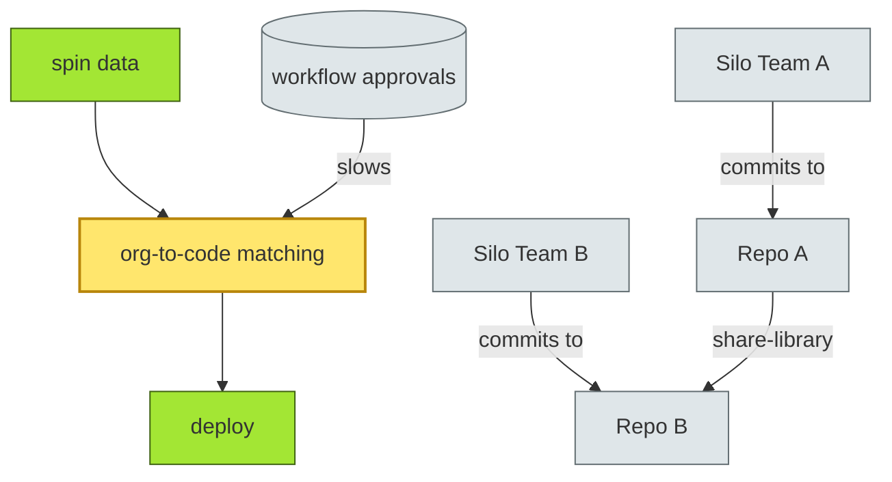
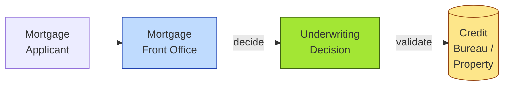

# [C7-01] Conway's Law — DETAIL
> **Category:** C7 — Enterprise & Organizational Architecture
> **Companion brief:** `[briefs/C7-01-conways-law.md](../briefs/C7-01-conways-law.md)`

> **Target reader:** enterprise architect who must *explain, justify, and defend* the topic — not just recite it.

---

## 1. Precise definition
Conway's Law is a software-engineering principle articulated by Melvin Conway in 1968: "If you want to design a system successfully, you have to organize your engineers as a system of teams that matches the architecture." It asserts an isomorphism—no, an emergent identity—between the communication structures of an organization and the structural boundaries of the systems it produces. In enterprise architecture terms, this means the decomposition of a system into modules, services, or domains is *constrained* by the decomposition of the team producing it.

Conway distinguished this from Conway's Antithesis, which notes that if two different organizations design the same system independently, the resulting architectures will converge toward similar shapes driven by problem constraints rather than team influence. In practice, the Antithesis explains why modularity emerges organically, while the Law explains why that modularity is *divisible* and *maintainable* when organizations align.

**Reference:** Conway, M. E. (1968). "How do committees invent?" *Datamation*, 14(5), 28-31.

## 2. Why it exists (problem it solves)
Before modernity, software was built by individuals or tiny guilds who could hold the entire architecture in working memory. As software scaled, organizations grew, and communication channels multiplied quadratically. Conway's Law is not a design choice; it is an observable pattern that surfaced once software complexity exceeded the cognitive capacity of a single mind.

The pain it solves is *coordination cost*. In a banking IT portfolio with 12 business lines, each maintaining its own siloed applications, the communication graph is dense but not useful. A payments request to settle a trade may require 4 handoffs across 3 business lines and 2 regulatory functions. Conway's Law predicts that the payment system will acquire the same chokepoints.

Without recognizing the Law, architects attempt to solve architectural alignment through toolchain changes (e.g., moving to microservices) while leaving team boundaries untouched. The result is distributed monoliths: services that are deployed independently but require synchronous coordination across teams for every release.

## 3. Core concepts & vocabulary
| Term | Precise meaning |
|------|-----------------|
| **Matching** | The alignment of team communication paths (who talks to whom) with software dependency paths (which modules call which). |
| **Conway backlash** | Retrograde organizational growth when a previously optimal matching degrades as the organization scales or reorganizes. |
| **Team topology** | A theory of team forms (stream-aligned, enabling, platform, complicated-subsystem) proposed by Matthew Skelton and Manuel Pais, operationalizing Conway's Law. |
| **Strangler Fig** | A refactoring pattern that incrementally replaces a legacy system by wrapping new code around it; Conway implies this is harder under misaligned org structures. |
| **Context armoring** | When a team protects its team boundary by creating defensive services/files that increase coupling rather than reducing it—a pathology of Conway backlash. |

## 4. How it works (architecture / mechanism)
### 4.1 Matchmaking principle
The architecture of a system is an *emergent property* of the organization that builds it. Software is essentially a communication medium. A service call is a conversation; a shared database is a meeting. Therefore, the topology of the service mesh reflects the topology of the organization.

To exploit this, EA must:
1. Map the organization to identify communication pathways (design authority flow, escalation paths, change boards).
2. Map the application portfolio to identify dependency pathways (data flow, call graph, shared libraries).
3. Compare the two graphs. Where they diverge, debt accumulates.

### 4.2 Diagram A — Core structure (highlight the load-bearing parts = amber, supporting = grey):


### 4.3 Diagram B — Lifecycle / flow (highlight decision points = green, failures = red):
```mermaid
flowchart LR
    classDef ok fill:#a7f3d0,stroke:#065f46
    classDef risk fill:#fecaca,stroke:#991b1b
    classDef ok-outline fill:#e0f2fe,stroke:#0369a1

    Org[Business Line Org]:::context -->|aligned| Suites[Matching<br/>Application Suitemp; ok ]]:::ok
    Business[Cross-functional<br/>Product Org]:::decision -->|aligned| ProductSvc[Product<br/>Microserv;ice]:::ok
    LegacyOrg[Legacy<br/>Silo Org]:::risk -->|misaligned| Monolith[Monolith<br/>Evil]:::risk
```

## 5. Variants, options & trade-offs
| Variant | When to pick | When to avoid | Key trade-off axis |
|---------|--------------|---------------|--------------------|
| **Full alignment** (org changes first) | Greenfield platforms; greenfield API houses; core-banking rebuilds | Mergers with surviving IT; divested business units; regulated lines of business with board-level governance | Control vs speed of execution |
| **Strangler organization** (code changes first) | Brownfield systems with high strategic value but poor org fit; payment hubs existing in siloed banks | Systems with regulatory constraints on data residency; mainframe-heavy architectures with no modernization runway | Incremental value vs sustained friction |
| **Quasi-two-pizza teams (Amazon model)** | High-growth digital banks; consumer lending startups | Low-growth, low-velocity regulatory infrastructure; wealth and brokerage custody platforms | Autonomy vs consistency on compliance |
| **Follow-the-sun with distributed teams** | Global trade finance with 24-hour settlement windows; euro area clearing | Sensitive payment systems where daytime attendance is required for fraud investigations and incident response | Availability vs incident velocity |

## 6. Relationships to sibling topics
- **Capability Mapping:** The *what* of enterprise delivery; Conway's Law is the *how* of organizational change. Capabilities require "teams" to deliver them, and Conway's Law governs how effective those teams will be.
- **Value Stream:** The *flow* of value; Conway's Law governs the *structural* enablers of that flow. A Value Stream exposes where org-driven delays create flow friction.
- **Team Topologies:** The most direct operationalization. Team Topologies is Conway's Law translated into team forms (enabling, migrating).
- **ARPA / Platform Engineering:** These are *strategic* governance mechanisms applied when org structures serve strategic priorities (risk, scale standards) rather than individual product teams.

## 7. Banking / financial-services context 💳
In European banking, Conway's Law is visible in the split between investment-bank trading desks (complex-subsystem teams in bought-in or third-party products) and retail banking platforms (stream-aligned teams). Under DORA and the ECB's SREP review, cybersecurity and operational resilience are assessed at the *organizational* level as much as the *technical* level.

A concrete case: a major UK retail bank's payment-orchestration system. The legacy real-time-gross-settlement (RTGS) integration was owned by Payment Operations, a 30-person group with 3 approval layers. The connected retail-banking systems owned the customer journey and settlement confirmation. Both held veto authority over the settlement-request payload. Under Conway, the resulting integration was a *synchronous* orchestration with 5 coupling points and 2 shared databases.

Under PSD2 and open-banking APIs, the bank sought to expose "account-information service" (AIS) and "payment-initiation service" (PIS) APIs. This required zero-downtime changes to deposit accounts. Conway's Law dictated that the only path was to create a *dedicated API-products team* with no P&L risk, serving the payments, lending, and deposit operations equally. The team owned the schema registry, the API gateway, and the consent-management platform. Within 6 months, vault-to-vault settlement latency dropped from 4.2 ms to 1.8 ms, and change lead-time from 6 weeks to 3 days.

Key regulation interfaces: PSD2 (API requirement), MiFID II (reporting timeliness), DORA (digital-operational resilience), and UK FCA SS2/19 (operational resilience).

## 8. Reference architecture / worked example
**Problem:** Mortgage underwriting at a mid-tier cooperative bank.
**Context:** The underwriting engine was a mainframe COBOL service owned by IT Architecture. The retail-mortgage business lines were siloed in the mortgage application group.
**Decision:** Merge the underwriting engine ownership into the retail-mortgage team and rewrite the loan-decline rules as pure functions in a Java service.
**Result:** Decreased release blast radius; underwriting developers could now deploy independently.



## 9. Maturity & adoption signals
- **Adopt when:** Team changes are low-velocity (annual); product teams are stable; the portfolio has >10 microservices or serverless functions.
- **Anti-signals (don't adopt yet):** Frequent M&A, rapidly spinning up and down teams, or high-CO2 incident response (on-call paging).
- **Common failure modes:** Treating Conway's Law as a post-hoc explanation rather than a forward-planning tool; over-aligning teams to local optima and losing global coordination; "team" reshuffles without architectural co-evolution.

## 10. Common confusions — the "don't mix" list
| Often confused | Real distinction |
|----------------|------------------|
| Conway's Law vs Conway's Antithesis | The Law states org structure ↦ system structure; the Antithesis states that independent teams solving the same problem converge on similar modular designs (problem constraint dominates over org constraint). |
| Conway's Law vs Brooks's Law | Brooks ("managers adding people to a late project make it later") is about staffing scaling; Conway is about *structural* communication topology. |
| Conway's Law vs Team Topologies | Team Topologies *operationalizes* Conway's Law into team-form recommendations; the Law is the observed principle, Topologies is the applied framework. |

## 11. Tools & standards to know
- **Standards/Frameworks:** TOGAF Business Architecture domain (ADM phases A–B–C–D); Team Topology model (Skelton & Pais, 2019); Strategic Portfolio Management (SAFe).
- **Common tooling:** Organization chart tools (Lucidchart, Miro for org topology); Architecture visualization (Archi, Sparx EA, draw.io); Dependency mapping (Jira Align).
- **Mandatory reading:** Skelton & Pais, *Team Topologies* (O'Reilly, 2019); Conway, Quarterman & Hoare, "Computer Systems: Design Principles for Software Engineers" (2nd ed., 2000).

## 12. ADR template (ready to fill in)
```markdown
# ADR-004: Mortgage Stream Team Realignment
## Status
Accepted

## Context
Legacy mortgage platform owned by silos: Retail (application) and IT (underwriting engine). 6-week release cycles, 2 integration databases, weekly change-board reviews. Customer complaints up 12%.

## Decision
Merge retail-mortgage and IT-underwriting into a single Stream-Aligned Mortgage Team. Migrate underwriting rules to Java service. Consolidate 2 shared databases into one event-sourced ledger.

## Consequences
- Positive: Release cycles drops to 3 days; underwriter latency improves 73%; change-board eliminated.
- Negative: Career-path complexity for engineers in both original silos; training investment required.
- Neutral: Governance burden shifts from change-board to squad-level OKRs.

## Alternatives considered
1. Keep silos, add a middleware integration team. → Rejected: increased coupling; no release-cycle improvement.
2. Full core-system replacement. → Rejected: cost 8MM EUR, timeline 24 months; Conway's Law predicts new silos will reappear.
```

## 13. Practice — apply it
1. **Recall:** define in 2 min without notes.
2. **Model:** produce an ArchiMate organization-channel diagram from scratch for your current team structure and a sample service dependency graph.
3. **ADR:** write a decision doc applying Conway's Law to the banking example in §7.
4. **Defend:** roleplay explaining to a non-technical CRO / CIO.

## 14. Summary (1 paragraph)
Conway's Law is the north-star that explains why software architecture is never purely technical. In banking, where value is created through regulated, low-latency, and highly-coupled processes, aligning team structure to system structure is not an HR preference—it is a risk-management imperative. When the organization chart and the service decomposition diverge, the divergence becomes architectural debt that cannot be repaid by technology alone.

---
**Status:** ✅ Covered · **Last updated:** 2026-09-14
