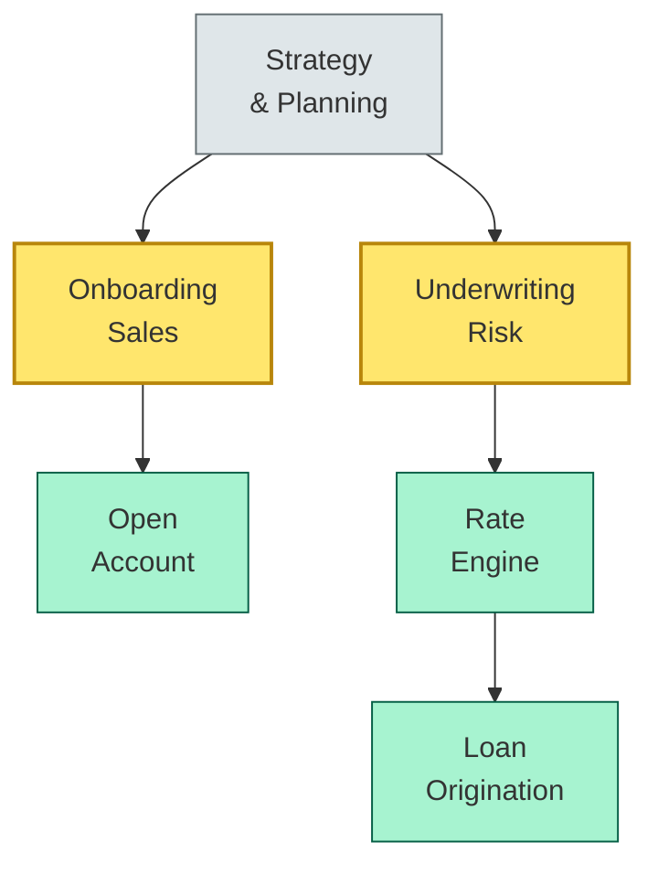
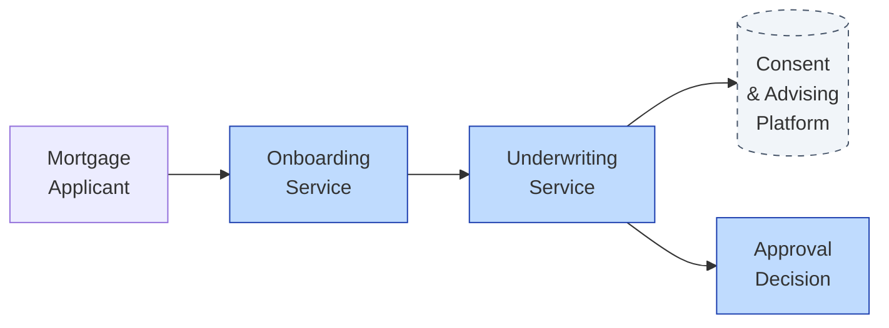

# [C7-02] Capability Mapping — DETAIL
> **Category:** C7 — Enterprise & Organizational Architecture
> **Companion brief:** `[briefs/C7-02-capability-mapping.md](../briefs/C7-02-capability-mapping.md)`

> **Target reader:** enterprise architect who must *explain, justify, and defend* the topic — not just recite it.

---

## 1. Precise definition
Capability mapping is the systematic practice of identifying, classifying, describing, and relating business capabilities to value, architecture, and execution resources in a structured taxonomy. It is a foundational element of enterprise architecture, originating in military and supply-chain contexts and adapted for IT portfolio management through frameworks such as TOGAF's Business Architecture (ADM Phases B and C) and the Capability Management (CapMan) method by Andrew Marinos.

A **business capability** is defined as:
> "A high-level abstraction of a business entity that captures the 'what' an organization does, rather than the 'how' (i.e., not a business function, process, or organization)."

Key definitional frontiers (Marinos, Marinos et al.):
- **Scope:** The boundary of what the organization intentionally does vs. what it accidentally does.
- **Level of abstraction:** Capabilities are non-process. You do not map a capability to "process steps" but to "value unit outcomes."
- **Actionability:** Each capability should be owned by a single business entity and have a clear maturity indicator.

**Reference:** TOGAF 9.2, Business Architecture Domain (ADM Phases B and C); Marinos, A. M. (2014). *Capability Management in Enterprise Architecture.* IEEE; Caetano, A. et al. (2006). *Strategic Enterprise Architecture: Methods for Business Excellence.*

## 2. Why it exists (problem it solves)
Before enterprise capability mapping, IT portfolios were organized by technology stack (mainframe vs. COBOL vs. Java), application, or project. When the board asked, "Do we have the capabilities to do instant payments?" there was no consistent answer. The problem was *ontological incoherence*: IT, procurement, risk, and strategy used different vocabularies for the same reality.

Capability mapping solves:
1. **Ecosystem mapping:** It models the market space (internal, external, and hybrid) rather than the enterprise interior.
2. **Portfolio coherence:** It surfaces duplicated, redundant, and orphaned capabilities before they become technical-debt factories.
3. **Strategic traceability:** It lets an M&A due-diligence team ask, "Which capabilities will survive the acquisition and which must be replaced?"

In banking, this is critical because regulators now assess digital-operational resilience under DORA, which requires demonstrating a *maturity-based* capability for business continuity, ICT risk management, and third-party monitoring.

## 3. Core concepts & vocabulary
| Term | Precise meaning |
|------|-----------------|
| **Capability taxonomy** | A hierarchical or faceted classification of capabilities (e.g., by customer segment, product type, or channel-agnostic). |
| **Capability picture** | A visual—often a tree, matrix, or ecosystem map—representing a selected slice of the taxonomy. |
| **Capability maturity level** | A stage on a maturity model (e.g., CMMI-inspired: Ad-hoc, Defined, Managed, Measured, Optimized); measured via a Capability Maturity Indicator. |
| **Capability gap** | A delta between a desired / target capability (from the strategy roadmap) and the current-state capability, expressed as missing, weak, or misaligned. |
| **Capability owner** | A business leader accountable for the capability's outcomes, budget, and evolution; not an IT role by default. |
| **Capability texture** | The perceived quality or readiness of a capability, often captured through stakeholder sentiment; used in gap smoke-testing. |
| **Capability texture score** | A normalized score (1–10) quantifying texture; used alongside objective metrics (lead time, defect density) in maturity calculations. |
| **Value unit** | A atomic unit of value produced and consumed by a capability; the currency of capability exchange in portfolio budgeting. |

## 4. How it works (architecture / mechanism)
### 4.1 Iterative discovery
Capability mapping is not a one-time pipeline. It is an iterative equilibrium between:
- **Bottom-up:** Identifying capabilities from data (usage logs, transaction volumes, process mining).
- **Top-down:** Decomposing strategic priorities (e.g., "expand into Real-Time Payments") into capability needs.

### 4.2 Dimension facets
Common facets for banking:
| Facet | Example values |
|-------|----------------|
| Channel-agnostic vs. channel-specific | Customer self-service (agnostic) vs. Branch mortgage (specific) |
| Customer segment | Retail, SME, Corporate, Treasury |
| Product / instrument | Loan, Card, Deposit, Investment |
| Market / geography | UK, EU, Global, Emerging markets |
| Ownership | Owned, partnered, outsourced |

### 4.3 Diagram A — Core structure (highlight the load-bearing parts = amber, supporting = grey):


### 4.4 Diagram B — Lifecycle / flow (highlight decision points = green, failures = red):
```mermaid
flowchart LR
    classDef ok fill:#a7f3d0,stroke:#065f46
    classDef risk fill:#fecaca,stroke:#991b1b
    classDef context fill:#dfe6e9,stroke:#636e72

    User[Research &<br/>Reduce]:::context --> Query[Advice<br/>& Quote]:::critical
    Query --> Quote[Investment<br/>Advice /<br/>Quote]:::decision
    Quote --> Trade[Order<br/>Execution]:::ok
    Trade -->|gap||underwrite| Underwrite[Underwriting<br/>Risk]:::risk
```

### 4.5 ADM integration
- **ADM B (Business Architecture):** Capability views and models.
- **ADM C (Information Systems Architecture):** Application and technology capability realization.
- **ADM G (Migration Planning & Preparation):** Incremental capability delivery through Paces phases.

### 4.6 Gap analysis
Gaps are identified through five dimensions:
1. **Missing:** The desired capability does not exist at all.
2. **Weak:** The capability exists but does not meet target maturity.
3. **Configuration:** The capability exists and meets maturity but is not technically fit-for-purpose (e.g., co-location of payments and retail core).
4. **Performance:** The capability meets maturity but not with target KPIs (latency, cost, availability).
5. **Over-investment:** The capability exceeds target maturity, generating maintenance cost without strategic benefit.

## 5. Variants, options & trade-offs
| Variant | When to pick | When to avoid | Key trade-off axis |
|---------|--------------|---------------|--------------------|
| **Lean-capability mapping** | New digital banks; agile transformations with limited time | Complex, multi-segment operations (contact center + wealth + corporate) | Speed vs granularity |
| **Capability maturity mapping** | Ongoing portfolio management; annual budget cycles | One-off due diligence or M&A | Rigor vs turnaround |
| **Channel-agnostic mapping** | Open-banking APIs; retail-to-SME portability | Single-channel operations | Simplicity vs completeness |
| **Product-centric mapping** | Product-led organizations; buy-to-let lending | Retail + corporate + wealth in one organization | Focus vs scope |

## 6. Relationships to sibling topics
- **Value Stream:** Value flows through capabilities, but not all value streams map to a single capability. A "Mortgage Origination" capability may serve 3 value streams (Retail, SME, Buy-to-let).
- **Team Topologies:** Capabilities are a strategic abstraction; team topologies are an *organizational* realization of capability ownership. You create a stream-aligned team *for* a capability.
- **Capability Mapping:** Capability mapping *is* this topic; but often confused with "business-function mapping" or "process mapping."
- **ADR / Architecture Decision Records:** Example: *ADR 005: Create a Non-Bank Payment Capability.*

## 7. Banking / financial-services context 💳
In banking, capabilities are the atomic unit for digitization mandates under PSD2 (API requirements), DORA (digital operational resilience), and the UK FCA's Consumer Duty (outcomes-based assessment). A bank must be able to demonstrate that "Consumer Credit Decision" is a capability with defined maturity, liquid customer support, and transparent outcomes.

**Eurozone retail context:** A Dutch neobank mapped its capabilities and found it lacked "On-Demand Account Closure" at the retail level. The workaround was "Send letter via bank's legacy mail provider"—a 10-day, non-digital process. The bank invested CHF 4.2M in a microservice-based cancellation engine, reclassifying the capability from "weak, co-located" to "strong, decoupled."

**US context:** A regional US bank's "Real-Time Fraud Detection" capability was co-located with its fraud-operations team, which reported through loss-prevention (risk) rather than through the payments product leadership. The co-location meant fraud-detection latency was 45 seconds. Reorganizing around "Digital Payments" and "Digital Fraud" as distinct capabilities cut latency to 200 ms.

Regulation-linked: Basel II/III (capital adequacy), MiFID II (transaction reporting), PSD2 (TTP/API standards), GDPR (data-for-consent capabilities), DORA (5th of December 2025 compliance deadline for ICT risk).

## 8. Reference architecture / worked example
**Problem:** A UK mutual building society lacked a unified "Mortgage Origination" capability.
**Context:** The capability was split across "Branch Sales," "Underwriting," "Legal House," and "Credit Bureau Interface."

**Decision:** Combine them into a single "Mortgage Origination" capability with a dedicated product manager.

**Result:** Processing time dropped from 21 days to 8 days. The capability maturity rose from "ad-hoc" to "defined" (ISO 9001).



## 9. Maturity & adoption signals
- **Adopt when:** The bank has >3 business lines, >50 applications, or is preparing for a regulated digital transformation program.
- **Anti-signals (don't adopt yet):** The bank is in the middle of an emergency system-renewal (e.g., core-systems replacement); capability mapping will be destabilizing.
- **Common failure modes:**
  1. **Flat hierarchy:** Mapping 100 capabilities with no sub-layers, making the map unbrowsable.
  2. **Functional re-labeling:** Calling "Insurance Underwriting" a capability when it is a process map with no output ownership.
  3. **IT-only mapping:** Letting IT own all capabilities; business functions must be the primary creators.

## 10. Common confusions — the "don't mix" list
| Often confused | Real distinction |
|----------------|------------------|
| **Capability** vs **Business function** | A capability produces a customer-facing outcome; a function is an administrative or process cluster with no consuming stakeholder. |
| **Capability** vs **Process** | A process is a *way* to deliver a capability; a capability is *what* you can deliver. |
| **Capability** vs **Value stream** | A capability is a *what* (ability); a value stream is *how* (event sequence producing a value unit). |
| **Capability maturity** vs **Application maturity** | Application maturity is technical (availability, latency); capability maturity is organizational (time-to-market, error rate, topology clarity). |

## 11. Tools & standards to know
- **Standards/Frameworks:** TOGAF 9.2 Business Architecture (ADM B and C); ISO/IEC 42010 (system-of-systems); DAMA-DMBOK (data-management capabilities); DORA (digital operational resilience); PSD2 (TTP); Basel III (capital adequacy).
- **Common tooling:** Sparx EA, Archi, Modelio (capability modeling); Miro, Lucidchart (canvas workshops); Jira Align / Aha! (backlog alignment); Process Mining (Celonis) for capability-discovery.
- **Mandatory reading:** Marinos, *Capability Management in Enterprise Architecture* (2014); TOGAF 9.2; DORA final tech regs (2025).

## 12. ADR template (ready to fill in)
```markdown
# ADR-005: Create a Non-Bank Payment Capability
## Status
Proposed

## Context
Cross-border P2P payments rely on legacy SWIFT MT103 operations. No dedicated capability owner; 12-week batch settlement; no 24/7 SLA. Regulatory pressure from DORA and PSD2 TTP.

## Decision
Create a standalone "Non-Bank Payment" capability, owned by Payments Product. Build a real-time clearing microservice decoupled from legacy debt-management.

## Consequences
- Positive: 24-hour settlement; separate governance from Treasury; audit-ready under DORA.
- Negative: Requires new vendor for non-bank supervision (could be mitigated via partnership).
- Neutral: Payment volume may cannibalize existing card interchange revenue.

## Alternatives considered
1. Reorganize within existing Treasury. → Rejected: conflicts with 24/7 SLA; cultural inertia.
2. Outsource to a BaaS provider. → Rejected: vendor lock-in risk; brand trust dependency.
```

## 13. Practice — apply it
1. **Recall:** define in 2 min without notes.
2. **Model:** produce a 3-tier capability tree for your own product area.
3. **ADR:** write a decision doc applying it to the banking example in §7.
4. **Defend:** roleplay explaining to a non-technical CRO / CIO.

## 14. Summary (1 paragraph)
Capability mapping is the strategic ontology of a bank. It converts vague strategic intents ("we need digital") into measurable, investable outcomes with clear owners, making IT spend traceable to business value. Without it, portfolio decisions are political; with it, they are evidence-based—and in a regulated industry like banking, evidence is the cost of doing business.

---
**Status:** ✅ Covered · **Last updated:** 2026-09-14
