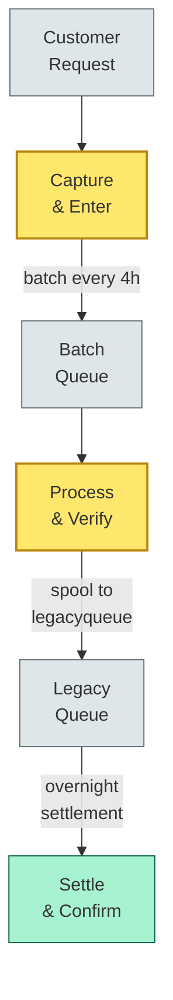
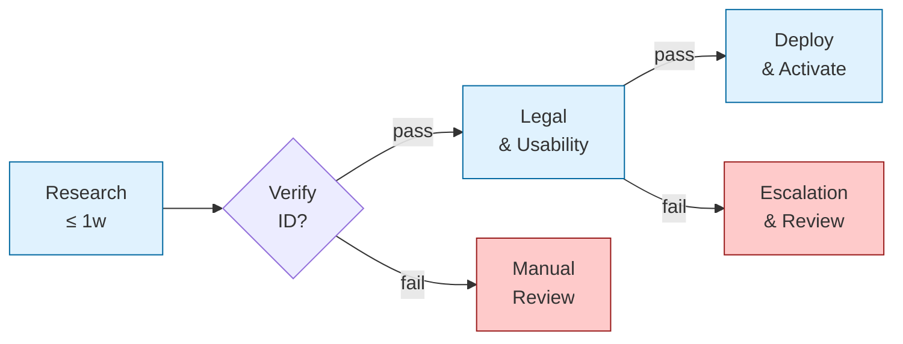
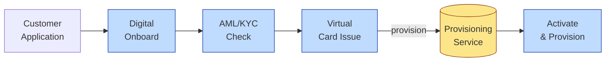

# [C7-03] Value Stream — DETAIL
> **Category:** C7 — Enterprise & Organizational Architecture
> **Companion brief:** `[briefs/C7-03-value-stream.md](../briefs/C7-03-value-stream.md)`

> **Target reader:** enterprise architect who must *explain, justify, and defend* the topic — not just recite it.

---

## 1. Precise definition
Value Stream Mapping (VSM) is a lean-management tool developed by Taiichi Ohno at Toyota in the 1950s, adapted by Michael Rother and John Shook (Lean Thinking, 1999) for enterprise-level process analysis. In enterprise architecture, a **value stream** is a system-level assembly of capabilities, processes, information flows, and material flows that deliver a specific value proposition to a specific customer or market segment.

Key characteristics distinguishing the EA usage from general lean:
- **System-level assembly:** A single value stream may span multiple business units, IT landscapes, and geographic regions.
- **Time-based metrics:** Cumulative lead time, processing time, wait time, and build time are measured separately.
- **External focus:** The value stream customer is the *external* consumer of the value proposition (retail depositors, wholesale counterparties), not internal compensation.
- **Architectural embedding:** The value stream is a *first-class* architectural viewpoint along with structure, behavior, and information, as recommended in the ISO/IEC/IEEE 42010/14764 standards.

Reference standards: ISO/IEC/IEEE 42010 (Systems and software engineering—Architecture description), SAFe (SAFe for Lean Enterprises), and the DORA metrics (deployment frequency, lead time for changes, MTTR, change failure rate) as proxies for value-stream health in DevOps/DevSecOps contexts.

## 2. Why it exists (problem it solves)
The core problem is *waste in flow*. In banking, waste takes forms that are financially material:
- **Wait time:** Manual review queues for KYC/AML checks, batch-processing overnight windows (e.g., loan origination), or paper-based escalation workflows that vanish into ERP spoolers.
- **Overproduction:** Underwriting teams generating 3x the documentation required by regulators; IT delivering features with no validated demand.
- **Defects:** Rework in payment-clearing loops, incorrect interest-rate calculations on floating-rate mortgages, misconfigured compliance reports.
- **Non-value-adding activity:** Manual data re-entry between core banking, GRC, and reporting systems; parallel reconciliation processes for the same transaction set.

If an EA looks only at the *structure* of the system (the capability map), they can miss that the *flow* of value through that structure is broken by handoffs and waits. VSM exposes the time dimension, which is what leadership, regulators, and customers care about.

## 3. Core concepts & vocabulary
| Term | Precise meaning |
|------|-----------------|
| **Value stream** | The end-to-end pathway of activities, information, and materials that creates a product or service for a customer, measured by *cumulative lead time*. |
| **Cumulative lead time** | Total elapsed time (value-adding + non-value-adding) from the initiation of a request to its delivery. |
| **Current-state VSM** | The as-is map of the value stream, often showing physical and information flows, swimlanes, and manual workarounds. |
| **Future-state VSM** | The to-be map after waste removal, often showing continuous flow, one-piece flow, or pull systems. |
| **One-piece flow** | Processing one unit at a time through all process stages, eliminating batch queues and context switching. |
| **Demand-driven pull** | Work is initiated only by actual customer demand, not by forecast or batch scheduling. |
| **Value-added time** | Time that transforms the product/service in a way the customer is willing to pay for. |
| **Non-value-added time** | Time that does not transform the offering from the customer's perspective (most wait time). |

## 4. How it works (architecture / mechanism)
### 4.1 Creation of the current-state VSM
Steps:
1. **Define the scope:** The customer/product/service boundary.
2. **Gather raw data:** Interview operators, collect system logs, validate KPIs.
3. **Map the process:** Use swimlane notation (customer, supplier, internal processes) with time on the horizontal axis.
4. **Designate process steps as VA (value-added) or NVA (non-value-added).**
5. **Quantify:** Measure processing time, wait time, and cumulative lead time per step.

### 4.2 Diagram A — Core structure (highlight the load-bearing parts = amber, supporting = grey):


### 4.3 Diagram B — Lifecycle / flow (highlight decision points = green, failures = red):


### 4.4 Process-event sequencing
1. **Customer places order** (e.g., "Open Instant Payment Account").
2. **Capture & enter** customer data (digital form, video ID, bank letter).
3. **Verify** using KYC/AML rules engine (automated, >1% exception).
4. **Validate** against sanctions lists, adverse media, and politically exposed persons (PEP).
5. **Process** funding instruction (account is funded, card issued).
6. **Confirm** account created, credentials issued, initial balance posted.
7. **Settle** with payment systems.

In the *current* state, steps 3–6 may overlap. In the *future* state, the E2E promise is under 5 minutes.

## 4.5 Relationship to enterprise-level events
Value streams in banking are not isolated. The \`Deposit Account Opening\` value stream consumes the \`Customer Identity Verification\` capability and produces the ``Account Created\` app-service. It is fed by the \`Customer Onboarding\` capability and produces the \`Account Activation\` signal consumed by the \`Issuing & Cards\` capability.

### 4.5 VSM as an architectural constraint
A VSM can define a *commitment boundary* for an ADR. For example, an ADR may state: "The real-time loan origination value-stream lead time must not exceed 14 days." This is not a functional requirement (how to process); it is an architectural constraint (the system *must* deliver this flow) that drives the choice of microservices, API contracts, event-driven architecture, and team topology.

### 4.6 Product/company level
In LeSS (Large-Scale Scrum) and SAFe, product-level VSMs are scoped to the product-delivery rhythm (e.g., 2-week sprint cadence). In Structural Architecture (SA), the structural level is decomposed into:
- **Structural view:** The bounded-context diagram.
- **Information view:** The data-contract and schema evolution policy.
- **Behavior view:** The capability-level flow diagram.

A *behavioral* VSM is the closest equivalent to a value-stream view at the architectural level: it shows capability-to-capability handoffs rather than human-to-human handoffs.

## 5. Variants, options & trade-offs
| Variant | When to pick | When to avoid | Key trade-off axis |
|---------|--------------|---------------|--------------------|
| **Physical flow analysis** | Contact-center, branch, and back-office processes; payment-clearing settlement times | Purely software-only capabilities (e.g., algorithmic trading) | Breadth of participant perspective vs. focus on criticality |
| **Information flow analysis** | IT-centric value streams where data latency is the primary waste (e.g., AML-report generation, regulatory submissions) | Customer-facing, high-touch services | Information quality vs process velocity |
| **Process manufacturing analysis** | Batch-oriented supply-chain, insurance underwriting, trade finance documentary processing | Real-time digital customer journeys | Batch-economies vs flow-efficiency |
| **Continuous improvement (Kaizen)** | Existing, stable processes with known measurement capability | Mission-critical/ zero-downtime systems | Incremental vs radical change |

## 6. Relationships to sibling topics
- **Relation to Value Stream:** This topic *is* value stream mapping; the detail expands the definition.
- **Capability Mapping:** Capabilities are the structural building blocks of a value stream. You map a capability to a value stream to understand *what* flows where.
- **ADR / Architecture Decision Records:** A value stream can be used as the *framing context* for an ADR. E.g., "The VSM for mortgages shows a 21-day lead time; therefore we choose microservices over monolith."
- **Process Mining (Celonis):** Process mining is the automated detection of the current-state VSM from event-log data.

## 7. Banking / financial-services context 💳
In banking, value-stream mapping is used for:
- **Onboarding:** Current account and mortgage opening, card issuing, lending.
- **Payments:** Real-time gross settlement (RTGS), SWIFT, card network clearing, instant payments (P2P, B2B).
- **Risk & compliance:** KYC, AML monitoring, credit-risk assessment, regulatory reporting.
- **Settlement & custody:** DVP (delivery versus payment), trade finance documentary processing.
- **Wealth:** Onboarding to advisory platforms, asset-allocation rebalancing, fund-management portfolio review.

**Regulation-linked:** DORA requires 72-hour incident reporting from ICT service providers, implying that the *value stream* for incident management must be designed for rapid, auditable flow. PSD2 requires TTP (trust-and-traceability-provider) verification, meaning the value stream for API access must include identity verification, trust registration, and audit logging as value-adding steps.

Specific example: A US community bank mapped its "Mortgage Loan Origination" value stream and found:
- **Wait time:** 34 days (ID verification via postal service, manual appraisal routing).
- **Value-added time:** 8 minutes.
- **Artifacts:** 14 PDFs per application, stored in a document-management system with 90s retrieval.
- **Decision:** Adopt an e-appraisal platform, digital identity verification (e.g., ID.me), and a loan-doc microservice with OCR auto-extraction, reducing lead time to 11 days and cost per loan from USD 4,200 to USD 2,800.

## 8. Reference architecture / worked example
**Problem:** Retail card issuance value stream has a 7-day cumulative lead time.
**Context:** A customer applies online; the bank checks KYC/AML; card is printed; the card is mailed; the customer receives it; the customer activates it; the card is provisioned to devices.

**Decision:** Eliminate the physical mail queue by using a virtual-card-first issuance model with instant activation via app, and a single-provider card scheme integration (Visa/Mastercard B2B API) to automate dispick.

**Result:** Cumulative lead time reduced from 7 days to 15 minutes. Activation rate improved from 62% to 89%.



## 9. Maturity & adoption signals
- **Adopt when:** The bank has a 2-year digital-transformation program; customer-facing capabilities are multi-channel; there is an identified pain in lead time or cost.
- **Anti-signals (don't adopt yet):** The bank is in the middle of a core-system migration; VSM will be a moving target and designs will obsolete before deployment.
- **Common failure modes:**
  1. **VSM theater:** Running a workshop without collecting actual data; the map looks clean but is wrong.
  2. **Over-engineering future state:** Drawing a future-state VSM with zero manual steps when the target maturity level is "defined"—accepting some NVA for risk control.
  3. **Ignoring coupling:** Mapping each value stream in isolation; bank value streams share capabilities (e.g., "Payment Processing" is in 4 value streams); duplication is hidden.

## 10. Common confusions — the "don't mix" list
| Often confused | Real distinction |
|----------------|------------------|
| **Value stream** vs **Business process** | A value stream is end-to-end and customer-centric; a business process is a bounded sequence of activities within one capability or function. |
| **Value stream** vs **Customer journey** | A customer journey is subjective and emotional; a value stream is objective, timed, and measurable. |
| **VSM** vs **Process mining** | VSM is human-constructed and explanatory; process mining is data-driven and descriptive from system logs. |
| **Cumulative lead time** vs **Cycle time** | Lead time is calendar time; cycle time is working time (excluding weekends, shifts). In banking, lead time matters because customers care about calendar days. |

## 11. Tools & standards to know
- **Standards/Frameworks:** ISO/IEC/IEEE 42010; SAFe for Lean Enterprises; DORA metrics; SOC 1 Type II (relevant for financial controls in value-stream handoffs); PSD2 (time-to-market for TTPs).
- **Common tooling:** Miro / Lucidchart (VSM canvas); ARIS / Visio (swimlane diagrams); Celonis / UiPath Process Mining (automated VSM from logs); Jira Align (value-stream mapping at scale in SAFe); Minit / SAP Signavio.
- **Mandatory reading:** Rother & Shook, *Lean Thinking* (1999); Rother, *Value Stream Design* (2009); Ohno, *Toyota Production System* (1988).

## 12. ADR template (ready to fill in)
```markdown
# ADR-006: Real-Time Pay-Apply-as-You-Bank Capability
## Status
Proposed

## Context
Mortgage application value stream has 21-day cumulative lead time; 14 days wait time (appraisal dispatch, postal ID verification, manual risk review). Customer complaints up 12%.

## Decision
Build a "Pay-as-You-Bank" capability: auto-appraisal via digital image capture, instant digital ID verification via facial-recognition, automated risk-score alignment, real-time signing ceremony.

## Consequences
- Positive: Lead time reduced to 5 days; cost per loan drops 22%; NPS improves 8 points.
- Negative: Regulators require back-testing on digital identity accuracy; biometric false-positive/negative ratios must be validated.
- Neutral: Partnership cost with ID verification vendor is USD 0.40 per application.

## Alternatives considered
1. Outsource to mortgage-servicing platform vendor. → Rejected: vendor lock-in; opacity of risk model.
2. Accelerate existing batch loan-doc service. → Rejected: batch send, not real-time; cannot meet competition in <10 days.
```

## 13. Practice — apply it
1. **Recall:** define in 2 min without notes.
2. **Model:** produce a swimlane VSM for a single-value stream (e.g., "Open a Current Account") with VA/NVA labels and time annotations.
3. **ADR:** write a decision doc applying it to the banking example in §7.
4. **Defend:** roleplay explaining to a non-technical CRO / CIO.

## 14. Summary (1 paragraph)
Value-stream mapping is the auditory check engine light of enterprise architecture: when it flashes, the system is running, but something is flowing inefficiently. In banking, where value is created through regulated, high-velocity, and heavily-audited processes, VSM is the only method that converts strategic intent ("digitise mortgages") into measurable operational outcomes ("5-day lead time, <5% NVA").

---
**Status:** ✅ Covered · **Last updated:** 2026-09-14
