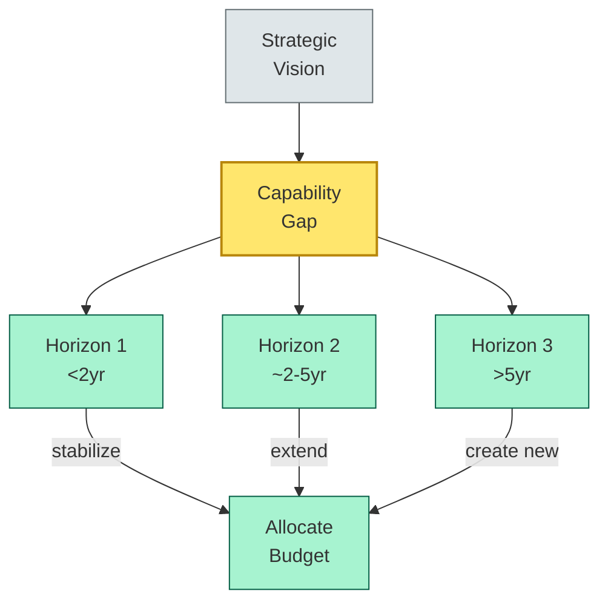
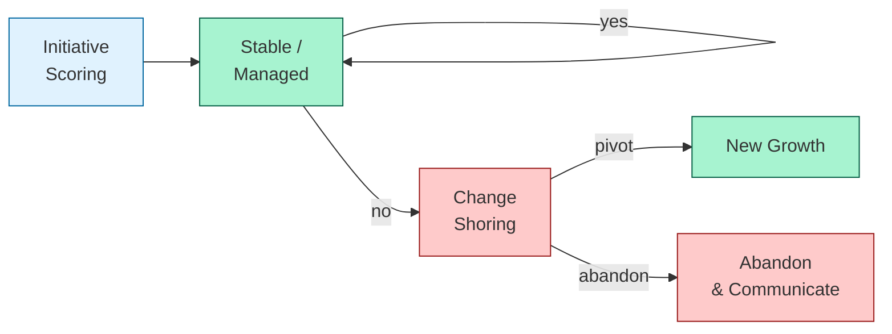

# [C7-04] Portfolio Roadmap — DETAIL
> **Category:** C7 — Enterprise & Organizational Architecture
> **Companion brief:** `[briefs/C7-04-portfolio-roadmap.md](../briefs/C7-04-portfolio-roadmap.md)`

> **Target reader:** enterprise architect who must *explain, justify, and defend* the topic — not just recite it.

---

## 1. Precise definition
A portfolio roadmap is a strategic artifact that sequences, prioritizes, and allocates resources to enterprise-level initiatives over a multi-year horizon, typically 3–7 years. It operates at the *portfolio* level, meaning it encompasses multiple programs, lines of business, and cross-cutting concerns (risk, data, infrastructure), synthesizing them into a single coherent plan.

Key definitional attributes:
- **Time-phased:** Initiative sequencing is expressed in time horizons, not just start and end dates.
- **Capability-centric:** Initiatives are selected by the capabilities they enable, not by technology preference.
- **Risk-adjusted:** Each initiative includes risk exposure, contingency, and optionality.
- **Governable:** The roadmap is *not* a 5-year static plan; it is a *reversible* plan with re-prioritization gates.

The portfolio roadmap is comparable to the *Integrated Business Plan (IBP)* in corporate finance and the *Strategic IT Plan* in TOGAF (ADM Phase F). It is the operationalization of the *target architecture* (ADM Phase D) into executable investments.

**Reference:** TOGAF 9.2, Architecture Governance and Change Management (ADM Phase G); SAFe Portfolio Management; TOGAF 9.2 Business Architecture Domain, Phase D (Target Architecture).

## 2. Why it exists (problem it solves)
In banking, the problem is *capital-constrained, regulation-heavy, and transformation-ambitious*. A bank's IT budget is a sliver of its P&L (~2–3%). Meanwhile, the board demands digital transformation (e.g., "50% digital sales by 2028"), regulatory mandates require massive compliance spending (BCBS239, DORA, PSD2), and legacy debt (mainframes, COBOL, siloed applications) requires ongoing maintenance.

Without a portfolio roadmap, the EA has:
- **No time-horizon discrimination:** All initiatives just "happen" in the current quarter; Horizon 3 dreams are funded at the same level as Horizon 1 operations.
- **No optionality:** All bets are "all-in"; the bank bets the mortgage business on a single platform.
- **No capital allocation rigor:** The C-suite cannot compare ROI across disparate initiatives.

The portfolio roadmap solves these by:
- **Explicit horizon packaging:** Horizon 1 = "keep the lights on, minimize risk"; Horizon 2 = "extend the core"; Horizon 3 = "create new growth."
- **Optionality:** Each horizon has viable alternatives and contingency paths (real options).
- **Transparent trade-offs:** The user can see exactly what is deferred and what is sacrificed when funding a Horizon 3 program.

## 3. Core concepts & vocabulary
| Term | Precise meaning |
|------|-----------------|
| **Three horizons** | H1: Adjacent optimization and process improvements; H2: Extend core and migrate/arch; H3: Create new capabilities and business models. |
| **Wiggle rooms** | Optional, contingent investment paths for pivot or ambition; they are not "decision points" but genuine options. |
| **Paces** | Incremental delivery vehicles (SAFe and large-scale scrum) that align capability delivery to business cadence; 5 Paces in SAFe. |
| **Real options** | A financial framing of portfolio decisions: invest, expand, defer, abandon, switch—each with an exercise price (cost) and payoff profile. |
| **Digital options** | The "switch" option in IT terms: can we pivot the technology or capability if market conditions change? |
| **Portfolio governance** | The control mechanisms (stage gates, budget panels, EA review) that keep the roadmap executable and reversible. |

## 4. How it works (architecture / mechanism)
### 4.1 Process flow
1. **Vision & strategy:** The C-suite defines strategic priorities (e.g., "become a real-time payment-enabled bank by 2027").
2. **Capability gap analysis:** The EA maps current capabilities to target capabilities, quantifies gaps, and scores strategic importance.
3. **Initiative generation:** Each targeted capability gap is bridged by one or more initiatives (program, project, or platform investment).
4. **Scoring & prioritization:** Initiatives are scored on strategic alignment, risk, ROI, and capital requirement.
5. **Horizon assignment:** Initiatives are assigned to H1, H2, or H3 based on strategic risk and investment scale.
6. **Wiggle-room insertion:** For each horizon, at least one contingent path (real option) is documented.
7. **Governance & re-planning:** Quarterly re-planning gates allow shifting initiatives between horizons without breaking the roadmap's reversibility property.

### 4.2 Diagram A — Core structure (highlight the load-bearing parts = amber, supporting = grey):


### 4.3 Diagram B — Lifecycle / flow (highlight decision points = green, failures = red):


### 4.4 PMO integration
- **PMO PMBOK:** Provides the *Work:*perform, *Monitor:*control, and *Integrated:*matrix for effort, schedule, and cost tracking.
- **EPM (Enterprise Portfolio Management):** The PMO PMO function that runs the investment portfolio as a strategic asset pool, with risk-adjusted capital allocation.

## 4.5 Relationship to other views
- **Target architecture (TOGAF Phase D):** The portfolio roadmap is the *executable sequence* of target-architecture components.
- **Capabilities (C7-02):** The roadmap is *driven* by capability priorities; capabilities are the input to roadmaps.
- **Value streams (C7-03):** Value streams are the *flow lenses* that validate whether roadmap initiatives actually deliver faster, cheaper, better flow.
- **Architecture decoupling:** The roadmap is the *fuel* for long-living capability domains; quick cycles fuel H1, strategic bets fuel H3, H2 is the decomposer.

## 4.6 Banking / financial-services context 💳
In banking, the portfolio roadmap is arguably the most *scrutinized* architectural artifact because:
1. **Regulator-capital link:** *Basel III* and *BCBS 239* require that technology spend be risk-proportional. A poorly justified roadmap can be interpreted as inefficient capital deployment.
2. **Tech-debt-to-equity ratio:** Legacy maintenance (H1) crowds out innovation (H3). The roadmap must explicitly *braid* debt reduction with innovation.

**US and EU dating:**
- **US banks** (large, CCAR/DFAST regulated): The portfolio roadmap is submitted to the OCC/FDIC as part of technology-risk management. The *Federal Reserve's supervision* requires evidence of technology governance; the portfolio roadmap is the EA's evidence.
- **EU banks** (DORA/GDPR/BCBS 239): The *management body* must ensure the portfolio roadmap is risk-adjusted and includes "dedicated budget lines for resilience." DORA requires *Technology Risk Management* (TRM) functions; their input feeds into the roadmap.

**Example—mortgage portfolio roadmap:**
A 7-year mortgage portfolio roadmap:
| Horizon | Initiative | Capability | Risk | Optionality |
|---------|------------|------------|------|-------------|
| H1 (Years 1–2) | Stabilize underwriting logic; fix delivery stale data; reduce runtime | Credit-risk scoring | Regulatory (CRR) compliance | If volume drops >15%, shift funds to transactional lending |
| H2 (Years 3–5) | Replace legacy COBOL with core-logic microservices; API modernization | Origination, Servicing, Settlement | Migration risk (data-quality loss) | Switch to a BaaS provider (digital options: "switch") |
| H3 (Years 5–7) | Embedded securities-lending; real-time valuation for SME loans | Securities-lending brokerage; Lending | Market risk (volatility); Op risk | Pilot in sandbox; if adoption <5%, abandon |

## 9. Maturity & adoption signals
- **Adopt when:** The bank has >3 business lines, >50 applications, and a multi-year strategic plan.
- **Anti-signals (don't adopt yet):** The bank is in the middle of a core-system replacement or a regulatory remediation; the roadmap will be unstable.
- **Common failure modes:**
  1. **Abstraction mismatch:** The roadmap talks in "streams" and "capabilities" but the PMO tracks "projects"; the two systems are not reconciled.
  2. **No optionality:** A 5-year roadmap with no wiggle rooms is a prediction, not a roadmap. When the world changes (interest-rate volatility, regulatory coup), it becomes obsolete.
  3. **Governance vacuum:** No executive sponsor or re-planning mechanism; the roadmap becomes a decorative document.

## 10. Common confusions — the "don't mix" list
| Often confused | Real distinction |
|----------------|------------------|
| **Portfolio roadmap** vs **Program roadmap** | Portfolio = multiple programs, cross-cutting; produces "what to do, when to do it." Program = single large-scale initiative; produces "how to execute." |
| **Portfolio roadmap** vs **Product roadmap** | Portfolio = IT/capability plan; produces "what" for architecture. Product = feature/release plan; produces "how" for product teams. |
| **Portfolio roadmap** vs **Strategic plan** | Portfolio roadmap is *executable, resourced, and risk-adjusted*; strategic plan is the *narrative, vision, and aspiration*. |
| **Wiggle rooms** vs **Contingency** | Wiggle rooms are *intentionally optional paths* (real options); contingency is *budget reserve* for known risks.

## 11. Tools & standards to know
- **Standards/Frameworks:** TOGAF 9.2 (ADM Phase F and G); SAFe (Portfolio Management, Agile at Scale); COBIT 2019 (APO5 Manage Risk and Opportunities); ECMA-374 (Enterprise Architecture — Capability Governance).
- **Common tooling:** PowerPoint (roadmapping, not recommended); Jira Align (SAFe portfolio management); Aha! (product+roadmap); Planview (enterprise portfolio management); Power BI (scenario analysis); IBM Engineering Workflow Management (via JA Agile); Minit Roadmap (visual roadmapping).
- **Mandatory reading:** R. Cooper, *Winning at New Products* (real options in product development); A. Marinos, *Capability Management in Enterprise Architecture* (capabilities as roadmap inputs); PMBOK 7th ed.

## 12. ADR template (ready to fill in)
```markdown
# ADR-007: Core-to-Microservices Migration Sequence
## Status
Proposed

## Context
COBOL deposit-accounting system (35 years old) requires CHF 18M/year maintenance. Basel III and DORA require more transparent risk-accounting.

## Decision
Adopt a three-horizon roadmap:
- H1 (Years 1–2): Stabilization + API reverse-engineering; maintain 15% debt-reduction budget.
- H2 (Years 3–5): Replace with event-driven microservices using Kafka; centralize deposit-services in a domain-driven bounded context.
- H3 (Years 5–7): Introduce embedded-finance for SMEs and real-time gross settlement via TCH.

Wiggle rooms included: cloud vendor switch, buy-versus-build for AML compliance.

## Consequences
- Positive: 40% reduction in maintenance cost; improved auditability; enabling real-time liquidity management.
- Negative: 5-year timeline conflicts with 2-year competitive pressure; requires interim API facade.
- Neutral: Requires recruitment of 8 Kafka/Cloud-native engineers; salary increase.

## Alternatives considered
1. Replace with SaaS SaaS core (e.g., Mambu). → Rejected: vendor lock-in; limited customization for complex credit products.
2. Extend COBOL (greenfield module). → Rejected: extends tech debt; does not solve regulatory need for transparent audit trail.
```

## 13. Practice — apply it
1. **Recall:** define in 2 min without notes.
2. **Model:** produce a 3-horizon portfolio roadmap for a single capability (e.g., "Payments").
3. **ADR:** write a decision doc applying it to the banking example in §7.
4. **Defend:** roleplay explaining to a non-technical CRO / CIO.

## 14. Summary (1 paragraph)
The portfolio roadmap is the sail of the enterprise architecture ship: it does not propel on its own, but without it, the best hull (target architecture) is aimless. In banking, where capital is finite and risk is perpetual, the roadmap is how the EA translates "digitise the bank" into a sequence of reversible, optionality-rich bets that balance solvency, compliance, and growth.

---
**Status:** ✅ Covered · **Last updated:** 2026-09-14
