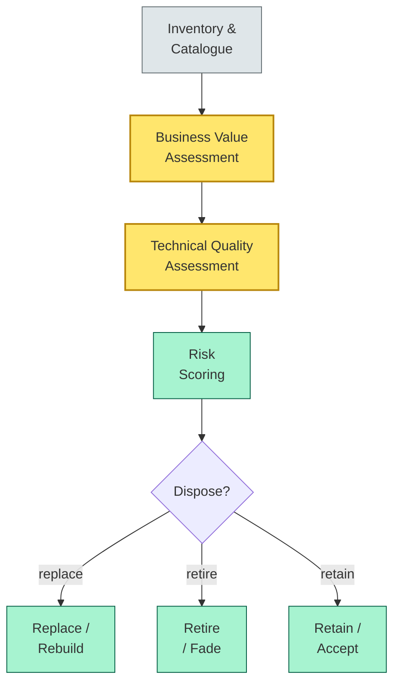
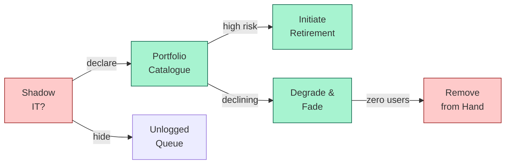
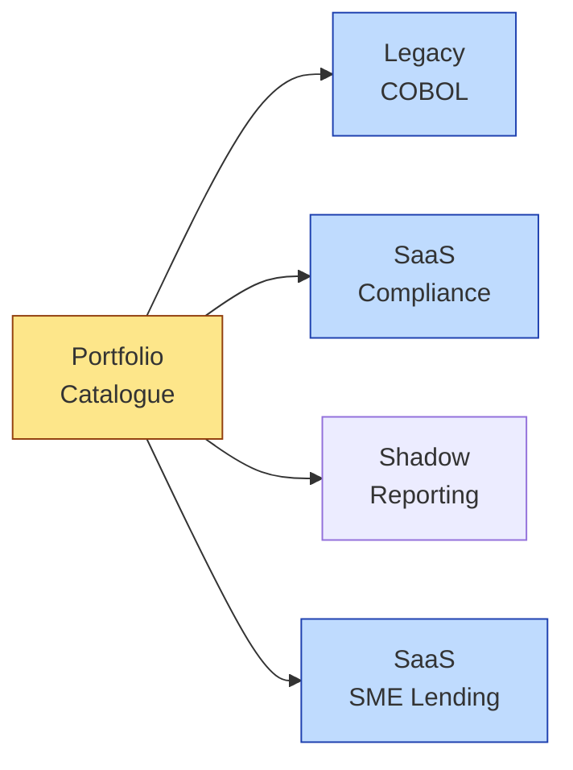

# [C7-05] App Rationalization — DETAIL
> **Category:** C7 — Enterprise & Organizational Architecture
> **Companion brief:** `[briefs/C7-05-app-rationalization.md](../briefs/C7-05-app-rationalization.md)`

> **Target reader:** enterprise architect who must *explain, justify, and defend* the topic — not just recite it.

---

## 1. Precise definition
Application rationalization is the systematic process of assessing an organization's entire application portfolio against a defined set of criteria—business value, usage, cost, technical quality, risk, and strategic alignment—to determine the optimal disposition for each application. The disposition options are: **retain, retire, replace, rebuild, merge, or accept**.

Key definitional frameworks:
- **TOGAF ADM Phase B (Business Architecture):** The business capability provides the evaluation criteria.
- **CIO Council / IT4IT Reference Architecture:** Provides the *Service-to-Service* and *Strategy-to-Portfolio* processes for application lifecycle management.
- **AMAZ jar IT4IT:** The MRS framework (Maintain-Introducing-Sustain-Replace) provides a disciplined mechanism for rationalization decisions.

A **valid rationalization** requires:
- A complete catalogue (no application is A>known).
- A documented business owner for every application.
- A risk score per application (compliance, security, vendor concentration).
- A total cost of ownership (TAC) and total benefit of ownership (TBO).

## 2. Why it exists (problem it solves)
In banking, the application landscape is a *tapestry of acquisitions, patchwork, and shadow IT*. Reasons for the mess:
1. **M&A deal closing:** Acquired banks bring their own core, GRC, and customer-facing stacks; immediately consolidating is politically impossible.
2. **Business-unit autonomy:** Line-of-business leaders (retail, wealth, corporate) hire their own product managers and build custom UIs over standard back-office services.
3. **Legacy dependency loops:** Applications exist because *other* applications depend on them; the dependency graph tessellates into a briar patch.
4. **Shadow IT:** Business units buy SaaS subscriptions for analytics, KYC checks, or tokenization without informing IT, creating security and compliance blind spots.

Without rationalization, the EA cannot answer:
- "Do we have the 'real-time payment originance' capability if we inherit a shadow-IT value-stream service?"
- "What is our application portfolio's TCO in 3 years under Basel III compliance costs?"
- "Which application failure is DORA-reportable?"

The core pain is **strategic obfuscation**: the true cost and capability coverage is hidden behind layers of redundancy, duplication, and undocumented dependencies.

## 3. Core concepts & vocabulary
| Term | Precise meaning |
|------|-----------------|
| **TAC (Total Cost of Ownership)** | The sum of license, implementation, operation, maintenance, support, and opportunity costs over the application's lifecycle. |
| **TBO (Total Benefit of Ownership)** | The quantified benefit of an application (revenue, risk reduction, efficiency). |
| **Shadow IT** | Unauthorized applications, infrastructure, or services deployed by business units without EA knowledge. |
| **Application Downsizing** | The deliberate reduction of an application's user base or transaction volume until it can be retired. |
| **Application Portfolio Catalogue** | A single source of truth with business description, technology stack, business owner, cost, risk score, and lifecycle stage. |
| **Application interconnectivity** | The degree to which two or more applications share data or functionality; high interconnectivity increases migration cost. |
| **Technical debt per application** | The cumulative cost of deferred improvements (e.g., outdated libraries, hard-coded business rules, missing observability). |
| **Service-to-service connectivity (IT4IT)** | The technical relationship between applications (e.g., API, file, database, message queue), distinct from *service* as in "SLA/SLA-based." |

## 4. How it works (architecture / mechanism)
### 4.1 Five-step rationalization process
1. **Inventory & catalogue:** Build a complete application portfolio catalogue. Sources: CMDB, license-management logs, CMDB-as-a-service, SIEM logs, budget spreadsheets, salesperson list.
2. **Business value assessment (BVA):** For each application, score it on 5–7 criteria (e.g., strategic importance, active users, data criticality, compliance dependency).
3. **Technical quality assessment (TQA):** Score on a CMMI-inspired scale: Ad-hoc, Defined, Managed, Measured, Optimized.
4. **Risk scoring:** Score on compliance, security, vendor lock-in, data-residency, and operational-risk (single point of failure).
5. **Disposition decision:** Feed BVA + TQA + risk + TAC/TBO into a *decision matrix*; determine retain, retire, replace, rebuild, merge, or accept.

### 4.2 Diagram A — Core structure (highlight the load-bearing parts = amber, supporting = grey):


### 4.3 Diagram B — Lifecycle / flow (highlight decision points = green, failures = red):


### 4.4 IT4IT MRS (Maintain, Introduce, Sustain, Replace)
The IT4IT MRS framework provides a disciplined mechanism for rationalization:
- **Maintain:** Does the application require maintenance or retirement?
- **Introduce:** Is it a candidate for consolidation with an existing app?
- **Sustain:** Is it viable for continued operation?
- **Replace:** If declining, when will it be sunset?

Each MRS stage has inputs, outputs, objects, and behaviors.

### 4.5 Relationship to other views
- **Capabilities (C7-02):** Capability mapping provides the *criteria* (capability coverage); application rationalization is the *decision* (which applications cover which capabilities).
- **Value streams (C7-03):** Value-stream mapping exposes *where* an application is critical (value-stream nodes); rationalization uses this to prioritize.
- **Technology landscape (C7-06):** Application rationalization is a *subset* of technology-landscape rationalization; the landscape includes infrastructure, platforms, and data.
- **Portfolio roadmap (C7-04):** The roadmap funds *rationalization initiatives*; rationalization decisions *feed* the roadmap scope.

## 5. Variants, options & trade-offs
| Variant | When to pick | When to avoid | Key trade-off axis |
|---------|--------------|---------------|--------------------|
| **Top-down rationalization** | Pre-merger due diligence; board-mandated cost reduction | Post-merger integration when reality diverges from plan | Speed vs accuracy |
| **Bottom-up rationalization** | Continuous improvement; shadow-IT containment | Emergency deadlines; urgent regulatory response | Accuracy vs speed |
| **Business-unit driven** | Market-facing apps (mobile, digital channel) | Back-office infrastructure; compliance systems | Autonomy vs consistency |
| **IT-domain driven** | Technical debt reduction; cloud migration | Customer-facing capabilities; revenue-generating apps | Cost vs customer experience |
| **Hybrid (EA-led)** | Large, multi-segment banks with complex M&A history | Startups / digital banks (fewer apps) | Rigor vs agility |

## 6. Relationships to sibling topics
- **Value Stream:** Value streams tell you *which* applications are in the critical path of value delivery.
- **Technology Landscape:** The technology landscape (C7-06) is the broader context; rationalization is the *application* slice.
- **Architecture Decoupling:** After rationalization, you can apply decoupling (C8-07 or later) to the retained apps.

## 7. Banking / financial-services context 💳
In banking, the application portfolio is the *most important artifact* for transformation-readiness. Key facts:
- Banking portfolios are *historically large*: average large bank has 200–500 applications; community banks have 50–100.
- *Shadow-IT risk*: A shadow IT app handling customer PII is a DORA/FCA-reportable incident within hours.
- *Regulatory constraints*: DORA demands a documented application inventory for ICT third-party risk; BCBS 239 requires source-code and data-flow documentation for every application that affects risk-weighted assets.
- *M&A legacy*: European banks often have 3+ core systems (legacy, acquired, new digital) running in parallel.

**Concrete example: Two Dutch banks in a late 2024 merger**
- **Bank A:** 234 applications; core = FIS; 48 in GRC; 65 customer-facing.
- **Bank B:** 218 applications; core = Temenos; 52 in GRC; 60 customer-facing.
- **Overlap:** 18 identical applications (3 in GRC, 2 in underwriting, 13 in payments); 4 redundant customer-facing mobile apps.
- **IT4IT-based rationalization decision:** Retire one GRC app (B), retire B's mobile app (duplicate), keep FIS core (A), migrate Temenos-based SME lending to FIS; keep the monolithic "Trade Finance Platform" as an interim integration layer (B) for 18 months while building a new event-driven platform.
- **Outcome:** CHF 4.2M annual TAC reduction; zero customer impact (mobile migration seamless); reduced PCI-DSS scope by 30%.

**Consequence for a real-time-payments-capex program:**
The rationalized portfolio reduced the "payment" application layer from 8 to 4, cutting TPP integration cost from CHF 8M to CHF 4.5M and accelerating the Go-Live by 9 months.

## 8. Reference architecture / worked example
**Problem:** A mid-tier cooperative bank had 127 applications, 22% performing no identifiable function.
**Context:** Business units had built 14 "shadow" reporting databases; 6 stored customer PII in Excel files; 3 "legacy" applications had never been updated since acquisition in 2014.
**Decision (IT4IT MRS):**
- **Maintain**: 7 applications (core GRC, AML systems) — continue with vendor support.
- **Introduce**: Merge 2 reconciliation apps into one data-integration platform.
- **Sustain**: 62 applications — continue, upgrade average; monitor risk.
- **Retire**: 14 applications (no users, no logs, no budget line) — ownership disclaimed; no data migration needed.
- **Replace**: 12 applications (co-located with a cloud SaaS vendor) — CFO chose SaaS for AML compliance.

**Result:** Each application rationalization decision reduced the application landscape by 18%; average TAC per application dropped 14%; risk coverage improved (8 fewer shadow-IT PII databases).



## 9. Maturity & adoption signals
- **Adopt when:** The bank has >100 applications; >10% overlap in function; or has completed a major M&A.
- **Anti-signals (don't adopt yet):** The bank is actively replacing its core system; rationalization before a target-app inventory is worthless.
- **Common failure modes:**
  1. **Catalogue inflation:** Build a catalogue that is never updated; becomes a 400-row spreadsheet with no owners.
  2. **Political overrule:** The C-suite protects an application because "it pays for itself"; rationalization becomes a symbolic exercise.
  3. **No disposition:** Decision making stops at "obvious" cases (duplicates) and every uncertain case is tabled indefinitely.

## 10. Common confusions — the "don't mix" list
| Often confused | Real distinction |
|----------------|------------------|
| **App rationalization** vs **App modernization** | Rationalization *decides* whether to change; modernization *executes* change on a retained app. |
| **App rationalization** vs **Application portfolio catalog** | Rationalization is an *assessment and action* process; the catalogue is the *data foundation*. |
| **App rationalization** vs **Shadow IT management** | Shadow IT management is the *detection and approval* of unauthorized apps; rationalization is the *global optimization* of apps. |
| **Downsizing** vs **Rationalization** | Downsizing is *reducing* an app's scope; rationalization is *re-evaluating* its place in the entire portfolio. |

## 11. Tools & standards to know
- **Standards/Frameworks:** TOGAF ADM (Phase B and C); IT4IT Reference Architecture (DSM MRS); COBIT 2019 (EDM02 Manage Enterprise IT); AWS Artifact (KIM, DSAR, TCC data); DORA (ICT third-party risk); BCBS 239 (risk data aggregation).
- **Common tooling:** ServiceNow ITOM (CMDB, discovery); Flexera One (software asset management); Snow Software (SaaS/shadow-IT detection); Jira Align (application-tracking integration); Excel/Jira (catalogue); Smartbear SCM (code-quality benchmarking); Sentry (production error-rate analysis).
- **Mandatory reading:** M. Ross, C. Weill & D. Robertson, *Enterprise Architecture as Strategy* (capabilities); IT4IT Wikipedia; COBIT 2019.

## 12. ADR template (ready to fill in)
```markdown
# ADR-008: Decommission the Siloed Mobile Banking App (Bank B)
## Status
Accepted

## Context
Bank B's mobile app (Android/iOS) duplicates Bank A's modern Flutter app. 14,000 active users; TAC-CHF 1.1M/year. Shadow IT detection flagged 2,300 users who installed an unauthorized private-label app.

## Decision
Retire Bank B's mobile app over 12 months. Migrate users via assisted onboarding (in-branch demos, video tutorials). Redirect TAC-CHF 1.1M to API security (DORA certification).

## Consequences
- Positive: Unified user experience; reduced PCI-DSS scope from 120 to 45 apps; eliminated shadow-app users by 50%.
- Negative: 14,000 users may churn during migration; requires branch-staff training and biometric SDK migration.
- Neutral: Reducing API surface from 2 to 1 reduces operational risk but increases vendor concentration risk.

## Alternatives considered
1. Build a separate "legacy-user" app. → Rejected: doubles maintenance, PCI-DSS scope, and regulatory audit.
2. Ignore shadow-IT usage. → Rejected: DORA requires documented third-party risk; two apps = double the attack surface.
```

## 13. Practice — apply it
1. **Recall:** define in 2 min without notes.
2. **Model:** produce a 10-cell application-portfolio matrix (TAC vs risk) for a single product line.
3. **ADR:** write a decision doc applying it to the banking example in §7.
4. **Defend:** roleplay explaining to a non-technical C-suite.

## 14. Summary (1 paragraph)
Application rationalization is the forensic audit of an enterprise's software heart. In banking, where every application is a potential DORA-reportable incident and where shadow IT can trigger a regulatory event within hours, rationalization is not an efficiency exercise—it is a *security and regulatory imperative*.

---
**Status:** ✅ Covered · **Last updated:** 2026-09-14
