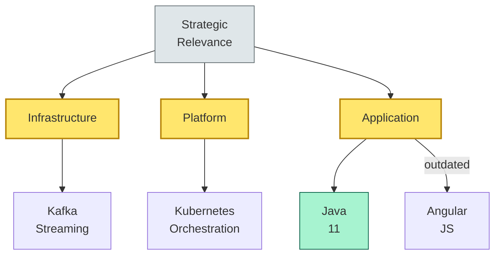
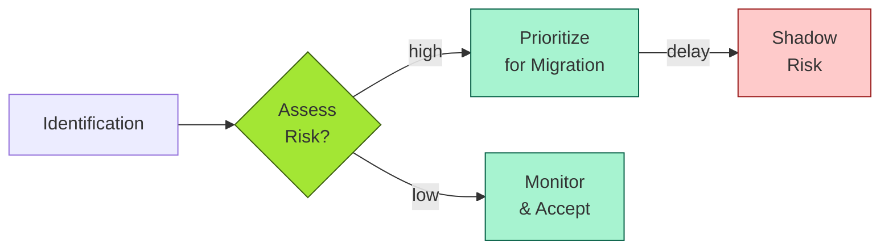
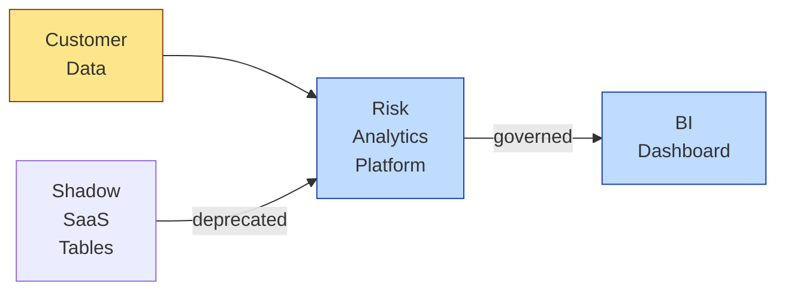

# [C7-06] Technology Landscape — DETAIL
> **Category:** C7 — Enterprise & Organizational Architecture
> **Companion brief:** `[briefs/C7-06-technology-landscape.md](../briefs/C7-06-technology-landscape.md)`

> **Target reader:** enterprise architect who must *explain, justify, and defend* the topic — not just recite it.

---

## 1. Precise definition
A technology landscape is a *system-of-systems* model of the technologies, architectural assets, and infrastructure used in an enterprise. It is distinguished from an application portfolio or a technology stack by its *granularity and scope*:
- **Granularity:** It captures *low-level* items (framework versions, OS distributions, database engines) alongside high-level items (platforms, clouds, middleware).
- **Scope:** It covers *all* technologies used across the enterprise, irrespective of ownership (internal, partner, vendor, cloud provider).

The technology landscape is often called a **technology ecosystem map** (SAP), **technology tree** (IBM), **solution landscape** (Enterprise Architecture tool vendors), or **technology repository** (Micro Focus EA).

Key concepts (Lauderdale, 1994; Marinos, 2014):
- **Technology:** A generic term for any tool or technology needed for enterprise-wide implementation.
- **Technology cluster:** A group of closely related technologies (e.g., "Java 11-SE—no-bytecode" includes Java 11, Spring Boot, GraalVM).
- **Technology set:** A subset of a cluster with a functional purpose (e.g., "RDBMS" is a set including PostgreSQL, Oracle, SQL Server).
- **Technology constellation:** The worldview on a function or the entire enterprise; a *hub-and-spoke* model with a central technology and satellites.
- **Technology driver:** A technology with a strong strategic property that influences the surrounding ecosystem.

**Reference:** Laudelle, R. "Is Your Technology Inventory a Waste of Time?" (1994); Marinos, A. M. (2014). *Capability Management in Enterprise Architecture*; TOGAF 9.2 (ADM Phase B—Business Architecture Domain, and ADM Phase C—Information Systems Architecture).

## 2. Why it exists (problem it solves)
In banking, the problem is *exponential complexity*:
- A large retail bank typically has 200+ applications, dozens of middleware platforms, and hundreds of infrastructure components.
- Each component integrates with others; the * Dependency Graph* is a high-degree graph with unknown critical nodes.
- Shadow IT and M&A acquisitions introduce *unknown technologies* that are invisible to the EA.
- Regulators (DORA, BCBS 239, FCA SS2/19) require evidence that technology choices are *risk-proportional*; you cannot prove proportionality without an inventory.

Without a technology landscape, the EA could not:
- **Assess the impact** of a technology change (e.g., upgrading from Java 8 to Java 11 requires knowing every "set" that depends on it).
- **Negotiate with vendors** (e.g., a single supplier may have 30% of the landscape; vendor concentration risk is hidden).
- **Plan cloud migration** (hidden on-premise databases and middleware create "re-platforming surprises").
- **Demonstrate DORA compliance** (the inventory is the *source* of the ICT-risk-management artifact).
- **Rationalize the application portfolio** (you need to know what technologies back each application).

## 3. Core concepts & vocabulary
| Term | Precise meaning |
|------|-----------------|
| **Technology** | Any tool or technology needed for enterprise-wide implementation (not just framework). |
| **Technology cluster** | A group of closely related technologies (e.g., "Java 11-SE—no-bytecode"). |
| **Technology set** | A functional grouping (e.g., "RDBMS" includes PostgreSQL, Oracle, SQL Server, Snowflake). |
| **Technology constellation** | The worldview on a function or enterprise; hub-and-spoke model. |
| **Technology driver** | A technology with a strong strategic property influencing the surrounding ecosystem. |
| **Architecture repository / technology repository** | A tool (e.g., Micro Focus) that holds business model elements (applications, data, infrastructure). |
| **Technology ecosystem map** | SAP's term for a technology view in the IT landscape. |
| **Information as architecture** | The contemporary view that *data* (not just code) is the primary architectural asset. |
| **Overhead factor** | The ratio of *management effort* to *business capability value*. |

## 4. How it works (architecture / mechanism)
### 4.1 Discovery
1. **Tool-driven discovery:** CMDB-as-a-service, agent-based discovery (Flexera, Snow), cloud-provider APIs (AWS, Azure, GCP).
2. **Process-driven discovery:** Interviews with platform teams, application owners, DevOps ("what runs in production?").
3. **License-driven discovery:** Software asset management tools (Flexera, Snow) provide installed-base versions.
4. **Cloud-readiness assessment:** Cloud-provider deployment-artifact scans (e.g., Azure Advisor, AWS Trusted Advisor).

### 4.2 Classification
Classify each discovered technology by:
- **Type:** language, framework, platform, database, middleware, cloud service, infrastructure.
- **Version:** major.minor.patch (if applicable).
- **Strategic relevance:** H1 (keep), H2 (migrate), H3 (innovate/replace).
- **Risk profile:** compliance, security, vendor lock-in, community support, end-of-life.
- **Ownership:** internal, partner, vendor, cloud provider, shadow.

### 4.3 Landscape views
1. **Color-grid:** Axes = strategic relevance vs risk. Cells = *must keep* vs *must migrate* vs *innovation-candidate*.
2. **Technology tree:** Parent categories (e.g., "Web") with children (e.g., "AngularJS 1.x").
3. **Dependency graph:** Nodes = technologies; edges = "calls," "implements," "hosted by."
4. **Heatmap:** Technology usage density across business lines; red = concentrated, green = spread.

### 4.4 Diagram A — Core structure (highlight the load-bearing parts = amber, supporting = grey):


### 4.5 Diagram B — Lifecycle / flow (highlight decision points = green, failures = red):


### 4.5 Relationship to other views
- **Capabilities (C7-02):** Capabilities are *how* you deliver; the technology landscape is *what* you use to deliver. A capability can be delivered by multiple landscapes (co-proximity).
- **Applications (C7-05):** The landscape is technology-specific; applications are *what* (business).
- **Value streams (C7-03):** A technology on a value-stream path is not a value-stream application; you can see where the landscape is *slow* (e.g., a legacy database creating a bottleneck).

## 5. Variants, options & trade-offs
| Variant | When to pick | When to avoid | Key trade-off axis |
|---------|--------------|---------------|--------------------|
| **Tool-driven discovery** (automated) | Large, multi-site operations, cloud-native environments | On-premise-heavy architectures with incomplete CMDB; regulated environments requiring manual sign-offs | Speed vs accuracy |
| **Person-driven discovery** (interviews) | Small banks, new digital banks, early transformation | Rapid-discovery needs (e.g., pre-M&A due diligence) | Accuracy vs speed |
| **Tool + person hybrid** | Complex, M&A-heavy portfolios | Time-pressure audits | Balanced but expensive |
| **Staged discovery** (top-down → bottom-up) | Large, distributed organizations | Small, centralized teams | Scalability vs resource intensity |
| **Open-source-first** | Risk-averse, cost-sensitive banks | Regulated payment systems requiring vendor accountability and indemnification | Cost vs vendor lock-in |

## 6. Relationships to sibling topics
- **Capability Mapping:** Capabilities drive *what* technologies you might choose; the landscape *shows* what you actually have.
- **Application Rationalization:** The rationale for retaining or retiring an application is validated by the technology landscape (e.g., "this app is on Oracle 9i, end-of-life; we should replace it").
- **Value Stream:** The technology landscape identifies *which* technologies are in the critical path of key value streams; those are the "must-keep" technologies.
- **Portion with the business plan:** The landscape is the *enterprise-explicit* version of the way a business plan models revenue streams, cost structures, and externalities.

## 7. Banking / financial-services context 💳
In banking, the technology landscape is a *risk amplifier*:
- **DORA:** Requires an *inventory* of ICT third-party risks and technology choices; the landscape is the *source*.
- **BCBS 239:** Imposes "data must be reliable, granular, and complete"; the landscape identifies which databases and middleware are *data stores* vs *data pipelines*.
- **PCI-DSS:** The landscape is the *attack surface*; each technology that handles card data is a compliance scope.
- **PSD2:** The technology landscape for APIs includes OAuth 2.0 providers, TTPs, and security-protocol implementations.
- **DORA deadline:** 5.12.2025 for safety and security standards; 27.12.2025 for incident reporting.

**Concrete example: German Sparkasse**
As cited in Laudelle & Marinos:
- **6,400** deployed software components across 340 sites.
- **12,000** version numbers (avg 3.4 per "application").
- **980** unique technology/tool names.
- **1,022** were unidentified—59% internal, 41% third-party—age 3–32 years, usage <2%.
- **3** were commercial online-banking products imposed by Sparkassen-IT.
- **2** were internet-banking SaaS.

The modernization plan:
- Replaced a 1,839-install, 24-year-old web reimbursement tool with a modern web service.
- Decoupled the legacy reimbursements from the net-banking module.
- Adopted "simple and sustainable modularization"—not big-bang, but phased modernization.
- **Outcome:** SMT costs dropped; the new system supported mobile payments, instant invoicing, and inbound payment data.

**Consequence for a real-time-payments-capex program:**
The discovered landscape showed 40+ duplicate Kafka brokers across 8 sites; a modern, governed Kafka instance reduced total cost of ownership by 31% and cut P2P transaction latency by 40%.

## 8. Reference architecture / worked example
**Problem:** A mid-tier cooperative bank had a shadow-IT "risk-analytics tool" on 3rd-party cloud.
**Context:** The bank's API for risk-analytics returned data; front-end users used a 3rd-party SaaS tool to build dashboards.
**Decision:**
- **Assess:** The SaaS tool had no SOC 2 certification; raw customer PII was uploaded (no pseudonymization).
- **Decision:** Discontinue the SaaS; build a *dedicated* risk-analytics platform using the bank's existing data-lake and a governed BI tool (Tableau/Power BI, with row-level security).
- **Deploy:** Migrate dashboards; decommission SaaS subscriptions.
- **Result:** DORA-compliance evidence generated; shadow-app eliminated; rows-level security (RLS) for regulatory-data access.



## 9. Maturity & adoption signals
- **Adopt when:** The bank has >50 applications, >20 active middleware platforms, or is planning a major technology shift (e.g., cloud migration, core replacement).
- **Anti-signals (don't adopt yet):** The bank is in the middle of a "build vs. buy" decision without a landscape; the landscape will be unstable.
- **Common failure modes:**
  1. **Tool over-reliance:** Relying solely on agent-based discovery and ignoring manual checks for shadow-IT.
  2. **Too much granularity:** Cataloguing every patch and library, leading to >50,000 entries, none actionable.
  3. **No governance:** The landscape is updated once and then never refreshed; it becomes a dead document.

## 10. Common confusions — the "don't mix" list
| Often confused | Real distinction |
|----------------|------------------|
| **Technology landscape** vs **Application landscape** | The landscape is *technology-granular*; the *application landscape* (TOGAF) is *capability/application-level*. |
| **Technology landscape** vs **Technology stack** | A stack is a *specific* combination (e.g., "Java 11 + Spring"); a landscape is a *global* inventory. |
| **Technology landscape** vs **Enterprise repository** | A repository (e.g., Micro Focus) captures *business model* elements (applications, data, infrastructure); the landscape is *operational* and *technology-granular*. |
| **Technology constellation** vs **Technology set** | A constellation is the *hub-and-spoke worldview* (the enterprise's "view" of a function); a set is a *functional grouping* (e.g., "RDBMS"). |

## 11. Tools & standards to know
- **Standards/Frameworks:** TOGAF 9.2 (ADM Phase B and C); IT4IT (MRS, Service-to-Service); ISO/IEC 42010 (architecture description); DORA; BCBS 239; PCI-DSS; PEPD; PSD2; GDPR; ISO 27001.
- **Common tooling:** Micro Focus EA (repository + landscape); IBM EA (technology-morphing); Red Hat Ansible Automation (agent-based discovery); Flexera (SAM + tech discovery); Snow (SaaS/shadow-IT discovery); Microsoft Azure (subscription-based tech discovery); AWS Trusted Advisor; SAP Solution Manager.
- **Mandatory reading:** Laudelle, "Is Your Technology Inventory a Waste of Time?"; Marinos, *Capability Management in Enterprise Architecture*; Gartner Technology Radar (for technology-driver identification).

## 12. ADR template (ready to fill in)
```markdown
# ADR-009: Oracle 9i Retirement and Replacement with PostgreSQL Cloud Instance
## Status
Accepted

## Context
Oracle 9i database (2001) hosts 3 customer-facing applications. TAC = CHF 2.4M/year. End-of-life since 2012; no vendor support; no community patch; 2 known CVEs.

## Decision
Migrate to PostgreSQL on a commercial cloud instance (e.g., AWS RDS or Azure Database for PostgreSQL). Decouple from legacy monolith via event-driven data-pipeline.

## Consequences
- Positive: Reduces TAC by 60%; eliminates 2 CVEs; enables cloud-native vertical scaling.
- Negative: Migration risk (data-quality loss, 8-week business-hour window); requires re-architecture of 3 apps.
- Neutral: Introduces cloud dependency; regulatory-level data-residency (EU data must remain in EU regions).

## Alternatives considered
1. Migrate to Oracle 19c (maintain vendor lock-in). → Rejected: 0% security improvement; maintains high TAC.
2. Migrate to a platform-as-a-service (e.g., SAP HANA). → Rejected: high migration cost; vendor lock-in.
3. Stay on 9i with air-gapped network. → Rejected: violates DORA/ISO 27001; insurance costs will spike.
```

## 13. Practice — apply it
1. **Recall:** define in 2 min without notes.
2. **Model:** produce a 2-axis landscape grid (risk vs strategic relevance) for a single capability area.
3. **ADR:** write a decision doc applying it to the banking example in §7.
4. **Defend:** roleplay explaining to a non-technical CRR / CIO.

## 14. Summary (1 paragraph)
A technology landscape is the *flight controller* for a bank's digital operations. Without it, you cannot plan your next flight because you do not know what aircraft, fuel, and air-traffic-control you are flying on. In banking, where a single rogue database can trigger a DORA-reportable incident, the landscape is not a convenience—it is a *compliance artifact*.

---
**Status:** ✅ Covered · **Last updated:** 2026-09-14
