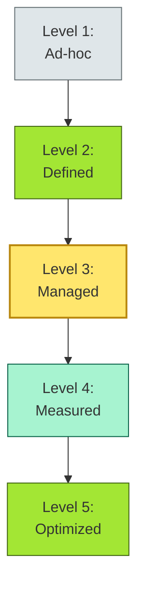
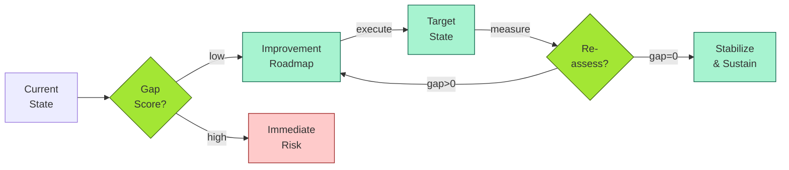
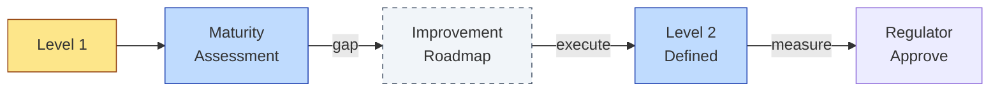

# [C7-07] Maturity Model — DETAIL
> **Category:** C7 — Enterprise & Organizational Architecture
> **Companion brief:** `[briefs/C7-07-maturity-model.md](../briefs/C7-07-maturity-model.md)`

> **Target reader:** enterprise architect who must *explain, justify, and defend* the topic — not just recite it.

---

## 1. Precise definition
A maturity model is a framework that describes the *maturity* of an enterprise's capabilities, processes, or organizational structures, typically expressed as ordered stages or levels with associated behavioral characteristics, metrics, and improvement pathways.

Key definitional dimensions:
- **Levels:** Discretely defined levels (commonly 3–5), each with distinct behavioral descriptors and measurement criteria.
- **Assessment:** A structured evaluation of current-state practices against level definitions, usually via surveys, interviews, and evidence (e.g., documents, metrics).
- **Gap analysis:** The delta between current and target states, including root-cause identification and remediation roadmap.
- **Improvement roadmap:** A time-phased plan to close gaps, with milestones, dependencies, and resource requirements.

The most widely adopted structure is the Capability Maturity Model Integration (CMMI), a process-improvement model that has spawned domain-specific adaptations:
- **CMMI:** Organizational process maturity.
- **CMMI-DEV:** Software development.
- **CMMI-SVC:** Service development.
- **CMMI PDU (Acquisition):** Contract and acquisition.
- **CMMI-CL (Projects):** IT-management.

In enterprise architecture, maturity models are often *customized* for a specific domain (e.g., IT service management: ITIL 4; software quality: CMMI-DEV; digital operational resilience: DORA-compliant; data governance: DAMA DMBOK; enterprise architecture: TOGAF 9.2 maturity model).

**Reference:** Paulk, M. C., et al. (1993). *Capability Maturity Model for Software, Version 1.1*. SEI; ISO/IEC 33063 (CMMI V3.0); ISO/IEC 15504 (SPICE).

## 2. Why it exists (problem it solves)
The core problem is *objectivity in transformation*. Without a maturity model:
- **EAs report fuzzy improvements:** "We have improved the architecture" is unverifiable.
- **Regulators demand evidence:** DORA requires a *management* level that includes "ICT risk-management and data-security posture" as an indicator of maturity.
- **Leadership needs comparability:** A CIO cannot compare "Platform A" (crafted) vs. "Platform B" (ad-hoc) without a common yardstick.
- **Vendors sell "maturity" as a product:** Without a rigorous definition, maturity models become marketing exercises.

In banking, the problem is acute because:
- **DORA (EU) requires:**
  - ICT risk-management measures (including cyber-resilience).
  - Digital operational resilience testing.
  - Incident reporting.
  - The *maturity* of these practices is a *core* assessment criterion.
- **Consumer Duty (UK FCA)** requires:
  - "Good outcomes" for vulnerable customers.
  - The *journey* from current to target must be *demonstrated*.
- **Basel III/IV:**
  - Operational risk capital (SREP) requires evidence of *risk management* maturity.
  - Model risk management (Model Governance) is explicitly maturity-assessed.

### 2.1 Financial incentive
A bank at Level 1 "Ad-hoc" for DORA will face *higher supervisory scrutiny* and *potentially higher capital requirements*. A bank at Level 3 complete (managed) is on the path to Level 5, which signals *predictive resilience* and may reduce regulatory premiums.

## 3. Core concepts & vocabulary
| Term | Precise meaning |
|------|-----------------|
| **Current-state assessment** | The baseline measurement against which improvement is tracked. |
| **Target-state** | The desired future maturity level and the capabilities required. |
| **Gap analysis** | The delta between current and target states, including root-cause identification and remediation roadmap. |
| **Maturity-driven planning** | The practice of using maturity levels to prioritize improvement initiatives. |
| **Approach:** | The set of practices (concept, method, technique) used to achieve a level. |
| **Practice:** | A specific implementation of an approach. |
| **Capable:** The maturity of a *specific* capability, process, or organization, not necessarily the overall enterprise. |
| **Level:** A stage on the path from ad-hoc to optimized (typically 1–5). |
| **Indicator:** A measurable artifact (survey response, metric, document, interview) used to assess an approach. |

### 3.1 CMMI-inspired level definitions
| Level | Label | Characteristics |
|-------|-------|-----------------|
| **1** | Ad-hoc / Initial | Unpredictable results; ad-hoc processes; hero-driven; no standardization. |
| **2** | Managed / Repeatable | Processes are repeatable; basic project management; planning, monitoring, control. |
| **3** | Defined / Standardized | Processes are institutionalized; standard processes across the enterprise. |
| **4** | Quantitatively Managed | Processes are measured and quantified; performance driven. |
| **5** | Optimizing | Continuous improvement; innovation; predictive risk management. |

## 4. How it works (architecture / mechanism)
### 4.1 Assessment process
1. **Scope definition:** Choose domain (e.g., IT service management, digital operational resilience, data governance).
2. **Level design:** Define 1–5 levels with behavioral descriptors for each approach.
3. **Evidence collection:** Surveys, interviews, document review, metrics (MTTR, change-lead-time, default rate, error rate, incident rate).
4. **Scoring:** Assess approach by approach, using an indicator scoring table (0–1 or 0–10, 10 = capable).
5. **SWOT analysis:** Compare current vs. target (gap analysis).
6. **Improvement plan:** Prioritize high-impact, high-urgency gaps in a time-phased roadmap.
7. **Re-assessment:** Re-assess at 12–24 month intervals to track progress.

### 4.2 Diagram A — Core structure (highlight the load-bearing parts = amber, supporting = grey):


### 4.3 Diagram B — Lifecycle / flow (highlight decision points = green, failures = red):


### 4.4 Indicator scoring
Each *approach* is assessed via *indicators*:
- **Survey** (0–10): Expert opinion on practice existence.
- **Metric** (0–10): Objective measurement (e.g., MTTR < 1h = 10, MTTR > 24h = 1).
- **Document** (0–10): Presence of policy or procedure.
- **Interview** (0–10): Confirmed by stakeholder testimony.
Each indicator is weighted; the *average* per approach determines the level.

## 5. Variants, options & trade-offs
| Variant | When to pick | When to avoid | Key trade-off axis |
|---------|--------------|---------------|--------------------|
| **Custom-built model** | Unique regulatory environment or business context | Standard frameworks already exist (CMMI, COBIT) | Precision vs. comparability |
| **Benchmarked model** (ISACA, ASG, Gartner) | Need external credibility; vendor-agnostic | Regulation is specific (DORA, FCA Consumer Duty) | Local relevance vs. global benchmarking |
| **Multi-domain model** | Complex enterprise with multiple maturity tracks | Simple, contained domain | Granularity vs. overhead |
| **Binary/3-level model** | Rapid assessment; resource-constrained | Need granular improvement targets | Speed vs. fidelity |

## 6. Relationships to sibling topics
- **Capabilities (C7-02):** Capabilities have *capability maturity indicators* (CMI) that measure how well a capability is delivered.
- **Value Stream (C7-03):** Mature value streams are *measured* and *quantified* (Level 4+); immature ones are ad-hoc (Level 1).
- **Application Rationalization (C7-05):** The *application portfolio* has a maturity level (e.g., "we always optimize our duplicates").
- **Portfolio Roadmap (C7-04):** The roadmap is the *improvement vehicle*; the maturity model is the *yardstick*.

## 7. Banking / financial-services context 💳
In banking, maturity is increasingly *regulatory currency*:
- **DORA:**
  - Requires ICT third-party risk management to be *managed* (ISO/IEC 33002 baseline).
  - Incident reporting must be *measured* (MTTR < 1 hour for critical incidents).
  - The *maturity* of management is a *core* assessment criterion (SCO10, SCO11, SCO12, SCO13).
- **FCA Consumer Duty (UK):**
  - Requires evidence of *outcomes* for vulnerable customers.
  - The *journey* from current to target must be *demonstrated*.
  - A *maturity model* for vulnerability addresses is required by March 2025.
- **Basel III/IV:**
  - Operational risk capital requires evidence of *risk management* maturity.
  - Model risk management (Model Governance) is explicitly maturity-assessed (SR 11-7 / SR 12-7).

**Concrete example:**
A Dutch neobank used a 5-level DORA-aligned maturity model for "Digital Operational Resilience":
- **Level 1 (Ad-hoc):** No formal ICT risk-classification; no second-opinion on third-party ICT; no incident-response plan.
- **Level 2 (Defined):** ICT risk classification defined; fallback-testing manual; incident response exists but not tested.
- **Level 3 (Managed):** ICT risk management executed; fallback-testing automated; incident response tested annually.
- **Level 4 (Measured):** Continuous monitoring; incident response <1h for critical; third-party risk measures documented and monitored.
- **Level 5 (Optimized):** Predictive risk management using ML; self-healing; automated resilience testing.

At first, the neobank was assessed at Level 1. After 18 months, with targeted investments (SRE team, automated failover, third-party risk tool), it reached Level 3, satisfying the DORA *Interim Report* (5.12.2025) and *Final Report* (27.12.2025).

## 8. Reference architecture / worked example
**Problem:** A community bank needed to demonstrate "Capability Maturity" to its regulator for an asset-finance award.
**Context:** The bank lacked documented IT governance, had no formal incident-response plan, and its "data quality" process was ad-hoc.
**Decision:** Adopt CMMI-DEV Level 2 as the target; map each IT process (development, testing, deployment) to Level 2 attributes.
**Result:** Within 12 months, the bank documented development procedures, automated testing, and a change-advisory board. The regulator approved the asset-finance award, which required "defined processes" as a baseline.



## 9. Maturity & adoption signals
- **Adopt when:** The bank has a regulatory deadline; needs comparability; or is entering a complex transformation.
- **Anti-signals (don't adopt yet):** The bank is not ready to change; or there is no *target* being pursued.
- **Common failure modes:**
  1. **Score inflation:** Assessments are human-driven and optimistic; actual practice diverges from stated maturity.
  2. **No target:** A maturity model without a target level is a giant questionnaire.
  3. **Scope creep:** Trying to assess the entire enterprise at once; custom maturity models fail if not scoped to one business domain.

## 10. Common confusions — the "don't mix" list
| Often confused | Real distinction |
|----------------|------------------|
| **Maturity model** vs **Capability model** | A capability model is the *taxonomy* (what you *have*); a maturity model is the *measurement* (how *well* you use it). |
| **Maturity model** vs **Capability maturity assessment** | The first is the *framework*; the second is the *application* of the framework to a specific capability. |
| **Maturity model** vs **Benchmarking** | Benchmarking compares you to peers; a maturity model measures you against a *standard*. |
| **CMMI** vs **COBIT** | CMMI is process-improvement (how well you execute); COBIT is control-objective (what you must control). |

## 11. Tools & standards to know
- **Standards/Frameworks:** CMMI (SEI), ISO/IEC 33063 (CMMI V3.0), ISO/IEC 15504 (SPICE), ITIL 4, COBIT 2019, DORA (EU), FCA Consumer Duty (UK), Basel III/IV/SR 11-7, DAMA DMBOK (data mastery).
- **Common tooling:** 
  - **Surveys/interviews:** SurveyMonkey, Google Forms; Miro for collaborative assessment.
  - **Self-assessment:** CMMI Online Self-Assessment (COSA).
  - **Automated metrics:** Sentry (error rate), Datadog (MTTR), Jira (cycle time).
  - **EAMS:** Vantana, Praxiom, OpCon (for compliance-aligned maturity).
  - **Integration:** Confluence (process documentation), Jira (work-tracking), SharePoint (policy repository).
- **Mandatory reading:** Paulk et al., *Capability Maturity Model for Software, Version 1.1*; CMMI Institute, *CMMI for Development* (2010); DORA Final Framework and Regulatory Technical Standards.

## 12. ADR template (ready to fill in)
```markdown
# ADR-010: Adopt a DORA-Aligned Digital Operational Resilience Maturity Model
## Status
Accepted

## Context
DORA (EU) deadline 5.12.2025 for ICT risk management and incident reporting. Regulator expects a maturity-based evidence pack; current-state assessment shows Level 1 for ICT risk management and Level 2 for data security.

## Decision
Adopt a 5-level DORA-aligned maturity model. Target: Level 3 (Managed) by 5.12.2025, Level 5 (Optimized) by 2028. Key investments: automated failover testing, third-party risk-management SaaS, SRE team, ML-based anomaly detection on payment flows.

## Consequences
- Positive: Regulator confidence; reduced capital buffers; competitive advantage.
- Negative: 18-month timeline conflicts with other initiatives; requires senior-management budget reallocation.
- Neutral: Some processes would have been improved anyway, but the maturity model focus prioritizes DORA-mandated items.

## Alternatives considered
1. Wait for a generic regulator framework. → Rejected: DORA has a 5-year window; waiting until 2025 would be too late.
2. Outsource to a consultant. → Rejected: consultant-issued maturity assessment has no regulatory credibility; internal ownership is required.
```

## 13. Practice — apply it
1. **Recall:** define in 2 min without notes.
2. **Model:** produce a 5-level maturity model for a single process (e.g., "Change Management") using CMMI-inspired descriptors.
3. **ADR:** write a decision doc applying it to the banking example in §7.
4. **Defend:** roleplay explaining to a non-technical CRO / CIO.

## 14. Summary (1 paragraph)
A maturity model is the *scorecard* of transformation. In banking, where regulators increasingly require demonstrable, measurable progress, it converts vague "we are getting better" into auditable evidence. Without it, improvement is a hope; with it, it is a plan.

---
**Status:** ✅ Covered · **Last updated:** 2026-09-14
