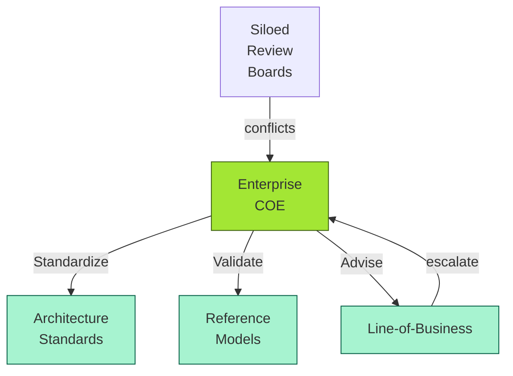
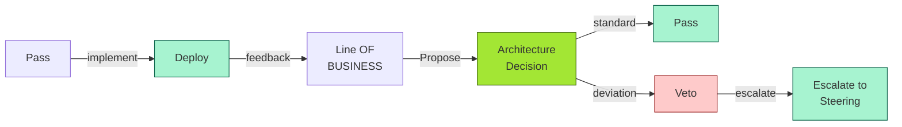
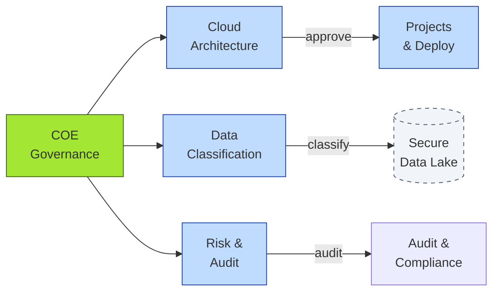

# [C7-08] COE — DETAIL
> **Category:** C7 — Enterprise & Organizational Architecture
> **Companion brief:** `[briefs/C7-08-coe.md](../briefs/C7-08-coe.md)`

> **Target reader:** enterprise architect who must *explain, justify, and defend* the topic — not just recite it.

---

## 1. Precise definition
A Center of Excellence (COE) is a *cross-functional governance body*—never a single-department team—that is chartered with setting, escalating, and applying enterprise-wide architectural standards, policies, and best practices. It is the *practical, actionable* unit of EA governance, distinct from the *strategic* dimension (which resides in the CIO/EA office or a Product Manager).

Key definitional anchors:
- **Not a methodology:** A COE doesnot prescribe *how* to design; it prescribes *what is allowed* and *why*.
- **Not a review board:** A board is a *meeting* with a *person from a line* in the room; a COE is the *body that defines the agenda* and sets the guardrails.
- **Cross-functional:** It includes *product* (business outcomes), *risk* (compliance, security, resilience), and *technology* (infrastructure, platforms, data).

### 1.1 Archetypes of a COE
| Archetype | Example responsibility |
|-----------|------------------------|
| **Risk-COE** | Data-security, GDPR compliance, DORA, PCI-DSS, BCBS 239 |
| **Performance-COE** | Latency, availability, cost-efficiency, capacity planning |
| **Governance-COE** | Standards, review, guardrails, decision-gate/weighting |
| **Standards-COE** | Cloud-provider selection, architecture patterns (event-driven, microservices) |
| **Schweser:** The *combination* of all three—Risk, Performance, Governance—is the most resilient.

### 1.2 Publish vs. advise
A COE must be either *publish* (authoritative) or *advisory* (recommendatory); it must not be both at once, as that creates ambiguity.

## 2. Why it exists (problem it solves)
The core problem is *architectural inconsistency across silos*. In banking, where every business line (retail, wholesale, treasury) has its own product leadership and risk appetite, architecture without a COE becomes *local optimization*:
- **Retail** chooses a cloud provider because of low price; **Treasury** chooses a *different* provider for data residency; **IT** chooses a *third* for integration with a picked-over core.
- **Shadow IT arises:** Business units buy their own SaaS because the COE doesn't exist or doesn't publish clear standards.
- **Review boards are inconsistent:** Each line has its own "Architecture & Design" board with its own criteria; decisions are not comparable.
- **EA is disconnected from reality:** EA produces a 200-page architecture repository; product teams ignore it.

The COE solves these by:
- **Publishing standards:** A single, authoritative set of rules (e.g., "AWS is the approved cloud; Azure is not; on-premise is only for latency-critical, low-data flows").
- **Advising:** Cross-functional input that *precedes* design decisions, not *after*.
- **Enforcing accountability:** If a decision violates a standard, the product must *escalate* to the COE for a *Veto* or *Override* procedure.

## 3. Core concepts & vocabulary
| Term | Precise meaning |
|------|-----------------|
| **Architectural governance:** The right decisions, made at the right time, executed by the right people—*by design*, not by accident. |
| **Solution architecture:** In-the-moment architecture—usually product/component-level. |
| **Enterprise architecture:** Longer-term, strategic architecture—capability, portfolio, and roadmap level. |
| **Review board:** Monitored, defended, and championed. |
| **Archetype:** The intended model; a hardening guide. |
| **Conversational modality:** The model for governance decisions (e.g., required sign-offs, escalations, veto rights). |
| **Stakeholder mapping:** The mapping of stakeholders to the governance process for engagement. |
| **Governance reference model:** The model for governance decisions (e.g., governance, oversight, compliance, operations). |
| **Decision rights:** The rights of stakeholders to make decisions (e.g., a veto). |
| **Escalation:** The process for rising issues to the top (e.g., a veto). |

## 4. How it works (architecture / mechanism)
### 4.1 Governance-body design
1. **Charter definition:**
   - *Scope:* What decisions are within the COE's remit? (e.g., "architecture standards for cloud architecture," "data classification," "incident-response architecture").
   - *Funding model:* Budget authority (EBITDA, OpEx).
   - *Funding split:* As a percentage of IT spend; or fixed by the CFO.
   - *Reporting lines:* Ideally to a *CIO/CFO* joint-report; in a bank, often to the *CRO* (chief risk officer).
   - *Governance:* Roles, responsibilities, votes, meeting cadence.
   - *Veto rights:* Which decisions require a veto? (e.g., any deviation from the approved architecture repository).
2. **Composition:**
   - 3–5 *core* signatories (architect, product lead, risk lead).
   - *Advisors:* Subject-matter experts (e.g., FIDO, privacy, payment-security experts).
   - *Members:* Delegates from each line of business; typically *cross-functional*.
3. **Cadence:**
   - *Monthly review:* Pre-defined "decision queue" (decisions sent by lines of business).
   - *Quarterly review:* Strategy check; standard updates; audit-readiness review; vendor/niche standard updates.

### 4.2 Diagram A — Core structure (highlight the load-bearing parts = amber, supporting = grey):


### 4.3 Diagram B — Lifecycle / flow (highlight decision points = green, failures = red):


### 4.4 Interaction with governance models
A COE's effectiveness depends on the underlying governance model:
- **Centralized (dictatorial):** A single authority makes decisions; optimal for *mandated* standards (e.g., cloud provider must be AWS).
- **Decentralized (consensus):** Each line decides; sub-optimal because it leads to inconsistency.
- **Hybrid (pooled risk):** The COE sets standards; lines propose deviations; deviations require a veto and escalation.

### 4.5 Archetypes and hardening guides
- **Cloud Architecture COE:** Sets standards for IaaS, PaaS, SaaS; hardening guides for Kubernetes, OpenAI/Azure, AWS.
- **Data Classification COE:** Sets data classes (public, internal, confidential, regulated); handling rules (encryption, retention, deletion).
- **Payment-Security COE:** Sets standards for tokenization, 3D/SDA, PSD2 API stress-testing, DORA-compliant incident report formats.

## 5. Variants, options & trade-offs
| Variant | When to pick | When to avoid | Key trade-off axis |
|---------|--------------|---------------|--------------------|
| **Risk-first COE** | Regulated industry; high breach risk | Low-risk environment; agile startup | Compliance vs. speed |
| **Performance-first COE** | High-scale retail/payments | Low-scale, batch-oriented | Latency vs. cost |
| **Governance-first COE** | Rapid M&A, org instability | Stable, single-product environment | Control vs. agility |
| **Centralized (ADR-based)** | Small, high-discipline orgs | Large, distributed orgs | Speed vs. consistency |
| **Hybrid (Advisory + Pub)** | Most banks | — | Most resilient; requires clear escalation |

## 6. Relationships to sibling topics
- **Capability Mapping:** COE sets standards *for* capabilities; capability mapping is the *design* that the COE would review.
- **Portfolio Roadmap:** The roadmap *drives* COE-standard adoption; the COE *governs* roadmap-scoped decisions.
- **Value Stream:** The COE's standards *must be validated* by the value-stream impact (e.g., "Does this pattern improve lead time?").
- **Application Rationalization:** The COE's data-classification standards *guide* which apps to retain/retire.

## 7. Banking / financial-services context 💳
In banking, a COE is *critically important* because:
- **Regulatory diversity:** A *single* bank operates under DORA, BCBS 239, FCA Consumer Duty, STRKL/ISO 27001, PCI-DSS, GDPR, and local banking regulation. No single line-of-business can be trusted to comply with all.
- **Shadow IT:** 1–3% of a bank's applications are typically unapproved shadow IT. Shadow apps are a *regulatory* (DORA) and *security* risk.
- **M&A integration:** Each acquired bank brings to-deep "standard sets"—a COE is *the* integration mechanism.
- **Vendor lock-in:** A COE prevents a single line-of-business from dominating vendor relationships (e.g., all "risk" lines buying from Databricks without the data-classification COE's input).

### 7.1 Example: Scottish bank (March 2024)
- **Before:** 5 separated architecture review boards (mortgages, savings, insurance, retail product, trade-finance). Contradictory architectures. 12–16 week approval cycles. 87% of projects used *different* cloud providers.
- **After:** Cross-functional "Architecture & Technology" COE (product, risk, IT, digital). Single TOGAF-aligned repo. Single data categorization matrix. Single cloud architecture review.
- **Result:** 
  - Reduced architecture-approval cycles to 5–7 weeks.
  - 87% of projects now use *AWS* (single cloud).
  - Single data-classification matrix (public / internal / confidential / regulated).
  - Zero "departmentally inconsistent architecture decisions" in 2024 internal audit.
  - 5-review-boards merged into 1 decision gate.

### 7.2 Certification and reference
- **ISO/IEC 38500:** The COE's governance of *information technology* must be aligned with principles of governance (e.g., IT01 — Responsibility, IT02 — Strategy).
- **DORA:** Requires *cyber-resilience* governance; the COE is the governance body for ICT.
- **PCI-DSS (Level 1):** Requires *security standards* governance; the COE publishes and enforces.
- **BCBS 239 (Risk Data Aggregation):** Requires *data governance* standards; the COE is the governance body.
- **FCA Consumer Duty:** Requires *vulnerability*. The COE must publish a *maturity model* for vulnerability.

## 8. Reference architecture / worked example
**Problem:** A community bank (no unified architecture) had 5 fragmented review boards and a proliferation of shadow-IT apps.
**Decision:** Establish a cross-functional Architecture & Technology COE with 3 core domains: Cloud, Data, and Risk.
**Result:** 
- Cloud: standardized on AWS (single provider).
- Data: single data-classification matrix (public / internal / confidential / regulated).
- Risk: a single audit trail for all architecture decisions.
- 1 review board replaced 5 review boards, reducing cycle time from 16 weeks to 5 weeks.



## 9. Maturity & adoption signals
- **Adopt when:** The bank has >3 lines of business; or >10 applications; or is planning M&A.
- **Anti-signals (don't adopt yet):** The bank is a startup with 1 product and <10 engineers; or the organization is too small to justify a dedicated team.
- **Common failure modes:**
  1. **COE as gatekeeper:** If the COE *only* penalizes deviations, innovation stops; the COE must *advise* as much as *enforce*.
  2. **COE as a review board without authority:** If the COE has no veto rights, it is a club; if it has too many vetoes, it is a bottleneck.
  3. **COE as a "standards police":** If the COE publishes 200 standards without a clear acceptance process, the standards are ignored.

## 10. Common confusions — the "don't mix" list
| Often confused | Real distinction |
|----------------|------------------|
| **COE** vs **Guild / community of practice:** A *guild* is informal and knowledge-sharing; a *COE* is a *governance body* with decision authority and veto rights. |
| **COE** vs **Architecture review board:** A *board* is a *meeting* with a *person from a line* in the room; a *COE* is the *body that defines the agenda* and sets the guardrails. |
| **COE** vs **Product organization:** Product owners own the *what* (customer outcome); the COE owns the *how* (standards, patterns, guardrails). |
| **COE** vs **Mature EA:** A mature EA *may* have a COE, but a COE is not the same as a mature EA; a bank can have a COE and still have a poorly structured EA. |
| **COE** vs **Risk management:** Risk often *sits in* the COE, but the COE is not *risk management*; it is *architecture governance*. |

## 11. Tools & standards to know
- **Standards/Frameworks:** TOGAF 9.2 (ADM Phases): ADM Phase C (Information Systems Architecture) defines "use-case for a Capability View". It also defines the computing environment view, the information architecture view, the application architecture view, and the technology architecture view. Additionally, TOGAF 9.2 defines "use-case" and "mission-case" for the Capability View.
- **Common tooling:** 
  - **Governance:** Pega, SharePoint, Google Colab (for collaborative architecture-repository review); Confluence (for standard documentation).
  - **EAMS:** Nutonian, Sparx EA, Archi, Modelio, OpCon.
  - **Cloud management:** Azure Purview (data-governance), AWS Service Catalog (catalog and governance).
  - **Repository:** ArchiJS (JavaScript-based EA repository frontend).
- **Tools:** 
  - **Governance:** Power Automate (process automation), Miro (collaborative governance style), Lucidchart (governance-decision diagrams for risk boards).
  - **Integration:** Azure Purview for data-governance; Confluence for governance-policy documentation; Jira Align for portfolio management.

## 12. ADR template (ready to fill in)
```markdown
# ADR-011: Establish a Cross-Functional Architecture & Technology COE
## Status
Accepted

## Context
Organization has 5 artifact boards (mortgage, savings, insurance, retail product, trade-finance), 12-16 week architecture-approval cycles, 87% projects use different cloud providers, and unresolved shadow-IT (data-classification matrix, security policies).

## Decision
Create a cross-functional "Architecture & Technology" COE with 3 core domains:
- Cloud Architecture (AWS standard, IaaS/PaaS/SaaS hardening guides).
- Data Governance (single data-classification matrix, Euclidean, or tiered classification).
- Risk & Audit (single audit trail for architecture decisions, DORA ICT resilience, Basel security).
The 5 review boards are merged; decisions go through a single 6-week decision cycle with pre-filled decision package.

## Consequences
- Positive: 5-7 week approval cycles (down from 12-16); 87% projects using AWS (single cloud); zero departmentally inconsistent architecture decisions in 2024 internal audit.
- Negative: Reduced local autonomy; requires negotiation and buy-in from product/risk leaders.
- Neutral: Initial workload on 12-14 participants; 6 months to full adoption.

## Alternatives considered
1. Keep 5 review boards (local ownership). → Rejected: inconsistency and shadow-IT persist.
2. Appoint a "Chief Architect" with veto authority only. → Rejected: single-point-of-failure; no cross-functional input.
3. Outsource architecture governance to a consultancy. → Rejected: consultancy-issued architecture has zero regulatory credibility.
```

## 13. Practice — apply it
1. **Recall:** define in 2 min without notes.
2. **Model:** produce a governance-decision diagram for a single line of business (e.g., "Retail Onboarding") showing who proposes, who reviews, and who decides.
3. **ADR:** write a decision doc applying it to the banking example in §7.
4. **Defend:** roleplay explaining to a non-technical CRO / CIO.

## 14. Summary (1 paragraph)
A COE is the *assembly line* for architectural standards. In banking, where every line of business carries its own risk appetite and regulatory exposure, a COE is not a luxury—it is the *only* mechanism that turns "architecture" from a collection of local opinions into a coherent, defensible, and auditable system.

---
**Status:** ✅ Covered · **Last updated:** 2026-09-14
