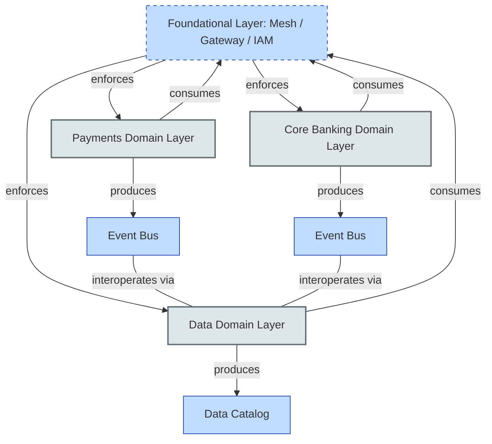

# [C8-01] Reference Architecture — DETAIL
> **Category:** C8 — Reference Architecture, Standards & Principles · **Difficulty:** ● · **Banking-relevant:** yes
>
> **Companion brief:** `[briefs/C8-01-reference-arch.md](../briefs/C8-01-reference-arch.md)`
>
> > **Target reader:** enterprise architect who must *explain, justify, and defend* the reference architecture to CIO, CRO, and board.

---

## 1. Precise definition
A **reference architecture** is a *prescriptive, reusable structural blueprint*—published and versioned by a cross-functional governance body—that defines the topology, interaction constraints, patterns, and quality-attribute tactics repeatable across the enterprise IT portfolio. It is not merely a “best-practice repository”; it carries *enforcement weight*: every solution architecture must be traceable to its published domain maps, and deviations require an Architecture Decision Record (ADR) reviewed by the Architecture Review Board (ARB).

Key distinction from ISO/IEC/IEEE 42010: where an “architecture” describes the *structure* of a single system, a reference architecture describes the *structure of structures*—the meta-architecture that governs a family of systems.

## 2. Why it exists (problem it solves)
Before reference architectures, banks experienced:
- **Duplication**: three payments platforms each rebuilt an API gateway, identity broker, and audit trail.
- **Inconsistency**: EU and US payment flows used different message formats and encryption key management, causing a SOX control breakdown during an IPO audit.
- **Governance debt**: each project claimed “custom requirements” to bypass standards, making the audit trail illegible in six months.

In 2022, a Tier-1 European bank’s GDPR remediation effort revealed that 23 microservices across retail and corporate channels each had their own “customer-identity” table, none sharing a canonical profile. The fix cost €18M and required six months of data consolidation. A reference architecture for identity governance would have forced a shared event-sourced profile service, eliminating the duplication.

## 3. Core concepts & vocabulary
| Term | Precise meaning |
|------|-----------------|
| **Reference architecture** | A versioned, domain-specific structural blueprint with constraints; consumed by multiple solution architectures. |
| **Solution architecture** | The architecture of one initiative, building *on* the reference architecture; may add local constraints. |
| **ADR (Architecture Decision Record)** | A lightweight, text-based document that records a *deviation* from the reference architecture with rationale, trade-offs, and approval. |
| **ARB (Architecture Review Board)** | A decision-making body with enterprise-architecture, product, security, and risk voices; enforces reference-architecture compliance. |
| **Domain map** | A visual/topological representation of the reference architecture for one business domain (e.g., Payments, Core Banking, Data). |
| **Platform enablement** | Delivering deployable, observable, secure building blocks (software factories, golden paths) so teams build *consistently* on top of the reference architecture. |

## 4. How it works (architecture / mechanism)
A reference architecture is installed via **three nested layers**:
1. **Foundational layer** — shared runtime (Kubernetes mesh, service mesh, API gateway, identity federation, secret management).
2. **Domain layer** — per-domain patterns (payments message schema, lending risk-engine API, data-mesh contracts).
3. **Governance layer** — ADR lifecycle, ARB review gates, tooling (policy-as-code, automated compliance scanning).

When a new solution architecture is proposed, it is *registered* against the reference architecture, *analyzed* for compliance (typically by an automated checker + manual ARB review), and *approved* with optional ADRs for justified divergence.

### 4.1 Diagrams
**Diagram A — Reference Architecture topology (foundational + domain):**


**Diagram B — ADR approval loop (highlighting risk = red, decisions = green):**
```mermaid
flowchart LR
    classDef ok fill:#a7f3d0,stroke:#065f46,stroke-width:1px
    classDef risk fill:#fecaca,stroke:#991b1b,stroke-width:1px
    classDef decision fill:#a3e634,stroke:#3f6212,stroke-width:1px
    
    Comply[{Compliance Check<br/>automated}]:::decision
    Check{{Draft ADR reviewed<br/>by ARB?}}:::risk
    Prev{Prior ADR<br/>conflicts?}:::decision
    
    Comply -->|pass| Check
    Comply -->|fail: retry later| Comply
    Check -->|no| Prev
    Check -->|yes: reject