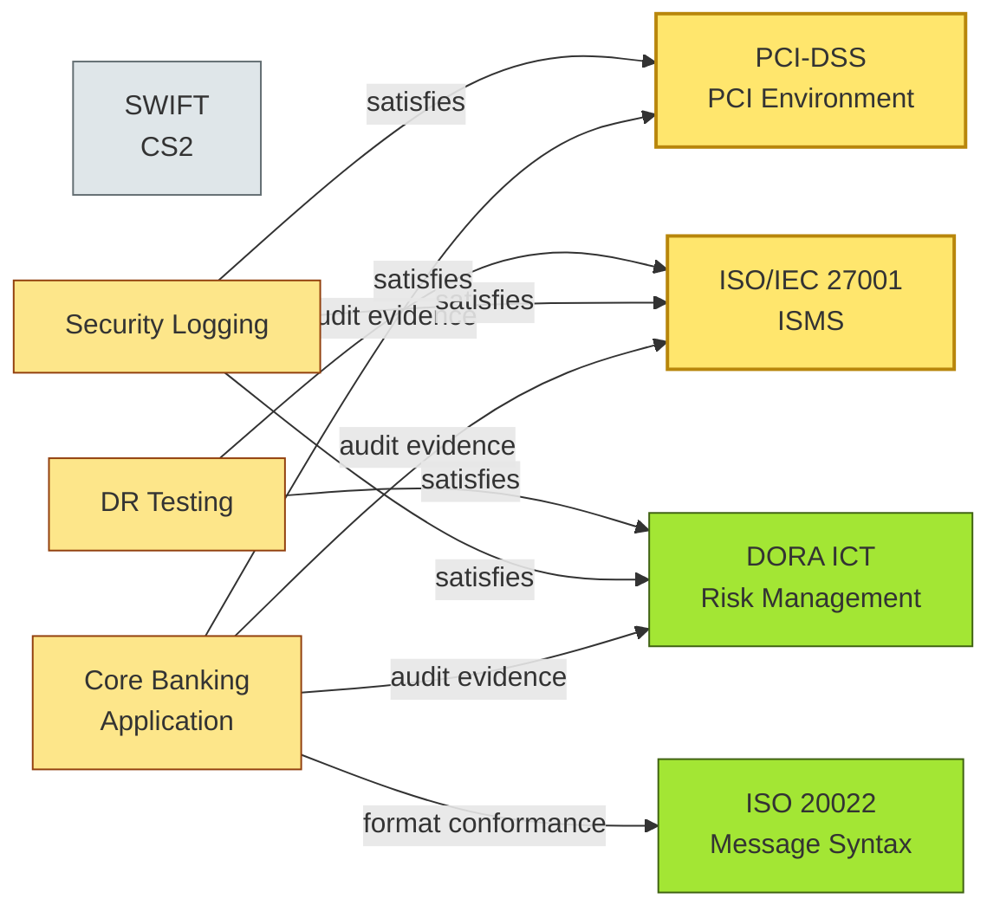

# [C8-02] Standards — DETAIL
> **Category:** C8 — Reference Architecture, Standards & Principles · **Difficulty:** ◑ · **Banking-relevant:** yes
>
> **Companion brief:** `[briefs/C8-02-standards.md](../briefs/C8-02-standards.md)`
>
> > **Target reader:** enterprise architect preparing a standards register for an audit or vendor-onboarding board.

---

## 1. Precise definition
In information-technology architecture, a **standard** is an explicit, documented, typically *testable* specification—issued by an accredited standards body (ISO/IEC, IEEE, IBBR) or by a dominant market consortium (SWIFT, ISO 20022) or by the enterprise itself—that constrains the form, interface, or behavior of an artifact or process. Standards are classified by *obligation* (mandatory vs. engineered vs. recommended) and by *scope* (technical, operational, regulatory).

IEEE 1471-2000 (now IEEE 42010-2021) frames *architecture description* as the “fundamental organization of a system embodied in its components, their relationships, and the principles and guidelines governing its design and evolution.” Standards are the *governing principles and guidelines* that make architecture description reproducible and auditable.

## 2. Why it exists (problem it solves)
Before explicit standards discipline, banking-system integration was:
- **Ad hoc**: each vendor implemented “ISO 20022” differently, producing a €12M harmonization project to align 40 payment-gateway implementations.
- **Inconsistent**: trading vs. risk systems used incompatible date-format standards (YYYY-MM-DD vs. DD/MM/YYYY), causing a €3.4M settlement failure during a platform migration.
- **Unauditable**: under DORA and NYDFS 23-NYCRR 500, the bank could not produce a map of which systems satisfied which ICT risk standard, forcing a 10-month remediation sprint.

## 3. Core concepts & vocabulary
| Term | Precise meaning |
|------|-----------------|
| **De jure standard** | Formally ratified by a recognized standards organization; carries implicit audit weight. |
| **De facto standard** | Market-adopted without formal ratification; still risky if it hardens into infrastructure (e.g., REST/JSON). |
| **Mandatory standard** | Required for operation in a regulated context; deviation is a control gap (PCI-DSS, DORA). |
| **Engineered standard** | Created by an industry body to solve a specific interoperability gap (ISO 20022, PSD2 XS2A). |
| **Endorsed standard** | Strongly recommended by governance; waivers require a documented ADR. |
| **Standards register** | A living artifact mapping each system, interface, or project to applicable standards, with evidence links (certs, scan reports, policy IDs). |
| **Overlap exploitation** | Using a single control to satisfy multiple standards (e.g., a SIEM feed satisfying PCI-DSS 10.2, ISO 27001 A.12.4.1, and DORA ICT risk monitor). |

## 4. How it works (architecture / mechanism)
Standards operate through **four enforcement vectors**:
1. **Design-time gates**: a standards-checker plugin rejects builds that violate a required standard (e.g., no TLS < 1.2).
2. **Procurement gate**: vendor RFPs reference mandatory standards; contracts include compliance clauses.
3. **Operational gate**: runbooks, monitoring, and incident-management templates must align with the standard’s evidence requirements.
4. **Audit gate**: the standards register is the primary artifact for external auditors and regulators.

When a new system is introduced, the EA requires a “standards fit” check: does it satisfy ISO 27001? DORA? BCBS 239? If yes, where is the evidence? If no, is there a documented waiver with compensating controls?

### 4.1 Diagrams
**Diagram A — Standards overlap and evidence sharing (data layer spans regulatory and technical standards):**


**Diagram B — Policy-as-code enforcement loop (highlighting critical = amber, risk = red, decision = green):**
```mermaid
flowchart TD
    classDef critical fill:#ffe66d,stroke:#b8860b,stroke-width:2px
    classDef risk fill:#fecaca,stroke:#991b1b,stroke-width:1px
    classDef decision fill:#a3e634,stroke:#3f6212,stroke-width:1px
    classDef ok fill:#a7f3d0,stroke:#065f46
    
    Dev[Developer<br/>Commit]:::decision
    Build[{Build Triggered}]:::risk
    Policy[Policy-as-Code<br/>Open Policy Agent]:::critical
    
    Dev -->|pushes| Build
    Build -->|gate| Policy
    Policy -->|pass| Deploy[{Deploy to<br/>Staging}]:::ok
    Policy -->|fail: evidence<br/>missing| Dev[Developer<br/>Resubmit]:::decision
    Deploy -->|promote| Prod[{Prod Gate}]:::critical
    Prod -->|fail: compliance<br/>drift| Dev
```

## 5. Variants, options & trade-offs
| Variant | When to pick | When to avoid | Key trade-off axis |
|---------|--------------|---------------|--------------------|
| **Mandatory standard with no waiver path** | Regulated card issuance, DORA-critical payment system | Early-stage innovation, grey-field migration | Control vs. agility |
| **Mandatory with engineered waiver (ADR required)** | Cloud migration, API-first rearchitecture | Low-risk internally-only tooling | Governance overhead vs. defensible deviation |
| **De facto standard (REST/JSON)** | Rapid prototyping, B2B partner onboarding | Core settlement or KYC where interoperability is legally mandated | Simplicity vs. auditability |
| **Proprietary standard** | Unique core-banking feature, competitive moat | Any customer-facing or regulatory-reportable interface | Differentiation vs. lock-in risk |

## 6. Relationships to sibling topics
- **Reference architecture:** reference architecture *recommends* standards; standards *constrain* reference architecture (e.g., DORA shapes the resilience patterns in the core-banking reference architecture).
- **Risk & resilience:** standards encode risk-control requirements (e.g., PCI-DSS encryption, DORA DR testing).
- **Vendor strategy:** vendor contracts are the procurement enforcement of standards; non-compliant vendors trigger vendor-risk scoring.

## 7. Banking / financial-services context 💳
In Basel-III reporting, a bank must map every risk-capture system to BCBS 239 data-principles (validation, completeness, accuracy, timeliness, uniqueness). The EA builds a standards register where each data-aggregator service is tagged with ISO 20022 (message validation) and Bodoga (DORA ICT incident logging). During the first-line BCP test, the EA discovers that a shadow node in the liquidity-reporting pipeline still emitted date-time in roman numerals because a DevOps engineer assumed internal-tool date format was exempt. The standards register—coupled with policy-as-code—would have caught this at the PR gate.

## 8. Reference architecture / worked example
**Problem:** The bank’s API-gateway marketplace had 17 independently procured gateways using different TLS settings, logging schemas, and identity-token formats. PCI-DSS certification lag extended from 45 to 180 days per gateway.

**Decision:** Adopt a *mandatory* reference architecture for all external API gateways, governed by PCI-DSS v4.0 and PCI SSC guidance, with an engineered-waiver ADR process for legacy data-center gateways.

**ADR:**
```markdown
# ADR-342: Mandatory PCI-DSS Aligned API Gateway Reference Architecture
## Status
Accepted
## Context
17 gateways, 180-day PCI recertification cycle, €3.2M/year audit consultancy, NO unified logging format.
## Decision
All new external API gateways must implement:
- TLS 1.2+ with OCSP stapling (PCI-DSS 4.0 4.1)
- Structured audit logs in CEF format, centralized to Splunk (PCI-DSS 10.6)
- Mutual TLS with per-service short-lived tokens (PCI-DSS 8.4.3)
Engineered waivers possible for legacy DP gateways via a 90-day migration plan approved by ARB.
## Consequences
- Positive: PCI recertification down to 45 days; unified alerting.
- Negative: 2 legacy data-center gateways require EOL planning.
- Negative: teams previously building ad-hoc auth must adopt mTLS on their first WSDL contract.
## Alternatives considered
1. Allow each gateway team to pick its own standard. → Rejected: fragmentation increased audit cost.
2. Mandate ISO 27001 only. → Rejected: PCI-DSS covers cardholder data scope, ISO 27001 does not.
```

## 9. Maturity & adoption signals
- **Adopt when:** you have 3+ domains, cross-team initiative dependencies, and a regulatory audit cycle.
- **Anti-signals (don't adopt yet):** fewer than 3 active systems, no cross-border partners, and a single technical leader.
- **Common failure modes:** (1) creating standards that no one can implement; (2) failing to map overlaps, causing duplicate controls; (3) letting standards become static—uncorrected after vendor deprecation.

## 10. Common confusions — the "don't mix" list
| Often confused | Real distinction |
|----------------|------------------|
| **Standard vs guideline** | Method buyer counts as a *specification*; guidelines are advisory and not tested. |
| **Mandatory standard vs legal requirement** | The requirement is *law*; the standard is the *specification* that demonstrates compliance. |
| **De facto vs de jure standard** | De facto = market habit; de jure = ratified body. Both can be mandatory in context. |
| **Reference architecture vs standard** | Reference architecture is an *internal blueprint*; standard is an *external or internal specification* that constrains it. |

## 11. Tools & standards to know
- **Standards/Frameworks:** ISO/IEC 27001, PCI-DSS v4.0/v4.1, IEEE 1471/42010, DORA, BCBS 239, ISO 20022, PSD2 XS2A, IBBR, SEPA Rulebook, SWIFT UFIG.
- **Common tooling:** Open Policy Agent (OPA), Rego, SonarQube, Veracode, Qualys SCA, Jira Align, Confluence, architecture-decision registers (ADRiffic), GitLab Duo.
- **Mandatory reading:** “Architecture Decisions: Defining and Documenting Architectural Knowledge” by O’Reilly; “The Role of Standards in Enterprise Architecture” — Fraunhofer IESE.

## 12. ADR template (ready to fill in)
```markdown
# ADR-XXX: <decision>
## Status
Accepted | Proposed | Deprecated

## Context
...

## Decision
...

## Consequences
- Positive ...
- Negative ...
- ...

## Alternatives considered
1. ...
2. ...
```

## 13. Practice — apply it
1. **Recall:** define standards and give one banking example in 2 minutes without notes.
2. **Model:** draw a standards-register matrix (systems vs. standards) for a trading, retail, and payments application.
3. **ADR:** write an ADR justifying the choice of REST/JSON over SOAP for a new B2B payments sandbox.
4. **Defend:** roleplay explaining to a non-technical CRO why we cannot treat de facto standards as legally sufficient for PCI-DSS.

## 14. Summary (1 paragraph)
Standards are the structural contract between a bank’s architecture and its regulators, partners, and auditors. They shrink integration risk, provide defensible evidence, and expose overlap when exploited correctly. An enterprise architect who treats standards as optional constraints—rather than as enforceable, auditable criteria—creates a the same governance debt that regulators and insurers will punish.
