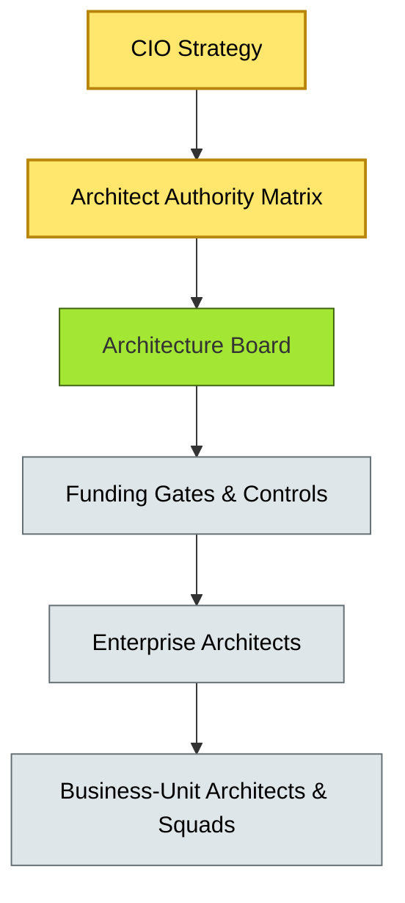
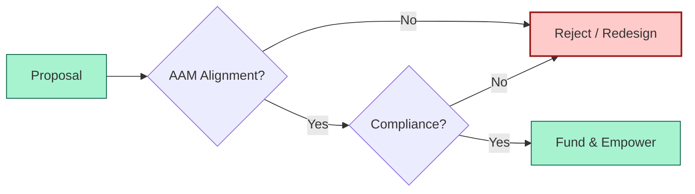
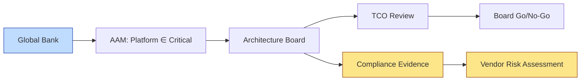

# [C9-01] EA Practice Governance — DETAIL
> **Category:** C9 — Governance, Management & Strategy · **Difficulty:** ● · **Banking-relevant:** yes
>
> **Companion brief:** `[briefs/C9-01-ea-practice-governance.md](../briefs/C9-01-ea-practice-governance.md)`
>
> > **Target reader:** enterprise architect who must *explain, justify, and defend* the topic — not just recite it.

## 1. Precise definition
EA Practice Governance is the organizational framework that assigns decision rights, funding authority, and compliance verification procedures to the architecture function and its consumers. It is the *constitution* of the Enterprise Architecture (EA) practice. It answers three questions: Who can decide whether a technology proposal aligns with the enterprise strategy? How are architectural initiatives funded and measured? What evidence proves compliance with internal and external standards?

This is distinct from *enterprise governance* (risk, audit, legal) and *architecture governance* (case-by-case review of a specific proposal). EA Practice Governance is meta-governance: it sets the rules for the rule-setters.

## 2. Why it exists (problem it solves)
In a bank, thousands of IT, business, and partner proposals surface annually—a cloud migration, a new card-scheme integration, a wholesale-to-end-user API product. Without EA Practice Governance:

- **Decision conflicts:** Two business lines adopt incompatible data-governance tools, causing integration failures and data-quality incidents that affect AML screening.
- **Funding opacity:** Capital is allocated to business-unit initiatives that duplicate spending (parallel CRM deployments) or omit enterprise-required components (missing data lineage for a new trade-finance platform).
- **Compliance gaps:** No one is explicitly accountable for ensuring that an architecture decision satisfies DORA ICT-risk requirements; SOC-2 audits flag "missing conceptual boundary documents."
- **Value opacity:** The organization cannot prove that its multi-million-euro architecture investment delivered the claimed business outcome.

EAs invented EA Practice Governance to turn architecture from an ad-hoc advisory activity into a first-class organizational capability with repeatable decision rights.

## 3. Core concepts & vocabulary
| Term | Precise meaning |
|------|-----------------|
| Architect Authority Matrix (AAM) | A role-to-decision matrix that assigns approve/fund/veto rights for architectural categories (e.g., "cloud platform strategy," "data-domain standards").|
| EA Value Realization | The discipline of tracking whether delivered architecture actually produced the claimed business outcomes, via controlled before/after comparison of KPIs.|
| Decision Rights | The formal or informal delegation of specific choices to a named owner, separate from general IT or project management authority. |
| Funding Gates | Scheduled checkpoints at which an architectural initiative must demonstrate compliance, risk sign-off, and cost-benefit evidence to receive further funding. |
| Governance by Design | Embedding governance checks into CI/CD pipelines and API platforms so that compliance and quality are automatic, not a separate process. |

## 4. How it works (architecture / mechanism)
EA Practice Governance operates through three layers:

1. **Strategic Layer:** The CIO, CRO, and CFO define the enterprise technology strategy and risk appetite, which establish the "North Star" that all EA governance serves.
2. **Governance Layer:** The Architecture Board, Architecture Standards Working Group, and Data Governance Council implement the AAM, set decision thresholds, and run funding gates.
3. **Execution Layer:** Business-unit architects, product squads, and third-party vendors operate within the decision rights and evidence requirements.

Artifacts such as the AAM, the Architecture Delivery Roadmap, and the Compliance Evidence Catalogue are living documents maintained by the central EA team.

### 4.1 Diagrams

**Diagram A — Governance layers (highlight the load-bearing parts = amber, supporting = grey):**


**Diagram B — Governance-by-design flow (highlight decision points = green, failures = red):**


## 5. Variants, options & trade-offs
| Variant | When to pick | When to avoid | Key trade-off axis |
|---------|--------------|---------------|--------------------|
| Centralized EA Practice Governance | Highly regulated bank with single-source-of-truth requirements; uniform risk appetite. | Distributed bank with strong country autonomy and no global standards needed. | Consistency vs local flexibility |
| Federated EA Practice Governance | Global bank with distinct regulatory regimes (e.g., US OCC, Brazil CVM, EU DORA) and multiple CIOs. | Bank where IT spending is centralized and all architecture must be uniform. | Standardization vs regulatory adaptation |
| AaaS-Enabled Practice Governance | Bank running large autonomous squads and needing self-service standards with automated enforcement. | Early-stage transformation where no repeatable standards exist yet. | Speed/automation vs maturity depth |

Trade-off: centralizing AAM simplifies audits but can create queue bottlenecks; federating it reduces latency but increases audit complexity and re-certification burden.

## 6. Relationships to sibling topics
- **Architecture Board (C9-02):** The AAM feeds members and decision rights to the Architecture Board; the Board enforces the AAM in practice.
- **Compliance & Audit (C9-03):** Compliance & Audit supplies the evidence and thresholds that define the feed into Funding Gates.
- **Architecture-as-a-Service (C9-04):** AaaS is a *delivery model* for EA Practice Governance—how the standards and decision rights are exposed to squads.
- **Delivery Models (C9-06):** The choice of delivery model (centralized, federated, bimodal) shapes how the AAM is instantiated across the organization.
- **Metrics & KPIs (C9-08):** EA Value Realization metrics derive directly from the governance layer; they prove whether the AAM is producing intended outcomes.

## 7. Banking / financial-services context 💳
A global Tier-1 bank operates under DORA (EU), OCC (US), and CVM (Brazil) regulations. The EA Practice Governance model assigns:

- **Global Payments Platform** decision rights exclusively to the Enterprise Architecture Board (critical path, multi-jurisdiction).
- **Country-level data-privacy controls** to local CDOs, but with mandatory reporting to enterprise risk and DPO.
- **Cloud migration** funding gates: every candidate service must pass a security-qualification gate before the central cloud-platform team provisions infrastructure.

Without this governance, the Brazil IT team selected a local card-processing vendor incompatible with the global switch, causing a payment-reconciliation incident and a CVM-audit finding.

Regulatory ties:
- **DORA** Art. 22 requires institutions to maintain an ICT-risk management framework with clear governance for critical ICT functions; EA Practice Governance is the operationalization of that requirement.
- **PCI-DSS** requires evidence of segmentation and change control; the AAM defines who can approve segmentation changes.
- **SOX** requires IT governance over financial reporting systems; EA Practice Governance maps that to the financial-system architecture review process.

## 8. Reference architecture / worked example
**Problem:** The bank is selecting a cloud-based KYC/AML-screening platform.

**Decision:** The AAM categorizes "KYC/AML screening platform" as a "critical-risk, global-standard" item requiring Architecture Board approval and funding-gate evidence.

**Diagram:**


**ADR:**
```markdown
# ADR-2026-004: Cloud-Based KYC/AML Screening Platform
## Status
Accepted
## Context
The retail bank's average KYC refresh cycle is 21 days. A cloud KYC/AML screening SaaS platform can reduce this to 48 hours and provide embedded watch-list updates. However, the platform will process personal data across EU and US jurisdictions.
## Decision
Adopt the platform under the AAM "critical-risk, global-standard" category, subject to Architecture Board approval, DORA ICT-risk qualification, and PCI-DSS segmentation review.
## Consequences
- Positive: 90% reduction in KYC cycle time; improved regulatory coverage.
- Negative: Ongoing SaaS dependency; exit complexity if vendor discontinues a data-residency option.
- Negative: Integration cost with existing core-banking onboarding workflows.
## Alternatives considered
1. Build an in-house KYC/AML microservice: high upfront cost, long timeline, full control.
2. Adopt a regional KYC vendor: lower integration cost for EU, but no US/Asia coverage.
```

## 9. Maturity & adoption signals
- **Adopt when:** The bank has multiple IT investment streams, measurable architecture outcomes, and a board-visible strategy.
- **Anti-signals (don't adopt yet):** Architecture is still reactive, one-off, and informal; no budget is ring-fenced for EA; business units reject centralized standards.
- **Common failure modes:**
  1. The AAM is published but not updated as the organization evolves, becoming a ceremonial artifact.
  2. Funding Gates are skipped under time pressure, and compliance evidence is retro-fitted.
  3. EA is perceived as a cost center with veto power only, leading to "governance by evasion."

## 10. Common confusions — the "don't mix" list
| Often confused | Real distinction |
|----------------|----------------|
| EA Practice Governance vs Risk Management Governance | EA Practice Governance governs the architecture function; Risk Management Governance governs business risk exposure and appetite. |
| Governance by Design vs Automation | Governance by Design embeds checks into platforms and pipelines; automation is the mechanism, not the concept. |
| AAM vs RACI | The AAM maps roles to *architectural* decision types; RACI maps roles to *project* activities. An AAM can be embedded inside a RACI. |

## 11. Tools & standards to know
- **Standards/Frameworks:** TOGAF 10 Part III (Enterprise Governance), ISO/IEC 38500 (IT governance), ITIL 4 (service value system), DORA ICT-risk framework.
- **Common tooling:** Jira Align / Miro (AAM visualization), Confluence (policy and standards docs), GitHub / GitLab (policy-as-code), ServiceNow GRC (controls mapping).
- **Mandatory reading (if any):** TOGAF 10 Part III (Enterprise Governance), "The Decision Rights Standards" by H.L. Sturgis.

## 12. ADR template (ready to fill in)
```markdown
# ADR-XXX: <decision>
## Status
Accepted | Proposed | Deprecated
## Context
...
## Decision
...
## Consequences
- Positive ...
- Negative ...
## Alternatives considered
1. ...
2. ...
```

## 13. Practice — apply it
1. **Recall:** Define EA Practice Governance in 2 min without notes.
2. **Model:** Draw a three-layer governance model (strategic / governance / execution) for your own organization.
3. **ADR:** Write an ADR applying the AAM concept to a banking platform decision.
4. **Defend:** Role-play explaining to a non-technical CRO why the AAM is not a bureaucracy but a risk-control mechanism.

## 14. Summary (1 paragraph)
EA Practice Governance is the constitution of the architecture function. It assigns decision rights, funding, and compliance to the EA practice and its consumers, ensuring that every technology choice in a regulated bank can be traced to an approved authority, measured against a KPI, and validated by an independent auditor. Without it, modern banking transformations become collections of competing local optimizations that regulators, auditors, and risk officers cannot understand—a liability rather than an asset.
