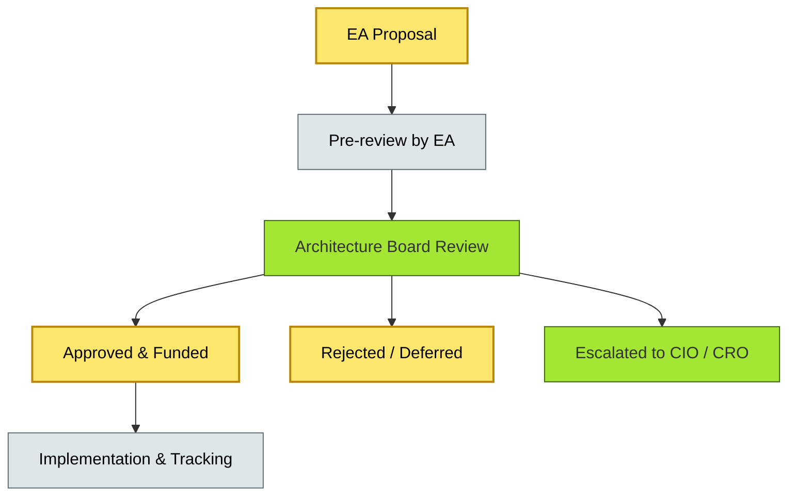
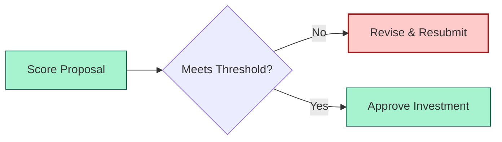
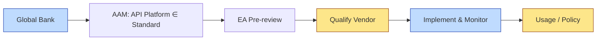

# [C9-02] Architecture Board — DETAIL
> **Category:** C9 — Governance, Management & Strategy · **Difficulty:** ● · **Banking-relevant:** yes
>
> **Companion brief:** `[briefs/C9-02-architecture-board.md](../briefs/C9-02-architecture-board.md)`
>
> > **Target reader:** enterprise architect who must *explain, justify, and defend* the topic — not just recite it.

## 1. Precise definition
An Architecture Board is a standing, chartered, cross-functional decision body of senior stakeholders from business, IT, risk, and compliance who meet on a regular cadence to review, approve, prioritize, or escalate material architectural proposals. It is not a mere advisory group; it is a decision authority with documented rights over enterprise-wide technology choices.

The board is governed by a *charter*—a document that defines its scope, membership, decision criteria, quorum, escalation paths, and review cadence.

It is distinct from a *Technical Review Board* (which reviews *how* to implement) and from a *Steering Committee* (which reviews *business* direction vs *enterprise* architecture).

## 2. Why it exists (problem it solves)
Without an Architecture Board, individual business units and IT departments make parallel, conflicting, or suboptimal technology decisions:

- **Platform duplication:** Two major retail banks' subsidiaries each select a different micro-services framework, forcing duplicate talent acquisition and support contracts.
- **Regulatory non-compliance:** A payments team selects a third-party vendor whose data-residency terms violate GDPR, discovered only during an audit.
- **Priority conflicts:** Two transformation programs compete for the same data-platform team; the outcome is determined by political influence rather than strategic alignment.
- **TCO blind spots:** Each unit negotiates its own licensing, but no one sees the enterprise-wide aggregation; total payments-software spend is invisible to the CFO.

The Architecture Board solves these by providing a *single, visible, and accountable forum* for resolving architectural competition and ensuring that every major technology choice is evaluated against strategy, risk, and cost criteria.

## 3. Core concepts & vocabulary
| Term | Precise meaning |
|------|-----------------|
| Charter | The governing document that defines the board's purpose, scope, membership, decision rights, escalation rules, and meeting cadence. |
| EDRB (EA Decision Review Board) | A board specifically focused on IT-architecture decisions; may be a sub-body of the full Architecture Board. |
| Escalation Path | The formal route for proposals that lack full approval authority or that require CEO/CRO/CFO intervention. |
| Decision Criteria | The weighted rubric (strategy-alignment, risk, TCO, compliance, vendor lock-in) used to score and compare proposals. |
| Runway | The budget or time window over which the board manages and approves a set of architectural initiatives. |

## 4. How it works (architecture / mechanism)
The Architecture Board operates through a *decision pipeline*:

1. **Submission:** Any stakeholder submits a proposal (e.g., "migrate payments system to cloud-native") through a standard template, including a TCO estimate, risk assessment, compliance mapping, and alignment score.
2. **Pre-review:** The EA team checks completeness, validates assumptions, and maps the proposal to the AAM (C9-01) to confirm the board has jurisdiction.
3. **Review Meeting:** The board meets (weekly/bi-weekly/monthly depending on charter); members score the proposal against criteria; the chair summarizes trade-offs.
4. **Decision:** The proposal is: Approved, Approved with Conditions, Deferrable, Rejected, or Escalated to a higher authority (e.g., CIO, CRO).
5. **Communication:** The decision and rationale are published in the central EA repository within a defined SLA.
6. **Post-decision:** The EA team tracks implementation against the approved decision and reports status at each Funding Gate (C9-01).

### 4.1 Diagrams

**Diagram A — Core structure (highlight the load-bearing parts = amber, supporting = grey):**


**Diagram B — Decision criteria scoring (highlight decision points = green, failures = red):**


## 5. Variants, options & trade-offs
| Variant | When to pick | When to avoid | Key trade-off axis |
|---------|--------------|---------------|--------------------|
| Full-scope Board (business + IT + risk + compliance) | Highly regulated bank where every major decision affects risk and customer data. | Small bank with low regulatory complexity and fast decision velocity. | Alignment robustness vs decision speed |
| IT-only Board (EDRB) | Technical modernization debate where business model is unchanged. | Decisions that touch customer experience, payments, or compliance directly. | Technical deep-dive vs cross-functional alignment |
| Bi-modal Board (Mode-1 + Mode-2) | Bank with regulated core (Mode-1) and digital products (Mode-2) requiring different cadences. | Organization that cannot sustain two meeting rhythms simultaneously. | Compliance rigor vs innovation speed |
| Federated Board (regional) | Global bank where region-specific regulations demand local decision authority. | Bank with a unified global technology strategy and low regional variance. | Local adaptation vs global standardization |

Trade-off: a larger board increases cross-functional alignment but slows decision velocity. A smaller board is faster but risks decisions that lack risk or business-line perspective.

## 6. Relationships to sibling topics
- **EA Practice Governance (C9-01):** The AAM and Funding Gates feed the board's membership and criteria; the board is the enforcement mechanism of the governance model.
- **Compliance & Audit (C9-03):** Compliance evidence is a mandatory input to board scoring; the board can escalate compliance-gap findings.
- **TCO / Cost (C9-05):** TCO estimates are a core scoring dimension; the board is a funding decision point.
- **Change & Adoption (C9-07):** Board-approved proposals become the target state that change management must realize.
- **Metrics & KPIs (C9-08):** Board decisions and their outcomes are itself a lagging metric (decision latency, approval rate, value realization).

## 7. Banking / financial-services context 💳
A global retail bank's Architecture Board, chaired by the CIO, includes the CRO, Chief Data Officer, AML head, and a business-line CFO. The board reviews:

- **Payments modernization proposals:** Each must pass AML risk screening, DORA ICT-risk qualification, and PCI-DSS segmentation review.
- **Core-banking roadmap:** Proposals are scored on deposit-system uptime, regulatory reporting fidelity, and exit-cost risk.
- **Third-party vendor selection:** Any vendor handling cardholder data or payment instructions requires a board-level risk and compliance dossier.

The board publishes its decisions in a public Confluence space, which the internal audit and external regulators can reference. A decision to postpone a cloud-migration of the real-time gross-settlement (RTGS) system by eighteen months (due to unresolved data-residency concerns) was documented, communicated, and later validated by an ECB review as "appropriate risk management."

Regulatory ties:
- **DORA Art. 22:** Requires oversight of ICT-risk; the Architecture Board is a key oversight mechanism.
- **PCI-DSS requirements:** Segregation and change-control decisions must be traceable to a decision authority; the board provides that.

## 8. Reference architecture / worked example
**Problem:** Selecting an API-management platform for a new open-banking initiative.

**Decision:** The open-banking initiative is a "strategic platform" requiring Architecture Board approval; a "standard infrastructure service" requires EA pre-review only.

**Diagram:**


**ADR:**
```markdown
# ADR-2026-003: API-Management Platform for Open Banking
## Status
Accepted
## Context
The bank must expose transaction and account-balance APIs to regulated third-party providers under the revised PSD2 framework. An API-management platform is required to enforce rate-limiting, consent management, and security policies.
## Decision
Approved via pre-review (AAM category: "standard infrastructure service"). Emerging from pre-review, the platform must be evaluated against DORA ICT-risk criteria before production exposure.
## Consequences
- Positive: Centralized policy enforcement; reduced integration effort per fintech partner.
- Negative: Single vendor lock-in; must run a security-qualification by 2027.
## Alternatives considered
1. Build an in-house API gateway: full control, high team cost, long timeline.
2. Adopt a managed PSD2-compliant platform: faster but with vendor lock-in risk.
```

## 9. Maturity & adoption signals
- **Adopt when:** The bank has a multi-million-euro technology portfolio, cross-functional teams, and board-visible digital strategy.
- **Anti-signals (don't adopt yet):** Every technology decision is informal and political; there is no backlog of competing proposals; the bank is too small for centralized architecture.
- **Common failure modes:**
  1. The board becomes a "veto committee" that kills all innovation; key fixes: explicit innovation/fast-track criteria.
  2. Board decisions are not communicated to squads, leading to re-work and mistrust.
  3. Membership is dominated by IT; absence of risk and business voices produces architecturally sound but commercially unusable decisions.

## 10. Common confusions — the "don't mix" list
| Often confused | Real distinction |
|----------------|----------------|
| Architecture Board vs Technical Review Board | The former decides *what* and *why*; the latter decides *how*. |
| Architecture Board vs Steering Committee | The former evaluates technical and architectural proposals; the latter evaluates business-case viability and financial returns. |
| Architecture Board vs Architecture Council | "Council" implies advisory/consensus; "Board" implies binding decision authority. |

## 11. Tools & standards to know
- **Standards/Frameworks:** TOGAF 10 Part III (Enterprise Governance), ISO/IEC 38500, ITIL 4, DORA ICT-risk framework.
- **Common tooling:** Confluence (proposals and decisions), Miro (charter and criteria workshops), Jira Align (backlog), GitHub/Confluence (ADR repository).
- **Mandatory reading:** TOGAF 10 Part III (decision governance), "The Architecture Review Board" in TOGAF.

## 12. ADR template (ready to fill in)
```markdown
# ADR-XXX: <decision>
## Status
Accepted | Proposed | Deprecated
## Context
...
## Decision
...
## Consequences
- Positive ...
- Negative ...
## Alternatives considered
1. ...
2. ...
```

## 13. Practice — apply it
1. **Recall:** Define the Architecture Board in 2 min without notes.
2. **Model:** Draw the decision pipeline from proposal to implementation.
3. **ADR:** Write an ADR applying the board to a banking platform decision.
4. **Defend:** Role-play explaining to a non-technical CRO why board delays protect the bank from regulatory risk.

## 14. Summary (1 paragraph)
The Architecture Board is the single, visible, accountable forum that turns competing technology choices into portfolio-aligned, risk-validated decisions. It is chartered, cross-functional, and outcome-oriented; without it, modern banking becomes a series of local optimizations that regulators, auditors, and the CFO cannot reconcile.
