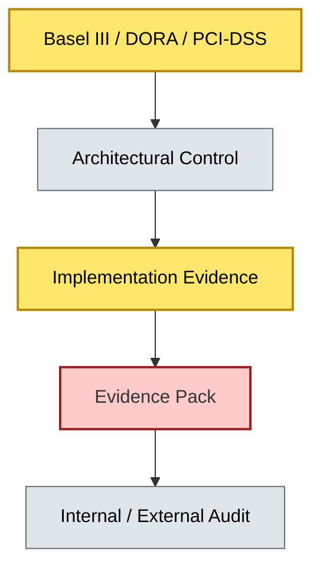
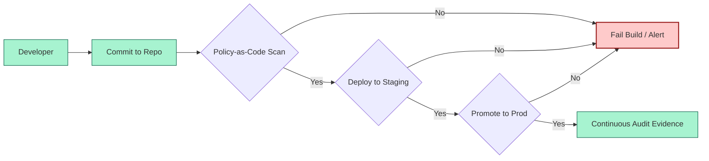
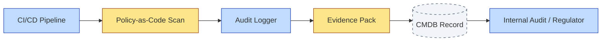

# [C9-03] Compliance & Audit — DETAIL
> **Category:** C9 — Governance, Management & Strategy · **Difficulty:** ●● · **Banking-relevant:** yes
>
> **Companion brief:** `[briefs/C9-03-compliance-audit.md](../briefs/C9-03-compliance-audit.md)`
>
> > **Target reader:** enterprise architect who must *explain, justify, and defend* the topic — not just recite it.

## 1. Precise definition
Compliance and audit in enterprise architecture is the set of architectural controls, evidence, and verification activities that prove an organization's systems, processes, and governance structures satisfy legal, regulatory, and contractual requirements.

It distinguishes between *architectural compliance* (design-time guarantees encoded in standards and patterns) and *audit compliance* (evidence production for internal or external reviewers). The EA function is responsible for the former; it must design for the latter from day one.

Regulatory frameworks commonly implicated: DORA (EU), PCI-DSS (payment cards), SOX (US financial reporting), Basel III (bank capital), GDPR (data protection), PSD2 (open banking).

## 2. Why it exists (problem it solves)
In banking, non-compliant architecture is an *illegal* architecture. Regulators (e.g., ECB, OCC, FCA, CVM) can levy fines in seven figures, restrict operations, or revoke licenses. Common failure modes that compliance architecture prevents:

- **Data-residency violations:** A SaaS vendor stores Swiss client data on US infrastructure, breaching GDPR Art. 44 and CVM-regime 2 of Circular 3333.
- **Opaque ownership:** No one can prove who owns a data-domain, violating DORA ICT-risk Art. 10 (traceability).
- **Undocumented segmentation:** Firewalls between the cardholder and non-cardholder environments were never documented, so PCI-DSS assessors cannot produce a segmentation map.
- **Undocumented change:** A core-banking patch is deployed without an architectural change record, violating SOX 302 (internal control over financial reporting).

Without compliance-oriented architecture, the bank faces unpredictable remediation costs, delayed product launches, and auditor findings that affect capital planning.

## 3. Core concepts & vocabulary
| Term | Precise meaning |
|------|-----------------|
| Control Traceability | The ability to map a regulatory requirement (e.g., "encryption of PAN at rest") to the architectural control, implementation evidence, and verification result. |
| Audit Trail | An immutable, time-stamped record of who changed which architectural artifact, when, and why—required for forensic and SOX compliance. |
| Compliance Debt | The accumulating technical and process debt created by shortcuts that defer regulatory alignment (e.g., "we will fix encryption in v2"). |
| Evidence Pack | A curated collection of logs, policies, scan results, and test evidence that proves a CI or relationship complies with an architectural or regulatory standard. |
| Continuous Compliance | A pattern where policy-as-code, automated scans, and CI/CD gates enforce compliance on every build, rather than only at audit time. |

## 4. How it works (architecture / mechanism)
Compliance and audit operate through a *design-for-compliance* loop:

1. **Regulatory ingestion:** Legal and risk teams translate regulations into architectural requirements (e.g., "SLA for outage recovery: Tier-1 payments systems, 15 minutes").
2. **Pattern embedding:** The EA team encodes those requirements into reference architectures, design patterns, and policy-as-code rules (e.g., Kubernetes PodSecurityPolicy, AWS SCPs).
3. **Evidence generation:** CI/CD pipelines produce logs, scan results, and architecture-decision records that constitute auditable evidence.
4. **Verification:** Internal auditors or external assessors independently validate that the evidence proves compliance.
5. **Remediation:** Gaps are traced to the originating architectural decision and corrected in a controlled change management process.

### 4.1 Diagrams

**Diagram A — Control traceability (highlight load-bearing parts = amber, supporting = grey):**


**Diagram B — Continuous compliance pipeline (highlight decision points = green, failures = red):**


## 5. Variants, options & trade-offs
| Variant | When to pick | When to avoid | Key trade-off axis |
|---------|--------------|---------------|--------------------|
| Design-Time Compliance (patterns + policies) | High-assurance regulated systems (payments, core banking). | Early startups or internal tooling with low regulatory exposure. | Assurance vs speed |
| Continuous Compliance (CI/CD-integrated) | High-velocity, regulated platforms that must release frequently. | Organizations with immature CI/CD or no policy-as-code capability. | Automation depth vs pipeline maturity |
| Evidence-Retrospective (audit-after) | Low-risk applications where cost of upfront governance exceeds expected penalty. | Any system affecting customer data, payments, or financial reporting. | Speed vs audit cost |
| Shared Compliance Platform (centralized evidence) | Banks with many regulated teams sharing common controls (encryption, identity). | Banks with highly domain-specific regulatory regimes (e.g., wealth vs consumer). | Reuse vs customization |

Trade-off: design-time compliance maximizes assurance but slows delivery; continuous compliance scales assurance but requires heavy platform investment.

## 6. Relationships to sibling topics
- **EA Practice Governance (C9-01):** Governs *who* is accountable for compliance; defines the AAM categories for "critical-risk" items.
- **Architecture Board (C9-02):** Reviews and escalates compliance-gap findings; owns the go/no-go decision for regulated projects.
- **Architecture-as-a-Service (C9-04):** Compliant patterns are the *product* of AaaS; the platform must expose only compliant-by-design templates.
- **Metrics & KPIs (C9-08):** Compliance-coverage KPIs and audit-finding rates are lagging indicators that prove the governance model works.

## 7. Banking / financial-services context 💳
A EU-headquartered retail bank applies Continuous Compliance to its open-banking API platform:

- **DORA Art. 22:** The bank publishes an ICT-risk classification per service; critical services (RTGS, card processing) are auto-scanned for missing encryption, segmentation, and logging controls.
- **PCI-DSS:** Every cardholder data environment must maintain a segmentation design doc in the CMDB; a quarterly automated scan validates the design matches the deployed state.
- **GDPR:** Architecture principles require Privacy-by-Design: data minimization, purpose limitation, and right-to-erasure mechanisms are embedded in API and data-model patterns.
- **Basel III:** Stress-testing outputs are validated by an architectural traceability matrix that maps each model input to a source system and approval record.

A real incident: an internal audit discovered that a newly-acquired subsidiary's payment switch was missing logging controls compliant with DORA. The bank had not enforced the central logging pattern because the acquisition team bypassed the AaaS catalogue. The remediation required a forced rollout; the cost was 18% higher than if the pattern had been enforced from day one.

Regulatory ties:
- **DORA** Art. 22: ICT-risk management framework with clear governance and reporting.
- **PCI-DSS** Req. 1, 2, 3: Secure network, secure systems, secure process—each requires architectural evidence.
- **SOX 302:** Management must certify financial reporting; IT general controls (ITGCs) must be designed and tested, requiring architectural documentation.

## 8. Reference architecture / worked example
**Problem:** Ensure a core-banking modernization project is continuously compliant with DORA and PCI-DSS.

**Decision:** The project adopts a "Compliance-as-Code" pipeline where every build produces an evidence pack proving encryption, access control, and audit-logging standards.

**Diagram:**


**ADR:**
```markdown
# ADR-2026-007: Continuous Compliance for Core Banking Modernization
## Status
Accepted
## Context
The bank is modernizing its core banking system to a cloud-native stack; the system processes cardholder data and payment instructions, triggering PCI-DSS and DORA requirements.
## Decision
Adopt a Compliance-as-Code pipeline that produces an evidence pack on every build, with evidence stored in the CMDB and validated by quarterly internal audit.
## Consequences
- Positive: Audit preparation time reduced by 80%; continuous monitoring replaces point-in-time reviews.
- Negative: Pipeline and CMDB maintenance cost; initial setup is 3 months of dedicated effort.
## Alternatives considered
1. Traditional audit-at-end-of-project: lower pipeline cost, high rework risk.
2. Manual controls review: immediate for pilot, non-scalable.
```

## 9. Maturity & adoption signals
- **Adopt when:** The bank operates in regulated jurisdictions, processes customer data or payments, and has a mature EA practice.
- **Anti-signals (don't adopt yet):** No regulatory or contractual compliance requirements; no CI/CD pipeline; CMDB is inaccurate or non-existent.
- **Common failure modes:**
  1. Controls are designed for a static architecture that changes more rapidly than the control can adapt (e.g., manual evidence collection).
  2. Evidence is stored in silos (s3 buckets, Jira tickets) not traceable to the architectural model.
  3. Compliance teams are seen as blockers; they are integrated into the delivery flow, not gated at the end.

## 10. Common confusions — the "don't mix" list
| Often confused | Real distinction |
|----------------|----------------|
| Compliance and Audit vs Risk Management | Compliance proves adherence to rules; risk management quantifies and mitigates business loss—different audiences and evidence standards. |
| Design-Time Compliance vs Continuous Compliance | Design-time embeds controls in architecture; continuous compliance enforces them automatically in CI/CD. |
| Compliance Debt vs Technical Debt | Compliance debt is a subset of technical debt; it is specifically the debt of deferred regulatory alignment. |

## 11. Tools & standards to know
- **Standards/Frameworks:** DORA, PCI-DSS v4.0, ISO/IEC 27001, SOX 2002, GDPR Art. 25 (Privacy by Design).
- **Common tooling:** Prisma Cloud / Wiz (cloud security posture), Checkov / OPA (policy-as-code), SonarQube (code quality & security), ServiceNow GRC (control traceability).
- **Mandatory reading:** PCI-DSS v4.0 Requirements, DORA final text (EU Regulation 2022/2554).

## 12. ADR template (ready to fill in)
```markdown
# ADR-XXX: <decision>
## Status
Accepted | Proposed | Deprecated
## Context
...
## Decision
...
## Consequences
- Positive ...
- Negative ...
## Alternatives considered
1. ...
2. ...
```

## 13. Practice — apply it
1. **Recall:** Define compliance and audit in architecture in 2 min without notes.
2. **Model:** Draw a control traceability map from a regulation to a deployed evidence pack.
3. **ADR:** Write an ADR applying compliance patterns to a banking platform decision.
4. **Defend:** Role-play explaining to a non-technical CRO why compliance is a design artifact, not an afterthought.

## 14. Summary (1 paragraph)
Compliance and audit are not the EA function's compliance checklist; they are the architectural contract with regulators, auditors, and the board. Designing for provable compliance from the first line of code—through control traceability, evidence packs, and policy-as-code—is the only sustainable path in banking.
