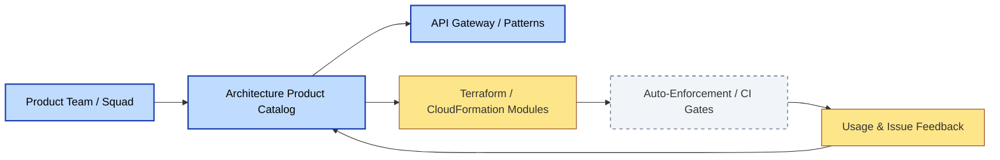
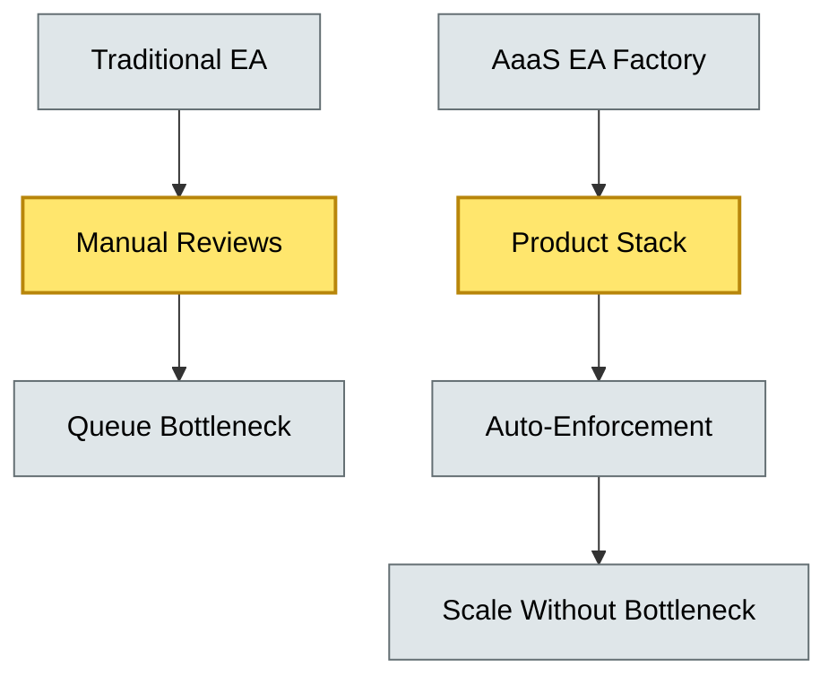
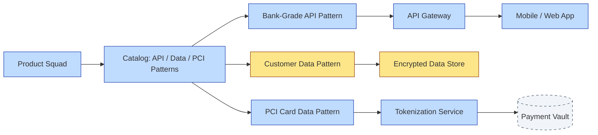

# [C9-04] Architecture-as-a-Service — DETAIL
> **Category:** C9 — Governance, Management & Strategy · **Difficulty:** ●● ●● ●● ●● || **Banking-relevant:** yes
>
> **Companion brief:** `[briefs/C9-04-arch-as-service.md](../briefs/C9-04-arch-as-service.md)`
>
> > **Target reader:** enterprise architect who must *explain, justify, and defend* the topic — not just recite it.

## 1. Precise definition
Architecture-as-a-Service (AaaS) is the provision of standardized, on-demand architectural guidance, patterns, and automated governance as a *product* to business units, agile squads, and third-party partners.

The core shift from traditional EA is from *advising on demand* to *providing pre-approved, consumable interfaces* that business teams can self-serve. AaaS includes:

- **Standardized patterns:** Reusable, validated architectural patterns (e.g., "PCI-compliant card data domain," "real-time fraud-detection pipeline").
- **Self-service governance:** Automated policy-as-code, CI/CD gates, and pre-qualified enforcement that evaluates compliance without human bottleneck.
- **Platform products:** Architectural standards, roadmaps, and support are managed like products—with product owners, roadmaps, SLAs, and usage analytics.
- **Enhanced reviews:** Lightweight, asynchronous architecture review for outliers and exceptions, not default approval.

AaaS is not "architects as a helpdesk"; it is "architects as product owners of compliance and quality."

## 2. Why it exists (problem it solves)
Traditional EA scales poorly:

- **Queue bottlenecks:** Architecture reviews become a linear bottleneck as squad count grows; a central EA team of 3 architects cannot review 30 squads per week.
- **Inconsistent quality:** Without enforced standards, different squads implement the same capability (e.g., a payments SDK) in incompatible ways, increasing integration and support cost.
- **Compliance drift:** Each squad reinvents data governance, security patterns, and logging, producing an un-auditable patchwork that SOC-2 and DORA assessors reject.
- **Architects burned out:** Functional, repetitive reviews drain senior architects from strategic decisions; AaaS re-routes routine work into automation and documented patterns.

In banking, AaaS lets the EA team scale influence without linear headcount growth, while maintaining regulatory consistency.

## 3. Core concepts & vocabulary
| Term | Precise meaning |
|------|-----------------|
| Platform Product Management | Treating architectural standards as products with stakeholders, roadmaps, documentation, and SLAs. |
| Self-Service Governance | Automated tooling (policy-as-code, CI gates, service-catalog approval) that enforces standards without human bottleneck. |
| Squad Enablement | The goal of AaaS: every squad is self-sufficient at the *standard* level, escalating only exceptions. |
| Product Owner for Architecture | The EA practitioner who owns the architecture standard as a product, with a roadmap, backlog, and feature team. |
| API / Terraform Modules | The consumable interfaces that encode a pattern (e.g., a Terraform module that creates a PCI-compliant data domain). |
| Exception Review | The human override path for cases that deviate from the standard; governed by the Architecture Board. |

## 4. How it works (architecture / mechanism)
AaaS operates as a *platform product organization* within the EA team:

1. **Pattern Design:** Architects design a pattern (e.g., "Bank-grade public-API with OAuth2 + rate-limit + WAF") with automated policy checks.
2. **Packaging:** The pattern is published as a Terraform module, a CloudFormation template, or a Git repository with CI checks (policy-as-code).
3. **Distribution:** The pattern is listed in a service product catalog (e.g., AWS Service Catalog, internal marketplace).
4. **Consumption:** Squads provision the pattern via self-service; the platform auto-enforces compliance.
5. **Feedback Loop:** Usage analytics, incident data, and squad feedback feed the product backlog; the product owner iterates.

The EA team shifts from *reviewer* to *product owner*: they own the standard, measure adoption, and improve it based on outcome data (not opinion).

### 4.1 Diagrams

**Diagram A — AaaS platform product model (highlight services = blue, data = yellow, boundary = dashed-grey):**


**Diagram B — Change from reviewer to product owner (highlight critical decision = amber, contexts = grey):**


## 5. Variants, options & trade-offs
| Variant | When to pick | When to avoid | Key trade-off axis |
|---------|--------------|---------------|--------------------|
| Pattern-Library AaaS | Bank with many repeatable domains (payments, KYC, data-lake) and moderate velocity. | Highly experimental projects or research prototypes. | Consistency vs flexibility |
| Full Platform AaaS (prod + CI + policy) | High-velocity squads with CI/CD maturity; need automation at every commit. | Org with immature dev-ops, no automated scanning. | Automation depth vs maturity |
| Federation AaaS (central patterns, local enforcement) | Global bank where central patterns exist but locales need local customization. | Bank with fully centralized IT and no local variables. | Global consistency vs local adaptation |
| Partner AaaS (inbound from fintech/third-party) | Bank building an open-banking ecosystem; external partners consume architectural services. | Closed-shop bank with no third-party access. | Ecosystem scale vs security boundary |

Trade-off: the more fully automated a product is, the less flexibility squads have for non-standard requirements. The exception-review path must be *expensive* (not free) to prevent standard bypass.

## 6. Relationships to sibling topics
- **EA Practice Governance (C9-01):** AaaS is the delivery model through which governance standards are exposed; the AAM still governs *exceptions*.
- **Architecture Board (C9-02):** The Board reviews and governs the portfolio of AaaS products; it is not bypassed by self-service.
- **Compliance & Audit (C9-03):** AaaS products are themselves compliant-by-design; audit evidence is generated automatically.
- **Delivery Models (C9-06):** AaaS is one of several delivery models (centralized, federated, bimodal) that a bank can adopt.

## 7. Banking / financial-services context 💳
A UK retail bank migrating to a micro-services architecture adopts AaaS for three domains:

- **Payments (psd2 gateway):** A standard Terraform module creates an API-gateway, rate-limiter, and audit-logger; squads select it from the catalog and provision in seconds.
- **KYC / AML data domain:** A standard pattern incorporates data-minimization and purpose-limitation policies; the data-product team owns the product.
- **PCI card-holder compliance:** A Terraform module provisions encrypted RDS, network segmentation, and access-control; SOC2 and PCI-DSS compliance are pre-verified.

Result: 12 squads onboarded in two months, with zero compliance-audit findings and a 60% reduction in architecture-review queue time.

A risk: a squad outside the program builds a "shadow" KYC microservice using a public open-source library without the data-minimization policy. The exception-review path catches it at the first CI gate; the squad is required to port to the standard pattern within two weeks or retire the service.

## 8. Reference architecture / worked example
**Problem:** Scale architecture governance for 15 product squads building customer-facing digital banking features, while maintaining PCI-DSS and GDPR compliance.

**Decision:** Adopt pattern-library AaaS with self-service Terraform modules and policy-as-code CI gates, governed by a central Architecture Product Owner.

**Diagram:**


**ADR:**
```markdown
# ADR-2026-005: Architecture-as-a-Service for Digital Banking
## Status
Accepted
## Context
The bank has 15 squads building customer-facing features; 3 squads recently deviated from PCI and data-privacy patterns, creating audit findings.
## Decision
Adopt AaaS: define 3 standard patterns (API gateway, data domain, PCI card-holder domain) as Terraform modules with OPA policy gates; squads self-serve via a product catalog. Exception review is required for any out-of-pattern choice.
## Consequences
- Positive: 90% of services now compliant within 48 hours of deployment; audit prep time reduced.
- Negative: Initial pattern design is 8 weeks of EA effort; squads need training on the catalog.
- Negative: The 3 squads' "shadow" services must be migrated or retired; some business-logic dependencies complicate porting.
## Alternatives considered
1. Keep manual reviews: lower platform cost, high queue latency and inconsistent quality.
2. Full bespoke customer solutions: maximum flexibility, maximum inconsistency and compliance risk.
```

## 9. Maturity & adoption signals
- **Adopt when:** The bank has multiple autonomous squads or product teams, moderate-to-high CI/CD maturity, and regulatory requirements that demand consistency.
- **Anti-signals (don't adopt yet):** Scarcely any automated scanning; squads are small and non-autonomous; no interest in standardizing patterns.
- **Common failure modes:**
  1. Patterns are too generic and do not fit real use cases; squads ignore them, creating shadow systems.
  2. The exception-review process is too easy (no cost to bypass); the standard framework collapses.
  3. Product owner role is a side duty with no budget or authority; patterns are not maintained and drift.

## 10. Common confusions — the "don't mix" up list
| Often confused | Real distinction |
|----------------|----------------|
| Architecture-as-a-Service vs Architecture Center of Excellence (CoE) | AaaS is productized and opt-in; a CoE is often a centrally staffed advisory body. |
| AaaS vs DevOps Pipeline Consultant | AaaS is about *what* to build (patterns and standards); DevOps is about *how* to build and operate it. |
| AaaS vs Internal Marketplace | AaaS is specifically about *architectural* standards and governance; a marketplace can sell any service. |

## 11. Tools & standards to know
- **Standards/Frameworks:** TOGAF 10 Part I (ADM), ITIL 4 (service value system), DORA ICT-risk, ISO/IEC 27001.
- **Common tooling:** HashiCorp Terraform / OpenTofu, Pulumi, AWS Service Catalog / Azure Blueprints, OPA / Kyverno (policy-as-code), GitHub / GitLab, Confluence.
- **Mandatory reading:** "Platform Engineering" by Guevara; "Team Topologies" by Skelton & Pais.

## 12. ADR template (ready to fill in)
```markdown
# ADR-XXX: <decision>
## Status
Accepted | Proposed | Deprecated
## Context
...
## Decision
...
## Consequences
- Positive ...
- Negative ...
## Alternatives considered
1. ...
2. ...
```

## 13. Practice — apply it
1. **Recall:** Define AaaS in 2 min without notes.
2. **Model:** Draw a platform-product model for an architecture domain in your organization.
3. **ADR:** Write an ADR adopting AaaS for a banking pattern (e.g., payments or KYC).
4. **Defend:** Role-play explaining to a non-technical CIO why "architects as product owners" is sustainable at scale.

## 14. Summary (1 paragraph)
Architecture-as-a-Service scales architecture influence by turning standards into consumable products, backed by automated governance. In banking, where consistency and compliance are non-negotiable, AaaS is the mechanism that lets the EA team stay strategic—defining what *must* be compliant—while squads self-serve safe, pre-approved paths.
