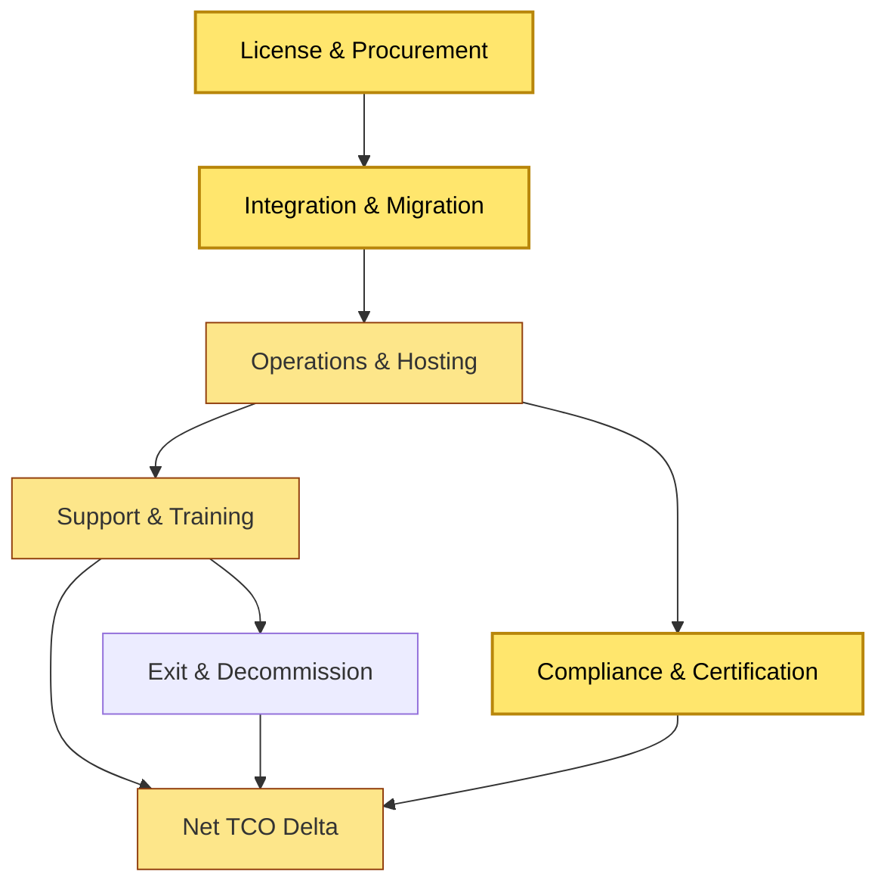
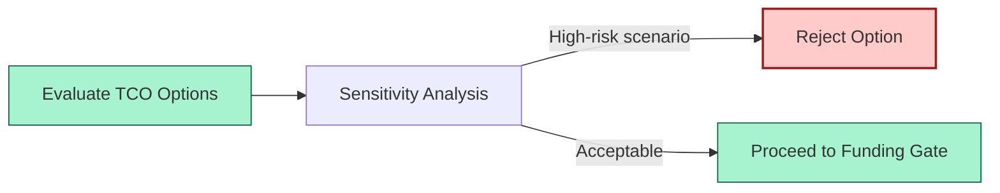
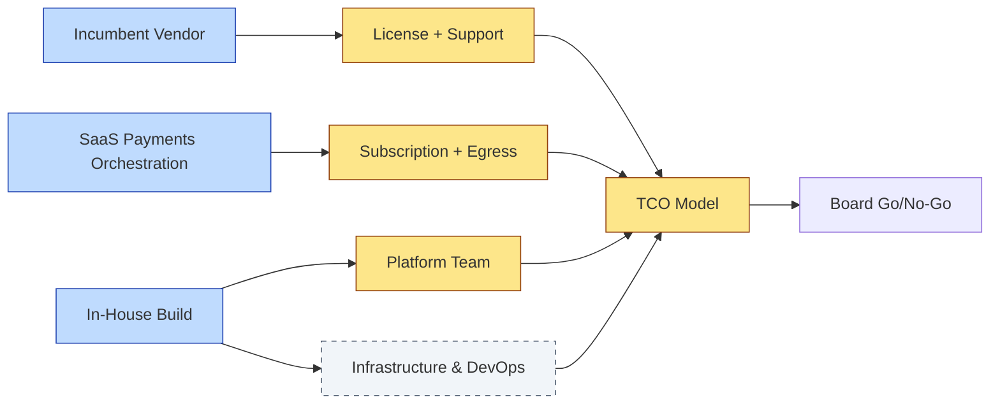

# [C9-05] TCO / Cost Modelling — DETAIL
> **Category:** C9 — Governance, Management & Strategy · **Difficulty:** ●● ●● ●● ●● ●● || **Banking-relevant:** yes
>
> **Companion brief:** `[briefs/C9-05-tco-cost.md](../briefs/C9-05-tco-cost.md)`
>
> > **Target reader:** enterprise architect who must *explain, justify, and defend* the topic — not just recite it.

## 1. Precise definition
Total Cost of Ownership (TCO) modelling in enterprise architecture is the practice of forecasting the *full lifetime cost* of a technology choice—including acquisition, integration, infrastructure, operations, security, compliance, training, support, resilience, and exit costs—to inform portfolio-level decisions, vendor negotiations, and business-case evaluation.

TCO is not a finance-only spreadsheet; it is an *architectural argument* comparing options on a common economic axis. The architect's job is to surface hidden costs (e.g., compliance certification, data-migration, vendor lock-in) that vendors often understate to win a procurement.

Key TCO components:
- **Now-case TCO:** Cost of maintaining the current architecture for one planning horizon.
- **Target-state TCO:** Projected cost of a proposed architectural option.
- **TCO Delta:** The signed difference, calculated as `Target-state TCO − Now-case TCO`.

## 2. Why it exists (problem it solves)
In banking, vendors of core-banking, cloud, and fintech platforms routinely quote a low per-user or per-transaction license fee while inflating *hidden* costs:

- **Integration cost:** Connecting a new SaaS KYC vendor to four legacy systems (CRM, core, data-warehouse, payments) requires 18 months of middleware development.
- **Compliance cost:** Each jurisdiction requires a separate certification exercise; a "single-tenant" cloud tenant may still need SOC-2, PCI-DSS, GDPR, and local regulator certifications.
- **Exit cost:** The "cloud is cheaper" argument ignores egress fees, data-export lock-in, and the cost of re-building a proprietary integration layer on-premise.
- **Transition cost:** The migration itself requires parallel operations for months, a technical-debt cleanup, and staff training.

Without rigorous TCO, the bank rationally chooses the lowest sticker price *and* overpays in total cost, or rejects a more expensive-but-lower-TCO option because the business-case team only sees the license fee.

## 3. Core concepts & vocabulary
| Term | Precise meaning |
|------|-----------------|
| TCO Delta | `Target-state TCO − Now-case TCO`; the net cost change of a proposal. |
| Now-case TCO | The baseline cost of the current architecture, including ongoing maintenance, licensing, and operations. |
| Target-state TCO | The projected cost of the proposed architecture over the same horizon. |
| Cost of Inaction | The TCO of continuing the current state; sometimes higher than migration when legacy systems carry un-remediated risk. |
| Sensitivity Analysis | Testing how the TCO delta changes with uncertain variables (e.g., transaction volume, salary inflation, vendor price increases). |
| Discounted TCO | A future-value-adjusted TCO model used for multi-year comparisons (common in bank capital planning). |

## 4. How it works (architecture / mechanism)
TCO modelling is a collaborative, architecture-led exercise:

1. **Scope definition:** Define the functional scope, boundaries, and planning horizon (e.g., 5 years) and identify which costs belong inside vs outside.
2. **Now-case inventory:** Catalog current licenses, infrastructure, headcount, support contracts, and regulatory on-going costs.
3. **Target-state inventory:** Catalog the proposed vendor or build costs, including implementation, migration, and integration estimates from the architecture team.
4. **Cost drivers:** Identify the big-ticket variables (SaaS subscription, FTE count, cloud egress, data-center colocation, compliance audits).
5. **Sensitivity & scenario:** Model optimistic, baseline, and pessimistic scenarios with ranges for uncertain drivers.
6. **Comparison & decision:** Compare TCO delta across options; note that a *negative* delta (cost saving) may come with *higher* risk, so do not over-index on the cheapest number.
7. **Evidence & assumptions:** Document every assumption (e.g., "5-year vendor price will not increase") so the finance team can stress-test it.

The EA team does not produce the final discounted TCO (that is finance's role); the EA team produces the *cost architecture model* with assumptions, integration estimates, and exit-cost analysis that finance thin-slices into a spreadsheet.

### 4.1 Diagrams

**Diagram A — TCO components (highlight critical costs = amber, supporting = grey):**


**Diagram B — Decision flow with sensitivity (highlight decision points = green, risk = red):**


## 5. Variants, options & trade-offs
| Variant | When to pick | When to avoid | Key trade-off axis |
|---------|--------------|---------------|--------------------|
| 3/5-Year TCO | Vendor selection, platform migrations, cloud-vs-on-premise decisions. | Highly uncertain R&D or innovation options with no baseline. | Precision vs uncertainty |
| Unit-Cost TCO (per transaction/account) | Banks that value software by volume; useful for comparing SaaS per-seat vs build-cost. | Fixed-cost platforms where variable cost is a small fraction. | Transparency vs simplicity |
| Risk-adjusted TCO | Decisions with high compliance, operational-risk, or exit-cost uncertainty. | Low-risk internal tooling with predictable costs. | Risk coverage vs calculation complexity |
| Now-case + Target-case dual model | Treasury and risk departments need to see both the cost of staying and the cost of moving. | Organizations that only fund greenfield projects. | Decision clarity vs reporting overhead |

Trade-off: longer TCO horizons reveal more hidden costs but increase uncertainty. A 1-year TCO may be misleadingly favorable; a 10-year TCO may be so uncertain as to be uninformative.

## 6. Relationships to sibling topics
- **EA Practice Governance (C9-01):** The TCO model is an input to *Funding Gates*; the AAM may require TCO approval for "critical-risk, global-standard" categories.
- **Architecture Board (C9-02):** The Board reviews TCO estimates as a core scoring dimension; it can escalate decisions where cost risk is material.
- **Compliance & Audit (C9-03):** Compliance-certification and audit costs are mandatory line items in a bank TCO; omitting them makes the model invalid.
- **Change & Adoption (C9-07):** Transition architecture and change-management costs are part of the TCO of a transformation, not just the software license.

## 7. Banking / financial-services context 💳
A US mid-market bank evaluates a core-banking migration from a legacy Amdocs-style system to a cloud-native fintech core. The vendor quotes a $2M/year license fee but no TCO model is provided.

The EA team builds a 5-year TCO model:
- **Now-case:** $3M/year (legacy license, data-center colocation, 8 FTEs, quarterly regulator self-assessments).
- **Target-case (vendor)**: $2M/year license + $800K/year integration maintenance + $400K/year compliance (SOC-2, PCI-DSS, DORA) + $600K one-time migration + $1.2M one-time training + $900K one-time data-migration testing.
- **Sensitivity:** If the vendor raises price 8% annually (common clause), the 5-year cost rises by $4.8M.

The *headline* 5-year target-state TCO is $2.6M/year (vs $3M now) — a 13% saving. However, the *risk-adjusted* TCO, including exit-cost and vendor-lock-in, rises to $3.4M/year, exceeding the now-case.

The Architecture Board reviews this: it approves the migration only if the vendor waives the 8% escalation clause and commits to open data-export.

Regulatory ties:
- **Basel III** (capital efficiency): the bank must capital-charge large, long-term commitments; TCO informs the capital-budget denominator.

## 8. Reference architecture / worked example
**Problem:** Compare three options for a payments-inbound/outbound gateway: (1) incumbent vendor, (2) SaaS payments-orchestration, (3) in-house build.

**Decision:** TCO modelling on a 5-year horizon reveals that In-house Build has the lowest *risk-adjusted* TCO due to predictable licensing, but the highest *transition* cost and longest time-to-value.

**Diagram:**


**ADR:**
```markdown
# ADR-2026-006: TCO-Based Gateway Selection
## Status
Accepted
## Context
The bank's payments-gateway is a single point of failure and the migration cost is material.
## Decision
Select In-House Build based on 5-year risk-adjusted TCO; approve a 24-month sandbox with a 60% team-uplift assignment.
## Consequences
- Positive: Long-term TCO 20% below incumbent; no vendor lock-in; full control over PCI-DSS segmentation.
- Negative: 24-month delivery timeline; requires escalation of 6 senior engineers from other squads.
- Negative: Initial build cost is 40% higher than SaaS; ROI is delayed by 18 months.
## Alternatives considered
1. Renew incumbent: lower transition cost, higher 5-year TCO, no exit flexibility.
2. Adopt SaaS: fastest to market, but 5-year TCO is 25% higher and exit cost is material.
```

## 9. Maturity & adoption signals
- **Adopt when:** The bank has a material technology budget, multiple platform decisions per year, and a board-visible cost-optimization mandate.
- **Anti-signals:** Every IT decision is approved on cap-ex alone; no mechanism for tracking on-going costs; no vendor lock-in exists (all open-source).
- **Common failure modes:**
  1. TCO model is built by finance alone and omits integration/technical debt estimates; the model is ignored by architects.
  2. Assumptions are hidden in spreadsheets without documented sources; sensitivity is never tested.
  3. TCO is used punitively ("this cost too much") without balancing risk, compliance, and strategic value.

## 10. Common confusions — the "don't mix" up list
| Often confused | Real distinction |
|----------------|----------------|
| TCO vs ROI | TCO is a cost forecast; ROI is a benefit/cost ratio. Architects must produce a credible TCO before ROI is calculable. |
| TCO | Net Present Value (NPV): NPV discounts future costs to today's value; TCO is nominal. |
| Cost of Inaction | Status-quo bias: sometimes the now-case TCO is *higher* than a migration because of un-remediated risk (e.g., a legacy core with no vendor support). |

## 11. Tools & standards to know
- **Standards/Frameworks:** TOGAF 10 Part III (value realization), ITIL 4 (service value system), DORA ICT-risk (capital and operational cost transparency).
- **Common tooling:** Excel/Google Sheets (cost model), Power BI / Tableau (scenario visualization), Jira (initiative tracking), Confluence (assumption docs).
- **Mandatory reading:** "Total Cost of Ownership: An Executive's Guide" by B. Williams; "Cloud TCO" by Matrix Group.

## 12. ADR template (ready to fill in)
```markdown
# ADR-XXX: <decision>
## Status
Accepted | Proposed | Deprecated
## Context
...
## Decision
...
## Consequences
- Positive ...
- Negative ...
## Alternatives considered
1. ...
2. ...
```

## 13. Practice — apply it
1. **Recall:** Define TCO in 2 min without notes.
2. **Model:** Choose one of your bank's current stacks and build a 3/5-year now-case TCO from license, infrastructure, and support line items.
3. **ADR:** Write an ADR adopting a TCO-based evaluation process for a procurement decision.
4. **Defend:** Role-play explaining to a non-technical CFO why a vendor's low sticker price is not the cheapest option.

## 14. Summary (1 paragraph)
TCO modelling is the architect's economic translation: it turns technical choices into budget language the board can compare. In banking, where every dollar is scrutinized by regulators and the CFO, a rigorous TCO—including hidden compliance, integration, and exit costs—is the only rational basis for architecture decisions.
