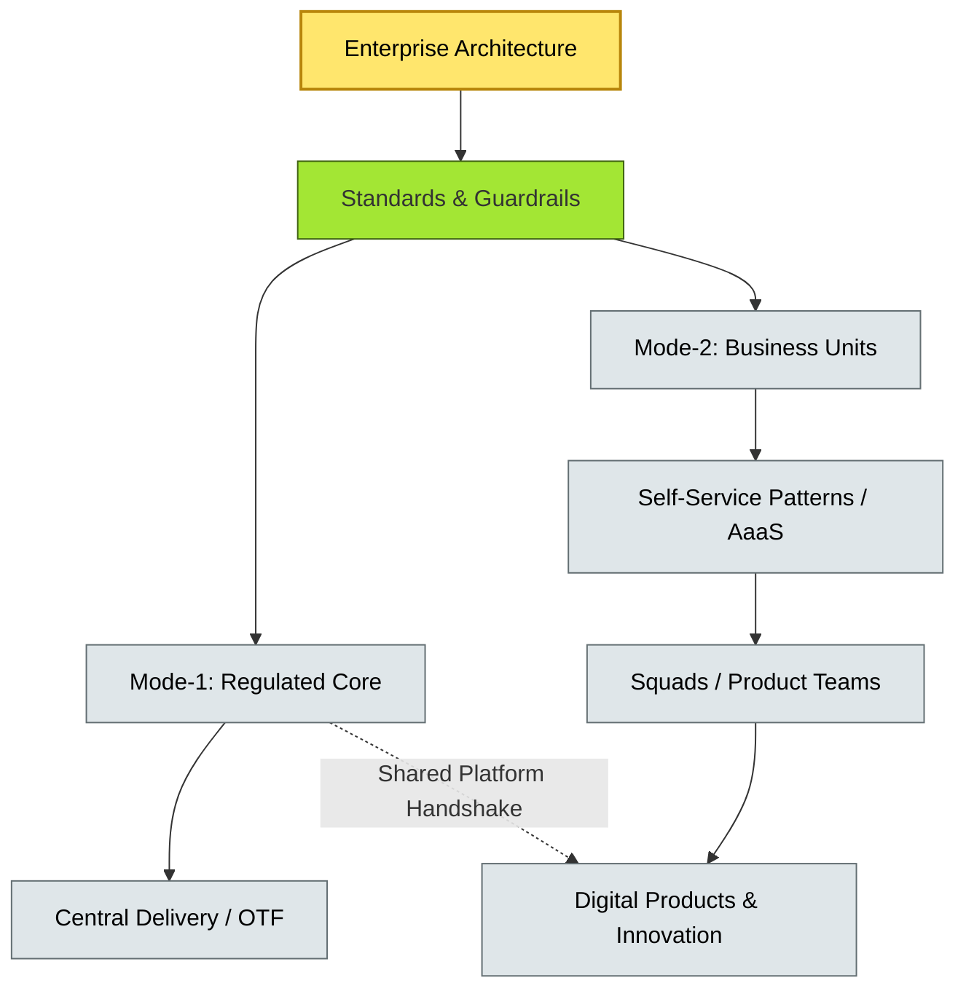
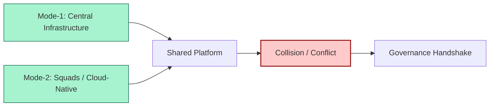
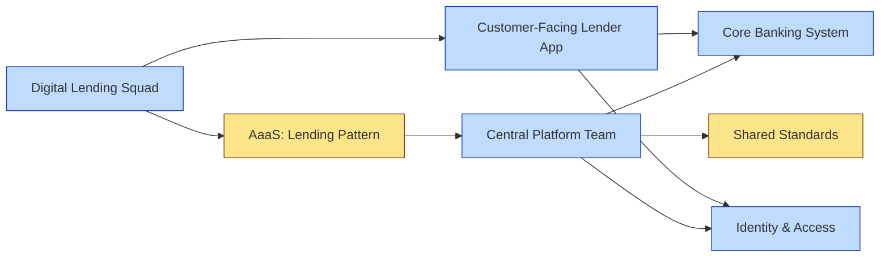

# [C9-06] Delivery Models — DETAIL
> **Category:** C9 — Governance, Management & Strategy · **Difficulty:** ●● ●● ●● ●● · **Banking-relevant:** yes
>
> **Companion brief:** `[briefs/C9-06-delivery-models.md](../briefs/C9-06-delivery-models.md)`
>
> > **Target reader:** enterprise architect who must *explain, justify, and defend* the topic — not just recite it.

## 1. Precise definition
Delivery models in enterprise architecture are the structural arrangements—centralized, federated, bimodal, or platform-based—that dictate how architectural decisions, funding, authority, and execution are allocated across the organization.

They sit between *strategy* (what we want to achieve) and *design* (how we build it). The choice of delivery model determines who decides, who pays, who builds, and who enforces standards. It is not merely a chart of reporting lines; it shapes daily workflows, incentives, and the organization's ability to absorb change.

The four standard delivery models are:

- **Centralized:** All major decisions, standards, and reviews flow through a single enterprise architecture function.
- **Federated:** Business units and regions have delegated authority, with enterprise architecture setting guardrails and standards.
- **Bimodal:** Rapid-delivery, decentralized Mode-2 squads coexist with controlled, centralized Mode-1 infrastructure.
- **Platform / AaaS:** Enterprise architecture provides self-service patterns and automation; business units build applications with local product ownership.

## 2. Why it exists (problem it solves)
Legacy EA delivery models in banking often fail at scale:

- **Centralized EA becomes a bottleneck:** A single team of architects cannot serve fifty business-unit proposals per quarter; squads queue and then bypass architecture to deliver.
- **Federated EA fragments standards:** Each country builds its own authentication and data residency model, and legacy mergers leave a pile of incompatible stacks that cannot be integrated.
- **Bimodal EA tears itself apart:** Mode-2 squads shipping micro-services on public cloud collide with Mode-1 teams managing regulated, on-premise runtimes; shared platforms become political battlegrounds.
- **Platform EA without executive buy-in:** The platform team delivers great patterns, but business units do not consume them; they rebuild utilities in "shadow IT."

Choosing and evolving a delivery model is an *architecture decision* in itself. The wrong model produces the wrong outcomes (governance gaps, innovation lag, or runaway cost), and switching models is harder than switching technology.

## 3. Core concepts & vocabulary
| Term | Precise meaning |
|------|-----------------|
| Centralized EA | All major decisions, standards, and reviews flow through a single enterprise architecture function. |
| Federated EA | Business units and regions have delegated authority; enterprise architecture sets guardrails and standards. |
| Bimodal EA | Mode-1: stable, controlled, capital-efficient infrastructure; Mode-2: rapid, experimental, customer-centric delivery. |
| Platform / AaaS Delivery | Enterprise architecture provides self-service patterns and automation; local squads own product direction. |
| Governance by Design | Embedding governance checks into CI/CD pipelines and API platforms so that compliance is automatic. |
| Delivery Model Hover-State | The condition where an organization runs multiple delivery models simultaneously without a clear governance handshake at the boundary. |

## 4. How it works (architecture / mechanism)
A delivery model is operationalized through five design decisions:

1. **Authority:** Who can approve what? (AAM, Board, Product Owner, Squad Lead)
2. **Funding:** Who pays for architecture work? (central budget, business-unit 3P, product P&L)
3. **Standards:** What is mandatory vs. optional? (global, regional, squad-level)
4. **Execution:** Who builds the approved design? (central OTF, business-unit team, 3rd-party, platform product)
5. **Measure:** What KPIs track the delivery model's health? (decision latency, compliance rate, innovation throughput)

Most large banks (like a global money-center) adopt a *hybrid* model: centralized Mode-1 control for payments and core banking, federated standards for data domains, and platform-based AaaS for customer-facing digital.

### 4.1 Diagrams

**Diagram A — Hybrid delivery model (highlight critical decisions = green, load-bearing = amber, contexts = grey):**


**Diagram B — Bimodal collision at shared platforms (highlight risk = red, ok = green):**


## 5. Variants, options & trade-offs
| Variant | When to pick | When to avoid | Key trade-off axis |
|---------|--------------|---------------|--------------------|
| Centralized | Highly regulated bank with uniform risk appetite and single-source-of-truth needs. | Multi-geographic bank with distinct regulatory regimes and strong local autonomy. | Consistency vs local flexibility |
| Federated | Global bank with varied regulations; each country or business line must adapt standards locally. | Bank with centralized IT spend and low regional variance. | Adapter flexibility vs standardization |
| Bimodal | Bank with regulated core (payments, settlement) and high-velocity digital (apps, APIs). | Bank where all systems have the same risk/speed profile. | Innovation speed vs compliance rigor |
| Platform / AaaS | High-velocity squads that need repeatable, compliant architecture with low EA queue latency. | Org with immature CI/CD or no dev-ops culture. | Scale/automation vs maturity |

Trade-off: a centralized model ensures compliance but kills speed; a federated model enables local agility but fragments standards. Many banks end up in an unspoken hybrid, which is worse than none because the boundary is invisible.

## 6. Relationships to sibling topics
- **EA Practice Governance (C9-01):** The delivery model is the *implementation* of the governance model; the AAM defines *what* decisions need a Board.
- **Architecture Board (C9-02):** The Board's membership and process change depending on whether delivery is centralized, federated, or bimodal.
- **Architecture-as-a-Service (C9-04):** AaaS is the delivery mechanism for a platform-based delivery model.
- **Change & Adoption (C9-07):** The chosen delivery model determines the change-management burden required to shift the organization.
- **Metrics & KPIs (C9-08):** Different delivery models need different metrics (e.g., decision latency in AaaS; compliance rate in centralized).

## 7. Banking / financial-services context 💳
A global money-center bank adopts a **hybrid delivery model**:

- **Mode-1 (Regulated Core):** The enterprise architecture team centrally owns the RTGS, core banking, and AML analytics platforms. All changes require Architecture Board approval and DORA ICT-risk sign-off.
- **Federated (Data & Compliance):** Each country's data officer adapts the global data-governance standard to local regulatory requirements (e.g., Brazil's LGPD vs EU GDPR).
- **Mode-2 / AaaS (Digital):** Eight product squads building mobile banking and embedded-finance features self-serve from an AaaS catalogue. They can use any cloud region and framework, as long as they consume the central identity, payments, and data-platform services.

The *collision zone* is the payments-platform: a Mode-2 squad wants to bypass the central payment gateway to reduce latency for an in-app lending feature. The Architecture Board resolves this by creating a "fast path" with mandatory segmentation and ledger reconciliation, negotiated between the mode's product owner and the central platform team.

Regulatory ties:
- **DORA** requires a clear governance model for ICT-risk; the hybrid model assigns critical ICT to Mode-1 and distributed ICT to Mode-2 with proportional oversight.
- **Basel III** requires capital to be efficient; a centralized platform prevents duplicate infrastructure cost.

## 8. Reference architecture / worked example
**Problem:** A bank must modernize its core-banking and launch a digital-lending platform simultaneously, but capacity and compliance rules differ.

**Decision:** Adopt a **bimodal + federated** hybrid: Mode-1 for core-banking (centralized gating), Mode-2 for digital-lending (self-service with shared compliance constraints).

**Diagram:**


**ADR:**
```markdown
# ADR-2026-008: Hybrid Bimodal + Federated Delivery Model
## Status
Accepted
## Context
The bank must modernize core banking (regulated, stable) and launch digital lending (fast, experimental) with shared payment and identity infrastructure.
## Decision
Adopt a hybrid model: Mode-1 (centralized EA + Architecture Board) for core; Mode-2 (AaaS self-service) for lending; federated data governance across countries.
## Consequences
- Positive: Core compliance is preserved; lending speed is preserved; shared platforms reduce duplication.
- Negative: Mode-2 teams occasionally collide with Mode-1; requires active governance handshake at payment and identity boundaries.
- Negative: Hybrid governance is complex to staff and operate.
## Alternatives considered
1. Full centralized: slower lending, lower coin-variance but missed market window.
2. Full mode-2: uncontrolled compounding risk; likely regulatory censure.
```

## 9. Maturity & adoption signals
- **Adopt when:** The bank has diverse business lines with different speed and risk profiles, and leadership needs clarity on where architecture authority sits.
- **Anti-signals:** Every decision is anyway; no friction is surfacing; the bank is too small for complexity.
- **Common failure modes:**
  1. The delivery model is *accidental* (evolved without intent), so boundaries are unclear and political; fix: articulate the model and publish it.
  2. Mode-2 teams ignore Mode-1 constraints; fix: make the shared-platform boundary expensive to bypass (policy-as-code, not a rule).
  3. The hybrid model requires headcount and budget that the organization is unwilling to fund; fix: the model must match resourcing, not the reverse.

## 10. Common confusions — the "don't mix" up list
| Often confused | Real distinction |
|----------------|----------------|
| Delivery Model | Architecture Practice Model: the former is organizational; the latter is the body of methods and standards. |
| Bimodal EA vs Scrum | Bimodal is an organizational *delivery* model; Scrum is a *team-level* agile framework. A team can use Scrum within Mode-1 or Mode-2. |
| Centralized vs Federated | Centralized means one decision-maker; federated means many decision-makers with common guardrails. |

## 11. Tools & standards to know
- **Standards/Frameworks:** TOGAF 10, DORA ICT-risk governance guidance, Team Topologies (platform team, stream-aligned team, enabling team, complicated-subsystem team).
- **Common tooling:** Miro / Confluence (delivery-model charter), Jira Align (road-mapping), Azure DevTest Labs / AWS Service Catalog (self-service).
- **Mandatory reading:** "Team Topologies" by Skelton & Pais; "Accelerate: The Science of Lean Software and DevOps."

## 12. ADR template (ready to fill in)
```markdown
# ADR-XXX: <decision>
## Status
Accepted | Proposed | Deprecated
## Context
...
## Decision
...
## Consequences
- Positive ...
- Negative ...
## Alternatives considered
1. ...
2. ...
```

## 13. Practice — apply it
1. **Recall:** Define delivery models in 2 min without notes.
2. **Model:** Draw a hybrid delivery model for your bank's key business areas.
3. **ADR:** Write an ADR adopting a hybrid model; include the five design decisions (authority, funding, standards, execution, measure).
4. **Defend:** Role-play explaining to a non-technical COO why a hybrid model is not "doing everything at once" but "matching governance to risk profile."

## 14. Summary (1 paragraph)
Delivery models determine who decides, who pays, and who builds. In banking, where risk, regulation, and speed vary dramatically across business areas, the *wrong* delivery model is the silent killer of transformation. The correct model matches governance rigor to the risk and velocity profile of the system it serves, with an explicit handshake at every shared boundary.
