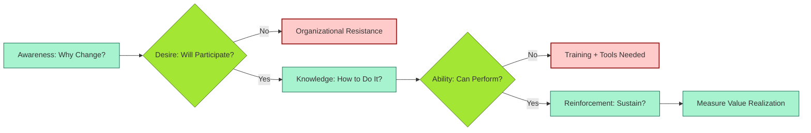
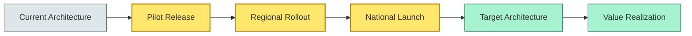

# [C9-07] Change & Adoption — DETAIL
> **Category:** C9 — Governance, Management & Strategy · **Difficulty:** ●● ●● ●● ●● || **Banking-relevant:** yes
>
> **Companion brief:** `[briefs/C9-07-change-adoption.md](../briefs/C9-07-change-adoption.md)`
>
> > **Target reader:** enterprise architect who must *explain, justify, and defend* the topic — not just recite it.

## 1. Precise definition
Change and adoption in enterprise architecture is the structured, evidence-based process of preparing, supporting, and transitioning the organization—people, process, and culture—into new ways of working enabled by architectural decisions.

It is distinct from *project management* (which delivers the technology) and *change management* as practiced in HR (which addresses re-orgs and layoffs). In EA, change and adoption specifically covers the *organizational and behavioral transition* required to realize a new architectural state.

Key frameworks:
- **ADKAR Model:** Awareness, Desire, Knowledge, Ability, Reinforcement—an individual/organizational change model.
- **Transition Architecture:** The deliberately temporary architecture, processes, and organization state required between the current state and target state.
- **Value Realization:** Measuring whether the architectural change produced the promised business outcomes, not just whether the system shipped.

## 2. Why it exists (problem it solves)
Architecture is a promise; adoption is its fulfillment. In banking, transformation programs are notorious for shipping great technology that is unused because:

- **Branch staff** were not trained on a new mobile-first onboarding process, so they continued processing cash applications via paper forms.
- **Advisors** lost commission on loans sold through new digital channels because the compensation system had not updated.
- **Regulators** rejected a new AML-screening architecture because it changed the data-provenance required for a SAR (suspicious activity report).
- **Customers** abandoned a new payments app because the UX was not explained; they called the call center and requested the old interface.

The root cause is not bad architecture; it is *insufficient change management*. The EA team must plan the organizational transition as rigorously as the technical migration.

## 3. Core concepts & vocabulary
| Term | Precise meaning |
|------|-----------------|
| Demand Management | Prioritizing and sequencing architectural initiatives based on business readiness, risk, and value. |
| Transition Architecture | The temporary state between current and target architecture, managed as a portfolio of transitional releases. |
| ADKAR Model | Awareness (of the need), Desire (to participate), Knowledge (of how), Ability (to perform), Reinforcement (to sustain). |
| Value Realization | Measuring whether the delivered architecture produced the promised business outcome (e.g., faster loan approval, reduced fraud). |
| Target-State Readiness | The condition where staff, process, and technology are all calibrated to the target architecture *before* the final cutover. |

## 4. How it works (architecture / mechanism)
Change and adoption operates as a *parallel track* to technology delivery:

1. **Demand Management:** The EA team maintains a prioritized pipeline of architectural initiatives, scoring each for *readiness* (process, org, customer impact) in addition to *value*.
2. **Readiness Assessment:** Before any initiative is approved, it must pass a readiness check: Is the business process updated? Is staff trained? Is the customer communication plan in place?
3. **Transition Architecture Design:** The shift from current to target is not a single leap; it is a series of transitional releases (e.g., pilot, regional, national) that allow learning and adjustment.
4. **ADKAR Rollout:** Each release follows the ADKAR sequence: communicate the need (A), build desire (D), train (K), provide tools and supervision (A), reinforce with incentives and monitoring (R).
5. **Value Realization Measurement:** Post-launch, the EA team tracks the promised benefits against a baseline; if value is not realized, the initiative is flagged for remediation.

### 4.1 Diagrams

**Diagram A — The ADKAR state machine (highlight decision gate = green, bypass risk = red):**


**Diagram B — Transition architecture over time (highlight critical transition releases = amber, target = green):**


## 5. Variants, options & trade-offs
| Variant | When to pick | When to avoid | Key trade-off axis |
|---------|-------------|---------------|--------------------|
| Big-bang Adoption | Low-risk, isolated systems with no process dependence (e.g., infrastructure monitoring). | Systems that touch customer-facing processes or branch operations. | Speed vs disruption |
| Phased / Pilot Adoption | High-risk or customer-facing systems that need learning and trust-building. | Systems where waiting increases major risk (e.g., known security flaw). | Learning vs speed |
| Parallel / Shadow Adoption | Complex systems where running both old and new simultaneously validates the change and gives users fallback. | Systems where maintaining two versions is operationally impossible. | Risk mitigation vs cost |
| Bounded / Canary Adoption | When a rolling rollout to a small audience can detect issues before full impact. | Systems where partial exposure affects all users identically (e.g., identity platform). | Targeted risk vs rollout complexity |

## 6. Relationships to sibling topics
- **EA Practice Governance (C9-01):** Demand management and funding gates prioritize initiatives by readiness; the AAM may require change-management approval for "critical-risk" categories.
- **Architecture Board (C9-02):** The Board reviews change-readiness evidence as part of its go/no-go decision.
- **Delivery Models (C9-06):** A delivery model's speed (e.g., bimodal) must be matched with an adoption strategy; Mode-2 speed without Mode-1 readiness creates chaos.
- **Metrics & KPIs (C9-08):** Value-realization KPIs are the ultimate measure of whether change and adoption succeeded.
- **Digital Transformation Strategy (C9-10):** Change and adoption is the operationalization of the transformation strategy; without it, the strategy is a document.

## 7. Banking / financial-services context 💳
A global retail bank launches a "real-time balance inquiry" mobile feature that queries a new payments data platform. The architecture is sound, but the rollout fails in the pilot region because:

- **Advisors** tell customers to continue using the existing branch terminal for large transactions, creating confusion.
- **Contact-center staff** have not been trained on the new app's error messages, so they direct customers to the wrong help flow.
- **Compliance** requires a manual signature for any transaction over €10K, but the app design assumed full automation; the update is delayed.

The EA team's change-management plan includes:
1. **ADKAR training** for branch and contact-center staff (15-min e-learning + role-play).
2. **Pilot with opt-in customers**, tracked by completion and repeat-use rates.
3. **Compensation adjustment** to reward advisors who onboard customers to the app.
4. **Value-realization KPI:** "Time to first successful balance inquiry via app" must drop by 50% (baseline: 3 min in branch; target: <90 sec).

A key lesson: the architecture board approved the app based on technical approval, but the change-readiness gate (business-process alignment, training, compliance) was *not* a gate—so it was skipped.

Regulatory ties:
- **DORA** Art. 22 requires transition coordination for major ICT changes that affect service levels; the transition architecture is part of that.

## 8. Reference architecture / worked example
**Problem:** Migrate a legacy card-issuance workflow to a cloud-native, automated approval system.

**Decision:** Adopt a phased adoption with parallel shadow processing for three months, with mandatory ADKAR training for branch staff and a value-realization KPI of 30% reduction in issuance time.

**Diagram:**
```mermaid
graph LR
    classDef critical fill:#ffe66d,stroke:#b8860b
    classDef ok fill:#a7f3d0,stroke:#065f46
    classDef context fill:#dfe6e9
    Current[Legacy Workflow]:::context --> Shadow[Shadow / Parallel Processing]:::critical
    Shadow --> Train[Staff Training (ADKAR)]:::ok
    Train --> Pilot[Pilot Region]:::critical
    Pilot --> Measure[Measure Value Realization]:::ok
    Measure --> Target[Target-State Operations]:::ok
```

**ADR:**
```markdown
# ADR-2026-009: Phased Adoption for Card-Issuance Modernization
## Status
Accepted
## Context
Legacy card-issuance takes 5 business days and requires 3 manual checks. A cloud-native approval engine can reduce this to 24 hours, but branch staff are not ready.
## Decision
Adopt phased adoption: 3-month shadow period, ADKAR training for all branch staff, and a 30% issuance-time reduction KPI.
## Consequences
- Positive: Staff confidence increases; risk of bad decision decreases; value is actually realized.
- Negative: 3-month shadow period adds infrastructure cost; staff turnover may erase training investment.
- Negative: If the pilot KPI is not met, the bank must decide whether to extend shadow or rollback.
## Alternatives considered
1. Big-bang cutover: fastest, but highest risk of mis-issuance and branch backlash.
2. Self-service only (no branch staff): lowest interaction cost, but legal/KYC requirements may still mandate face-to-face.
```

## 9. Maturity & adoption signals
- **Adopt when:** The bank has strategic initiatives that affect people, process, or customer behavior; or when the organization has a history of "valley of death" transformations.
- **Anti-signals:** Every IT change is perceived as "just a system update"; there is no business-process impact; customers are passive consumers.
- **Common failure modes:**
  1. Change and adoption is treated as a "go-live checklist" rather than a parallel track; lead-time for readiness is underestimated.
  2. The target-state readiness gate is skipped under deadline pressure; the organization cuts over to an architecture it is not prepared to operate.
  3. Value realization is not measured; the organization assumes benefit because the system shipped on time.

## 10. Common confusions — the "don't mix" up list
| Often confused | Real distinction |
|----------------|----------------|
| Change & Adoption vs Project Management | Change & Adoption is about people/process/culture transition; project management is about scope/schedule/budget. |
| Change & Adoption vs Change Management (HR) | In EA, it specifically covers the org transition needed to realize architectural value. |
| TCO vs Value Realization | TCO is a cost forecast; value realization is the *actual* benefit after adoption. |

## 11. Tools & standards to know
- **Standards/Frameworks:** ADKAR (Prosci), McKinsey 7S (McKinsey & Company), ITIL 4 (service value system).
- **Common tooling:** Miro / Mural (change-readiness workshops, ADKAR mapping), Confluence (readiness docs), NPS / customer-feedback tools for value tracking, Jira (adoption ticket tracking).
- **Mandatory reading:** "ADKAR: A Model for Change in Business, Government and Our Community" by Prosci; "Switch: How to Change Things When Change Is Hard" by Heath & Heath.

## 12. ADR template (ready to fill in)
```markdown
# ADR-XXX: <decision>
## Status
Accepted | Proposed | Deprecated
## Context
...
## Decision
...
## Consequences
- Positive ...
- Negative ...
## Alternatives considered
1. ...
2. ...
```

## 13. Practice — apply it
1. **Recall:** Define change and adoption in 2 min without notes.
2. **Model:** Draw the ADKAR model for a banking digital product launch.
3. **ADR:** Write an ADR adopting a change-management approach for a core-banking modernization.
4. **Defend:** Role-play explaining to a non-technical CRO why "the system is built" is not the same as "the business is ready."

## 14. Summary (1 paragraph)
Change and adoption transforms architectural blueprints into usable banking services by planning the people, process, and cultural transition with the same rigor as the technology migration. In a regulated bank, ad-hoc adoption is a regulatory and commercial liability: it produces relaunch cost, fugitive risk, and customer attrition.
