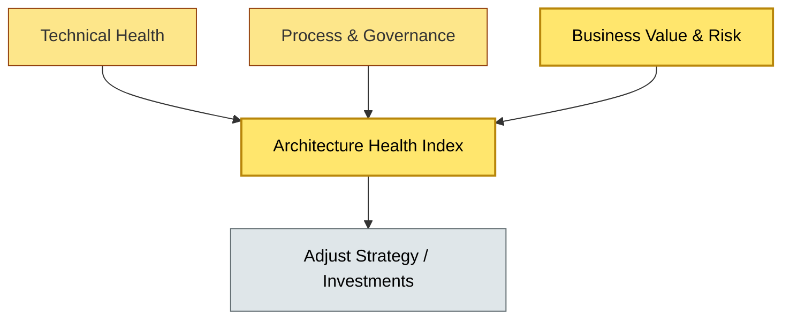
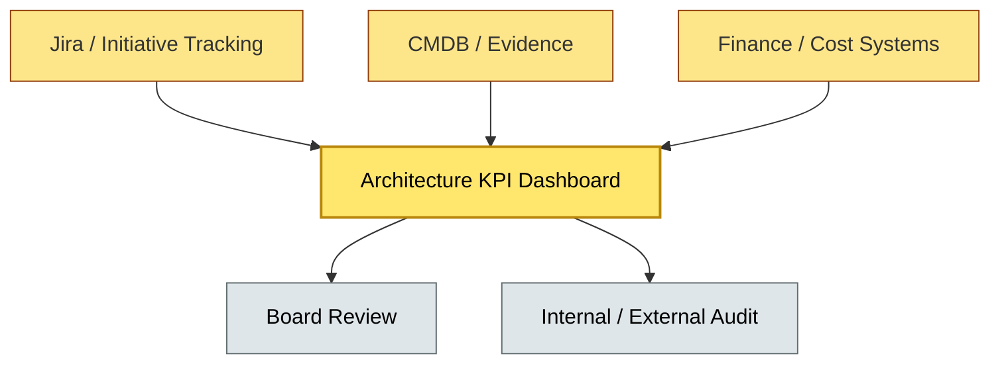

# [C9-08] Metrics & KPIs — DETAIL
> **Category:** C9 — Governance, Management & Strategy · **Difficulty:** ●● ●● ●● ●● ★ || **Banking-relevant:** yes
>
> **Companion brief:** `[briefs/C9-08-metrics-kpis.md](../briefs/C9-08-metrics-kpis.md)`
>
> > **Target reader:** enterprise architect who must *explain, justify, and defend* the topic — not just recite it.

## 1. Precise definition
Metrics and KPIs in enterprise architecture are quantifiable measures—both lagging and leading—that assess the health, effectiveness, and business impact of the architecture function and its decisions.

- **Metrics** are raw or derived measurements (e.g., "number of architectures reviewed," "percentage of services with up-to-date diagrams").
- **KPIs** are *key* performance indicators: metrics with explicit targets, owners, and review cadences.

A *balanced* architecture metric set includes:
- **Technical Health:** SOX-style metrics (documentation, model currency, debt).
- **Process & Governance:** Decision latency, approval rate, exception rate, review coverage.
- **Business Value:** Value realization, time-to-market, cost-per-transaction, customer-impact metrics.
- **Risk & Compliance:** Compliance coverage, audit-finding count, control effectiveness.

The purpose is not measurement for its own sake; it is to *inform and drive decision-making* at the Board, the CIO, and the business.

## 2. Why it exists (problem it solves)
In banking, architecture is a cost center and a risk control—but without metrics, it is an *invisible* cost center and *unprovable* risk control:

- **Budget battles:** Without metrics, the EA team cannot defend its budget against "line-of-business dev" claims that architecture is overhead, not value.
- **Quality invisibility:** Senior management cannot see whether architectural debt is growing until an incident or audit finds it.
- **Value denial:** Every transformation program claims benefits; without value-realization KPIs, the claims are anecdotal and unauditable.
- **Regulatory exposure:** Regulators can ask, "What is your governance key performance indicator for ICT-risk?" A bank without an answer loses credibility.

Metrics make the architecture function *visible, accountable, and improvable*—a necessity in any regulated, board-visible organization.

## 3. Core concepts & vocabulary
| Term | Precise meaning |
|------|-----------------|
| Leading Indicator | A metric that predicts an outcome (e.g., design-review coverage predicts production defect rate). |
| Lagging Indicator | A metric that confirms a past outcome (e.g., cost overruns, incident rate). |
| Architecture Health Index (AHI) | An aggregated score combining multiple health dimensions (technical, governance, compliance, value) into a single view. |
| Value Realization KPIs | Metrics that close the loop between delivered architecture and promised business outcomes (e.g., loan-processing time, KYC cycle time). |
| Decision Latency | The time from an architectural proposal submission to a go/no-go decision. |
| Compliance Coverage | The percentage of regulated systems or critical components that have up-to-date evidence packs and control traceability. |
| Technical Debt Rate | The ratio of work needed to bring a system to a desired quality level vs. the work currently delegated; often measured in story points or person-months. |

## 4. How it works (architecture / mechanism)
A mature architecture metric program operates through a *measurement cycle*:

1. **Define the metric:** Choose a metric with a clear definition, data source, calculation, and owner.
2. **Set the target:** Define a SMART target (Specific, Measurable, Achievable, Relevant, Time-bound) and a baseline.
3. **Instrument:** Automate data collection where possible (e.g., from CMDB, Jira, CI/CD, audit tools, financial systems).
4. **Monitor:** Track on a dashboard visible to the Architecture Board and the CIO; review at each Board meeting.
5. **Act:** Closed-loop improvement—if a metric is off-target, assign, investigate, and remediate.
6. **Audit:** Validate metric data during internal audit so that it can also serve external auditors.

### 4.1 Diagrams

**Diagram A — Architecture Health Score (highlight critical drivers = amber, supporting = grey):**


**Diagram B — Leading vs Lagging indicator pipeline (highlight decision gate = green, failure = red):**
```mermaid
flowchart LR
    classDef ok fill:#a7f3d0,stroke:#065f46,stroke-width:1px
    classDef risk fill:#fecaca,stroke:#991b1b,stroke-width:2px
    Leading[Leading Indicators (Coverage, Latency)]:::ok --> Predict[Predict Outcome]:::decision
    Predict -- Good --> Continue[Continue Investment]:::ok
    Predict -- Poor --> Invest[Investigate & Remediate]:::risk
    Invest --> Recurring[Recurring? ]:::decision
    Recurring -- Yes --> Escal[Escalate to Board]:::risk
    Recurring -- No --> Adjust[Adjust Process]:::ok
```

## 5. Variants, options & trade-offs
| Variant | When to pick | When to avoid | Key trade-off axis |
|---------|-------------|---------------|--------------------|
| Quantitative-only (dashboards, numbers) | Mature banks with data pipelines, finance alignment, and board demand for numeric proof. | Nascent EA practices without data sources or baseline; quantitative metrics can be gamed. | Objectivity vs gaming risk |
| Qualitative (survey + narrative) | Early-stage or politically-sensitive measurements where trust is low. | Regulators and the CFO who demand numeric evidence of governance effectiveness. | Accessibility vs accountability |
| Composite (weight-based AHI) | Banks that need a single score for board reporting. | Complex weighting may obscure which dimension is failing; risks false confidence. | Simplicity vs diagnostic depth |
| External (benchmarked against peers) | Banks preparing for supervisory stress tests or investor roadshows. | Peer data may be stale, non-comparable, or competitively sensitive. | Normative reference vs actual improvement |

## 6. Relationships to sibling topics
- **EA Practice Governance (C9-01):** The AAM and Funding Gates generate governance metrics (decision latency, approval rate); their effectiveness is measured by these KPIs.
- **Architecture Board (C9-02):** Board decisions and their time-to-decision are a lagging KPI, but Board *attendance* and *decision quality* are leading indicators.
- **TCO / Cost (C9-05):** Cost-per-deployment and TCO-delta KPIs inform whether financial targets are being met.
- **Change & Adoption (C9-07):** Value-realization KPIs are the ultimate measure of whether change and adoption succeeded.

## 7. Banking / financial-services context 💳
A global retail bank tracks eight architecture KPIs on a quarterly dashboard:

- **Leading:** Design-review coverage (target: 100% of new services); decision latency (target: <10 business days); technical-debt story-points vs new-feature points (target: <15%).
- **Lagging:** Cost overruns on scoped architecture decisions (target: <5%); post-implementation incident rate (target: <2/quarter for top-10 systems); audit-finding rate on architectural controls (target: zero material findings).
- **Business value:** Time-to-market reduction for new retail loans (target: 30% vs baseline); API call latency for open-banking partners (target: <50ms p99).

The dashboard itself is a product of AaaS: it is published on a self-service platform, owned by an Architecture Product Owner, and reviewed by the Architecture Board.

A real incident: a Board-approved modernization of the mortgage-origination platform shipped on time, but the value-realization KPI (time-to-approve a mortgage) did not improve in the first quarter. Root cause: branch staff were not trained on the new UI (a change-management gap), so they continued working on the legacy system. The metric triggered a post-implementation review that led to an ADKAR training sprint for branches.

Regulatory ties:
- **DORA** requires the bank to demonstrate effective ICT-risk management; the Architecture Health Index and compliance-coverage KPIs are inputs to supervisory reporting.
- **PCI-DSS** requires documented evidence of security controls; compliance-coverage KPIs ensure that every card system has current evidence.

## 8. Reference architecture / worked example
**Problem:** The bank must establish an architecture metrics program to prove EA value to the Board and the FRC.

**Decision:** Adopt a 4-quadrant metric set: Technical Health, Process & Governance, Business Value, and Risk & Compliance, with automated data collection from Jira (projects), CMDB (components), and finance systems (costs).

**Diagram:**


**ADR:**
```markdown
# ADR-2026-010: Architecture Metrics Program
## Status
Accepted
## Context
The Board and the FRC have asked for evidence that EA is delivering value; the current process is ad-hoc and cannot scale as the digital portfolio grows.
## Decision
Establish a 4-quadrant metric program with automated collection, an Architecture Product Owner, and quarterly Board review.
## Consequences
- Positive: Board can see EA value quantitatively; audit preparation is smoother.
- Negative: Initial 3-month data-accumulation and baseline-setting effort; some teams may game metrics.
- Negative: Quantitative focus must not crowd out qualitative insight.
## Alternatives considered
1. Keep ad-hoc reporting: lower cost, higher Board skepticism.
2. Outsource metrics to a consultancy: fast but non-sustainable and non-contextual.
```

## 9. Maturity & adoption signals
- **Adopt when:** The bank has a board-visible IT portfolio, multi-year investment commitments, and regulatory pressure to demonstrate governance.
- **Anti-signals:** No budget for architectural tooling; EA is too new to have historical baseline; the organization treats all numbers as negotiable fiction.
- **Common failure modes:**
  1. Vain metric inflation: "We increased 'architecture reviews completed' by 200%' by lowering the 'review' threshold to a Slack message.
  2. Single KPI obsession: optimizing one number (e.g., decision latency) causes compensatory damage in quality (e.g., more rejected proposals).
  3. Metrics without action: a beautiful dashboard that is reviewed but not used to drive decisions; metrics become decoration.

## 10. Common confusions — the "don't mix" up list
| Often confused | Real distinction |
|----------------|----------------|
| KPIs vs Metrics | Metrics are raw numbers; KPIs are metrics with targets and owners. |
| Leading vs Lagging | Leading indicators predict; lagging confirm—both are needed. |
| Architecture Health Index | AHI is a composite score; it is a *summary*, not a *measurement*; over-reliance masks root causes. |

## 11. Tools & standards to know
- **Standards/Frameworks:** Scaling Agile Framework (SAFe) metrics guidance, TOGAF value-realization, DORA ICT-risk reporting requirements.
- **Common tooling:** Power BI / Tableau (dashboards), Jira (initiative metrics), Confluence (metric definitions), Grafana (monitoring).
- **Mandatory reading:** "Measuring the Impact of Enterprise Architecture" — various academic and industry papers; "Leading vs Lagging Indicators" — Goldratt / TOC literature.

## 12. ADR template (ready to fill in)
```markdown
# ADR-XXX: <decision>
## Status
Accepted | Proposed | Deprecated
## Context
...
## Decision
...
## Consequences
- Positive ...
- Negative ...
## Alternatives considered
1. ...
2. ...
```

## 13. Practice — apply it
1. **Recall:** Define architecture metrics and KPIs in 2 min without notes.
2. **Model:** Define eight quadrant metrics for your bank's EA function, with data sources and owners.
3. **ADR:** Write an ADR establishing a metrics program; include baseline, target, and the risk of metric gaming.
4. **Defend:** Role-play explaining to a non-technical Board member why "number of meetings" is a dangerous metric.

## 14. Summary (1 paragraph)
Architecture metrics are the evidence that the EA function is not a cost center but a value and risk-control mechanism. In banking, where the Board and regulators demand proof, a balanced set of leading and lagging KPIs—collected automatically, governed by an Architecture Product Owner, and reviewed quarterly—is the only credible way to defend EA budget and guide portfolio decisions.
