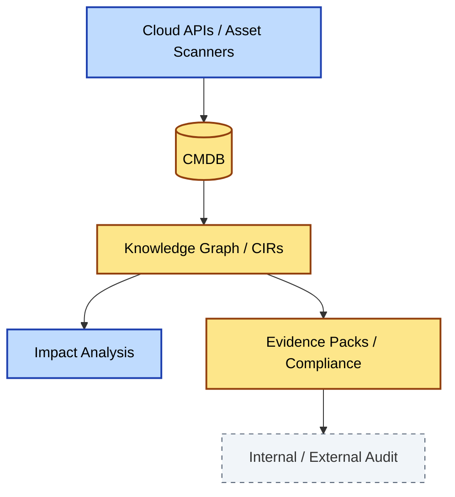
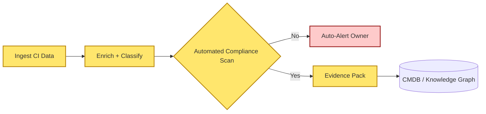
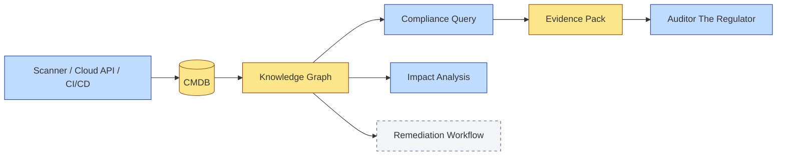

# [C9-09] Knowledge & CMDB — DETAIL
> **Category:** C9 — Governance, Management & Strategy · **Difficulty:** ●● ●● ●● ●● ★ || **Banking-relevant:** yes
>
> **Companion brief:** `[briefs/C9-09-knowledge-cmdb.md](../briefs/C9-09-knowledge-cmdb.md)`
>
> > **Target reader:** enterprise architect who must *explain, justify, and defend* the topic — not just recite it.

## 1. Precise definition
The Configuration Management Database (CMDB) and knowledge layer in enterprise architecture is the authoritative, curated registry of all configuration items (CIs), their configuration item relationships (CIRs), their owners, business-service mappings, and the evidence that proves compliance with architectural and regulatory standards.

In modern EA, the CMDB is not a static inventory; it is a *knowledge graph* that enables machine-readable impact analysis, automated compliance evidence, and real-time architectural truth. The EA function is responsible for data quality, provenance, and assurance.

Key concepts:
- **Configuration Item (CI):** Any component that must be managed to deliver IT service (hardware, software, network, cloud resource, API).
- **Configuration Item Relationship (CIR):** The logical or physical dependency between two CIs (e.g., "payment-gateway" depends on "identity-service" and "fraud-engine").
- **Evidence Pack:** A curated set of logs, policies, scan results, and test evidence proving that a CI or CIR complies with a standard.
- **Knowledge Graph:** A semantic network of CIs, owners, business services, and regulatory classifications that enables automated impact, compliance, and search queries.

## 2. Why it exists (problem it solves)
In banking, an accurate CMDB and knowledge graph are not optional:

- **Forensics:** After a cyber-incident, the bank must identify every affected system and data flow within hours; without a CMDB, this takes weeks.
- **Audit:** SOC-2, PCI-DSS, and DORA auditors demand evidence that every production system is inventoried, classified, and linked to compliance controls. A missing CI is an immediate material finding.
- **Change management:** A change proposed to one system must be assessed for impact on every dependent system; without a CMDB, impact analysis is a biased guess.
- **Exit / migration:** Before decommissioning a legacy core-banking system, the bank must have a complete map of every integration and data dependency to avoid breaking payments.

Without a living CMDB, the bank operates with a *false source of truth*: spreadsheets and tribal knowledge that are already out of date.

## 3. Core concepts & vocabulary
| Term | Precise meaning |
|------|-----------------|
| Configuration Item (CI) | A component that must be managed to deliver IT service (e.g., a Kubernetes pod, an API endpoint, a database instance). |
| Configuration Item Relationship (CIR) | The logical or physical dependency between two CIs (e.g., "service A" uses "service B" and "database C"). |
| Evidence Pack | A collection of logs, policies, scan results, and test evidence proving a CI or CIR complies with a standard or regulation. |
| Knowledge Graph | A semantic, machine-readable network of CIs, owners, business services, and classifications; enables automated impact and compliance queries. |
| CIA / Data-Classification | Classification of data and systems by sensitivity (Public, Internal, Confidential, Restricted) that governs handling and security. |
| Data Owner | The business stakeholder accountable for the quality, classification, and lifecycle of a data domain or asset. |
| CMDB Accuracy Target | A measurable threshold (e.g., 95% of production CIs inventoried and up-to-date as of last-quarter-end) with a remediation plan for variance. |
| SBOM (Software Bill of Materials) | A machine-readable inventory of software components, licenses, and vulnerabilities; increasingly linked to the CMDB. |

## 4. How it works (architecture / mechanism)
The CMDB and knowledge layer operate through an *authoritative, automated pipeline*:

1. **Ingestion:** CI data is pulled from all sources: cloud provider APIs (AWS Config, Azure Resource Graph), CMDB for on-premise (ServiceNow, Lansweeper), CI/CD pipelines, software-bill-of-materials scanners, and discovery agents.
2. **Normalization & Enrichment:** Raw data is normalized (e.g., an AWS TCP Gateway is a "public API" category), enriched with business-service mapping, ownership, and data-classification.
3. **Relationship Inference:** Logical dependencies are inferred from network traffic, API catalogs, configuration files, and version-control history; human-reviewed for validation.
4. **Evidence Generation:** Compliance evidence is auto-generated: encryption status from cloud security posture, access-control from IAM policies, patch status from vulnerability scanners.
5. **Query & Impact:** Users and tools query the knowledge graph to answer "what is affected if CI X fails?", "which systems process cardholder data?", or "what is our PCI-DSS coverage?".
6. **Data-Quality Governance:** The EA team runs accuracy audits (e.g., spot-check 50 CIs per quarter against live evidence) and publishes an accuracy KPI.

### 4.1 Diagrams

**Diagram A — CMDB / Knowledge Graph pipeline (highlight services = blue, data = yellow, boundary = dashed):**


**Diagram B — Continuous evidence generation (highlight critical evidence steps = amber):**


## 5. Variants, options & trade-offs
| Variant | When to pick | When to avoid | Key trade-off axis |
|---------|-------------|---------------|--------------------|
| Centralized CMDB (single source) | Bank with a unified IT estate and strong central authority over infrastructure. | Bank fragmented across many cloud-native, multi-cloud, and outsourcing contracts. | Consistency vs integration cost |
| Federated CMDB (multi-source, unified catalog) | Bank with mixed on-premise, cloud, and fintech-ecosystem CIs; must accept some lag. | Bank with stringent real-time audit requirements and no tolerance for delayed evidence. | Integrity vs latency |
| Knowledge Graph (semantic relationships) | Bank needing deep impact analysis and automated compliance queries across complex dependencies. | Bank with simple topology or short timelines where building a graph is prohibitive. | Insight depth vs build cost |
| CMDB-lite (critical-only) | Bank that starts small and grows; resources to capture only critical services (payments, core, identity). | Bank where regulators expect a full inventory. | Coverage vs effort |

Trade-off: the more sources integrated, the more fragile the pipeline (one misconfigured scanner can poison the CMDB). The EA team must invest in pipeline reliability and data-quality SLA.

## 6. Relationships to sibling topics
- **EA Practice Governance (C9-01):** The CMDB is the *authoritative infrastructure* that enables governance; the AAM includes "CMDB accuracy" as a process standard.
- **Compliance & Audit (C9-03):** The CMDB *is* the evidence that compliance controls are in place; without it, audit is impossible.
- **Architecture-as-a-Service (C9-04):** AaaS platforms depend on the CMDB for self-service; theself-service catalog (services, not just tech) requires business-service mapping.
- **Delivery Models (C9-06):** The CMDB's accuracy target varies by delivery model; centralized models can enforce 99% accuracy; Mode-2 federated models may accept 90% with exceptions.

## 7. Banking / financial-services context 💳
A European trade-finance bank with operations across five jurisdictions carries out a forensic investigation after a SWIFT message interception incident.

Without a CMDB, the incident-response team spends three weeks discovering that three secondary systems (a reporting dashboard, a risk-calculation engine, and a document-management server) all access the compromised message-gateway—and that the gateway's logs were not centralized.

After the incident, the bank invests in an authoritative CMDB that ingests:
- **AWS Config, Azure Resource Graph, and on-premise ServiceNow** into a single catalog.
- **Grafana + AWS Config** for encryption evidence.
- **ServiceNow GRC** for control-traceability.
- **GitHub / Terraform state** for infrastructure-as-code lineage.
- **Security-posture tools (Checkov, Prisma Cloud)** for continuous evidence generation.

The CMDB now contains 99% of production CIs, with evidence packs for PCI-DSS, GDPR, and SOC-2. An analyst can query "show me all CIs that store cardholder data and connect to the internet" in seconds; before, this took a manual week-long effort.

Regulatory ties:
- **DORA** Art. 22: requires institutions to maintain an ICT-risk management framework with clear asset and infrastructure documentation; the CMDB is the operational implementation.
- **PCI-DSS** Req. 1.1: requires a network diagram that shows cardholder data flows; the CMDB generates this dynamically.
- **GDPR** Art. 33 (breach notification): requires identifying affected data subjects within 72 hours; the CMDB and knowledge graph accelerate this identification.

## 8. Reference architecture / worked example
**Problem:** A bank must demonstrate to a DORA supervisory audit that it has complete asset visibility and automated compliance evidence for all production systems.

**Decision:** The bank implements a unified CMDB with a knowledge graph, continuous evidence generation, and an accuracy KPI of 99% with a monthly remediation SLA.

**Diagram:**


**ADR:**
```markdown
# ADR-2026-011: Unified CMDB with Knowledge Graph for DORA Compliance
## Status
Accepted
## Context
The bank is preparing for a DORA audit; the current asset inventory is fragmented across cloud consoles and on-premise spreadsheets.
## Decision
Implement a unified CMDB with a knowledge graph, continuous evidence from cloud-security and IAM tools, and an accuracy SLA of 99%.
## Consequences
- Positive: auditor-ready asset visibility; faster PCI-DSS and DORA evidence preparation.
- Negative: 6-month build; requires data-quality discipline from infrastructure and security teams.
- Negative: Ongoing cost for scanner licenses and graph-database licensing.
## Alternatives considered
1. Audit-time remediation: low cost, but high audit-failure risk and regulatory sanction.
2. Multiple CMDBs (one per domain): lower initial cost, but fragmented view and reconciliation burden.
```

## 9. Maturity & adoption signals
- **Adopt when:** The bank has regulated production systems, multi-cloud footprints, and regular audit or supervisory reviews.
- **Anti-signals:** No regulated systems; no integration between cloud, on-premise, and application inventories; no authority to enforce data accuracy.
- **Common failure modes:**
  1. The CMDB becomes a "people's graveyard": CIs are entered by hand and never updated; queries return stale data.
  2. The acquisition pipeline is too slow; by the time the graph reflects reality, a reconfiguration makes it wrong again.
  3. Gamification of "99% accuracy" causes inflating the inventory (low-impact CIs are lumped or excluded) rather than remediating.

## 10. Common confusions — the "don't mix" up list
| Often confused | Real distinction |
|----------------|----------------|
| CMDB vs Asset Inventory | A CMDB includes relationships, ownership, classifications, and compliance evidence; an inventory is just a list. |
| CMDB vs ServiceNow / ITSM | The CMDB *can* be housed in ServiceNow, but it is a data layer; ITSM is the process layer (incident, change, problem). |
| CMDB vs Knowledge Graph | A CMDB is a database; a knowledge graph is the semantic, relationship-aware representation overlay; the CMDB can *become* a knowledge graph. |

## 11. Tools & standards to know
- **Standards/Frameworks:** ITIL 4 (Service Transition, Configuration Management), ISO/IEC 10007 (configuration management), NIST SP 800-72 (CMDB guidance), DORA ICT-risk framework.
- **Common tooling:** ServiceNow (CMDB + GRC), Atlas (open-source knowledge graph), Neo4j (graph DB), AWS Config, Azure Resource Pipeline, Checkov, Prisma Cloud, GitHub Advanced Security (SBOM).
- **Mandatory reading:** "Configuration Management Database: A Practical Guide" (industry white paper); NIST SP 800-72.

## 12. ADR template (ready to fill in)
```markdown
# ADR-XXX: <decision>
## Status
Accepted | Proposed | Deprecated
## Context
...
## Decision
...
## Consequences
- Positive ...
- Negative ...
## Alternatives considered
1. ...
2. ...
```

## 13. Practice — apply it
1. **Recall:** Define CMDB and knowledge graph in 2 min without notes.
2. **Model:** Draw the CMDB pipeline from source to evidence for a payment-processing system.
3. **ADR:** Write an ADR implementing a CMDB/knowledge graph for DORA or PCI-DSS compliance.
4. **Defend:** Role-play explaining to a non-technical CISO why a CMDB is not "just an IT asset list."

## 14. Summary (1 paragraph)
The CMDB and knowledge layer are the architectural truth engine of the bank: they make compliance evidence, impact analysis, and incident response possible and fast. In a world of cloud, micro-services, and fintech partnerships, an authoritative, automated CMDB is no longer a nice-to-have—it is the foundation of every governance, compliance, and resilience claim the bank makes to its board and its regulators.
