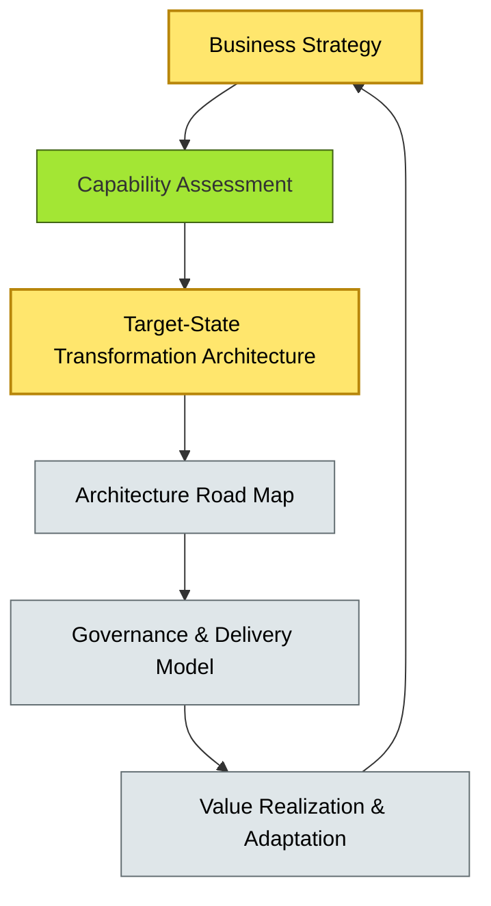
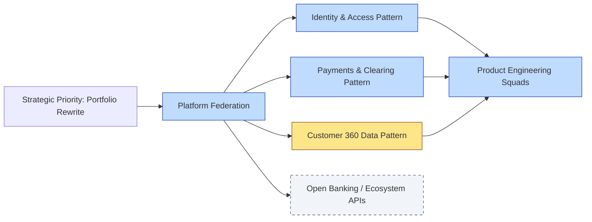

# [C9-10] Digital Transformation Strategy — DETAIL
> **Category:** C9 — Governance, Management & Strategy · **Difficulty:** ●● ●● ●● ●● ★ || **Banking-relevant:** yes
>
> **Companion brief:** `[briefs/C9-10-digital-transform.md](../briefs/C9-10-digital-transform.md)`
>
> > **Target reader:** enterprise architect who must *explain, justify, and defend* the topic — not just recite it.

## 1. Precise definition
Digital transformation strategy is the long-term, enterprise-wide plan that re-imagines the bank's business models, customer experiences, operating models, and value chains through technology.

Crucially, it is *not* an IT roadmap, nor is it a series of agile sprints. It is a *strategic plan* that answers:
- What customer and operations models are obsolete and must be discontinued?
- What new experiences (e.g., API-driven embedded finance, real-time settlement, AI-driven advisory) are to be created?
- What capabilities (identity, data, payments, analytics) must be built or acquired?
- What partnerships and ecosystem roles will the bank assume?
- What regulatory and risk boundaries govern the transformation?
- What is *explicitly excluded*?

The EA function translates this strategy into an *architecture road map*—a time- and capability-based plan that sequences the transition from the as-is to the to-be.

## 2. Why it exists (problem it solves)
Banks that treat digital transformation as an IT project suffer strategic failure:

- **Gap between strategy and execution:** The board approves "become a digital bank," but the EA road map is just a cloud-migration list; the result is an agile core that still services branch-only customers.
- **Legacy coverage:** A platform-modernization program optimizes the current core banking without challenging the underlying business model; the "optimised" core still cannot reach several million unbanked customers.
- **Competitor pre-emption:** Neobanks and big-tech platforms build ecosystems that capture customer relationships *before* the incumbent bank launches its digital app, so the bank's "digital" offering arrives late and competes only on brand.
- **Incoherent investment:**

The ambition of "become a digital bank" is interpreted differently in each business line (wealth, retail, SME, treasury), producing duplicated efforts and architectural debt.

Digital transformation strategy exists to prevent the bank from optimizing while the competitive floor collapses under it.

## 3. Core concepts & vocabulary
| Term | Precise meaning |
|------|-----------------|
| Customer Journey Redesign | Re-mapping banking services (onboarding, lending, payments, advisory) to digital-first, context-aware experiences that decouple from legacy channel assumptions. |
| Ecosystem / Platform Strategy | Opening the bank's API gateways and data platforms to regulated third-party providers, fintechs, and embedded-finance partners. |
| Operating Model Design | New governance, funding, and velocity models (e.g., squad-chapters, guilds, platform teams) that sustain transformation. |
| Transformation Architecture | The target-state architecture that emerges from the strategy, distinct from incremental modernization; it is *coherent* by design. |
| Strategic Priorities & Exclusions | The top 3-5 business-model changes the bank will pursue, and what it deliberately *will not* do in the 3-5 year horizon. |
| Architecture Road Map | A time- and capability-based plan that sequences the transition from current to target architecture, aligned to transformation phases. |
| Scenario Planning | Stress-testing the transformation against macroeconomic, regulatory, and competitive shocks (e.g., a new fintech entrant with a viral product). |

## 4. How it works (architecture / mechanism)
Digital transformation strategy is formulated and translated through a *strategic-to-architectural pipeline*:

1. **Business Strategy Alignment:** The CEO, executive committee, and risk committee define the *business model* transformation (e.g., "embedding lending into retail e-commerce"), not just "better mobile apps."
2. **Capability Assessment:** The EA team assesses current capabilities against the desired business model, using tools like the McKinsey 7S or TOGAF Business Architecture.
3. **Transformation Architecture Definition:** The target-state architecture is defined at the *business* level first (value streams, customer journeys), then at the *technology* level (skeletons of identity, payments, data, analytics).
4. **Transaction Architecture (Road Map):** The capabilities are sequenced into a TTR (time-to-realize) plan: prioritize capabilities that unblock subsequent ones (e.g., identity before payments, API gateway before ecosystem).
5. **Governance Model:** The EA budget, Architecture Board, and delivery model are designed to match the transformation pace—e.g., a bimodal model for core (Mode-1) and speed (Mode-2).
6. **Continuous Adaptation:** The strategy is revisited annually (Scrum-of-Scrums at the executive level); the road map is derived quarterly.

### 4.1 Diagrams

**Diagram A — Strategy-to-Architecture pipeline (highlight strategic = critical, supporting = grey):**


**Diagram B — AaaS-enabled transformation (highlight services = blue, data = yellow, boundary = dashed):**


## 5. Variants, options & trade-offs
| Variant | When to pick | When to avoid | Key trade-off axis |
|---------|-------------|---------------|--------------------|
| Full Transformation (radical business-model change) | Bank faces existential competitive pressure and must fundamentally change its customer relationship. | Bank is profitable with protected market share and no existential threat. | Disruption magnitude vs reinvention risk |
| Incremental / Revolutions (dashboard-first) | Bank has budget constraints and must show early wins; the business model is stable. | Bank's competitors are already capturing ecosystem value; early wins will not close the gap. | Speed of ROI vs strategic relevance |
| Big-Tech Partnership (platform-as-a-service) | Bank lacks technology scale and wants to outsource non-core, regulated components to a verified partner. | Bank's strategy is to own the customer relationship and data, not wholesale it. | Control vs speed |
| Green-field / Indie bank (start-new) | Bank has no legacy constraints and can build a new digital model. | Bank's business relies on legacy systems for investment or settlement credibility. | Freedom vs continuity |

Trade-off: the more radical the business-model change, the more uncertainty and risk; the more conservative, the more cost-saving but less defensive.

## 6. Relationships to sibling topics
- **EA Practice Governance (C9-01):** The transformation strategy defines the *purpose* of governance; the governance model (AAM, Board, delivery) must be resourced to match the transformation pace.
- **Architecture Board (C9-02):** The Board becomes the *transformation steering body* for initiatives that the business strategy prioritizes.
- **TCO / Cost (C9-05):** The transformation road map is costed; TCO models validate each phase's investment case.
- **Change & Adoption (C9-07):** The strategy defines *what* must change; change and adoption defines *how quickly and safely* the organization can absorb it.
- **Metrics & KPIs (C9-08):** The strategy's goals are operationalized into KPIs; the architecture road map is a leading indicator.

## 7. Banking / financial-services context 💳
A global retail and corporate bank operating in twenty countries announced a digital-transformation strategy:

- **Delivered:** Move from branch-centric deposits/loans to an API-driven ecosystem where fintechs offer personalized credit products powered by the bank's identity, payments, and data rails.
- **Capabilities built first:** A unified identity layer (KYC, identity verification), a real-time payment-orchestration platform, and a customer-360 data lake.
- **Capabilities excluded:** The bank decided *not* to build a lending-service platform for unbanked customers (insufficient data and regulatory uncertainty); instead, it partnered with a regulated fintech that has access to open-banking data.
- **Ecosystem:** The bank opened B2B APIs to the European market under PSD2; each fintech partner must consume the identity and payments patterns from the AaaS catalogue, ensuring PCI-DSS and DORA compliance.

The EA function's transformation road map is funded over four years:

1. **Year 1:** Identity and data patterns (foundation).
2. **Year 2:** Payments orchestration and open-banking gateway.
3. **Year 3:** AI-driven risk scoring and embedded lending (in partnership).
4. **Year 4:** Full ecosystem monetization and integration with retail banking (legacy refinement enabled by new APIs).

A key enforcement: the Architecture Board explicitly prohibits any business unit from building a *parallel* customer-360 data store; all data must flow through the central pattern to avoid replication and inconsistent AML screening.

Regulatory ties:
- **PSD2** (Retail Banking): requires open-banking APIs; the transformation strategy turns a *regulatory obligation* into a *capability-for-sale*.
- **DORA Art. 22:** The ecosystem-strategy is evaluated by the bank's ICT-risk team to ensure that third-party API consumers do not increase systemic risk beyond the bank's control.
- **KYC/AML:** The identity-pattern underpins all risk decisions; any fintech partner must integrate with the bank's KYC/AML ingestion pipeline, not its own.

## 8. Reference architecture / worked example
**Problem:** A bank wants to transform from branch-centric retail and SME banking to an API-first, partner-enabled model.

**Decision:** The board approves a four-year digital-transformation strategy with a bimodal governance model: centralized for core/risk, platform-enabled for digital.

**Diagram — The TTR (time-to-realize) road map:**
```mermaid
graph LR
    classDef critical fill:#ffe66d,stroke:#b8860b,stroke-width:2px,color:#000
    classDef ok fill:#a7f3d0,stroke:#065f46
    classDef context fill:#dfe6e9,stroke:#636e72
    Y1[Y1: Identity + Data Patterns]:::critical --> Y2[Y2: Payments & Open Banking]:::critical
    Y2 --> Y3[Y3: AI Risk & Embedded Lending (Partner)]:::critical
    Y3 --> Y4[Y4: Full Ecosystem Monetization]:::critical
    Y1 --> Core[Would-Be Core Refinement]:::ok
    Core --> Platform[Platform Team]:::context
```

**ADR:**
```markdown
# ADR-2026-012: Digital Transformation Strategy for Ecosystem-First Banking
## Status
Accepted
## Context
The bank's retail and SME market share is eroding to neobanks and embeds; branch-centric processes cannot reach unbanked segments.
## Decision
Adopt a four-year digital-transformation strategy: API-first ecosystem, with identity and data patterns first; bimodal governance for core (Mode-1) and digital (Mode-2/AaaS).
## Consequences
- Positive: Ecosystem value-capture; meet PSD2 obligations via a capability-for-sale; customer relationships modernized.
- Negative: High execution risk; partner dependency limits control; 4-year horizon means initial losses before monetization.
- Negative: Legacy core must coexist for 4 years; integration cost is material.
## Alternatives considered
1. Incremental modernization only: lower risk, but insufficient to stop competitive erosion.
2. Green-field (start a separate digital bank): fastest to market, but customer acquisition cost is higher and brand dilution risk.
```

## 9. Maturity & adoption signals
- **Adopt when:** The bank faces material competitive or regulatory pressure to rethink its model; or a board-level digital-ambition exists but the execution is diffuse.
- **Anti-signals:** The bank is in a protected, stable market with no competitive threat; the "digital" statement is a marketing exercise rather than a board-approved model.
- **Common failure modes:**
  1. Strategy is vague ("be digital") and therefore un-decidable; each business line invents its own path, creating architectural debt.
  2. EA is asked to produce a *roadmap* without a *strategy*; the roadmap is a migration plan, not a model change.
  3. The strategy is rejected by the risk committee because shareholder-friendly language ("ecosystem," "platform") is perceived as incompatible with safety-and-soundness.

## 10. Common confusions — the "don't mix" up list
| Often confused | Real distinction |
|----------------|----------------|
| Digital Transformation vs Digital Modernization | Modernization improves the existing model; transformation redefines it (often through ecosystem and platform). |
| Strategy vs Road Map | Strategy defines *where* and *why*; the road map defines *how* and *when*. |
| Transformation Architecture | The target-state architecture that emerges from the strategy, distinct from an incremental modernization target.

## 11. Tools & standards to know
- **Standards/Frameworks:** TOGAF 10 Part III (Execution and Governance), TechVision / Future-of-Money frameworks, DORA ICT-risk.
- **Common tooling:** Miro / Miro Board for strategy workshops, Confluence for strategy documentation, Jira / OKR tools for road-map tracking.
- **Mandatory reading:** "Platform Strategy" by Gawer & Cusumano; "The Platform Economy" by Parker, Van Alstyne, & Choudary; "Accelerate" (DevOps).

## 12. ADR template (ready to fill in)
```markdown
# ADR-XXX: <decision>
## Status
Accepted | Proposed | Deprecated
## Context
...
## Decision
...
## Consequences
- Positive ...
- Negative ...
## Alternatives considered
1. ...
2. ...
```

## 13. Practice — apply it
1. **Recall:** Define digital transformation strategy in 2 min without notes.
2. **Model:** Draw a strategy-to-architecture pipeline for a bank you know.
3. **ADR:** Write an ADR adopting a four-year transformation strategy for an ecosystem-first bank.
4. **Defend:** Role-play explaining to a non-technical CEO why "digital" is not a technology project but a business-model change.

## 14. Summary (1 paragraph)
Digital transformation strategy is the architect's translation of a business-model reinvention into a time-sequenced, coherent architecture plan. It is not a technology journey; it is the journey *through* which technology becomes the enabler of new customer and operating models.
