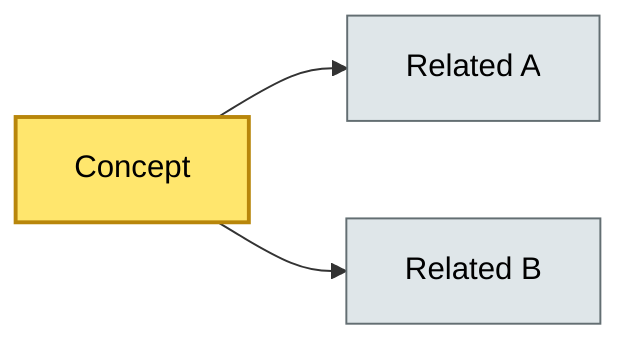

# [C?-??] [Topic Name] — BRIEF
> **Category:** C? — {Category name} · **Difficulty:** ●/◑/○ · **Banking-relevant:** yes/no
> **One-liner:** _{define the topic in one complete sentence}_
> **Why an EA cares:** _{why this matters in an enterprise/banking context}_
## Quick definition
_{2–4 sentences, precise, jargon-free where possible.}

## Key ideas / terms
- **{Term}:** {one-line definition}
- **{Term}:** {one-line definition}
- **{Term}:** {one-line definition}

## The mental model
_{1 short paragraph: how it fits into the larger architecture picture, and how it relates to 2–3 sibling concepts.}

## One diagram (mandatory)
_{A single, simple Mermaid diagram capturing the core idea. Use color classes to highlight the most important parts.}

## When to use / when NOT to use
- ✅ **Use when:** {scenario}
- ⚠️ **Avoid when:** {scenario}

## Banking 💳 example
_{One concrete banking or financial-services example (core banking, payments, lending, fraud, data platform, etc.).}

## Common confusions (don't mix these up)
- **{Topic}** vs **{Similar topic}:** {one-sentence distinction}

## Interview / recall prompt
_“Explain {topic} in 2 minutes without notes.”_ → _{3–5 bullet key points you should hit.}

---
**Status:** ☐ Not started · See detail doc: `[details/{same-file-name}.md](../details/{same-file-name}.md)`
