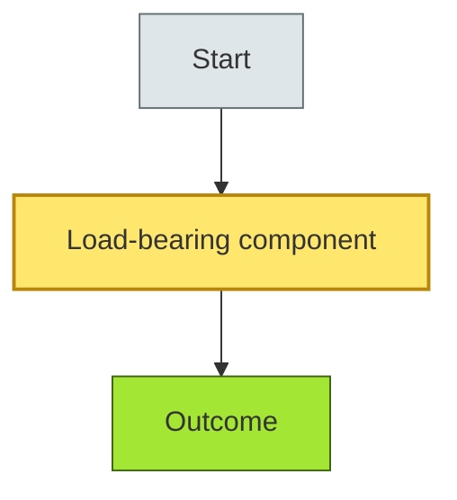
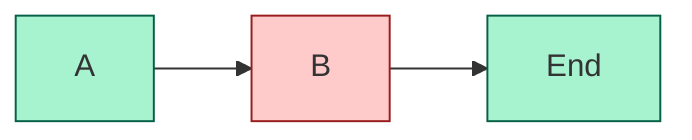
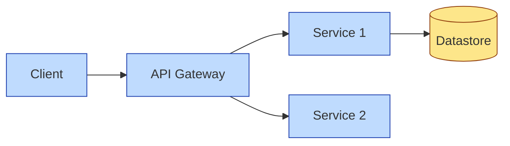

# [C?-??] [Topic Name] — DETAIL
> **Category:** C? — {Category name} · **Difficulty:** ●/◑/○ · **Banking-relevant:** yes/no

> **Companion brief:** `[briefs/{file}.md](../briefs/{file}.md)`

> **Target reader:** enterprise architect who must *explain, justify, and defend* the topic — not just recite it.

---

## 1. Precise definition
_{Rigorous, unambiguous definition. Distinguish from near-identical terms explicitly. If there is a standards body definition (ISO, IEEE, TOGAF), cite it.}

## 2. Why it exists (problem it solves)
_{What architectural pain drove this? What would happen without it? Why did it emerge historically?}

## 3. Core concepts & vocabulary
| Term | Precise meaning |
|------|-----------------|
| {term} | {definition} |
| {term} | {definition} |

## 4. How it works (architecture / mechanism)
_{Step-by-step or structural explanation. Include how the parts connect.}

### 4.1 Diagrams
_{2–4 Mermaid diagrams. MANDATORY: use `classDef` color coding to separate critical / important / supporting elements. Different diagrams can use different color schemes to encode different "what matters" dimensions.}

**Diagram A — Core structure (highlight the load-bearing parts = amber, supporting = grey):**


**Diagram B — Lifecycle / flow (highlight decision points = green, failures = red):**


## 5. Variants, options & trade-offs
_{For each alternative: pros, cons, when-to-use. Be explicit about which axis differs (cost vs latency vs coupling vs governance).}

| Variant | When to pick | When to avoid | Key trade-off axis |
|---------|--------------|---------------|--------------------|
| A | {case} | {case} | {axis} |
| B | {case} | {case} | {axis} |

## 6. Relationships to sibling topics
- **{sibling A}:** {how it's a prerequisite / consumer / alternative}
- **{sibling B}:** {same}
- **{sibling C}:** {same}

## 7. Banking / financial-services context 💳
_{Concrete application in banking: core banking, payments, trade finance, lending, wealth, insurance, wealth-management, data platform, anti-fraud, AML/KYC, etc. Tie to relevant regulations where applicable (Basel II/III, SOX, PCI-DSS, PSD2, GDPR, DORA). State the *business* reason, not only the technical one.}

## 8. Reference architecture / worked example
_{A small but realistic worked example: the problem, the decision, the resulting diagram, and the ADR you'd write.}



## 9. Maturity & adoption signals
- **Adopt when:** {org readiness}
- **Anti-signals (don't adopt yet):** {signals}
- **Common failure modes:** {top 3}

## 10. Common confusions — the "don't mix" list
| Often confused | Real distinction |
|----------------|------------------|
| {X} vs {Y} | {precise} |
| {Z} vs {W} | {precise} |

## 11. Tools & standards to know
- **Standards/Frameworks:** {TOGAF ADM phase, ISO 42010, IDEF, etc.}
- **Common tooling:** {Enterprise Architect, Sparx EA, Archi, Modelio, draw.io, Miro, Jira Align, Confluence, etc.}
- **Mandatory reading (if any):** {books, white papers, articles}

## 12. ADR template (ready to fill in)
```markdown
# ADR-XXX: <decision>
## Status
Accepted | Proposed | Deprecated
## Context
...
## Decision
...
## Consequences
- Positive ...
- Negative ...
- ...
## Alternatives considered
1. ...
2. ...
```

## 13. Practice — apply it
1. **Recall:** define in 2 min without notes.
2. **Model:** produce an ArchiMate/UML diagram from scratch.
3. **ADR:** write a decision doc applying it to the banking example in §7.
4. **Defend:** roleplay explaining to a non-technical CRO / CIO.

## 14. Summary (1 paragraph)
_{A closing paragraph you could literally read aloud at a board.}

---
**Status:** ☐ Not started · ☐ In progress · ✅ Covered · **Last updated:** _{date}_
