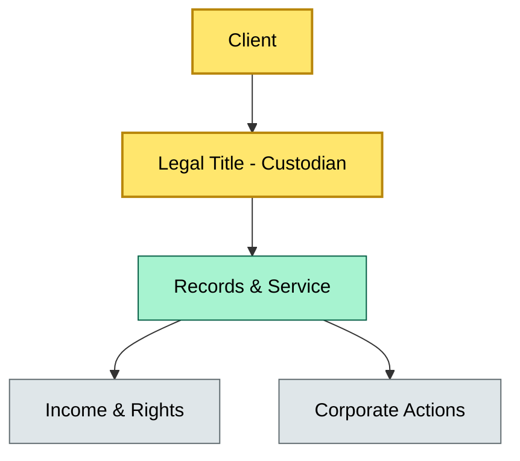

# [C1] What is custody? — BRIEF
> **Category:** C1 Foundations · **Difficulty:** ● · **Banking-relevant:** yes / 💳

> **One-liner:** Custody is the safekeeping and record-keeping of securities, enforced by legal ownership separation and operational servicing, so the asset owner retains economic benefits while the custodian mitigates fraud, loss, and settlement failure.

> **Why an enterprise architect / trainee cares:** If you cannot distinguish custody from asset management, your bank's reference architecture will conflate client imperative trading authority with holding rights. That conflation creates phantom service contracts, double-charged fees, unbanked operational risk, and a regulator-visible gap between legal ownership and beneficial ownership.

## Quick definition
Custody is the legal and operational safekeeping of financial instruments on behalf of a client. It is not investment advice, not trading, and not financing. The custodian holds title to the securities in a segregated (or omnibus) account, maintains the ledger, executes corporate actions, and provides statements. The client retains economic rights: dividends, interest, collateral reuse, and bankruptcy set-off.

## Key ideas / terms
- **Legal title:** The custodian's name on the issuer's records; the client's beneficial ownership.
- **Beneficial ownership:** The client's right to income and underlying asset claims, even while title sits with the custodian.
- **Corporate actions:** Events (splits, dividends, M&A) that change the economic or physical form of an instrument; the custodian processes them at the issuer level.
- **Segregated vs omnibus:** Segregated = each client's securities held in their own sub-account; omnibus = pooled for efficiency with internal risk controls.
- **Rehypothecation:** The custodian lending securities to a third party for cash collateral, generating income for the client but creating counterparty and legal risk.

## The mental model
Custody sits at the intersection of three domains: (1) securities settlement infrastructure (DTCC/Euroclear/Clearstream), (2) bank treasury and funding (where securities are monetized), and (3) legal entity structure (where title is ring-fenced). A bank that treats custody as a sub-system of asset management will discover, too late, that a trade instruction touched both the custody ledger and the portfolio manager's mandate without a reconciliation layer. The enterprise architect must draw custody as a bounded, auditable node with strict inbound/outbound interfaces to trading, fund servicing, and regulatory reporting.

## One diagram (mandatory)

```

## When to use / when NOT to use
- ✅ **Use when:** Writing requirements for client onboarding, onboarding new asset classes (e.g., crypto-ETPs), or evaluating a custodian switch.
- ⚠️ **Avoid when:** Describing the bank's own investment decision; custody does not select instruments or allocate capital.

## Banking 💳 example
A Swiss private bank holds Apple Inc. shares for a UHNWI client in a segregated omnibus account at SIX SIS. SIX SIS is the legal title holder; the bank is the beneficial owner via a segregation agreement. Annual dividends of ~$900/share flow to the client's bank account after SIX SIS deducts withholding tax. In 2019, SIX SIS and other depositories failed to process the Apple dividend for several clearing members due to a tax-withholding report mismatch; the bank had to absorb interest costs because its custody operational horse-race was separate from its SSI. This illustrates why custody is both record-keeping and a revenue-loss vector.

## Common confusions (don't mix these up)
- **Custody** vs **asset management:** Custody holds and services; asset management decides what to buy/sell.
- **Custody** vs **prime brokerage:** Prime brokerage is a bundle (custody + repo + financing + brokerage) sold to hedge funds; custody is one service inside that bundle.

## Interview / recall prompt
"Explain what custody is and why a bank separates legal title from beneficial ownership."
- Custody is legal safekeeping with segregated records and serviced income; it does not manage assets.
- Legal title sits with the custodian; beneficial ownership (income, voting, exposure) sits with the client.
- Corporate actions are processed because the custodian is on the issuer register.
- Prerequisite for any institution that holds securities for a third party.
- Failure modes: loss of records, rehypothecation mismatch, tax withholding error.

## Status
☐ Not started · See detail doc: `details/C1-01-what-is-custody.md`

---
**One diagram required. Both brief + detail must exist before ✓.**
