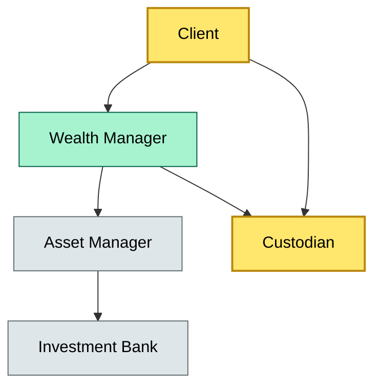

# [C2] Custody vs asset management vs wealth management vs investment banking — boundaries — BRIEF
> **Category:** C2 Foundations · **Difficulty:** ● · **Banking-relevant:** yes / 💳

> **One-liner:** The boundary between custody (safekeeping and record-keeping), asset management (investment decision), and investment banking (capital raising and M&A advisory) is the separation of *holding* rights from *discretionary authority* and *indicative* from *advisory* services.

> **Why an enterprise architect / trainee cares:** Misclassifying these boundaries in a bank's service catalog leads to phantom service agreements, regulatory mis-signing, double fee-charging to the same client, and confusion in the audit trail between who gave the order and who held the asset.

## Quick definition
- **Custody:** Legal safekeeping, record-keeping, and servicing of securities; no investment discretion.
- **Asset management:** Discretionary or non-discretionary investment decision-making and portfolio construction; may use a custodian but does not hold title.
- **Wealth management:** A holistic advisory service blending financial planning, tax, and brokerage; can include asset management and custody as sub-services.
- **Investment banking:** Underwriting, M&A advisory, and capital markets; may handle proceeds that later become custodial assets, but advises rather than holds.

## Key ideas / terms
- **Discretionary authority:** The ability to trade on a client's behalf without per-trade approval.
- **Fiduciary duty:** The obligation to act in the client's best interest; asset managers and wealth managers have it; custodians have a contractual safekeeping duty.
- **Mandate:** The legal document authorizing the asset manager to trade; the custodian follows it.
- **Scope creep:** When a service provider (e.g., a wealth manager) begins performing tasks that originate from another service (e.g., custody reconciliation).
- **Regulatory boundary:** Some jurisdictions (e.g., EU UCITS) prescribe which entities may perform which functions to avoid conflicts of interest.

## The mental model
In enterprise architecture, these services are distinct nodes in a service mesh. Custody is a record-keeper; asset management is a decision engine; wealth management is a coordination layer; investment banking is an origination event. A common anti-pattern: a wealth manager's CRM generates trade instructions that are executed through the bank's custody system, but the CRM also generates settlement reports without a reconciliation rule, creating a data divergence. The architect must enforce a boundary at the service mesh level with identity and authorization checks.

## One diagram (mandatory)

```

## When to use / when NOT to use
- ✅ **Use when:** Writing an RFP for mixed advisory and custody services, or designing a client onboarding flow that collects service boundaries.
- ⚠️ **Avoid when:** Describing a single integrated product as one "service"; always decompose it.

## Banking 💳 example
A private wealth competitor in Geneva offers a "family office suite": wealth planning, UBS asset management, and a SIX SIS custody wrapper. The client thinks one bill, but the contract matrix is: (1) wealth manager for financial planning and tax optimization, (2) UBS as asset manager with discretionary mandates, (3) SIX SIS as custodian. If the client later sues for a wrong trade, the response splits: UBS (discretionary fault) vs SIX SIS (record-keeping fault) vs the wealth planner (conflict of interest if they recommended the manager). The architecture must keep the three contracts separate.

## Common confusions (don't mix these up)
- **Custody** vs **asset management:** Custody holds; asset management decides.
- **Wealth management** vs **asset management:** Wealth management is holistic planning; asset management is investment selection only.
- **Investment banking** vs **asset management:** IB advises on capital raising; asset management buys/sells instruments for returns.

## Interview / recall prompt
"Explain the difference between custody, asset management, and investment bankingin one sentence each."
- Custody is legal safekeeping without investment discretion.
- Asset management is discretionary or non-discretionary investment in a portfolio.
- Investment banking is advisory or underwriter services, not long-term portfolio management.
- The boundary is *who holds* vs. *who decides* vs. *who advises*.
- A bank that mixes them creates regulatory and operational friction.

## Status
☐ Not started · See detail doc: `details/C1-02-custody-vs-am-vs-ib.md`

---
**One diagram required. Both brief + detail must exist before ✓.**
