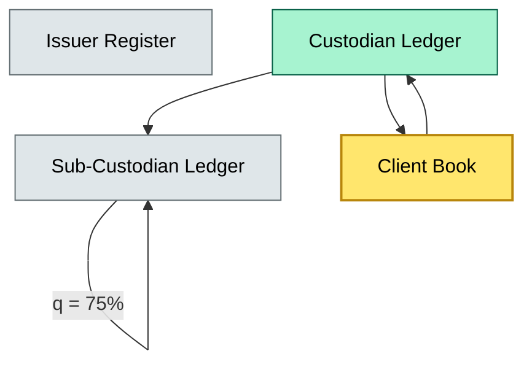

# [C1] Asset classes held — BRIEF
> **Category:** C1 Foundations · **Difficulty:** ● · **Banking-relevant:** yes / 💳

> **One-liner:** Custody encompasses the safekeeping, administration, and transfer of financial instruments, cash, and ancillary asset classes on behalf of clients under legally recognized obligation.

> **Why an enterprise architect / trainee cares:** Banks that cannot precisely classify what sits in custody, who owns it, and how it flows between books, subsystems, and regulatory boundaries risk commingling, settlement failure, and capital miscalculation — all of which trigger DORA, Basel III, and CSDR breaches.

## Quick definition
Custody is the regulated service of holding and safeguarding client assets — whether securities, currencies, derivatives, or cash — and maintaining the records that prove ownership. It is distinct from investment management: the custodian does not decide *what* to buy, only *that* it is held correctly and settleable.

## Key ideas / terms
- **Safekeeping:** The contractual obligation to maintain possession or control of an asset and prevent unauthorized transfer.
- **Sub-custody (or agent):** Outsourcing part of the safekeeping function to a third-party agent (e.g., a local clearing bank abroad).
- **Nominee / arrangement:** The legal structure through which a custodian appears as owner in the issuer’s register while the client retains the beneficial interest.
- **Unbundling / unbundling fees:** Separating custody and asset-management services to comply with MiFID II unbundling rules for non-discretionary portfolios.

## The mental model
Custody sits at the intersection of **legal ownership** (registry records), **economic ownership** (beneficial interest), and **operational control** (settlement systems). It is a trust-metis layer: asset classes move across multiple ledgers — issuer register, custodian ledger, sub-custodian ledger, and settlement instruction — and the custodian’s job is to keep them aligned. For an enterprise architect, this means custody is a *data-integrity boundary*: if the three ledgers diverge, the advisory (front office) thinks the client owns 1,000 shares, the back office has only 800, and the issuer record shows 0 until the nominee registers the transfer.

## One diagram (mandatory)

```

## When to use / when NOT to use
- ✅ **Use when:** Designing custody onboarding, settlement-reconciliation policies, or regulatory reporting pipelines.
- ⚠️ **Avoid when:** You are describing discretionary investment advice — custody is non-discretionary by design.

## Banking 💳 example
J.P. Morgan acts as global custodian for BlackRock’s iShares funds. In the U.S., the nominal holder is the omnibus nominee (Cede & Co.); in Europe, it holds bare legal title under a custody agreement with BlackRock’s authorizer. If J.P. Morgan’s sub-custodian in Tokyo mistakenly marks 10,000 more shares than exist in the omnibus account, the SMIF (Sub-Safekeeping Information File) reconciles to the issuer register, but only after the CSD (Euroclear/Clearstream) rejects the delivery. Result: failed settlement, DVP exposure, and a DORA incident report.

## Common confusions (don't mix these up)
- **Custody** vs **Asset management:** Custody holds assets; asset management decides weightings and trades on behalf of the client.
- **Nominee arrangement** vs **Direct registration (DRS):** Nominee = custodian appears on issuer books; DRS = client name appears directly on issuer books (lower cost, higher liability).

## Interview / recall prompt
“Explain asset classes held in custody in 2 minutes without notes.” →
- Safekeeping + recordkeeping distinction
- Legal vs economic ownership via nominee
- Sub-custody risk and reconciliation

## Status
☐ Not started · See detail doc: `details/C1-03-asset-classes-held.md`

---
**One diagram required. Both brief + detail must exist before ✓.**
