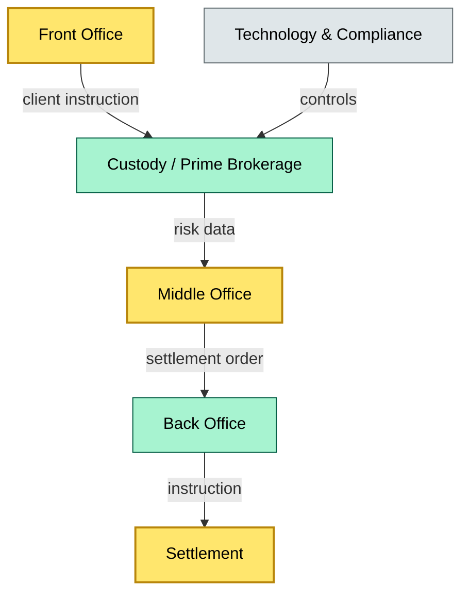

# [C1] Where custody sits — BRIEF
> **Category:** C1 Foundations · **Difficulty:** ◑ · **Banking-relevant:** yes / 💳

> **One-liner:** Custody is neither a back-office back-room admin line nor a pure IT function; it sits at the intersection of front-office advisory, middle-office risk-weighted assets, back-office settlement, and technology governance as a regulated trust service.

> **Why an enterprise architect / trainee cares:** Mis-placing custody in the org chart leads to broken RACI, unreported risk concentrations, and DORA/CRD/CRR capital miscalculation.

## Quick definition
Custody is embedded in the bank’s enterprise architecture across four structural dimensions: (1) **Regulatory / legal entity** (who is licensed to custody), (2) **Line of business** (wealth, asset management, prime services), (3) **Organizational layer** (front, middle, back, tech, compliance), and (4) **Data layer** (ownership ledger, settlement ledger, regulatory report).

## Key ideas / terms
- **Prime brokerage:** A single LOB that bundles custody, financing, and execution; custody risk is implicit, not separated.
- **WASP:** West Asset Services Platform (or equivalent asset-servicing core); the operational backbone for custody.
- **RACI for custody:** Clear ownership prevents “not my safekeeping” drift when sub-custodian fails.
- **Third-party criticality (DORA):** Custody auditors and infrastructure are ICT third parties; their outage is a major incident.

## The mental model
Custody governance is a *stack*, not a silo. The top of the stack is the **retail advisory layer** (who buys the client the product); the bottom is the **CSD / CSD-equivalent**. In between, the *ownership ledger* is a shared boundary between front (client relationship), middle (risk weighting and reporting), and back (settlement and custody movement). If the middle office does not model custody as a *risk-weight variable*, the bank capitalizes incorrectly.

## One diagram (mandatory)

```

## When to use / when NOT to use
- ✅ **Use when:** Mapping bank org charts, writing DORA ICT-risk registers, or defining custody hand-off SLAs.
- ⚠️ **Avoid when:** You are describing a crypto exchange custody model where the entity sits outside the traditional banking stack.

## Banking 💳 example
HSBC’s Global Custody sits within the Asset and Wealth Management (AWM) division, but its CSD connectivity and settlement run through the Global Banking and Markets (GB&M) tech platform. The front office (private banking) trades in derivatives; the prime brokerage desk holds the positions as collateral; the back office settles via Euroclear/Clearstream; and DORA-mandated ICT third-party risk reviews (auditors, core-platform vendors) report to Risk Committee, not to AWM P&L.

## Common confusions (don't mix these up)
- **Custody LOB** vs **Wealth advisory LOB:** Wealth advisors sell; custody holds — same division, different accountability.
- **Prime brokerage** vs **Agency securities finance:** Prime = broader (custody + financing + execution); Agency = pure execution-only financing.

## Interview / recall prompt
“Explain where custody sits in the bank in 2 minutes without notes.” →
- Four structural dimensions
- Front vs middle vs back hand-offs
- DORA-critical ICT-third-party gate

## Status
☐ Not started · See detail doc: `details/C1-04-where-custody-sits.md`

---
**One diagram required. Both brief + detail must exist before ✓.**
